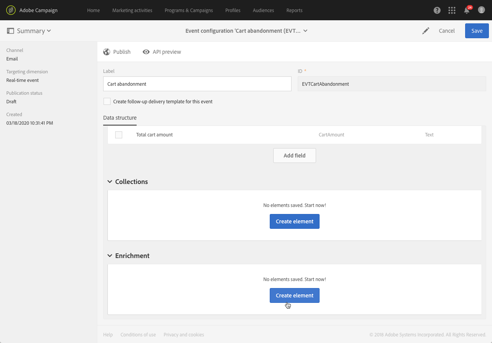

# Configurazione di un evento transazionale {#configuring-transactional-event}

Per inviare un messaggio transazionale con  Adobe Campaign, è innanzitutto necessario descrivere la struttura dei dati dell&#39;evento creando e configurando un evento.

>[!IMPORTANT]
>
>Solo gli [amministratori di funzionalità](../../administration/using/users-management.md#functional-administrators) <!--being part of the **[!UICONTROL All]** [organizational unit](../../administration/using/organizational-units.md) -->dispongono dei diritti appropriati per creare e modificare le configurazioni dell&#39;evento.

La configurazione varia a seconda del [tipo di messaggio transazionale](../../channels/using/getting-started-with-transactional-msg.md#transactional-message-types) che si desidera inviare e del canale che verrà utilizzato. Per ulteriori informazioni, vedere [Configurazioni specifiche](#transactional-event-specific-configurations).

Al termine della configurazione, l’evento deve essere pubblicato. Vedere [Pubblicazione di un evento transazionale](../../channels/using/publishing-transactional-event.md).

## Creazione di un evento {#creating-an-event}

Per iniziare, create l&#39;evento corrispondente alle vostre esigenze.

1. Fai clic sul logo **[!UICONTROL Adobe Campaign]** nell’angolo in alto a sinistra, quindi seleziona **[!UICONTROL Marketing plans]** > **[!UICONTROL Transactional messages]** > **[!UICONTROL Event configuration]**.
1. Fai clic sul pulsante **[!UICONTROL Create]**.
1. Immettete un **[!UICONTROL Label]** e un **[!UICONTROL ID]** per l&#39;evento. Il campo **[!UICONTROL ID]** è obbligatorio e deve iniziare con il prefisso &quot;EVT&quot;. Se non si utilizza questo prefisso, viene aggiunto automaticamente dopo aver fatto clic su **[!UICONTROL Create]**.

   

   >[!IMPORTANT]
   >
   >L&#39;ID non deve superare i 64 caratteri, incluso il prefisso EVT.

1. Selezionare il canale che verrà utilizzato per inviare i messaggi transazionali **[!UICONTROL Email]**, **[!UICONTROL Mobile (SMS)]** o **[!UICONTROL Push notification]**. Per ogni evento può essere utilizzato un solo canale e successivamente non può essere modificato.

1. Selezionate la dimensione di targeting corrispondente alla configurazione dell&#39;evento desiderata e fate clic su **[!UICONTROL Create]**.

   I messaggi transazionali basati su eventi sono destinati ai dati contenuti nell&#39;evento stesso, mentre i messaggi transazionali basati su profilo sono destinati ai dati contenuti nel database Adobe Campaign . Per ulteriori informazioni, vedere [Configurazioni specifiche](#transactional-event-specific-configurations).

>[!NOTE]
>
>Il numero di eventi transazionali può avere un impatto sulla piattaforma. Per garantire prestazioni ottimali, eliminate gli eventi inutilizzati. Vedere [Eliminazione di un evento](../../channels/using/publishing-transactional-event.md#deleting-an-event).

## Definizione degli attributi evento {#defining-the-event-attributes}

Nella sezione **[!UICONTROL Fields]**, definite gli attributi che saranno integrati nel contenuto dell&#39;evento e che potranno quindi essere utilizzati per personalizzare il messaggio transazionale.

La procedura per aggiungere e modificare i campi è la stessa utilizzata per [risorse personalizzate](../../developing/using/configuring-the-resource-s-data-structure.md#adding-fields-to-a-resource).

>[!NOTE]
>
>Se desiderate creare un messaggio transazionale multilingue, definite un attributo di evento aggiuntivo con l&#39; **[!UICONTROL AC_language]** ID. Ciò vale solo per i messaggi relativi alle transazioni degli eventi. Dopo la pubblicazione dell’evento, i passaggi per modificare il contenuto di un messaggio transazionale in più lingue sono gli stessi di un messaggio e-mail standard in più lingue. Vedere [Creazione di un&#39;e-mail in più lingue](../../channels/using/creating-a-multilingual-email.md).

## Definizione delle raccolte di dati {#defining-data-collections}

Potete aggiungere al contenuto dell&#39;evento una raccolta di elementi, ciascuno stesso elemento con diversi attributi.

Questa raccolta può essere utilizzata in un messaggio e-mail transazionale per aggiungere [elenchi di prodotti](../../channels/using/editing-transactional-message.md#using-product-listings-in-a-transactional-message) al contenuto del messaggio, ad esempio un elenco di prodotti - con il prezzo, il numero di riferimento, la quantità, ecc. per ogni prodotto dell&#39;elenco.

1. Nella sezione **[!UICONTROL Collections]**, fare clic sul pulsante **[!UICONTROL Create element]**.

   

1. Aggiungete un&#39;etichetta e un ID per la raccolta.
1. Aggiungete tutti i campi che desiderate visualizzare nel messaggio transazionale per ciascun prodotto dell’elenco.

   In questo esempio, sono stati aggiunti i campi seguenti:

   

1. La scheda **[!UICONTROL Enrichment]** consente di arricchire ogni elemento della raccolta. In questo modo potrete personalizzare gli elementi dell&#39;elenco di prodotti corrispondente con informazioni provenienti dal database Adobe Campaign  o da altre risorse create.

>[!NOTE]
>
>I passaggi per arricchire gli elementi di una raccolta sono gli stessi descritti nella sezione [Arricchire l&#39;evento](#enriching-the-transactional-message-content). Tenete presente che l&#39;arricchimento dell&#39;evento non consente di arricchire una raccolta: è necessario aggiungere un arricchimento alla raccolta stessa nella sezione **[!UICONTROL Collections]**.

Una volta pubblicati l&#39;evento e il messaggio, potrete utilizzare questa raccolta nel messaggio transazionale.

Anteprima API per questo esempio:

**Argomenti correlati:**

* [Anteprima e pubblicazione dell’evento](../../channels/using/publishing-transactional-event.md#previewing-and-publishing-the-event)
* [Utilizzo degli elenchi di prodotti in un messaggio sulle transazioni](../../channels/using/editing-transactional-message.md#using-product-listings-in-a-transactional-message)
* [Pubblicazione di un messaggio sulle transazioni](../../channels/using/publishing-transactional-message.md#publishing-a-transactional-message)

## Arricchimento dell&#39;evento {#enriching-the-transactional-message-content}

Puoi arricchire il contenuto dei messaggi transazionali con informazioni provenienti dal database Adobe Campaign  per personalizzare i messaggi. Dal cognome o dall&#39;ID CRM di ciascuno dei destinatari, ad esempio, puoi recuperare dati quali l&#39;indirizzo o la data di nascita o qualsiasi altro campo personalizzato aggiunto nella tabella Profilo, al fine di personalizzare le informazioni inviate.

È possibile arricchire il contenuto dei messaggi transazionali con informazioni provenienti da **[!UICONTROL Profile and services Ext API]** esteso. Per ulteriori informazioni, consultate [Estensione dell&#39;API: Pubblicazione dell&#39;estensione](../../developing/using/step-2--publish-the-extension.md)

Queste informazioni possono essere memorizzate anche in nuove risorse. In tal caso, la risorsa deve essere collegata direttamente alle risorse **[!UICONTROL Profile]** o **[!UICONTROL Service]** oppure tramite un&#39;altra tabella. Ad esempio, nella configurazione seguente, è possibile arricchire il contenuto dei messaggi transazionali con informazioni dalla risorsa **[!UICONTROL Product]** come la categoria o l&#39;ID del prodotto, se la risorsa **[!UICONTROL Product]** è collegata alla risorsa **[!UICONTROL Profile]**.

Per ulteriori informazioni sulla creazione e la pubblicazione di risorse, consultate [questa sezione](../../developing/using/key-steps-to-add-a-resource.md).

1. Nella sezione **[!UICONTROL Enrichment]**, fare clic sul pulsante **[!UICONTROL Create element]**.

   

1. Seleziona la risorsa con cui collegare il messaggio. In questo caso, scegliete la risorsa **[!UICONTROL Profile]**.

   

1. Utilizzare il pulsante **[!UICONTROL Create element]** per collegare un campo dalla risorsa selezionata a uno dei campi aggiunti in precedenza all&#39;evento (vedere [Definizione degli attributi dell&#39;evento](#defining-the-event-attributes)).

   

1. In questo esempio, i campi **[!UICONTROL Last name]** e **[!UICONTROL First name]** vengono riconciliati con i campi corrispondenti nella risorsa **[!UICONTROL Profile]**.

   

   Puoi anche arricchire il contenuto dei messaggi transazionali utilizzando la risorsa **[!UICONTROL Service]**. Per ulteriori informazioni sui servizi, vedere [questa sezione](../../audiences/using/creating-a-service.md).

1. Se si sta creando o modificando un evento [basato su profilo](#profile-based-transactional-messages), nella sezione **[!UICONTROL Targeting enrichment]** selezionare l&#39;arricchimento che verrà utilizzato come destinazione del messaggio durante l&#39;esecuzione della consegna.

   

   >[!NOTE]
   >
   >La creazione di un arricchimento e la selezione di un arricchimento di targeting basato sulla risorsa **[!UICONTROL Profile]** sono obbligatorie per gli eventi basati sul profilo.

Dopo la pubblicazione dell’evento e del messaggio, questo collegamento consente di arricchire il contenuto del messaggio transazionale.

**Argomenti correlati:**

* [Anteprima e pubblicazione dell’evento](../../channels/using/publishing-transactional-event.md#previewing-and-publishing-the-event)
* [Personalizzazione di un messaggio sulle transazioni](../../channels/using/editing-transactional-message.md#personalizing-a-transactional-message)
* [Pubblicazione di un messaggio sulle transazioni](../../channels/using/publishing-transactional-message.md#publishing-a-transactional-message)

## Ricerca di eventi transazionali {#searching-transactional-events}

Per accedere agli eventi transazionali già creati ed eseguire ricerche, procedere come segue.

1. Fai clic sul logo **[!UICONTROL Adobe Campaign]** nell’angolo in alto a sinistra, quindi seleziona **[!UICONTROL Marketing plans]** > **[!UICONTROL Transactional messages]** > **[!UICONTROL Event configuration]**.
1. Fai clic sul pulsante **[!UICONTROL Show search]**.

   

1. È possibile filtrare in base alla **[!UICONTROL Publication status]**. Questo consente di visualizzare solo gli eventi pubblicati, ad esempio.
1. È inoltre possibile filtrare gli eventi utilizzando il simbolo **[!UICONTROL Last event received]**. Ad esempio, se immettete 10, verranno visualizzate solo le configurazioni dell&#39;evento con l&#39;ultimo evento ricevuto 10 giorni fa o più. Questo consente di visualizzare gli eventi inattivi per un determinato periodo di tempo.

   

   >[!NOTE]
   >
   >Il valore predefinito è 0. Vengono visualizzati tutti gli eventi.

## Configurazioni specifiche {#transactional-event-specific-configurations}

La configurazione dell&#39;evento transazionale può variare a seconda del [tipo di messaggio transazionale](../../channels/using/getting-started-with-transactional-msg.md#transactional-message-types) che si desidera inviare (evento o profilo) e del canale che verrà utilizzato.

Le sezioni seguenti descrivono la configurazione specifica da impostare in base al messaggio transazionale desiderato. Per ulteriori informazioni sui passaggi generali per configurare un evento, vedere [Creazione di un evento](#creating-an-event).

### Messaggi transazionali basati su eventi {#event-based-transactional-messages}

Puoi inviare messaggi sulle transazioni destinati a un evento. Questo tipo di messaggi sulle transazioni non contiene informazioni del profilo: il target di consegna è definito dai dati contenuti nell’evento stesso.

Per inviare un messaggio di transazione basato su eventi, è innanzitutto necessario creare e configurare un evento per il targeting dei **dati contenuti nell&#39;evento stesso**.

1. Quando create la configurazione dell&#39;evento, selezionate la dimensione di targeting **[!UICONTROL Real-time event]** (vedete [Creazione di un evento](#creating-an-event)).
1. Aggiungete i campi all&#39;evento, per poter personalizzare il messaggio transazionale (consultate [Defining the event attribute](#defining-the-event-attributes)).
1. La messaggistica transazionale basata su eventi dovrebbe utilizzare solo i dati presenti nell’evento inviato per definire il destinatario e la personalizzazione del contenuto del messaggio.

   Tuttavia, se si desidera utilizzare informazioni aggiuntive provenienti dal database Adobe Campaign , è possibile arricchire il contenuto dei messaggi transazionali (vedere [Arricchimento del contenuto dei messaggi transazionali](#enriching-the-transactional-message-content)).

1. Visualizzate l&#39;anteprima e pubblicate l&#39;evento (vedete [Anteprima e pubblicazione dell&#39;evento](../../channels/using/publishing-transactional-event.md#previewing-and-publishing-the-event)).

   Quando si visualizza l&#39;anteprima dell&#39;evento, l&#39;API REST contiene un attributo che specifica l&#39;indirizzo e-mail, il telefono cellulare o gli attributi specifici della notifica push, in base al canale selezionato.

   Una volta pubblicato l’evento, viene automaticamente creato un messaggio transazionale collegato al nuovo evento. Affinché l&#39;evento attivi l&#39;invio di un messaggio transazionale, è necessario [modificare](../../channels/using/editing-transactional-message.md) e [pubblicare](../../channels/using/publishing-transactional-message.md) il messaggio appena creato.

1. Integrare l&#39;evento nel sito Web (vedere [Integrare l&#39;attivazione dell&#39;evento](../../channels/using/getting-started-with-transactional-msg.md#integrate-event-trigger)).

### Messaggi transazionali basati su profili {#profile-based-transactional-messages}

Puoi inviare messaggi transazionali basati sui profili dei clienti, che ti consentono di applicare regole di tipologia di marketing, includere il collegamento per l&#39;annullamento della sottoscrizione, aggiungere il messaggio al reporting globale sulla consegna e utilizzarlo nel percorso del cliente.

Per inviare un messaggio transazionale basato sul profilo, è innanzitutto necessario creare e configurare un targeting di eventi **dati dal database Adobe Campaign**.

1. Quando create la configurazione dell&#39;evento, selezionate la dimensione di targeting **[!UICONTROL Profile event]** (vedete [Creazione di un evento](#creating-an-event)).
1. Aggiungete i campi all&#39;evento, per poter personalizzare il messaggio transazionale (consultate [Defining the event attribute](#defining-the-event-attributes)). Per creare un arricchimento è necessario aggiungere almeno un campo. Non è necessario creare altri campi quali **Nome** e **Cognome**, in quanto sarà possibile utilizzare i campi di personalizzazione del database Adobe Campaign .
1. Create un arricchimento per collegare l&#39;evento alla risorsa **[!UICONTROL Profile]** (vedete [Arricchimento dell&#39;evento](#enriching-the-transactional-message-content)) e selezionate questo arricchimento come **[!UICONTROL Targeting enrichment]**.

   >[!IMPORTANT]
   >
   >Questo passaggio è obbligatorio per gli eventi basati sul profilo.

1. Visualizzate l&#39;anteprima e pubblicate l&#39;evento (vedete [Anteprima e pubblicazione dell&#39;evento](../../channels/using/publishing-transactional-event.md#previewing-and-publishing-the-event)).

   Quando si visualizza l&#39;anteprima dell&#39;evento, l&#39;API REST non contiene un attributo che specifica gli attributi specifici dell&#39;indirizzo e-mail, del telefono cellulare o della notifica push, in quanto verrà recuperato dalla risorsa **[!UICONTROL Profile]**.

   Una volta pubblicato l’evento, viene automaticamente creato un messaggio transazionale collegato al nuovo evento. Affinché l&#39;evento attivi l&#39;invio di un messaggio transazionale, è necessario [modificare](../../channels/using/editing-transactional-message.md) e [pubblicare](../../channels/using/publishing-transactional-message.md) il messaggio appena creato.

1. Integrare l&#39;evento nel sito Web (vedere [Integrare l&#39;attivazione dell&#39;evento](../../channels/using/getting-started-with-transactional-msg.md#integrate-event-trigger)).

<!--### Transactional SMS messages {#transactional-sms}

The steps to configure an  event to send an SMS transactional message are the same as for the email channel. The only differences are as follows:

* When creating the corresponding event, you need to select the **[!UICONTROL Mobile (SMS)]** channel.

* When previewing the event corresponding to an event-based transactional SMS, the REST API contains an attribute specifying the mobile phone instead of the email address.

* The specificities to edit the content of an SMS transactional message are the same as for a [standard SMS](../../channels/using/about-sms-and-push-content-design.md).-->

### Notifiche push transazionali {#transactional-push-notifications}

Potete inviare due tipi di notifiche push transazionali:
* Una notifica push transazionale anonima a tutti gli utenti che hanno acconsentito alla ricezione di notifiche dall&#39;applicazione mobile. Consultate [Configurazione delle notifiche push transazionali basate su eventi](../../channels/using/transactional-push-notifications.md#event-based-transactional-push-notifications).
* Una notifica push transazionale ai profili Adobe Campaign  che hanno effettuato la sottoscrizione all’applicazione mobile. Consultate [Configurazione delle notifiche push transazionali basate su profilo](../../channels/using/transactional-push-notifications.md#profile-based-transactional-push-notifications).

>[!IMPORTANT]
>
>Per poter inviare notifiche push transazionali, devi configurare  Adobe Campaign di conseguenza. Vedere [Configurazione di un&#39;applicazione mobile](../../administration/using/configuring-a-mobile-application.md).

### Messaggi di follow-up {#follow-up-messages}

Puoi inviare un messaggio di follow-up ai clienti che hanno ricevuto un messaggio transazionale specifico.

I passaggi per configurare un evento che consenta di inviare un messaggio di follow-up sono descritti in [questa sezione](../../channels/using/follow-up-messages.md#configuring-an-event-to-send-a-follow-up-message).
