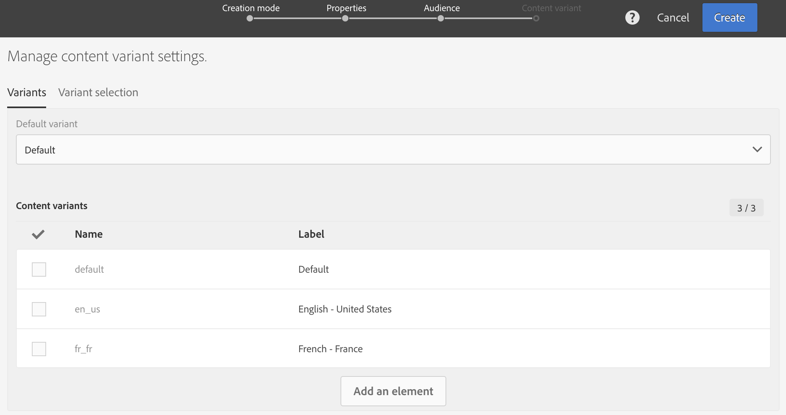
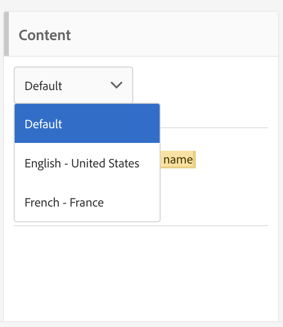

# Creazione di un messaggio e-mail multilingue{#creating-a-multilingual-email}

Puoi inviare un’e-mail multilingue a profili con diverse lingue preferite: ogni profilo riceverà una variante dell’e-mail nella lingua preferita.

A questo scopo, verifica di disporre di un modello e-mail multilingue. In caso contrario, scopri come crearne uno in [questa sezione](../../channels/using/multilingual-messages-template.md).

Il pubblico si basa su profili con informazioni complete sulla lingua preferita.

1. Crea un nuovo messaggio e-mail basato su un [modello multilingue](../../channels/using/multilingual-messages-template.md).

   

1. Definisci le proprietà generali e il pubblico target dell’e-mail, come per un’e-mail standard. Consulta la sezione [Creazione di tipi di pubblico](../../audiences/using/creating-audiences.md).

1. Nel quarto passaggio della procedura guidata di creazione, definisci le opzioni di variante. Se il [modello multilingue](../../channels/using/multilingual-messages-template.md) contiene già tutti i parametri corretti, è possibile fare clic direttamente sul pulsante **[!UICONTROL Create]**.

   

   Se necessario, aggiungere varianti utilizzando il pulsante **[!UICONTROL Add an element]**. La variante **[!UICONTROL Default]** non deve essere eliminata. Se è impostato su **[!UICONTROL default]**, [per scegliere la variante viene utilizzata la lingua preferita del profilo](../../audiences/using/creating-profiles.md). È inoltre possibile impostare la variante **[!UICONTROL Default]** su qualsiasi altra lingua.

1. Conferma creazione e-mail: viene quindi visualizzato il dashboard e-mail.
1. Definisci il contenuto dell’e-mail per ogni variante. A seconda del modello scelto, puoi definire diversi oggetti, diversi nomi di mittenti o diversi contenuti differenti. Utilizza il menu a discesa per spostarti tra le diverse varianti dell’elemento. Per ulteriori informazioni, consulta la sezione [editor di contenuti](../../designing/using/designing-content-in-adobe-campaign.md).

   

1. Verifica e convalida il messaggio. Consulta la sezione [Invio della bozza](../../sending/using/sending-proofs.md).
1. Pianifica l&#39;invio con **[!UICONTROL Send after confirmation option]**.
1. Una volta inviata l’e-mail, puoi accedere ai relativi registri e rapporti per misurare il successo della campagna. Per ulteriori informazioni sul reporting, consulta [questa sezione](../../reporting/using/about-dynamic-reports.md).

