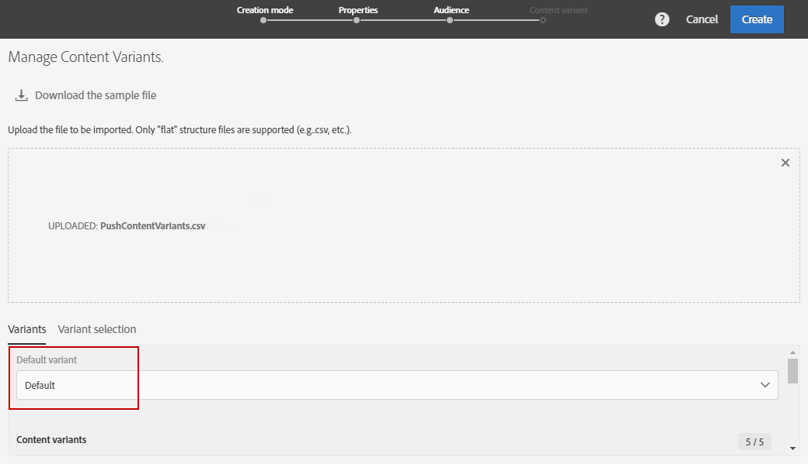
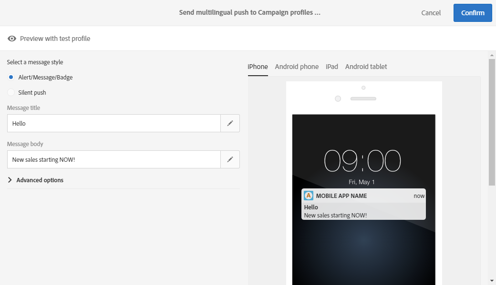

# Creazione di una notifica push multilingue{#creating-a-multilingual-push-notification}

## Informazioni sulla notifica push multilingue {#about-multilingual-push-notification}

Personalizza il contenuto delle notifiche push inviando messaggi in base alle lingue e alle aree preferite dagli utenti. Potete importare direttamente varianti di contenuto per le notifiche push multilingue nell'editor dei contenuti e inviare una notifica push multilingue in un'unica consegna.

Questa funzione utilizza le lingue preferite specificate nei profili dei destinatari o le preferenze della lingua del sistema per gli utenti iscritti alle app mobili, a seconda del modello di consegna utilizzato per la notifica push. Se le preferenze della lingua non vengono popolate per un particolare utente, il sistema utilizzerà la variante predefinita definita durante la creazione di una notifica push multilingue. Per ulteriori informazioni sulla gestione di profili e sottoscrittori, consulta questa [guida](../../audiences/using/about-profiles-and-audiences.md).

Per utilizzare varianti di contenuto multilingue per la distribuzione delle notifiche push, effettuate le seguenti operazioni:

* [Passaggio 1: Carica variante di contenuto multilingue](#step-1--upload-multilingual-content-variant)
* [Passaggio 2: Visualizzare in anteprima e finalizzare una notifica push utilizzando varianti di contenuto multilingue](#step-2--preview-and-finalize-a-push-notification-using-multilingual-content-variants)
* [Passaggio 3: Inviare e analizzare la consegna di notifiche push in più lingue](#step-3--send-and-analyze-multilingual-push-notification-delivery)

## Passaggio 1: Carica variante di contenuto multilingue {#step-1--upload-multilingual-content-variant}

Prima di personalizzare la notifica push multilingue, è necessario caricare le varianti di contenuto in un modello di consegna multilingue e creare la consegna.

>[!NOTE]
>
>Potete inoltre saltare questo passaggio se desiderate creare manualmente una variante per ogni variante della lingua.

1. In **[!UICONTROL Marketing activities]**, fare clic sul **[!UICONTROL Create]** pulsante e selezionare **[!UICONTROL Push notification]**.
1. Seleziona il modello **[!UICONTROL Send multilingual push to Campaign profiles]** se vuoi eseguire il targeting dei profili Adobe Campaign per i quali hai effettuato l'iscrizione all'applicazione mobile o al modello per inviare una notifica push **[!UICONTROL Send multilingual push to app subscriber]** a tutti gli utenti che hanno acconsentito alla ricezione di notifiche dall'applicazione mobile.

   

1. Immettete le proprietà di notifica push e selezionate l'app mobile nel **[!UICONTROL Associate a Mobile App to a delivery]** campo.

   Il menu a discesa mostrerà le applicazioni SDK SDK V4 e Adobe Experience Platform.

1. Nelle **[!UICONTROL Audiences]** finestre, trascinate le query per ottimizzare il pubblico.

   Le query aggiunte dipendono dal modello scelto: se avete scelto il **[!UICONTROL Send multilingual push to Campaign profiles]** modello, potete eseguire query ai destinatari noti dell’applicazione mobile. Se invece avete scelto il **[!UICONTROL Send multilingual push to app subscriber]** modello, potete eseguire una query a tutti gli abbonati di una particolare app che hanno acconsentito.
   >[!NOTE]
   >
   >Se eseguite il targeting di audience con lingue specifiche, dovete elencare tutte le lingue di destinazione nel file CSV.

   

1. Nella **[!UICONTROL Manage Content Variants]** finestra, trascinare il file o selezionare un file dal computer.

   Il file deve essere codificato in UTF8 e deve avere un layout specifico che può essere trovato facendo clic sull' **[!UICONTROL Download the sample file]** opzione. È inoltre necessario utilizzare la sintassi corretta per i valori delle impostazioni internazionali. Per ulteriori informazioni sul formato del file e sulle impostazioni internazionali supportate, consultare questa [nota tecnica](http://helpx.adobe.com/campaign/kb/acs-generate-csv-multilingual-push.html).

   

1. Dopo aver caricato il file, le varianti di lingua vengono popolate automaticamente nella **[!UICONTROL Variants]** scheda. È possibile includere nel file una **[!UICONTROL Default variant]** variante di contenuto predefinita, se non viene specificata alcuna lingua preferita per l'utente di destinazione.

   

1. La **[!UICONTROL Variant selection]** scheda fornirà uno script per determinare quale preferenza di lingua tenere conto in base al modello di consegna. Si tratta di uno script out-of-the-box che non richiede alcuna modifica.
1. Per aggiungere altre varianti non presenti nel file importato, fare clic sul **[!UICONTROL Add an element]** pulsante e aggiungere tutte le nuove varianti di lingua necessarie.

   Aggiungendo varianti diverse da quelle caricate dal file, nessun contenuto verrà collegato a questa lingua. Dovrete modificare il contenuto direttamente nel dashboard di distribuzione.

   

1. Fate clic **[!UICONTROL Create]** al termine della configurazione. Puoi sempre tornare alla **[!UICONTROL Content variant]** finestra e apportare alcune modifiche dal dashboard di distribuzione.

   

Ora puoi iniziare a personalizzare la notifica push multilingue.

## Passaggio 2: Visualizzare in anteprima e finalizzare una notifica push utilizzando varianti di contenuto multilingue {#step-2--preview-and-finalize-a-push-notification-using-multilingual-content-variants}

Dopo aver caricato il file contenente varianti di contenuto, ora potete visualizzare in anteprima le diverse varianti dalla distribuzione delle notifiche push.

È inoltre possibile creare e modificare più varianti oltre a quelle caricate dal file.

1. Nella **[!UICONTROL Content]** finestra del dashboard di distribuzione, l'elenco a discesa consente di visualizzare l'anteprima del contenuto delle notifiche push in base alla lingua scelta.

   

1. Se non è specificata una variante di contenuto per una lingua particolare, fate clic sull'icona a forma di campana sotto l'anteprima per iniziare ad aggiungere contenuto a questa variante di lingua.

   Facendo clic sulla **[!UICONTROL Content]** finestra, la notifica push rappresenta il contenuto della lingua selezionata nell'elenco a discesa. Le modifiche apportate in questa finestra influiscono solo su una lingua.

1. Potete anche fare clic su una variante di contenuto per personalizzarla ulteriormente, ad esempio con i campi di personalizzazione.

   Per ulteriori informazioni su come personalizzare la notifica push, consultate questa [sezione](../../channels/using/customizing-a-push-notification.md).

   

1. Fare clic sulla **[!UICONTROL Content variant]** finestra per aggiungere o eliminare varianti di lingua.

   Tenete presente che aggiungendo una nuova lingua, dovrete aggiungere manualmente il contenuto alla notifica push collegata alla lingua aggiunta.

   

È ora possibile inviare la notifica push in più lingue.

## Passaggio 3: Inviare e analizzare la consegna di notifiche push in più lingue {#step-3--send-and-analyze-multilingual-push-notification-delivery}

Le notifiche push delle varianti di contenuto multilingue sono ora pronte per essere inviate agli utenti.

1. Per iniziare a preparare l'invio, fare clic sul **[!UICONTROL Prepare]** pulsante.
1. Quando la preparazione è finita senza avvertenze, potete fare clic sul **[!UICONTROL Confirm]** pulsante per iniziare a inviare la vostra notifica multilingue.

   

1. Dopo aver inviato correttamente la notifica push, fate clic sull' **[!UICONTROL Reports]** icona, quindi **[!UICONTROL Dynamic reports]** per analizzare il successo della distribuzione.

   

1. Selezionare **[!UICONTROL Push notification report]**.
1. Trascina la **[!UICONTROL Variant]** dimensione nel pannello per iniziare a filtrare i dati.

   

Ora puoi misurare l'impatto della consegna di notifiche push in più lingue sui destinatari.

**Argomenti correlati:**

* [Report notifiche push](../../reporting/using/push-notification-report.md)
* [Invio di una notifica push in un flusso di lavoro](../../automating/using/push-notification-delivery.md)
* [Raggiungere audience in più lingue con un unico flusso di lavoro](https://helpx.adobe.com/campaign/kb/simplify-campaign-management.html#Engageyourcustomersateverystep)
