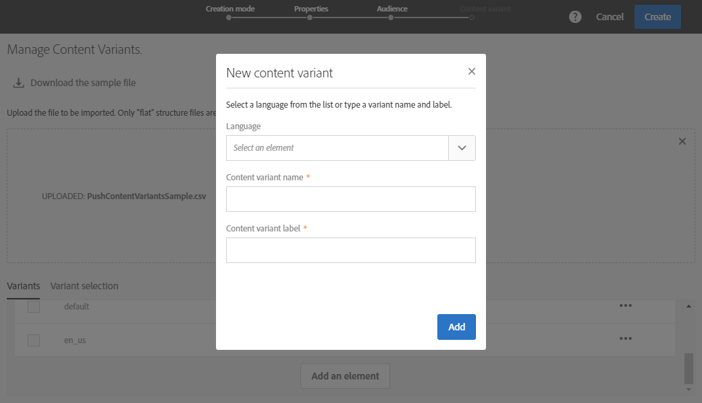

# Creazione di una notifica push multilingue{#creating-a-multilingual-push-notification}

## Informazioni sulle notifiche push multilingue {#about-multilingual-push-notification}

Personalizza il contenuto delle notifiche push inviando messaggi in base alle lingue e alle aree geografiche preferite dagli utenti. Puoi importare direttamente varianti di contenuto di notifiche push multilingue nell’editor di contenuti e inviare una notifica push multilingue in un’unica consegna.

Questa funzione sfrutta le lingue preferite specificate nei profili dei destinatari o le preferenze della lingua di sistema per gli abbonati all’app mobile, a seconda del modello di consegna utilizzato per la notifica push. Se la preferenza della lingua non viene compilata per un utente specifico, il sistema utilizzerà la variante predefinita definita durante la creazione di una notifica push multilingue. Per ulteriori informazioni su come gestire profili e abbonati, consulta questa [guida](../../audiences/using/get-started-profiles-and-audiences.md).

Per utilizzare varianti di contenuto multilingue per la consegna delle notifiche push, effettua le seguenti operazioni:

* [Passaggio 1: caricare una variante di contenuto multilingue](#step-1--upload-multilingual-content-variant)
* [Passaggio 2: visualizzare in anteprima e finalizzare una notifica push utilizzando varianti di contenuto multilingue](#step-2--preview-and-finalize-a-push-notification-using-multilingual-content-variants)
* [Passaggio 3: inviare e analizzare la consegna di notifiche push multilingue](#step-3--send-and-analyze-multilingual-push-notification-delivery)

## Passaggio 1: caricare una variante di contenuto multilingue {#step-1--upload-multilingual-content-variant}

Prima di personalizzare la notifica push multilingue, è necessario caricare le varianti di contenuto in un modello di consegna multilingue e creare la consegna.

>[!NOTE]
>
>Puoi anche saltare questo passaggio se desideri creare manualmente una variante per ogni variante di lingua.

1. In **[!UICONTROL Marketing activities]**, fare clic sul pulsante **[!UICONTROL Create]**, quindi selezionare **[!UICONTROL Push notification]**.
1. Selezionare il modello **[!UICONTROL Send multilingual push to Campaign profiles]** se si desidera eseguire il targeting dei profili Adobe Campaign che si sono abbonati all&#39;app mobile o il modello **[!UICONTROL Send multilingual push to app subscriber]** per inviare una notifica push a tutti gli utenti che hanno acconsentito alla ricezione di notifiche dall&#39;app mobile.

   

1. Immetti le proprietà della notifica push e seleziona la tua app mobile nel campo **[!UICONTROL Associate a Mobile App to a delivery]**.

   Tieni presente che nel menu a discesa verranno visualizzate le applicazioni SDK V4 e Adobe Experience Platform SDK.

1. Nelle finestre **[!UICONTROL Audiences]**, trascina e rilascia le query per ottimizzare il pubblico.

   Le query aggiunte dipendono dal modello scelto: se si sceglie il modello **[!UICONTROL Send multilingual push to Campaign profiles]** è possibile eseguire una query sui destinatari noti dell&#39;app mobile. Se invece si sceglie il modello **[!UICONTROL Send multilingual push to app subscriber]**, è possibile eseguire una query su tutti gli abbonati a una determinata app che hanno acconsentito.
   >[!NOTE]
   >
   >Se esegui il targeting di tipi di pubblico con lingue specifiche, devi elencare tutte le lingue di destinazione nel file CSV.

   

1. Nella finestra **[!UICONTROL Manage Content Variants]**, trascina e rilascia il file o seleziona un file dal computer.

   Il file deve avere la codifica UTF8 e deve avere un layout specifico, individuabile facendo clic sull&#39;opzione **[!UICONTROL Download the sample file]**. È inoltre necessario utilizzare la sintassi corretta per i valori delle impostazioni internazionali. Per ulteriori informazioni sul formato del file e sulle impostazioni internazionali supportate, fare riferimento a questa [pagina](../../channels/using/generating-csv-multilingual-push.md).

   

1. Dopo aver caricato il file, le varianti di lingua vengono compilate automaticamente nella scheda **[!UICONTROL Variants]**. Si noti che è possibile fornire **[!UICONTROL Default variant]** nel file che sarà la variante di contenuto predefinita se non viene specificata alcuna lingua preferita per l&#39;utente di destinazione.

   

1. La scheda **[!UICONTROL Variant selection]** fornirà uno script per determinare quale preferenza di lingua prendere in considerazione a seconda del modello di consegna. Si tratta di uno script preconfigurato che non richiede alcuna modifica.
1. Se si desidera aggiungere altre varianti non presenti nel file importato, fare clic sul pulsante **[!UICONTROL Add an element]** e aggiungere tutte le nuove varianti di lingua necessarie.

   Aggiungendo varianti diverse da quelle caricate dal file, nessun contenuto verrà collegato a questa lingua. Dovrai modificare il contenuto direttamente nel dashboard di consegna.

   

1. Al termine della configurazione, fare clic su **[!UICONTROL Create]**. Puoi sempre tornare alla finestra **[!UICONTROL Content variant]** e apportare alcune modifiche dal dashboard di consegna.

   

Ora puoi iniziare a personalizzare la notifica push multilingue.

## Passaggio 2: visualizzare in anteprima e finalizzare una notifica push utilizzando varianti di contenuto multilingue {#step-2--preview-and-finalize-a-push-notification-using-multilingual-content-variants}

Dopo aver caricato il file contenente le varianti di contenuto, ora puoi visualizzare in anteprima le diverse varianti dalla consegna della notifica push.

È inoltre possibile creare e modificare più varianti oltre a quelle caricate dal file.

1. Nella finestra **[!UICONTROL Content]** dal dashboard di consegna, l&#39;elenco a discesa consente di visualizzare in anteprima il contenuto della notifica push a seconda della lingua scelta.

   

1. Se non viene specificata una variante di contenuto per una lingua particolare, fai clic sull’icona a forma di campana sotto l’anteprima per iniziare ad aggiungere contenuto a questa variante di lingua.

   Facendo clic sulla finestra **[!UICONTROL Content]**, la notifica push rappresenta il contenuto della lingua selezionata nel menu a discesa. Le modifiche apportate in questa finestra avranno effetto solo su una lingua.

1. Puoi anche fare clic su una variante di contenuto per personalizzarla ulteriormente, ad esempio con campi di personalizzazione.

   Per ulteriori informazioni su come personalizzare la notifica push, consulta questa [sezione](../../channels/using/customizing-a-push-notification.md).

   

1. Fare clic sulla finestra **[!UICONTROL Content variant]** se si desidera aggiungere o eliminare varianti di lingua.

   Tieni presente che aggiungendo una nuova lingua, dovrai aggiungere manualmente il contenuto alla notifica push collegata alla lingua aggiunta.

   

La consegna delle notifiche push multilingue è ora pronta per essere inviata.

## Passaggio 3: inviare e analizzare la consegna di notifiche push multilingue {#step-3--send-and-analyze-multilingual-push-notification-delivery}

Le notifiche push multilingue per varianti di contenuto sono ora pronte per essere inviate agli utenti.

1. Per iniziare a preparare l&#39;invio, fare clic sul pulsante **[!UICONTROL Prepare]**.
1. Quando la preparazione è terminata senza avvertenze, è possibile fare clic sul pulsante **[!UICONTROL Confirm]** per iniziare a inviare il messaggio push multilingue.

   

1. Dopo aver inviato correttamente la notifica push, fai clic sull&#39;icona **[!UICONTROL Reports]** e quindi su **[!UICONTROL Dynamic reports]** per analizzare il successo della consegna.

   

1. Seleziona **[!UICONTROL Push notification report]**.
1. Trascina e rilascia la dimensione **[!UICONTROL Variant]** nel pannello per iniziare a filtrare i dati.

   

Ora puoi misurare l’impatto della consegna di notifiche push multilingue sui destinatari.

**Argomenti correlati:**

* [Rapporto notifiche push](../../reporting/using/push-notification-report.md)
* [Invio di una notifica push all’interno di un flusso di lavoro](../../automating/using/push-notification-delivery.md)
