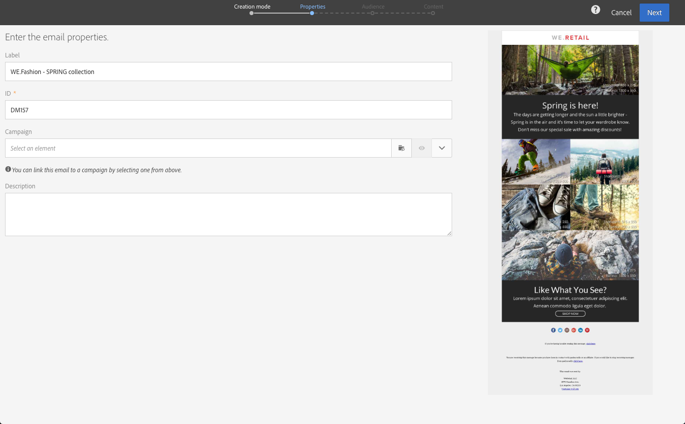
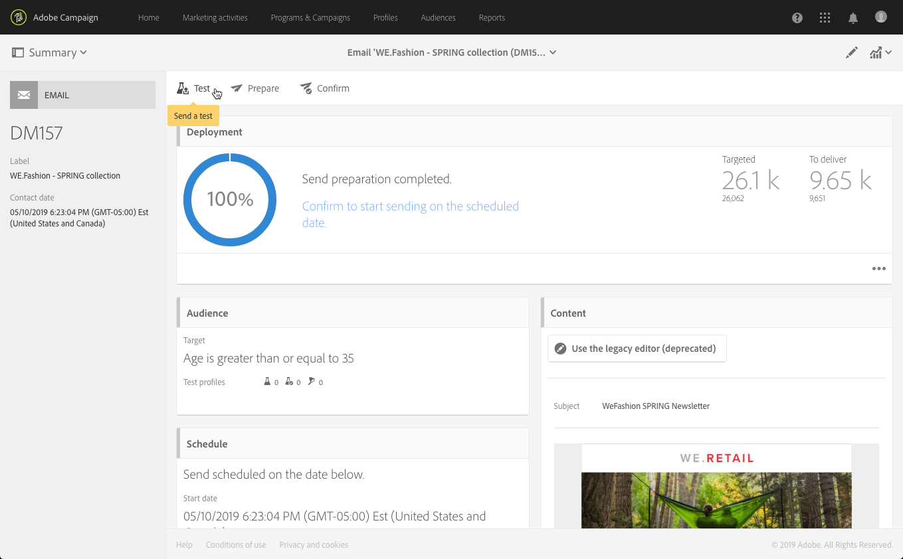

# Creazione di un messaggio e-mail{#creating-an-email}

Potete creare un&#39;e-mail da una [campagna](../../start/using/marketing-activities.md#creating-a-marketing-activity), dalla  pagina principale di Adobe Campaign o nell&#39;elenco [delle attività di](../../start/using/marketing-activities.md#about-marketing-activities)marketing. Potete anche creare e-mail singole e ricorrenti da un flusso di lavoro.

1. Dopo aver iniziato a creare un&#39;attività di e-mail marketing, seleziona il modello da utilizzare.

   Per impostazione predefinita, potete scegliere tra diversi modelli per ogni attività di marketing. Questo consente di preconfigurare alcuni parametri in base alle esigenze e di assegnare un marchio alla consegna. For more on this, see [Managing templates](../../start/using/marketing-activity-templates.md).

   

   >[!NOTE]
   >
   >I modelli di test A/B e di follow-up sono nascosti per impostazione predefinita. Per visualizzarle, selezionate le caselle a sinistra (pannello **[!UICONTROL Filter]** laterale).

1. Immettete le proprietà generali del messaggio e-mail. You can enter a name in the **Label** field and edit the ID. Sia il nome dell&#39;attività che il relativo ID vengono visualizzati nell&#39;interfaccia, ma non sono visibili ai destinatari del messaggio.

   Puoi aggiungere una descrizione che l’utente può visualizzare nel contenuto della campagna.

   

   >[!NOTE]
   >
   >Puoi creare l&#39;e-mail all&#39;interno di una campagna padre dalla pagina principale o dall&#39;elenco delle attività di marketing. Selezionatela dalle campagne già create.

1. Definisci la destinazione del messaggio in base ai criteri aziendali. See [About profiles](../../audiences/using/about-profiles.md).

   Puoi anche definire i profili di test che convalideranno il messaggio. Consulta [Gestione dei profili di test](../../audiences/using/managing-test-profiles.md).

   

1. Definite e personalizzate il contenuto del messaggio, il nome del mittente e l&#39;oggetto utilizzando [Email Designer](../../designing/using/designing-content-in-adobe-campaign.md). Per ulteriori informazioni, consultate [Informazioni sulla progettazione](../../designing/using/designing-content-in-adobe-campaign.md)del contenuto delle e-mail.

   

   Potete progettare il messaggio direttamente utilizzando un modello di contenuto predefinito oppure utilizzando Dreamweaver o Adobe Experience Manager. Se non siete designer, potete anche caricare un contenuto preparato per voi, oppure importare un contenuto esistente da un URL. Consulta [Selezione di un contenuto esistente](../../designing/using/using-existing-content.md).

1. Visualizza in anteprima il messaggio. Consulta [Anteprima dei messaggi](../../sending/using/previewing-messages.md).
1. Conferma la creazione dell’e-mail.

   >[!NOTE]
   >
   >Per poter salvare l’e-mail, è innanzitutto necessario apportare alcune modifiche al contenuto. Se fate clic **[!UICONTROL Cancel]** a questo punto, la procedura guidata non verrà completata e il messaggio e-mail non verrà creato.

   Viene quindi visualizzato il dashboard e-mail. Consente di controllare il messaggio e [preparare l&#39;invio](../../sending/using/preparing-the-send.md).

   Il **[!UICONTROL Edit properties]** pulsante in alto a destra consente di modificare le proprietà del messaggio e-mail. Ad esempio, potete configurare l’e-mail in modo che la relativa etichetta venga calcolata al momento della preparazione della consegna.  I parametri disponibili sono elencati in [questa sezione](../../administration/using/configuring-email-channel.md#list-of-email-properties).

   

1. Pianifica l’invio. Consulta [Pianificazione dei messaggi](../../sending/using/about-scheduling-messages.md).

   

1. Prepara il messaggio per analizzarne la destinazione. See [Preparing the send](../../sending/using/confirming-the-send.md).

   

   >[!NOTE]
   >
   >Puoi impostare regole di affaticamento globali cross-channel che escludono automaticamente i profili sollecitati eccessivamente dalle campagne. Per ulteriori informazioni, consultate [Regole](../../sending/using/fatigue-rules.md)di Fatigue.

1. Invia le bozze per la verifica e la convalida del messaggio e per monitorarne il rendering nella casella in entrata. Vedere [Invio della prova](../../sending/using/sending-proofs.md).

   

1. Invia il messaggio e controllane la distribuzione tramite il dashboard e i registri dei messaggi. Consulta [Invio di messaggi](../../sending/using/confirming-the-send.md).

   

1. Misura l&#39;impatto del messaggio con i report di consegna. For more on reporting, see [this section](../../reporting/using/about-dynamic-reports.md).

**Argomenti correlati**:

* Video sulla [Creazione di un messaggio e-mail](https://docs.adobe.com/content/help/en/campaign-learn/campaign-standard-tutorials/getting-started/create-email-from-homepage.html)
* [Creazione di una guida dettagliata sull’e-mail](https://helpx.adobe.com/it/campaign/kb/acs-get-started-with-emails.html) personalizzata
* [video sull’integrazione](https://docs.adobe.com/content/help/it-IT/campaign-standard-learn/tutorials/designing-content/email-designer/dreamweaver-integration.html) Adobe Campaign e Dreamweaver
* [Integrazione con Adobe Experience Manager](../../integrating/using/integrating-with-experience-manager.md)
