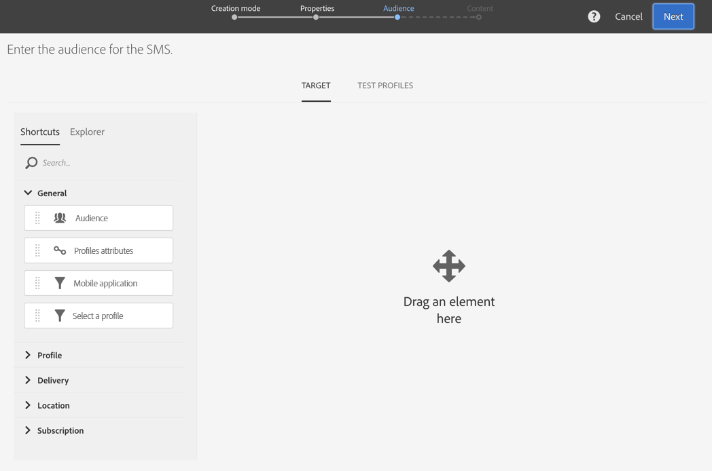

# Creazione di un messaggio SMS{#creating-an-sms-message}

Creare una consegna di SMS è una procedura molto simile a quella per una normale e-mail. I passaggi seguenti descrivono la configurazione specifica di questo canale. Per ulteriori informazioni sulle altre opzioni, consulta [Creazione di un’e-mail](../../channels/using/creating-an-email.md).

I parametri SMS avanzati sono descritti in dettaglio nella sezione relativa alla [configurazione di SMS](../../administration/using/configuring-sms-channel.md).

Per creare e inviare messaggi SMS a un cellulare, è necessario:

* Un account esterno di **[!UICONTROL Routing]** configurato sul canale **[!UICONTROL Mobile (SMS)]** con la modalità **[!UICONTROL Bulk delivery]**. Per ulteriori informazioni, consulta la sezione [Indirizzamento](../../administration/using/configuring-sms-channel.md#defining-an-sms-routing).
* Un modello di consegna correttamente collegato a questo account esterno.

1. Crea una consegna SMS. Puoi eseguire tale operazione dalla [pagina Home](../../start/using/interface-description.md#home-page) di Adobe Campaign, in una [campagna](../../start/using/marketing-activities.md#creating-a-marketing-activity) o nell’[elenco delle attività di marketing](../../start/using/programs-and-campaigns.md#creating-a-campaign).

   Puoi anche aggiungere un’attività SMS all’interno di un flusso di lavoro. Per ulteriori informazioni, consulta la guida [Flussi di lavoro](../../automating/using/sms-delivery.md).

   Durante la creazione di un messaggio, viene visualizzata una procedura guidata per indicarti i passaggi più importanti. I contenuti definiti dalla procedura guidata possono essere modificati in un secondo momento dal dashboard dei messaggi.

1. Seleziona il modello da utilizzare. Puoi scegliere il modello di SMS predefinito o uno dei tuoi modelli.

   

   Per effettuare la consegna a un telefono cellulare, il modello di consegna deve essere collegato correttamente all’account esterno di indirizzamento SMS.

1. Inserisci le proprietà generali dell’SMS.

   

   Sia l’etichetta dell’attività che il relativo ID vengono visualizzati nell’interfaccia, ma non sono visibili ai destinatari del messaggio.

1. Specifica il pubblico di cui desideri eseguire il targeting. Puoi selezionare un pubblico esistente o eseguire direttamente il targeting di una popolazione attraverso la definizione e la combinazione delle regole.

   

1. Aggiungi contenuto al tuo SMS. Puoi anche definire il contenuto facendo clic sulla sezione **[!UICONTROL Content]** del dashboard di distribuzione, una volta completata la creazione dell’SMS. Consulta [Informazioni sulla progettazione di contenuto SMS](../../channels/using/about-sms-and-push-content-design.md).

   Se hai inserito campi di personalizzazione o testo condizionale nel contenuto del messaggio SMS, la lunghezza del messaggio potrà variare da un destinatario all’altro. Infatti, tali fattori possono introdurre caratteri che non vengono presi in considerazione dalla codifica GSM. Questo è il motivo per cui è necessario valutare la lunghezza del messaggio una volta effettuata la personalizzazione. Consulta [Personalizzazione dei messaggi SMS](../../channels/using/personalizing-sms-messages.md).

   

1. Conferma la creazione del messaggio. Viene visualizzato il dashboard dei messaggi.
1. Pianifica l’invio. L’SMS può essere inviato manualmente subito dopo la preparazione del messaggio o in automatico, in una data pianificata. Consulta [Pianificazione dei messaggi](../../sending/using/about-scheduling-messages.md).
1. Prepara il messaggio per analizzarne la validità, la personalizzazione e il target.

   

   >[!NOTE]
   >
   >Puoi impostare regole di affaticamento globali cross-channel che escludono automaticamente i profili sollecitati eccessivamente dalle campagne. Consulta [Regole di affaticamento](../../sending/using/fatigue-rules.md).

1. Invia le bozze per la verifica e la convalida del messaggio e per monitorarne il rendering nella casella in entrata. Consulta la sezione [Invio di bozze](../../sending/using/sending-proofs.md).
1. Conferma l’invio del messaggio. L’invio avrà inizio in base alla pianificazione da te definita.

   

Il messaggio viene inviato. Puoi controllarne la consegna tramite il dashboard e i registri dei messaggi.

Al termine dell’invio, puoi iniziare a misurare l’impatto del messaggio con i rapporti di consegna predefiniti o personalizzati.

**Argomenti correlati:**

* [Informazioni sulla modifica di contenuto SMS e push](../../channels/using/about-sms-and-push-content-design.md)
* [Gestione dei modelli](../../start/using/marketing-activity-templates.md)
* [Creare un video di consegna SMS](https://docs.adobe.com/content/help/it-IT/campaign-standard-learn/tutorials/communication-channels/mobile/sms/sms-delivery.html)
