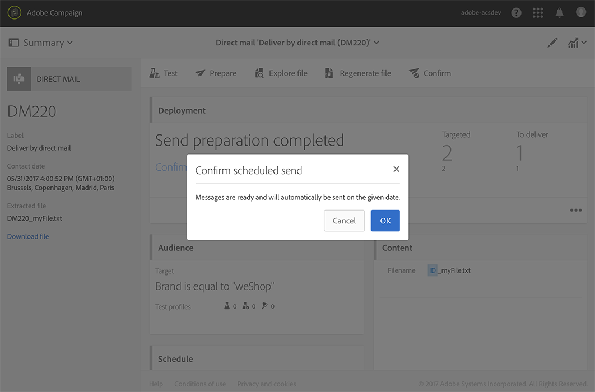

# Creazione della direct mail{#creating-the-direct-mail}

La creazione di una consegna diretta per posta è molto simile alla creazione di un&#39;e-mail regolare. I passaggi seguenti descrivono la configurazione specifica per questo canale. Per ulteriori informazioni sulle altre opzioni, consultate [Creazione di un messaggio e-mail](../../channels/using/creating-an-email.md) .

1. Crea una nuova consegna diretta. Potete crearne uno dalla [home page](../../start/using/interface-description.md#home-page)del Adobe Campaign , in una [campagna](../../start/using/marketing-activities.md#creating-a-marketing-activity) o in un elenco [di attività](../../start/using/programs-and-campaigns.md#creating-a-campaign)di marketing.

   >[!NOTE]
   >
   >Potete anche aggiungere un&#39;attività di posta diretta in un flusso di lavoro. Per ulteriori informazioni, consulta la guida [Flussi](../../automating/using/direct-mail-delivery.md) di lavoro.

   

1. Scegliete il modello predefinito **[!UICONTROL Direct mail]** o uno dei modelli personalizzati. Per ulteriori informazioni sui modelli, consultare la sezione [Gestione dei modelli](../../start/using/marketing-activity-templates.md) .

   

1. Immettere le proprietà generali della consegna.

   

1. Definite il pubblico da includere nel file di estrazione, nonché i profili di test e di trap. See [Defining the direct mail audience](../../channels/using/defining-the-direct-mail-audience.md).

   

   >[!NOTE]
   >
   >La definizione di audience è molto simile alla definizione di un pubblico di e-mail regolare. Consultate [Creazione di audience](../../audiences/using/creating-audiences.md).

1. Modificate il contenuto del file: colonne da includere per ciascun profilo, struttura del file, intestazione e piè di pagina. See [Defining the direct mail content](../../channels/using/defining-the-direct-mail-content.md).

   

1. Fate clic sulla **[!UICONTROL Schedule]** sezione del dashboard consegna per definire la data di contatto. Per la posta diretta, la data di contatto è obbligatoria. Per ulteriori informazioni, vedere [Programmazione dell&#39;invio](../../sending/using/about-scheduling-messages.md).

   

1. Se avete aggiunto dei profili di test (consultate [Aggiunta di profili](../../channels/using/defining-the-direct-mail-audience.md#adding-test-and-trap-profiles)di test e di trap), potete verificare la distribuzione prima di preparare il file finale. Consente di creare un file di esempio contenente solo i profili di prova selezionati.

   Fate clic su **[!UICONTROL Test]** per generare il file di esempio. Fare clic su **[!UICONTROL Summary]**, nell&#39;angolo in alto a sinistra, quindi selezionare **[!UICONTROL Proofs]**. Nella parte sinistra dello schermo, selezionare la prova e fare clic su **[!UICONTROL Download file]**.

   >[!NOTE]
   >
   >Il **[!UICONTROL Export]** ruolo è necessario per consentire  Adobe Campaign di esportare il file e renderlo disponibile per il download. Contattare l&#39;amministratore.

   

1. Una volta definiti il contenuto della distribuzione, il pubblico e la data di contatto, fate clic sul **[!UICONTROL Prepare]** pulsante, nel dashboard della distribuzione.

   

   Vengono applicate le regole di tipologia. Ad esempio, tutti gli indirizzi postali non specificati sono esclusi dalla destinazione. Per questo motivo, accertatevi di aver selezionato la **[!UICONTROL Address specified]** casella nelle informazioni dei profili (consultate [Recommendations](../../channels/using/about-direct-mail.md#recommendations)). Se avete definito un **[!UICONTROL Maximum volume of message]** nelle proprietà di posta diretta o a livello di modello, sarà applicato anche qui.

   

   >[!NOTE]
   >
   >Potete impostare regole di affaticamento tra canali globali che escluderanno automaticamente i profili sollecitati dalle campagne. Consultate [Regole](../../sending/using/fatigue-rules.md)di fatica.

1. Fare clic su **[!UICONTROL Explore file]** per visualizzare in anteprima le prime 100 righe del file.

   

   Il file completo è accessibile per il download locale nella parte sinistra dello schermo. Il download del file genera una voce di registro nel **[!UICONTROL Export audits]** menu. Per ulteriori informazioni sui controlli delle esportazioni, consultare la sezione [Controllo delle esportazioni](../../administration/using/auditing-export-logs.md) .

   >[!NOTE]
   >
   >Il **[!UICONTROL Export]** ruolo è necessario per consentire  Adobe Campaign di esportare il file e renderlo disponibile per il download. Contattare l&#39;amministratore.

   Per modificare il contenuto della distribuzione, è sufficiente fare clic sul **[!UICONTROL Regenerate file]** pulsante per tenere conto della modifica. Non è necessario rivedere la preparazione.

   

1. Per confermare che il file è definitivo, fate clic su **[!UICONTROL Confirm]** nel dashboard di consegna.

   

È ora possibile inviare il file di estrazione al provider di posta diretta. A tal fine, sono disponibili diverse opzioni:

* Inviatelo via e-mail, con il file allegato
* Invia tramite Campaign: esegui la posta diretta in un [flusso](../../automating/using/direct-mail-delivery.md) di lavoro **[!UICONTROL Transfer file]** della campagna e aggiungi un messaggioper inviare il file, ad esempio tramite FTP. Consulta [Trasferisci file](../../automating/using/transfer-file.md).

Il provider recupera l&#39;elenco degli indirizzi errati e invia queste informazioni al Adobe Campaign  che aggiunge automaticamente all&#39;elenco blocchi gli indirizzi errati. See [Return to sender](../../channels/using/return-to-sender.md).
