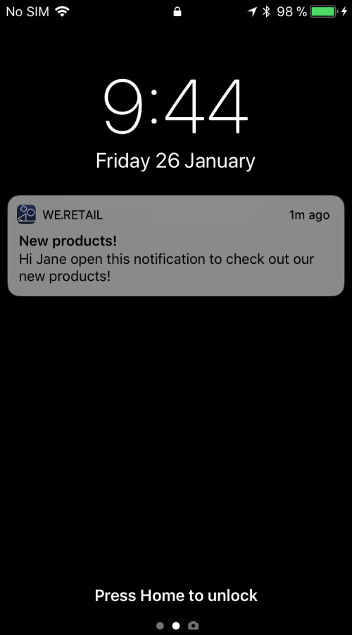

# Personalizzazione di una notifica push{#customizing-a-push-notification}

Per ottimizzare la notifica push, Adobe Campaign ti consente di accedere a un set di opzioni avanzate durante la progettazione di una notifica push.

In qualità di utente esperto, per configurare le app mobili in Adobe Campaign, consulta la seguente nota tecnica [Struttura del payload per le notifiche push di Campaign Standard](https://docs.adobe.com/content/help/it-IT/campaign-standard/using/communication-channels/push-notifications/push-payload.html).

**Contenuto correlato:**

* [Report notifiche push](../../reporting/using/push-notification-report.md)
* [Invio di una notifica push all’interno di un flusso di lavoro](../../automating/using/push-notification-delivery.md)

## Riprodurre un suono {#play-a-sound}

La funzione **[!UICONTROL Play a sound]** consente all’applicazione di riprodurre suoni sul dispositivo con la consegna di una notifica push, quando l’app non è in esecuzione.

Un suono avvisa gli utenti di una notifica push, conferendogli maggiore visibilità. Per includere un suono nella tua app mobile:

1. Apri la notifica push e accedi alla sezione **[!UICONTROL Advanced options]**.
1. Nel campo **[!UICONTROL Play a sound]**, inserisci il nome del file audio, senza estensione, che deve essere riprodotto dal dispositivo mobile quando viene ricevuta la notifica.

   Per ulteriori informazioni sui formati supportati, consulta la documentazione [Apple](https://support.apple.com/kb/PH16864?locale=it_IT) e [Android](https://developer.android.com/guide/topics/media/media-formats).

   

1. Il file audio viene riprodotto durante la consegna della notifica se il file è definito nel pacchetto dell’app mobile. In caso contrario, viene riprodotto l’audio predefinito del dispositivo.

L’utente riceverà quindi la notifica push e il suono solo se l’audio del telefono non è disattivato.

## Aggiornare il valore del badge {#refresh-the-badge-value}

Un badge viene utilizzato per visualizzare direttamente sull’icona dell’applicazione il numero di nuove informazioni non lette. Il valore del badge scompare non appena l’utente apre o legge il nuovo contenuto dall’applicazione.

Quando un dispositivo riceve una notifica, quest’ultima può aggiornare o aggiungere un valore di badge per l’app correlata. Per inviare un valore di badge dal lato server:

1. Apri la notifica push e accedi alla sezione **[!UICONTROL Advanced options]**.
1. Il valore del badge deve essere un numero intero e può essere aggiornato in diversi modi:

   * Per aggiornare il badge, immetti 0 nel campo **[!UICONTROL Value of the badge]**. Ciò rimuoverà il badge dall’icona dell’applicazione.
   * Per aggiungere un valore di badge, immettere un numero qualsiasi nel campo **[!UICONTROL Value of the badge]**. Questo numero viene visualizzato automaticamente nel badge non appena l’utente riceve la notifica push.
   * Se il campo è vuoto o non contiene un numero intero, il valore del badge non viene modificato.

   In questo caso, nel campo **[!UICONTROL Value of the badge]** è stato immesso 1 per informare gli utenti che l’applicazione contiene nuove informazioni.

   

1. Dopo aver inviato il messaggio, gli utenti riceveranno la notifica push e la loro applicazione visualizzerà automaticamente il nuovo valore del badge.

   

## Aggiungere un deep link {#add-a-deeplink}

Un deep link ti consente di portare gli utenti direttamente al contenuto presente all’interno dell’applicazione (anziché aprire una pagina del browser web).

Un deep link può includere dati di personalizzazione per un’esperienza in-app personalizzata. Ad esempio, i nomi dei destinatari vengono inseriti automaticamente nella pagina a cui l’applicazione li indirizza.

Per aggiungere un deep link in una notifica push:

1. Apri la notifica push e accedi alla sezione **[!UICONTROL Advanced options]**.
1. Immetti il collegamento nel campo **[!UICONTROL Add a deeplink]**.

   

1. Dopo l’invio del messaggio, gli utenti riceveranno la notifica push e accederanno alla pagina specifica dell’app interagendo con la notifica, ad esempio toccando o facendo clic sul pulsante di invito all’azione.

   

## Definire un’azione {#define-an-action}

Se disponibile nell’app mobile, puoi aggiungere un ID di categoria e quindi visualizzare i pulsanti di azione. Queste notifiche forniscono all’utente un modo più rapido per eseguire diverse attività in risposta a una notifica senza aprire o esplorare l’applicazione.

La finestra di dialogo visualizzata sul telefono dell’utente richiede una decisione per procedere. Quando l’utente seleziona una delle azioni, il sistema notifica l’applicazione in modo tale che possa eseguire tutte le attività associate.

Per aggiungere una categoria in una notifica push:

1. Apri la notifica push e accedi alla sezione **[!UICONTROL Advanced options]**.
1. Immetti un nome di categoria predefinito nel campo **[!UICONTROL Category]** per visualizzare i pulsanti utilizzabili quando viene ricevuta la notifica push.

   Lo sviluppatore dell’app mobile deve definire l’ID di categoria e il comportamento previsto dei pulsanti nell’applicazione. Per ulteriori informazioni, consulta la [documentazione per sviluppatori di Apple](https://developer.apple.com/library/content/documentation/NetworkingInternet/Conceptual/RemoteNotificationsPG/SupportingNotificationsinYourApp.html) (sezione **Configuring Categories and Actionable Notifications**) o la [documentazione per sviluppatori di Android](https://developer.android.com/guide/topics/ui/notifiers/notifications.html).

   

1. Dopo aver inviato la notifica push, gli utenti la ricevono e devono intervenire con i pulsanti utilizzabili configurati in precedenza.

   

A seconda dell’azione dell’utente, l’applicazione viene notificata in modo tale da poter eseguire tutte le attività associate.

## Aggiungere una data di scadenza {#add-expiration-date}

Impostare una data di scadenza per la notifica push ti consente di impostare una data di scadenza specifica in cui il messaggio non verrà più inviato da Apple ([APNS](https://developer.apple.com/documentation/usernotifications/setting_up_a_remote_notification_server/sending_notification_requests_to_apns)) o Android ([FCM](https://firebase.google.com/docs/cloud-messaging/concept-options)).

Per aggiungere una data di scadenza alla notifica push:

1. Seleziona l’opzione **[!UICONTROL Expire message]**.

   >[!NOTE]
   >
   >Selezionando l’opzione **[!UICONTROL Expire message]**, la durata viene automaticamente impostata su 0. Se non modifichi il valore, APNS e FCM tenteranno di inviare il messaggio immediatamente. Se l’invio non riesce, il messaggio non verrà inviato di nuovo.

1. Nel campo **[!UICONTROL Duration]**, seleziona la validità della notifica push.

   

1. Dopo l’invio della notifica push, se l’utente non l’ha ricevuta immediatamente poiché il telefono non è acceso o non dispone di segnale, la notifica push verrà comunque inviata entro il periodo di tempo della data di scadenza.

Se la notifica push non è stata inviata prima della data di scadenza, verrà eliminata.

## Aggiungere campi personalizzati {#add-custom-fields}

I campi personalizzati ti consentono di trasmettere dati personalizzati nel payload sotto forma di una coppia di valori chiave. Questa opzione può essere utilizzata per trasmettere dati aggiuntivi all’applicazione oltre le chiavi predefinite.

Per eseguire questa operazione:

1. Apri la notifica push e accedi alla sezione **[!UICONTROL Advanced options]**.
1. Nella categoria **[!UICONTROL Custom fields]**, fai clic sul pulsante **[!UICONTROL Add an element]**.
1. Inserisci le **[!UICONTROL Keys]** e quindi i **[!UICONTROL Values]** associati a ciascuna chiave.

   

1. La gestione e lo scopo dei campi personalizzati dipende interamente dall’app mobile. Nella notifica push seguente, i campi personalizzati sono stati utilizzati dall’app per visualizzare le etichette dei pulsanti per la notifica push.

   

## Aggiungere contenuti rich media {#add-rich-media-content}

I contenuti rich media ti consentono di migliorare il coinvolgimento dell’utente, rendendolo più propenso ad aprire la notifica push.

Puoi includere un file immagine, gif, audio o video che verrà riprodotto o visualizzato nella notifica stessa. Gli utenti dell’app non dovranno aprire l’applicazione per visualizzarlo.

Per includere rich media nella notifica push:

1. Apri la notifica push e accedi alla sezione **[!UICONTROL Advanced options]**.
1. Immetti l’URL del file nel campo **[!UICONTROL Rich media content URL]** per ciascun formato: iOS e Android.

   Per iOS 10 o versioni successive, puoi inserire file immagine, gif, audio e video. Per le versioni iOS precedenti, la notifica push verrà visualizzata senza contenuti rich. Per i passaggi dettagliati su come visualizzare un’immagine da una notifica push di Adobe Campaign su un dispositivo iOS, consulta questa [pagina](https://docs.adobe.com/content/help/it-IT/campaign-standard/using/communication-channels/push-notifications/image-push-notification.translate.html).

   Per Android, puoi includere solo immagini.

   

1. Dopo aver inviato il messaggio, l’utente riceverà la notifica push e potrà visualizzare i contenuti rich media.

   

## Modificare il comportamento di notifica per iOS {#change-the-notification-behavior-for-ios}

Per iOS 10 o versioni successive, nella sezione **[!UICONTROL Advanced options]** delle notifiche push sono disponibili due opzioni aggiuntive: **[!UICONTROL Mutable content]** e **[!UICONTROL Content available]**.

Quando è selezionata l’opzione **[!UICONTROL Mutable content]** e/o viene aggiunto un URL di contenuti rich media, il contrassegno di contenuto variabile verrà inviato nel payload push e consentirà la modifica del contenuto della notifica push da parte di un’estensione dell’applicazione del servizio di notifica fornita nell’SDK iOS. Per ulteriori informazioni, consulta la [documentazione per sviluppatori di Apple](https://developer.apple.com/library/content/documentation/NetworkingInternet/Conceptual/RemoteNotificationsPG/ModifyingNotifications.html).

Puoi quindi sfruttare le estensioni dell’app mobile per modificare ulteriormente il contenuto o la presentazione delle notifiche push in arrivo inviate da Adobe Campaign. Ad esempio, gli utenti possono sfruttare questa opzione per:

* Decrittare dati consegnati in un formato crittografato
* Scaricare immagini o altri file multimediali e aggiungerli come allegati a una notifica
* Modificare il testo del corpo o del titolo di una notifica
* Aggiungere un identificatore di thread a una notifica

Quando **[!UICONTROL Content available]** è selezionato, il contrassegno di contenuto disponibile verrà inviato nel payload push per garantire che l’app venga riattivata non appena riceve la notifica push, il che significa che l’app sarà in grado di accedere ai dati del payload. Questo funziona anche se l’app è in esecuzione in background e non richiede alcuna interazione da parte dell’utente (ad esempio, toccando la notifica push), tuttavia non si applica se l’app non è in esecuzione. Per ulteriori informazioni, consulta la [documentazione per gli sviluppatori di Apple](https://developer.apple.com/library/content/documentation/NetworkingInternet/Conceptual/RemoteNotificationsPG/CreatingtheNotificationPayload.html).

## Modificare il comportamento di notifica per Android {#change-the-notification-behavior-for-android}

Per Android, puoi immettere l’URL del file nel campo **URL contenuti rich media**. A differenza della versione iOS, per Android puoi includere solo immagini e non file GIF, audio o video.

La casella di controllo **[!UICONTROL High priority]** ti consente di impostare una priorità alta o normale per le notifiche push. Per ulteriori informazioni sulla priorità dei messaggi, consulta la [documentazione per gli sviluppatori di Google](https://firebase.google.com/docs/cloud-messaging/concept-options#setting-the-priority-of-a-message).

