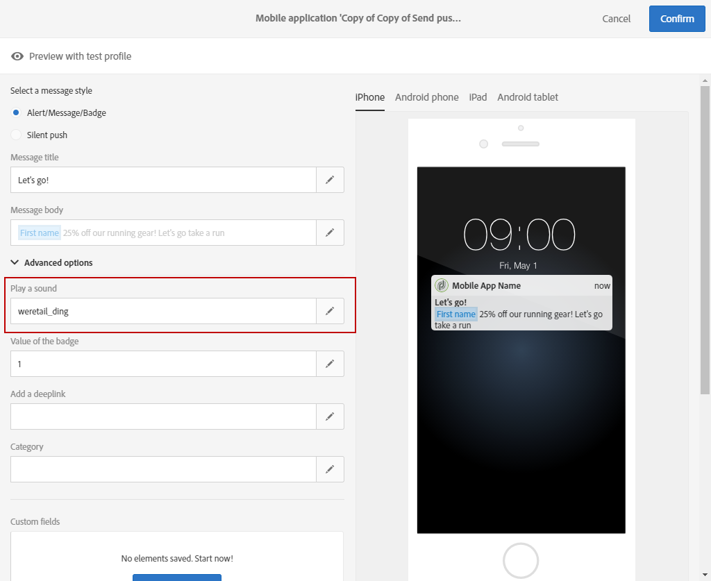

# Personalizzazione di una notifica push{#customizing-a-push-notification}

Per ottimizzare la notifica push, Adobe Campaign consente di accedere a una serie di opzioni avanzate durante la progettazione di una notifica push.

In qualità di utente esperto, per configurare le applicazioni mobili in Adobe Campaign, consulta la seguente nota tecnica [Informazioni sulla struttura](https://helpx.adobe.com/campaign/kb/understanding-campaign-standard-push-notifications-payload-struc.html)payload delle notifiche push standard di Campaign.

**Contenuto correlato:**

* [Report notifiche push](../../reporting/using/push-notification-report.md)
* [Invio di una notifica push in un flusso di lavoro](../../automating/using/push-notification-delivery.md)

## Riproduzione di un suono {#play-a-sound}

La funzione **[!UICONTROL Play a sound]** consente all'applicazione di riprodurre i suoni sul dispositivo con la consegna di una notifica push, quando l'app non è in esecuzione.

Un suono avvisa gli utenti di una notifica push, conferendogli maggiore visibilità. Per includere un suono nell'app mobile:

1. Aprite la notifica push e accedete alla **[!UICONTROL Advanced options]** sezione.
1. Nel **[!UICONTROL Play a sound]** campo, inserire il nome del file audio, senza l'estensione, che deve essere riprodotto dal dispositivo mobile quando viene ricevuta la notifica.

   Per ulteriori informazioni sui formati supportati, consultate la documentazione [Apple](https://support.apple.com/kb/PH16864?locale=en_US) e [Android](https://developer.android.com/guide/topics/media/media-formats.html) .

   

1. Il file audio viene riprodotto durante la trasmissione della notifica se il file è definito nel pacchetto dell'applicazione mobile. In caso contrario, viene riprodotto l'audio predefinito del dispositivo.

L'utente riceverà quindi la notifica push e l'audio solo se il telefono non è disattivato.

## Aggiornare il valore del contrassegno {#refresh-the-badge-value}

Un contrassegno viene utilizzato per visualizzare direttamente sull'icona dell'applicazione il numero di nuove informazioni non lette. Il valore contrassegno scompare non appena l'utente apre o legge il nuovo contenuto dall'applicazione.

Quando una notifica viene ricevuta su un dispositivo, può aggiornare o aggiungere un valore contrassegno per l'app correlata. Per inviare un valore contrassegno dal lato Server:

1. Aprite la notifica push e accedete alla **[!UICONTROL Advanced options]** sezione.
1. Il valore del contrassegno deve essere un numero intero e può essere aggiornato in modi diversi:

   * Per aggiornare il contrassegno, immettere 0 nel **[!UICONTROL Value of the badge]** campo. Questo rimuoverà il contrassegno dall'icona dell'applicazione.
   * Per aggiungere un valore contrassegno, immettere un numero qualsiasi nel **[!UICONTROL Value of the badge]** campo. Questo numero viene visualizzato automaticamente nel contrassegno non appena l'utente riceve la notifica push.
   * Se il campo è vuoto o non contiene un numero intero, il valore del contrassegno non cambia.
   In questo **[!UICONTROL Value of the badge]** campo è stato immesso 1 per informare gli utenti che l’applicazione contiene nuove informazioni.

   

1. Dopo aver inviato il messaggio, gli utenti riceveranno la notifica push e la loro applicazione visualizzerà automaticamente il nuovo valore contrassegno.

   

## Aggiungere un collegamento profondo {#add-a-deeplink}

Un collegamento profondo consente di portare gli utenti direttamente al contenuto presente all’interno dell’applicazione (anziché aprire una pagina del browser Web).

Un collegamento profondo può includere dati di personalizzazione per un'esperienza in-app personalizzata. Ad esempio, i nomi dei destinatari vengono automaticamente inseriti nella pagina a cui l'applicazione li indirizza.

Per aggiungere un collegamento profondo in una notifica push:

1. Aprite la notifica push e accedete alla **[!UICONTROL Advanced options]** sezione.
1. Inserisci il collegamento nel **[!UICONTROL Add a deeplink]** campo.

   

1. Dopo l'invio del messaggio, gli utenti riceveranno la notifica push e accederanno alla pagina specifica dell'app interagendo con la notifica, ad esempio toccando o facendo clic sul pulsante di chiamata all'azione.

   

## Definire un'azione {#define-an-action}

Puoi aggiungere un ID categoria, se disponibile nell’applicazione mobile, e quindi visualizzare i pulsanti di azione. Queste notifiche forniscono all'utente un modo più rapido per eseguire diverse attività in risposta a una notifica senza aprire o navigare nell'applicazione.

La finestra di dialogo visualizzata sul telefono dell'utente richiede una decisione di procedere. Quando l'utente seleziona una delle azioni, il sistema notifica all'applicazione in modo che possa eseguire tutte le attività associate.

Per aggiungere una categoria in una notifica push:

1. Aprite la notifica push e accedete alla **[!UICONTROL Advanced options]** sezione.
1. Immettete un nome di categoria predefinito nel **[!UICONTROL Category]** campo per visualizzare i pulsanti utilizzabili quando viene ricevuta la notifica push.

   Lo sviluppatore di applicazioni mobili deve definire l'ID categoria e il comportamento previsto dei pulsanti nell'applicazione. Per ulteriori informazioni, consultate la documentazione [per sviluppatori](https://developer.apple.com/library/content/documentation/NetworkingInternet/Conceptual/RemoteNotificationsPG/SupportingNotificationsinYourApp.html) Apple (sezione **Configurazione delle categorie e delle notifiche** fruibili) o la documentazione [per sviluppatori](https://developer.android.com/guide/topics/ui/notifiers/notifications.html)Android.

   

1. Dopo aver inviato la notifica push, gli utenti la ricevono e devono intervenire con i pulsanti attivabili configurati in precedenza.

   

A seconda dell'azione dell'utente, l'applicazione riceve una notifica in modo da poter eseguire tutte le attività associate.

## Aggiunta di una data di scadenza {#add-expiration-date}

>[!NOTE]
>
>Queste modifiche si applicano solo a partire dalla release Campaign Standard 19.4.

Impostando una data di scadenza sulla notifica push, puoi impostare una data di scadenza specifica in cui il messaggio non verrà più inviato da Apple ([APNS](https://developer.apple.com/documentation/usernotifications/setting_up_a_remote_notification_server/sending_notification_requests_to_apns)) o Android ([FCM](https://firebase.google.com/docs/cloud-messaging/concept-options)).

Per aggiungere una data di scadenza alla notifica push:

1. Selezionare l' **[!UICONTROL Expire message]** opzione.

   >[!NOTE]
   >
   >Selezionando l' **[!UICONTROL Expire message]** opzione, la durata viene automaticamente impostata su 0. Se non si modifica il valore, APNS e FCM tenteranno di inviare il messaggio immediatamente. Se non riesce, il messaggio non verrà inviato di nuovo.

1. Nel **[!UICONTROL Duration]** campo, selezionate la validità della notifica push.

   

1. Dopo l'invio della notifica push, se l'utente non l'ha ricevuta immediatamente a causa del telefono che non è acceso o che non ha un segnale, la notifica push verrà comunque inviata entro lo slot di data di scadenza.

Se la notifica push non è stata inviata prima della data di scadenza, verrà eliminata.

## Aggiunta di campi personalizzati {#add-custom-fields}

I campi personalizzati consentono di trasmettere dati personalizzati nel payload sotto forma di coppia di valori chiave. Questa opzione può essere utilizzata per trasmettere dati aggiuntivi all'applicazione oltre le chiavi predefinite.

A questo scopo:

1. Aprite la notifica push e accedete alla **[!UICONTROL Advanced options]** sezione.
1. Nella **[!UICONTROL Custom fields]** categoria, fare clic sul **[!UICONTROL Add an element]** pulsante.
1. Inserite **[!UICONTROL Keys]** quindi il **[!UICONTROL Values]** codice associato a ogni chiave.

   

1. La gestione e lo scopo dei campi personalizzati dipende interamente dall'app mobile. Nella notifica push seguente, i campi personalizzati sono stati utilizzati dall'app per visualizzare le etichette dei pulsanti per la notifica push.

   

## Aggiunta di contenuti multimediali {#add-rich-media-content}

I contenuti multimediali avanzati consentono di migliorare il coinvolgimento degli utenti, il che significa che l’utente sarà più propenso ad aprire la notifica push.

Potete includere un file immagine, gif, audio o video che verrà riprodotto o visualizzato nella notifica stessa. Gli utenti dell'app non dovranno aprire l'applicazione per visualizzarla.

Per includere contenuti multimediali nella notifica push:

1. Aprite la notifica push e accedete alla **[!UICONTROL Advanced options]** sezione.
1. Immettete l’URL del file nel **[!UICONTROL Rich media content URL]** campo per ciascun formato: iOS e Android.

   Per iOS 10 o versione successiva, potete inserire file immagine, gif, audio e video. Per le versioni iOS precedenti, la notifica push verrà visualizzata senza contenuto avanzato. Per i passaggi dettagliati su come visualizzare un'immagine da una notifica push di Adobe Campaign su un dispositivo iOS, fai riferimento a questa [pagina](https://helpx.adobe.com/campaign/kb/display-image-push.html).

   Per Android, potete includere solo immagini.

   

1. Dopo aver inviato il messaggio, l'utente riceverà la notifica push e potrà visualizzare il contenuto multimediale.

   

## Modifica del comportamento di notifica per iOS {#change-the-notification-behavior-for-ios}

Per iOS 10 o versione successiva, nella sezione **[!UICONTROL Advanced options]** delle notifiche push sono disponibili due opzioni aggiuntive: **[!UICONTROL Mutable content]** e **[!UICONTROL Content available]**.

Quando l' **[!UICONTROL Mutable content]** opzione è selezionata e/o viene aggiunto un URL di contenuto multimediale, il flag di contenuto variabile verrà inviato nel payload push e consentirà la modifica del contenuto della notifica push tramite un'estensione del servizio di notifica fornita in iOS SDK. Per ulteriori informazioni, consultate la documentazione [per gli sviluppatori di](https://developer.apple.com/library/content/documentation/NetworkingInternet/Conceptual/RemoteNotificationsPG/ModifyingNotifications.html)Apple.

Puoi quindi sfruttare le estensioni delle tue app mobili per modificare ulteriormente il contenuto o la presentazione delle notifiche push in arrivo inviate da Adobe Campaign. Ad esempio, gli utenti possono sfruttare questa opzione per:

* Decrittografare i dati inviati in formato crittografato
* Scaricare immagini o altri file multimediali e aggiungerli come allegati a una notifica
* Modificare il corpo o il testo del titolo di una notifica
* Aggiunta di un identificatore di thread a una notifica

Quando **[!UICONTROL Content available]** è selezionato, il flag di contenuto disponibile verrà inviato nel payload push per garantire che l'app venga riattivata non appena riceve la notifica push, il che significa che l'app sarà in grado di accedere ai dati di payload. Questo funziona anche se l'app è in esecuzione in background e non richiede alcuna interazione da parte dell'utente (ad esempio, toccando una notifica push), tuttavia, questo non si applica se l'app non è in esecuzione. Per ulteriori informazioni, consultate la documentazione [per gli sviluppatori di](https://developer.apple.com/library/content/documentation/NetworkingInternet/Conceptual/RemoteNotificationsPG/CreatingtheNotificationPayload.html)Apple.

## Modifica del comportamento di notifica per Android {#change-the-notification-behavior-for-android}

Per Android, potete immettere l'URL del file nel campo URL **contenuto** multimediale. Con la versione iOS, invece, per Android potete includere solo immagini e non file GIF, audio o video.

La **[!UICONTROL High priority]** casella di controllo consente di impostare una priorità alta o normale per le notifiche push. Per ulteriori informazioni sulla priorità dei messaggi, consulta la documentazione [per gli sviluppatori di](https://firebase.google.com/docs/cloud-messaging/concept-options#setting-the-priority-of-a-message)Google.

