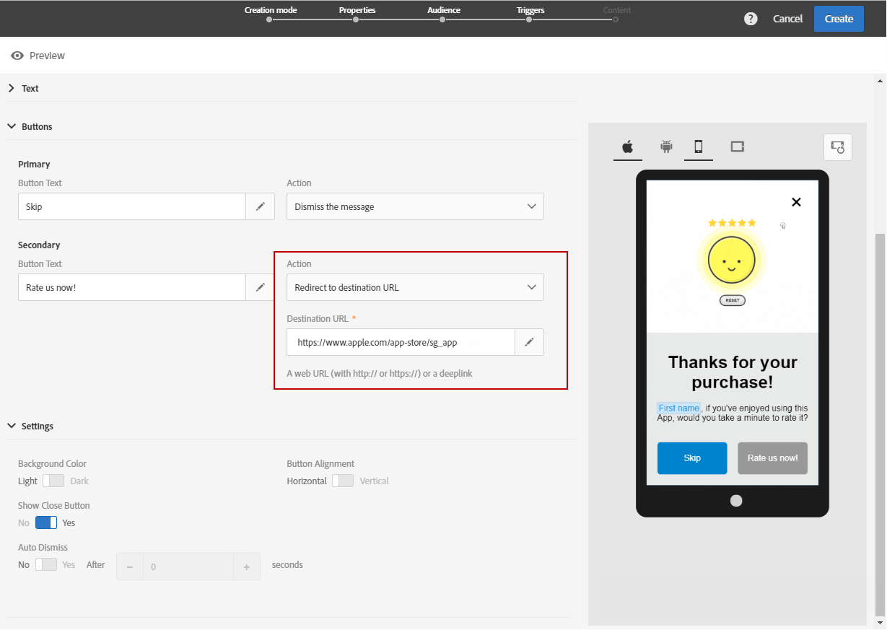
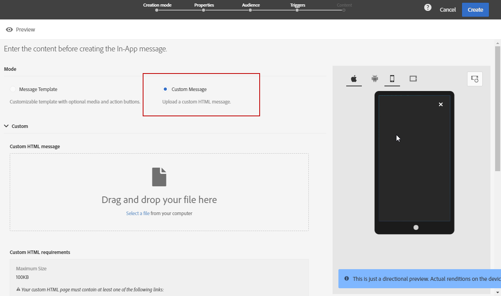
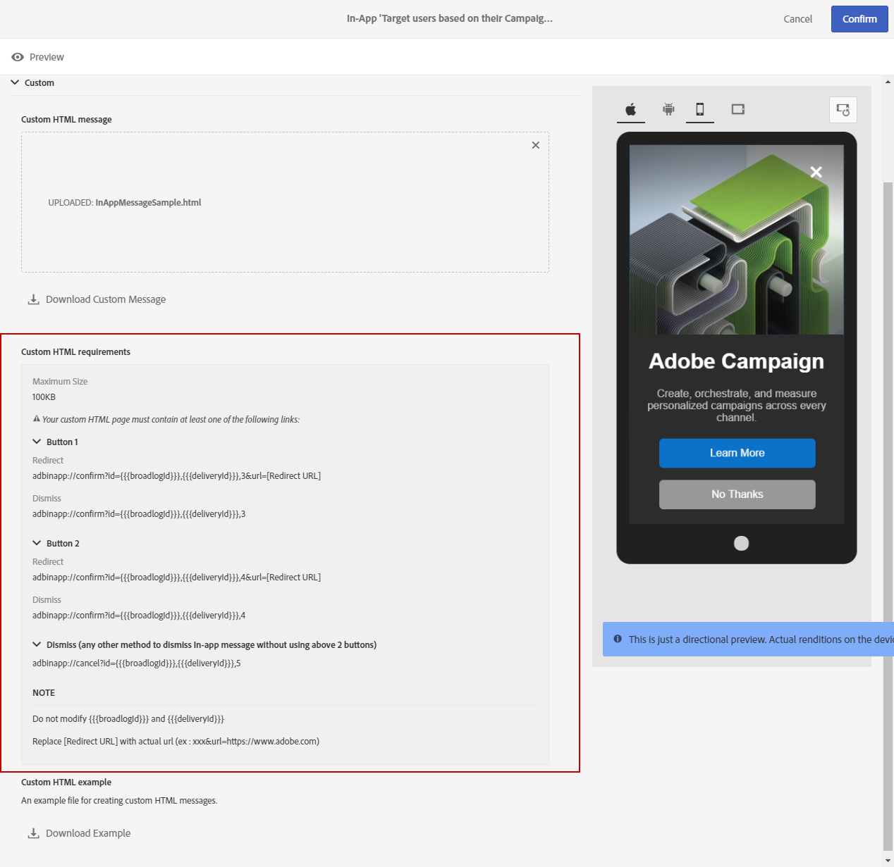

# Personalizzazione di un messaggio in-app{#customizing-an-in-app-message}

Per ottimizzare il tuo messaggio in-app, Adobe Campaign ti consente di accedere a una serie di opzioni avanzate durante la progettazione in-app.

L’editor del contenuto in-app ti consente di scegliere tra due modalità di messaggio in-app:

* [Modello di messaggio](#customizing-with-a-message-template): ti permette di personalizzare completamente l’app tramite immagini o video e pulsanti di azione.
* [Messaggio personalizzato](#customizing-with-a-custom-html-message): questo modello ti consente di importare codice HTML personalizzato.

>[!NOTE]
>
> Il rendering dei messaggi in-app è supportato solo per Android API 19 e versioni successive.

**Argomenti correlati:**

* [Invio del messaggio in-app](../../channels/using/preparing-and-sending-an-in-app-message.md#sending-your-in-app-message)
* [Reporting in-app](../../reporting/using/in-app-report.md)
* [Implementazione del tracciamento delle notifiche locali](../../administration/using/local-tracking.md)

## Personalizzazione tramite un modello di messaggio {#customizing-with-a-message-template}

### Layout {#layout}

Il menu a discesa **[!UICONTROL Layout]** offre quattro opzioni diverse tra cui scegliere a seconda delle tue esigenze di messaggistica:

* **[!UICONTROL Full page]**: questo tipo di layout copre l’intero schermo dei dispositivi per il pubblico.

   Supporta i componenti per contenuti multimediali (immagine, video), di testo e i pulsanti.

* **[!UICONTROL Large modal]**: questo layout viene visualizzato in una grande finestra in stile avviso. L’applicazione rimane visibile in background.

   Supporta i componenti per contenuti multimediali (immagine, video), di testo e i pulsanti.

* **[!UICONTROL Small modal]**: questo layout viene visualizzato come una piccola finestra di avviso, l’applicazione rimane visibile in background.

   Supporta i componenti per contenuti multimediali (immagine, video), di testo e i pulsanti.

* **[!UICONTROL Alert]**: questo tipo di layout viene visualizzato come messaggio di avviso del sistema operativo nativo.

   Può supportare solo componenti di testo e pulsanti.

* **[!UICONTROL Local notification]**: questo tipo di layout viene visualizzato come messaggio del banner.

   Può supportare solo audio, testo e destinazione. Per ulteriori informazioni sulla notifica locale, consulta [Personalizzazione di un tipo di messaggio di notifica locale](#customizing-a-local-notification-message-type).

Ogni tipo di layout può essere visualizzato in anteprima su diversi dispositivi quali telefono, tablet, piattaforma, ad esempio Android o iOS e anche secondo l’orientamento, come orizzontale o verticale nella finestra di destra dell’editor di contenuti.

### Media {#media}

L’elenco a discesa **[!UICONTROL Media]** consente di aggiungere contenuti multimediali al messaggio in-app per creare un’esperienza coinvolgente per l’utente finale.

1. Seleziona il tuo **[!UICONTROL Media Type]**, scegliendo tra immagine e video.
1. Per il tipo di supporto **[!UICONTROL Image]**, immetti l’URL nel campo **[!UICONTROL Media URL]** in base ai formati supportati.

   Se necessario, puoi anche inserire il percorso di un’**[!UICONTROL Bundled image]** che può essere utilizzato se il dispositivo è offline.

   

1. Per il tipo di **[!UICONTROL Video]** supporto, immetti l’URL nel campo **[!UICONTROL Media URL]**.

   Quindi, inserisci il **[!UICONTROL Video poster]** da usare durante il download del video sui dispositivi del pubblico o finché gli utenti non toccano il pulsante di riproduzione.

   

### Testo {#text}

Se necessario, puoi anche aggiungere un titolo e un contenuto del messaggio al messaggio in-app. Per personalizzare meglio il messaggio in-app, puoi aggiungere al contenuto vari campi di personalizzazione, blocchi di contenuto e testo dinamico.

1. Nell’elenco a discesa **[!UICONTROL Text]**, aggiungi un titolo nel campo **[!UICONTROL Message title]**.

   

1. Inserisci il contenuto nel campo **[!UICONTROL Message content]**.
1. Per personalizzare ulteriormente il testo, fai clic sull’icona  per aggiungere campi di personalizzazione.

   

1. Inserisci il contenuto del messaggio e aggiungi i campi di personalizzazione, se necessario.

   Per ulteriori informazioni sul campo della personalizzazione, consulta [questa sezione](../../designing/using/personalization.md#inserting-a-personalization-field).

   

1. Controlla il contenuto del messaggio nella finestra di anteprima.

   

### Pulsanti {#buttons}

Puoi aggiungere fino a due pulsanti al messaggio in-app.

1. Nell’elenco a discesa **[!UICONTROL Buttons]**, inserisci il testo del primo pulsante nella categoria **[!UICONTROL Primary]**.

   

1. Scegli quale tra le due azioni **[!UICONTROL Dismiss]** e **[!UICONTROL Redirect]** sarà assegnata al pulsante principale.
1. Nella categoria **[!UICONTROL Secondary]**, aggiungi un secondo pulsante all’app, se necessario, immettendo il testo.
1. Seleziona l’azione associata al secondo pulsante.
1. Se hai scelto l’azione **[!UICONTROL Redirect]**, immetti l’URL web o il collegamento diretto nel campo **[!UICONTROL Destination URL]**.

   

1. Inserisci l’URL web o il collegamento diretto nel campo **[!UICONTROL Destination URL]**, se hai scelto l’azione **[!UICONTROL Redirect]**,
1. Controlla il contenuto del messaggio nella finestra di anteprima o facendo clic sul pulsante Preview.

   Fai riferimento alla pagina [Anteprima del messaggio in-app](#previewing-the-in-app-message).

   

### Impostazioni {#settings}

1. Nella categoria **[!UICONTROL Settings]**, seleziona il colore di sfondo tra chiaro e scuro.
1. Scegli se visualizzare o meno un pulsante Chiudi insieme all’opzione **[!UICONTROL Show close button]** per fornire agli utenti la possibilità di ignorare il messaggio in-app.
1. Con l’opzione **[!UICONTROL Button alignment]** puoi selezionare se l’allineamento del pulsante sarà orizzontale o verticale.
1. Scegli se il messaggio in-app può essere chiuso o meno in automatico dopo alcuni secondi.

   

## Personalizzazione di un tipo di messaggio di notifica locale {#customizing-a-local-notification-message-type}

Le notifiche locali possono essere attivate solo da un’app in un momento particolare e in base a un evento. Le notifiche avviseranno gli utenti che qualcosa sta accadendo nella loro app, anche senza avere accesso a Internet.
Per informazioni su come tenere traccia delle notifiche locali, consulta questa [pagina](../../administration/using/local-tracking.md).

Per personalizzare una notifica locale:

1. Dalla pagina **[!UICONTROL Content]**, seleziona **[!UICONTROL Local notification]** nella categoria **[!UICONTROL Layout]**

   

1. Sotto la categoria **[!UICONTROL Text]**, digita il **[!UICONTROL Message title]** e il **[!UICONTROL Message content]**.

   

1. Sotto la categoria **[!UICONTROL Advanced option]**, nel campo **[!UICONTROL Wait to display]**, scegli la durata in secondi della visualizzazione sullo schermo della notifica locale dopo l’attivazione dell’evento.
1. Nel campo **[!UICONTROL Sound]**, inserisci il nome del file audio con l’estensione, che deve essere riprodotto dal dispositivo mobile alla ricezione della notifica locale.

   Il file audio viene riprodotto durante la consegna della notifica se il file è definito nel pacchetto dell’app mobile. In caso contrario, viene riprodotto l’audio predefinito del dispositivo.

   

1. Specifica una destinazione per reindirizzare gli utenti quando interagiscono con la notifica locale nel campo **[!UICONTROL Deeplink URL]**.
1. Per trasmettere i dati personalizzati nel payload sotto forma di coppia chiave valore, puoi aggiungere campi personalizzati alla notifica locale. Nella categoria **[!UICONTROL Custom fields]**, fai clic sul pulsante **[!UICONTROL Create an element]**.
1. Inserisci le **[!UICONTROL Keys]** e quindi i **[!UICONTROL Values]** associati a ciascuna chiave.

   La gestione e lo scopo dei campi personalizzati dipendono interamente dall’app mobile.

1. Nella categoria **[!UICONTROL Apple options]**, compila i campi **[!UICONTROL Category]** per aggiungere un’ID categoria per le azioni personalizzate, se disponibile nella tua app mobile Apple.

## Personalizzazione tramite messaggio HTML personalizzato {#customizing-with-a-custom-html-message}

>[!NOTE]
>
>Il messaggio HTML personalizzato non supporta la personalizzazione del contenuto.

La modalità **[!UICONTROL Custom message]** ti consente di importare direttamente uno dei messaggi HTML preconfigurati.

Per eseguire questa operazione, devi solo trascinare e rilasciare il file dal computer.

Il file deve disporre di un layout specifico, individuabile facendo clic sull’opzione **Download the sample file**.

Per eseguire un’importazione corretta all’interno di Adobe Campaign, puoi anche trovare un elenco di requisiti HTML personalizzati.

Una volta importato il codice HTML, nella finestra di anteprima puoi trovare un’anteprima del file su diversi dispositivi.

## Anteprima del messaggio in-app {#previewing-the-in-app-message}

Prima di inviare il messaggio in-app, puoi eseguirne la verifica tramite i profili di test, così da controllare ciò che verrà visualizzato dal pubblico target quando riceverà la tua consegna.

1. Fai clic sul pulsante **[!UICONTROL Preview]**.

   

1. Per iniziare a visualizzare l’anteprima della consegna, fai clic sul pulsante **[!UICONTROL Select a test profile]** e seleziona uno dei profili di test. Per ulteriori informazioni sui profili di test, consulta questa [sezione](../../audiences/using/managing-test-profiles.md).
1. Controlla il messaggio su diversi dispositivi, ad esempio Android, iPhone o persino tablet. Puoi anche verificare se i campi di personalizzazione recuperano i dati corretti.

   

1. Ora puoi inviare il messaggio e misurarne l’impatto tramite i rapporti di consegna. Per ulteriori informazioni sul reporting, consulta [questa sezione](../../reporting/using/in-app-report.md).
