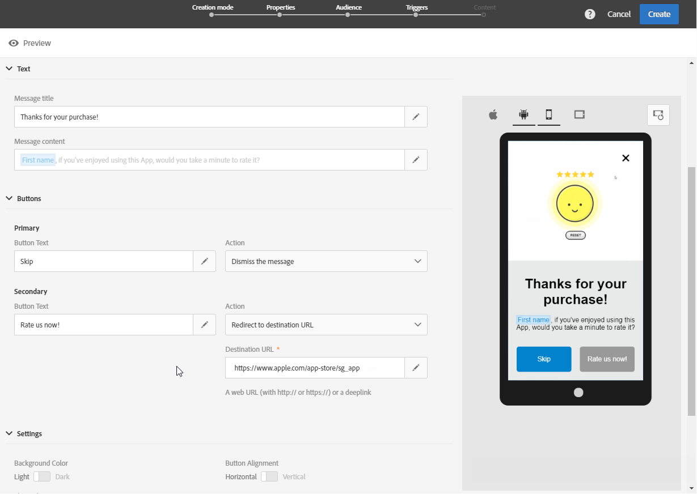

# Personalizzazione di un messaggio in-app{#customizing-an-in-app-message}

Per ottimizzare il messaggio in-app, Adobe Campaign consente di accedere a una serie di opzioni avanzate durante la progettazione di un'app.

L'editor del contenuto in-app consente di scegliere tra due modalità di messaggio in-app:

* [Modello](../../channels/using/customizing-an-in-app-message.md#customizing-with-a-message-template)messaggio: questo modello consente di personalizzare completamente l'applicazione con immagini o video e pulsanti di azione.
* [Messaggio](../../channels/using/customizing-an-in-app-message.md#customizing-with-a-custom-html-message)personalizzato: questo modello consente di importare codice HTML personalizzato.

**Argomenti correlati:**

* [Invio del messaggio in-app](../../channels/using/preparing-and-sending-an-in-app-message.md#sending-your-in-app-message)
* [Generazione di rapporti in-app](../../reporting/using/in-app-report.md)
* [Implementazione del tracciamento delle notifiche locali](https://helpx.adobe.com/campaign/kb/local-notification-tracking.html)

## Personalizzazione con un modello di messaggio {#customizing-with-a-message-template}

### Layout {#layout}

Il **[!UICONTROL Layout]** menu a discesa offre quattro opzioni diverse tra cui scegliere a seconda delle esigenze di messaggistica:

* **[!UICONTROL Full page]**: Questo tipo di layout copre l'intero schermo dei dispositivi per il pubblico.

   Supporta i componenti per contenuti multimediali (immagine, video), testo e pulsante.

* **[!UICONTROL Large modal]**: Questo layout viene visualizzato in una grande finestra in stile avviso. L'applicazione rimane visibile in background.

   Supporta i componenti per contenuti multimediali (immagine, video), testo e pulsante.

* **[!UICONTROL Small modal]**: Questo layout viene visualizzato come una piccola finestra di avviso, l'applicazione rimane visibile in background.

   Supporta i componenti per contenuti multimediali (immagine, video), testo e pulsante.

* **[!UICONTROL Alert]**: Questo tipo di layout viene visualizzato come messaggio di avviso del sistema operativo nativo.

   Può supportare solo componenti di testo e pulsanti.

* **[!UICONTROL Local notification]**: Questo tipo di layout viene visualizzato come messaggio del banner.

   Può supportare solo audio, testo e destinazione. Per ulteriori informazioni sulla notifica locale, consultate [Personalizzazione di un tipo](../../channels/using/customizing-an-in-app-message.md#customizing-a-local-notification-message-type)di messaggio di notifica locale.

Ogni tipo di layout può essere visualizzato in anteprima su diversi dispositivi quali telefono, tablet, piattaforma, ad esempio Android o iOS e l'orientamento, ad esempio orizzontale o verticale nella finestra destra dell'editor di contenuti.

### Media {#media}

Il **[!UICONTROL Media]** menu a discesa consente di aggiungere contenuti multimediali al messaggio in-app per creare un'esperienza coinvolgente per l'utente finale.

1. Selezionate l’immagine **[!UICONTROL Media Type]** desiderata e il video desiderato.
1. Per il tipo di **[!UICONTROL Image]** supporto, immettete l’URL nel **[!UICONTROL Media URL]** campo in base ai formati supportati.

   Se necessario, potete anche immettere il percorso di un dispositivo **[!UICONTROL Bundled image]** che può essere utilizzato se il dispositivo è offline.

   

1. Per il tipo di **[!UICONTROL Video]** supporto, immettete l’URL nel **[!UICONTROL Media URL]** campo.

   Quindi, immettete il testo **[!UICONTROL Video poster]** da usare durante il download del video sui dispositivi del pubblico o finché gli utenti non toccano il pulsante di riproduzione.

   

### Testo {#text}

Se necessario, puoi anche aggiungere un titolo e un contenuto del messaggio al messaggio in-app. Per personalizzare meglio il messaggio in-app, puoi aggiungere diversi campi di personalizzazione, blocchi di contenuto e testo dinamico al contenuto.

1. Nell’ **[!UICONTROL Text]** elenco a discesa, aggiungete un titolo nel **[!UICONTROL Message title]** campo.

   

1. Aggiungete il contenuto nel **[!UICONTROL Message content]** campo.
1. Per personalizzare ulteriormente il testo, fai clic sull’  icona per aggiungere campi di personalizzazione.

   

1. Inserisci il contenuto del messaggio e aggiungi i campi di personalizzazione, se necessario.

   Per ulteriori informazioni sul campo della personalizzazione, consulta questa [sezione](../../designing/using/personalization.md#inserting-a-personalization-field).

   

1. Controlla il contenuto del messaggio nella finestra di anteprima.

   

### Pulsanti {#buttons}

Puoi aggiungere fino a due pulsanti al messaggio in-app.

1. Nell' **[!UICONTROL Buttons]** elenco a discesa, immettete il testo del primo pulsante nella **[!UICONTROL Primary]** categoria.

   

1. Scegliete quale delle due azioni **[!UICONTROL Dismiss]** e **[!UICONTROL Redirect]** verrà assegnato al pulsante principale.
1. Nella **[!UICONTROL Secondary]** categoria, aggiungete un secondo pulsante all'app, se necessario, immettendo il testo.
1. Selezionare l'azione associata al secondo pulsante.
1. Se avete scelto l’ **[!UICONTROL Redirect]** azione, immettete l’URL Web o il collegamento profondo nel **[!UICONTROL Destination URL]** campo.

   

1. Inserite l’URL Web o il collegamento profondo nel **[!UICONTROL Destination URL]** campo, se avete scelto l’ **[!UICONTROL Redirect]** azione,
1. Controlla il contenuto del messaggio nella finestra di anteprima o facendo clic sul pulsante Anteprima.

   Fate riferimento alla pagina [Anteprima del messaggio](../../channels/using/customizing-an-in-app-message.md#previewing-the-in-app-message) in-app.

   

### Impostazioni {#settings}

1. Nella **[!UICONTROL Settings]** categoria, selezionate il colore di sfondo tra luce e buio.
1. Scegliete di visualizzare o meno un pulsante Chiudi con l' **[!UICONTROL Show close button]** opzione per fornire agli utenti la possibilità di chiudere il messaggio in-app.
1. Selezionare se l'allineamento del pulsante sarà orizzontale o verticale con l' **[!UICONTROL Button alignment]** opzione.
1. Scegli se il messaggio in-app può essere chiuso automaticamente o meno dopo alcuni secondi.

   

## Personalizzazione di un tipo di messaggio di notifica locale {#customizing-a-local-notification-message-type}

Le notifiche locali possono essere attivate solo da un'app in un momento particolare e in base a un evento. Avviseranno gli utenti che qualcosa sta accadendo nella loro app anche senza avere accesso a Internet.
Per informazioni su come tenere traccia delle notifiche locali, consultate questa [pagina](https://helpx.adobe.com/campaign/kb/local-notification-tracking.html).

Per personalizzare una notifica locale:

1. Dalla **[!UICONTROL Content]** pagina, seleziona **[!UICONTROL Local notification]** nella **[!UICONTROL Layout]** categoria

   

1. Sotto la **[!UICONTROL Text]** categoria, digitare il testo **[!UICONTROL Message title]** e **[!UICONTROL Message content]**.

   

1. Sotto la **[!UICONTROL Advanced option]** categoria, nel **[!UICONTROL Wait to display]** campo, scegliete il tempo in secondi per la visualizzazione sullo schermo della notifica locale una volta attivato l’evento.
1. Nel **[!UICONTROL Sound]** campo, inserire il nome del file audio, con l'estensione, che deve essere riprodotto dal dispositivo mobile quando viene ricevuta la notifica locale.

   Il file audio viene riprodotto durante la trasmissione della notifica se il file è definito nel pacchetto dell'applicazione mobile. In caso contrario, viene riprodotto l'audio predefinito del dispositivo.

   

1. Specificate una destinazione per reindirizzare gli utenti quando interagiscono con la notifica locale nel **[!UICONTROL Deeplink URL]** campo.
1. Per trasmettere dati personalizzati nel payload sotto forma di coppia di valori chiave, è possibile aggiungere campi personalizzati alla notifica locale. Nella **[!UICONTROL Custom fields]** categoria, fare clic sul **[!UICONTROL Create an element]** pulsante.
1. Inserite **[!UICONTROL Keys]** quindi il **[!UICONTROL Values]** codice associato a ogni chiave.

   La gestione e lo scopo dei campi personalizzati dipendono interamente dall'app mobile.

1. Nella **[!UICONTROL Apple options]** categoria, compila i **[!UICONTROL Category]** campi per aggiungere un ID categoria per le azioni personalizzate, se disponibile nell’applicazione mobile Apple.

## Personalizzazione con un messaggio HTML personalizzato {#customizing-with-a-custom-html-message}

>[!NOTE]
>
>Il messaggio HTML personalizzato non supporta la personalizzazione del contenuto.

La **[!UICONTROL Custom message]** modalità consente di importare direttamente uno dei messaggi HTML preconfigurati.

Per fare questo, basta trascinare e rilasciare o selezionare il file dal computer.

Il file deve avere un layout specifico che può essere trovato facendo clic sull'opzione **Scarica il file** di esempio.

Puoi anche trovare un elenco di requisiti HTML personalizzati per un'importazione corretta in Adobe Campaign.

Una volta importato il codice HTML, nella finestra di anteprima potete trovare un’anteprima del file su diversi dispositivi.

## Anteprima del messaggio in-app {#previewing-the-in-app-message}

Prima di inviare il messaggio in-app, potete eseguire il test con i profili di test per verificare cosa vedrà il pubblico di destinazione quando riceverà la vostra consegna.

1. Fate clic sul **[!UICONTROL Preview]** pulsante.

   

1. Fate clic sul **[!UICONTROL Select a test profile]** pulsante e selezionate uno dei profili di test per iniziare a visualizzare l'anteprima della distribuzione. Per ulteriori informazioni sui profili di test, consultate questa [sezione](../../sending/using/managing-test-profiles-and-sending-proofs.md).
1. Controlla il messaggio su diversi dispositivi, ad esempio Android, iPhone o persino tablet. Puoi anche verificare se i campi di personalizzazione recuperano i dati corretti.

   

1. Ora puoi inviare il messaggio e misurarne l'impatto con i rapporti di consegna. For more on reporting, refer to [this section](../../reporting/using/in-app-report.md).

