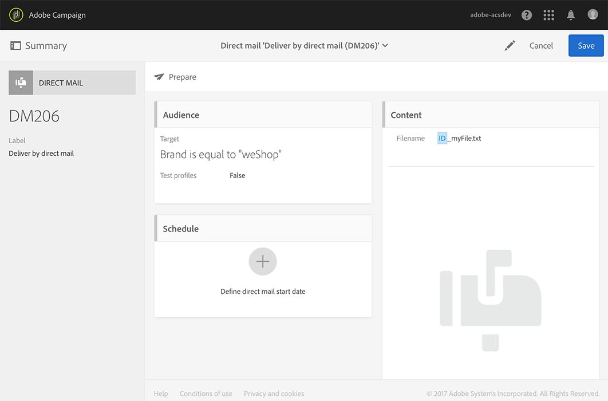
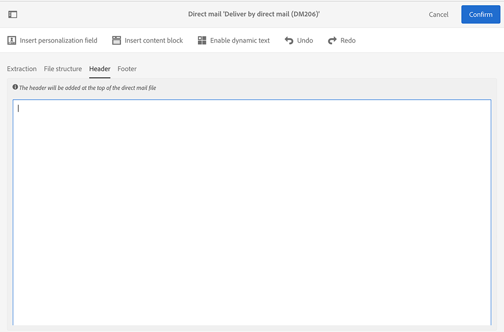
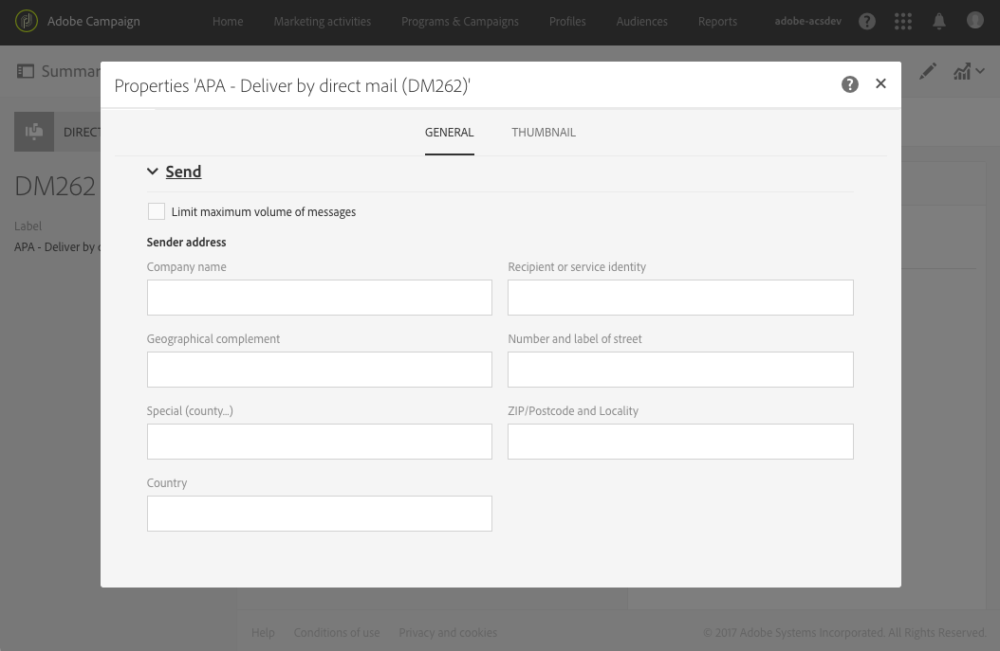

# Defining the direct mail content{#defining-the-direct-mail-content}

You can either define the content in the last screen of the creation wizard or by clicking on the **Content** section of the delivery dashboard.

The **[!UICONTROL Content]** definition screen is specific to the direct mail channel. It is divided into four tabs: **[!UICONTROL Extraction]**, **[!UICONTROL File structure]**, **[!UICONTROL Header]** and **[!UICONTROL Footer]**.

## Defining the extraction {#defining-the-extraction}

1. Iniziate definendo il nome del file di estrazione. Click on the button to the right of the **[!UICONTROL Output file]** field and enter the desired label. You can use personalization fields, content blocks and dynamic text (see [Defining content](../../designing/using/example--email-personalization.md)). Ad esempio, puoi completare l'etichetta con l'ID di consegna o la data di estrazione.

   

1. Click the **[!UICONTROL +]** or **[!UICONTROL Add an element]** button to add an output column. The **[!UICONTROL Output columns]** let you define the profile information (columns) to be exported into the output file.

   >[!CAUTION]
   >
   >Accertatevi che i profili includano un indirizzo postale in quanto queste informazioni sono essenziali per il provider di posta diretta. Also make sure you have checked the **[!UICONTROL Address specified]** box in your profiles' information. See [Recommendations](../../channels/using/about-direct-mail.md#recommendations).

   

1. Create tutte le colonne necessarie. Potete modificare le colonne facendo clic sulle relative espressioni ed etichette.

>[!NOTE]
>
>For more information on output column definition, refer to the [Extract file](../../automating/using/extract-file.md) workflow activity section.

## Defining the file structure {#defining-the-file-structure}

The **File structure** tab allows you to configure the output, date, and number formats for the file that will be exported.

>[!NOTE]
>
>The available options are detailed in the [Extract file](../../automating/using/extract-file.md) workflow activity sections.

## Defining the header and footer {#defining-the-header-and-footer}

A volte potrebbe essere necessario aggiungere informazioni all'inizio o alla fine del file di estrazione. For this, use the **[!UICONTROL Header]** and **[!UICONTROL Footer]** tabs of the **[!UICONTROL Content]** configuration screen.

Ad esempio, potrebbe essere utile includere, per il provider di posta diretta, le informazioni del mittente nell'intestazione del file. È possibile personalizzare il piè di pagina e l'intestazione con le informazioni disponibili nel contesto della distribuzione. See [Defining content](../../designing/using/example--email-personalization.md).

The sender address is defined in the **[!UICONTROL Send]** section of the direct mail properties or at the template level.

