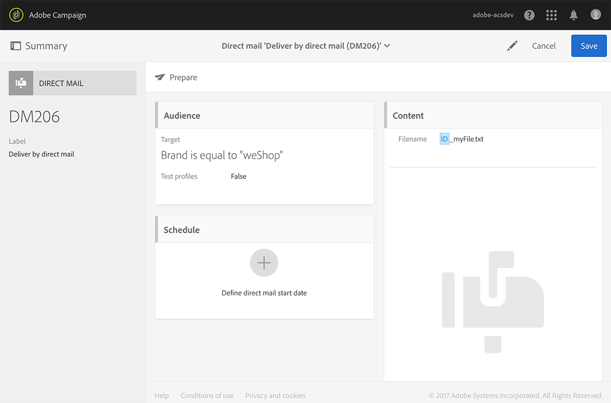
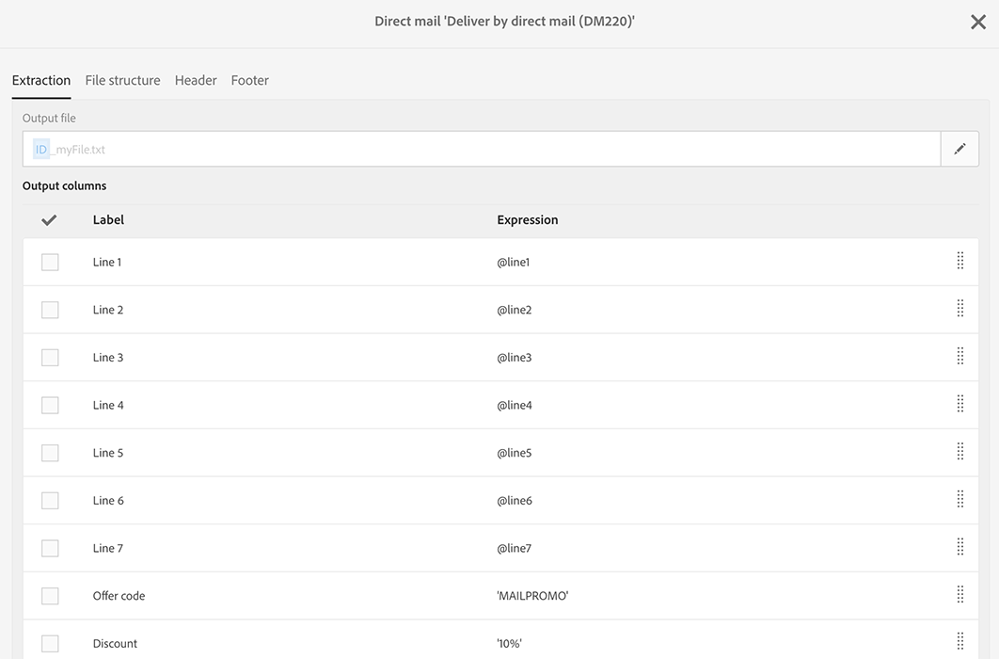
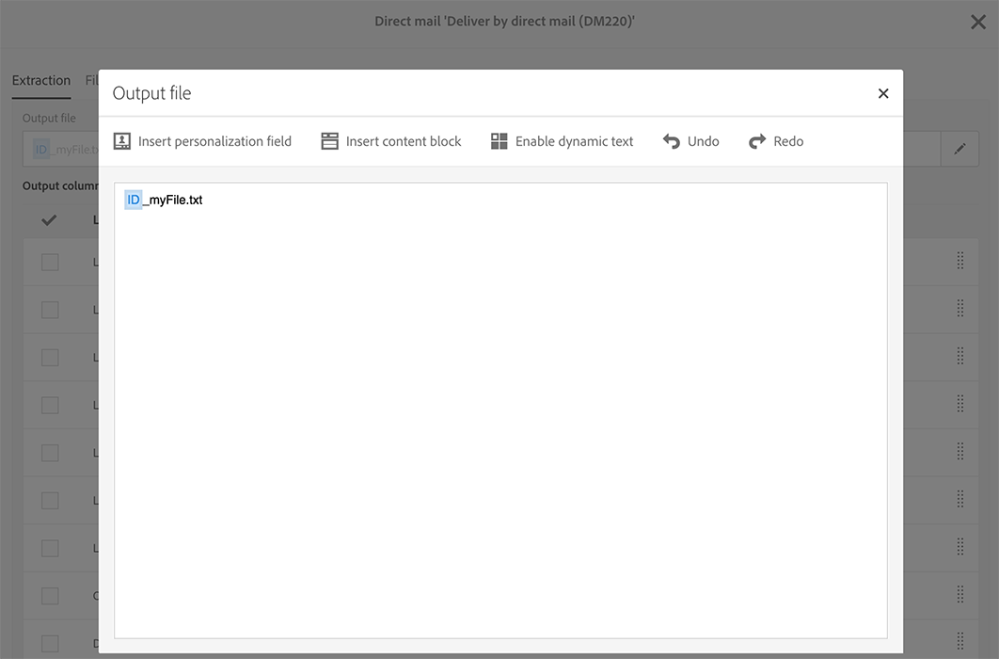
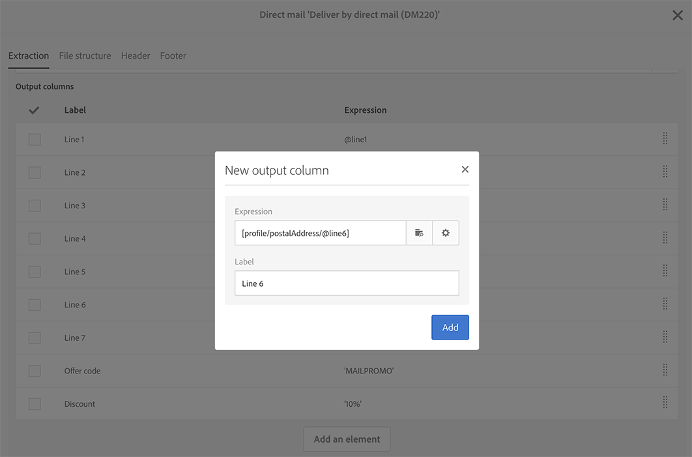
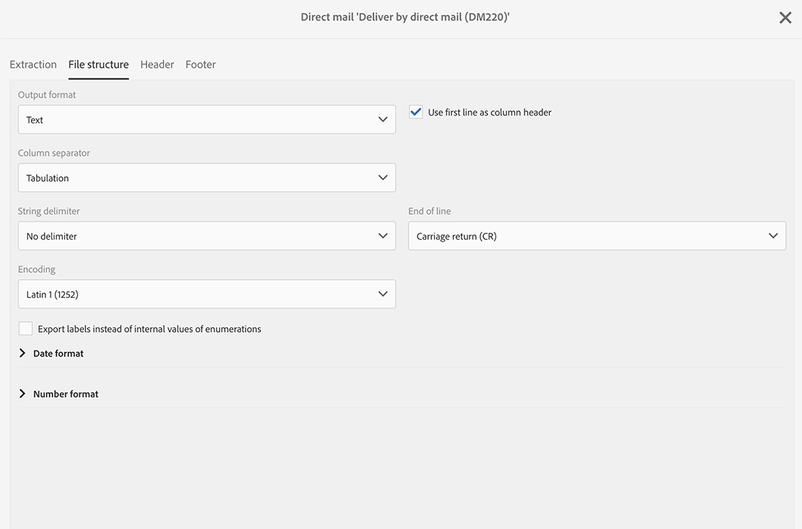
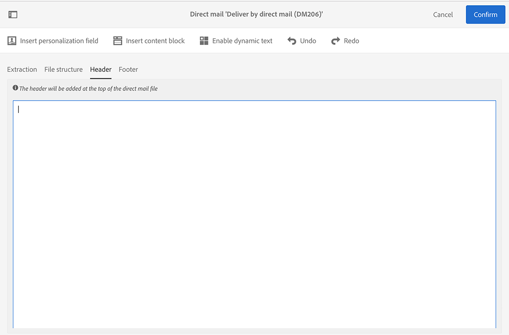
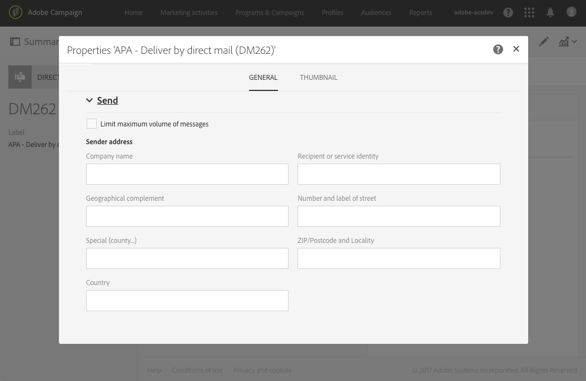

# Definizione del contenuto del direct mailing{#defining-the-direct-mail-content}

Puoi definire il contenuto nell’ultima schermata della procedura guidata di creazione oppure facendo clic sulla sezione **Content** del dashboard della consegna.

La schermata di definizione **[!UICONTROL Content]** è specifica per il canale direct mailing. È divisa in quattro schede: **[!UICONTROL Extraction]**, **[!UICONTROL File structure]**, **[!UICONTROL Header]** e **[!UICONTROL Footer]**.

## Definizione dell’estrazione {#defining-the-extraction}

1. Inizia definendo il nome del file di estrazione. Fai clic sul pulsante a destra del campo **[!UICONTROL Output file]** e immetti l’etichetta desiderata. Puoi utilizzare campi di personalizzazione, blocchi di contenuto e testo dinamico (consulta [Definizione del contenuto](../../designing/using/personalization.md#example-email-personalization)). Ad esempio, puoi completare l’etichetta con l’ID di consegna o la data di estrazione.

   

1. Fai clic sul pulsante **[!UICONTROL +]** o su **[!UICONTROL Add an element]** per aggiungere una colonna di output. Le **[!UICONTROL Output columns]** ti permettono di definire le informazioni di profilo (colonne) da esportare nel file di output.

   >[!IMPORTANT]
   >
   >Accertati che i profili includano un indirizzo postale, poiché queste informazioni sono essenziali per il provider di direct mailing. Inoltre, assicurati di aver selezionato la casella **[!UICONTROL Address specified]** nelle informazioni del profilo. Consulta [Consigli](../../channels/using/about-direct-mail.md#recommendations).

   

1. Crea tutte le colonne necessarie. Puoi modificare le colonne facendo clic sulle relative espressioni ed etichette.

>[!NOTE]
>
>Per ulteriori informazioni sulla definizione della colonna di output, consulta la sezione dell’attività del flusso di lavoro [Extract file](../../automating/using/extract-file.md).

## Definizione della struttura del file {#defining-the-file-structure}

La scheda **File structure** ti consente di configurare i formati di output, data e numero per il file da esportare.

>[!NOTE]
>
>Le opzioni disponibili sono descritte dettagliatamente nelle sezioni dell’attività del flusso di lavoro [Extract file](../../automating/using/extract-file.md).

## Definizione di intestazione e piè di pagina {#defining-the-header-and-footer}

A volte potresti aver bisogno di aggiungere informazioni all’inizio o alla fine del file di estrazione. A questo scopo, utilizza le schede **[!UICONTROL Header]** e **[!UICONTROL Footer]** della schermata di configurazione **[!UICONTROL Content]**.

Ad esempio, potresti voler includere, per il provider di direct mailing, le informazioni sul mittente nell’intestazione del file. È possibile personalizzare il piè di pagina e l’intestazione con le informazioni disponibili nell’ambito della consegna. Consulta [Definizione del contenuto](../../designing/using/personalization.md#example-email-personalization).

L’indirizzo del mittente è definito nella sezione **[!UICONTROL Send]** delle proprietà della direct mailing o a livello di modello.

