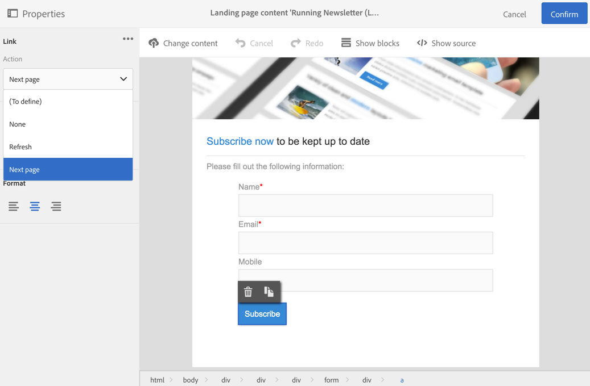

# Progettazione di una pagina di destinazione{#designing-a-landing-page}

## Informazioni sulla progettazione del contenuto {#about-content-design}

Le pagine di destinazione vengono create come qualsiasi attività [di](../../start/using/marketing-activities.md#about-marketing-activities)marketing.

Durante la progettazione di una pagina di destinazione, è necessario definire il contenuto di:

* la pagina stessa,
* la pagina di conferma,
* la pagina di errore.

Utilizzate lo switcher sotto la barra delle azioni per visualizzare e configurare ciascuna di queste pagine.

Il contenuto di queste pagine è progettato tramite l'editor di contenuti di Campaign. Fare riferimento al contenuto Progettazione.

## Mapping dei campi modulo {#mapping-form-fields}

I campi di input vengono utilizzati per memorizzare o aggiornare i dati nel database Campaign. A tal fine, è necessario collegare i campi del database con aree di input, pulsanti di scelta o blocchi di tipo casella di controllo. Per eseguire questa operazione:

1. Selezionare un blocco nella pagina di destinazione.
1. Completare la **[!UICONTROL Form data]** parte nella palette.

   

1. Scegliere un campo di database da collegare al campo modulo nella zona di **[!UICONTROL Field]** selezione.

   Quando l’ **[!UICONTROL Mandatory]** opzione è selezionata, la pagina può essere inviata solo se l’utente ha completato il campo. Se un campo obbligatorio non è completato, quando l'utente convalida la pagina viene visualizzato un messaggio di errore.

   >[!NOTE]
   >
   >Le pagine di destinazione possono essere mappate solo con **Profili**.

1. Definire il tipo di campo scegliendo, ad esempio **[!UICONTROL Text]**, **[!UICONTROL Number]** o **[!UICONTROL Date]** nell'area di **[!UICONTROL HTML type of the field]** selezione.

>[!NOTE]
>
>I campi predefiniti delle pagine di destinazione incorporate sono preconfigurati. Potete modificarle come necessario.

## Invio del modulo {#submitting-the-form}

Potete selezionare l'azione da eseguire quando il visitatore fa clic sul pulsante di invio. Per eseguire questa operazione:

1. Fate clic sul pulsante Invia della pagina di destinazione.
1. Selezionate l’azione nell’elenco a discesa nel pannello a sinistra. Le azioni possibili sono: **[!UICONTROL Refresh]** (per aggiornare la pagina) e **[!UICONTROL Next page]** (per visualizzare la pagina di conferma).

   

Inoltre, puoi modificare l'etichetta del pulsante o configurare un collegamento specifico. Per eseguire questa operazione:

1. Fate clic sul pulsante Invia.
1. Fate clic sul  pulsante nel pannello a sinistra.
1. Immettete l’etichetta del pulsante, selezionate il tipo di collegamento, le relative proprietà e la destinazione.

   

## Collegamento di un modulo a un servizio {#linking-a-form-to-a-service}

È possibile collegare un modulo a un servizio in modo che i profili possano sottoscrivere un servizio specifico durante la convalida delle pagine di destinazione.

I parametri per collegare una pagina di destinazione consentono di specificare il tipo di azione eseguita e se la pagina di destinazione è specificamente collegata a un singolo servizio o se è generica.

Per selezionare il servizio da collegare, è necessario:

1. Modificate le proprietà della pagina di destinazione a cui accedete tramite l’  icona nel dashboard della pagina di destinazione e visualizzate i **[!UICONTROL Job]** parametri.

   

1. Scegli **[!UICONTROL Subscription]** nell'elenco a **[!UICONTROL Specific actions]** discesa.

   

1. Selezionate **[!UICONTROL Specific service]** per collegare la pagina di destinazione a un singolo servizio. Non selezionate questa opzione se desiderate utilizzare diversi servizi con la pagina di destinazione.

   Utilizzate l' **[!UICONTROL Specified service in the URL]** opzione per consentire l'utilizzo della pagina di destinazione per diversi servizi. È pertanto necessario fare riferimento alla pagina di destinazione al momento della configurazione del servizio.

### Conferma invio pagina di destinazione {#confirm-a-landing-page-submission}

Quando una pagina di destinazione viene inviata da un visitatore, potete configurare le azioni attivate. Per eseguire questa operazione:

1. Modificate le proprietà della pagina di destinazione a cui accedete tramite l’  icona nel dashboard della pagina di destinazione e visualizzate i **[!UICONTROL Job]** parametri.

   

1. Nella **[!UICONTROL Specific actions]** sezione , selezionare **[!UICONTROL Start sending message]** per determinare l'invio di un messaggio automatico, ad esempio per confermare l'iscrizione a un servizio. È quindi necessario selezionare un modello di consegna e-mail.

   Se a livello di servizio è già configurato un messaggio di conferma, non selezionarne uno in questa schermata per evitare l'invio di più messaggi di conferma. Fare riferimento a [Configurare un servizio](../../audiences/using/creating-a-service.md).

1. Crea **[!UICONTROL Additional data]** per abilitare la memorizzazione di dati aggiuntivi durante l'invio della pagina di destinazione. Questi dati non sono visibili agli utenti che visitano la pagina. Vengono presi in considerazione solo i valori costanti.

   

## Impostazione delle autorizzazioni e precaricamento dei dati {#setting-permissions-and-pre-loading-data}

L'accesso a una pagina di destinazione può essere limitato ai visitatori identificati, che provengono da un collegamento in un messaggio inviato da Campaign, ad esempio. In questo caso, potete precaricare i relativi dati nella pagina di destinazione. Per eseguire questa operazione:

1. Modificate le proprietà della pagina di destinazione a cui accedete tramite l’  icona nel dashboard della pagina di destinazione e visualizzate i **[!UICONTROL Access & loading]** parametri.

   

1. Selezionare **[!UICONTROL Preload visitor data]**.

   Se un visitatore della pagina corrisponde a un profilo nel database, i suoi dati vengono visualizzati nei campi del modulo che sono mappati con i dati del database e vengono presi in considerazione gli elementi di personalizzazione della pagina di destinazione.

   

È inoltre possibile:

* Utilizzate i parametri URL per identificare i visitatori, utilizzando l' **[!UICONTROL Authorize visitor identification via URL parameters]** opzione: quindi dovete scegliere il tasto di caricamento e mappare i parametri del filtro con i parametri dell'URL corrispondente.
* Autorizzate qualsiasi visitatore ad accedere alla pagina di destinazione utilizzando l' **[!UICONTROL Authorize unidentified visitors]** opzione.

## Impostazione di Google reCAPTCHA {#setting-google-recaptcha}

È possibile impostare Google reCAPTCHA V3 con la pagina di destinazione per proteggerlo dallo spam e dagli abusi causati dai bot. Per poterlo usare con la pagina di destinazione, dovete innanzitutto creare un account esterno. Per ulteriori informazioni su come configurarlo, consulta questa [sezione](../../administration/using/external-accounts.md#google-recaptcha-external-account).

Una volta configurato il tuo account esterno Google reCAPTCHA V3, puoi aggiungerlo alla pagina di destinazione:

1. Prima di pubblicare la pagina di destinazione, accedete alle proprietà della pagina a cui si accede tramite l’  icona dal dashboard della pagina di destinazione.

   

1. Aprite il **[!UICONTROL Access & loading]** menu.
1. Selezionare l' **[!UICONTROL Use reCAPTCHA to protect your site from spam and abuse]** opzione.
1. Selezionate l'account esterno Google reCAPTCHA creato in precedenza.

   

1. Click **[!UICONTROL Confirm]**.

La pagina di destinazione è ora configurata con Google reCAPTCHA, visibile nella parte inferiore della pagina.

Google reCAPTCHA restituirà quindi un punteggio basato sulle interazioni degli utenti con la pagina. Per verificare il punteggio, collegatevi alla console [di amministrazione di](https://g.co/recaptcha/admin)Google.
