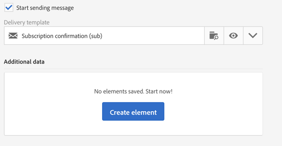

# Designing a landing page{#designing-a-landing-page}

## About content design {#about-content-design}

Landing pages are created as any [marketing activity](../../start/using/marketing-activities.md#about-marketing-activities).

Durante la progettazione di una pagina di destinazione, è necessario definire il contenuto di:

* la pagina stessa,
* la pagina di conferma,
* la pagina di errore.

Utilizzate il commutatore sotto la barra di azione per visualizzare e configurare ciascuna di queste pagine.

Il contenuto di queste pagine è progettato tramite Editor contenuto campagna. Refer to [Design content](../../designing/using/about-landing-page-content-design.md).

## Mapping form fields {#mapping-form-fields}

I campi di input vengono utilizzati per memorizzare o aggiornare i dati nel database Campagna. A questo scopo, è necessario collegare i campi del database con i blocchi di input, pulsanti di scelta o caselle di controllo. A tal fine:

1. Selezionate un blocco nella pagina di destinazione.
1. Complete the **[!UICONTROL Form data]** part in the palette.

   

1. Choose a database field to link with the form field in the **[!UICONTROL Field]** selection zone.

   When the **[!UICONTROL Mandatory]** option is checked, the page can only be submitted if the user has completed this field. Se un campo obbligatorio non è stato completato, quando l'utente convalida la pagina viene visualizzato un messaggio di errore.

   >[!NOTE]
   >
   >Landing pages can only be mapped with **Profiles**.

1. Define the field type by choosing, for example **[!UICONTROL Text]**, **[!UICONTROL Number]**,or **[!UICONTROL Date]** in the **[!UICONTROL HTML type of the field]** selection area.

>[!NOTE]
>
>I campi predefiniti delle pagine di destinazione integrate sono preconfigurati. È possibile modificarle in base alle esigenze.

## Submitting the form {#submitting-the-form}

È possibile selezionare l'azione da eseguire quando il visitatore fa clic sul pulsante di invio. A tal fine:

1. Selezionate il pulsante di invio della pagina di destinazione.
1. Selezionate l'azione nell'elenco a discesa nel pannello a sinistra. Possible actions are: **[!UICONTROL Refresh]** (to refresh the page) and **[!UICONTROL Next page]** (to display the confirmation page).

   

Inoltre, potete modificare l'etichetta del pulsante o configurare un collegamento specifico. A tal fine:

1. Fate clic sul pulsante Invia.
1. Click on the  button in the left panel.
1. Immettete l'etichetta del pulsante, selezionate il tipo di collegamento, le relative proprietà e la destinazione.

   

## Linking a form to a service {#linking-a-form-to-a-service}

Potete collegare un modulo a un servizio in modo che i profili possano iscriversi a un servizio specifico durante la convalida delle pagine di destinazione.

I parametri per il collegamento di una pagina di destinazione consentono di specificare il tipo di azione eseguito e se la pagina di destinazione è collegata specificatamente a un singolo servizio o se è generica.

Per selezionare il servizio da collegare, dovete:

1. Edit the landing page properties accessed via the  icon in the landing page dashboard, and display the **[!UICONTROL Job]** parameters.

   

1. Choose **[!UICONTROL Subscription]** in the **[!UICONTROL Specific actions]** drop-down list.

   

1. Select **[!UICONTROL Specific service]** to link the landing page to a single service. Non selezionate questa opzione se desiderate utilizzare più servizi con la pagina di destinazione.

   Use the **[!UICONTROL Specified service in the URL]** option to allow the landing page to be used for several services. Pertanto, per configurare il servizio dovete fare riferimento alla pagina di destinazione.

### Confirm a landing page submission {#confirm-a-landing-page-submission}

Quando una pagina di destinazione viene inviata da un visitatore, puoi configurare le azioni attivate. A tal fine:

1. Edit the landing page properties accessed via the  icon in the landing page dashboard, and display the **[!UICONTROL Job]** parameters.

   

1. Under the **[!UICONTROL Specific actions]** section, select **[!UICONTROL Start sending message]** to determine the sending of an automatic message, for example to confirm subscription to a service. È quindi necessario selezionare un modello di consegna e-mail.

   Se a livello di servizio è già configurato un messaggio di conferma, non è necessario selezionarne uno in questa schermata per evitare di inviare più messaggi di conferma. Refer to [Configure a service](../../audiences/using/creating-a-service.md).

1. Create **[!UICONTROL Additional data]** to enable storing additional data when the landing page is being submitted. Questi dati non sono visibili alle persone che visitano la pagina. Vengono presi in considerazione solo i valori costanti.

   

## Setting permissions and pre-loading data {#setting-permissions-and-pre-loading-data}

L'accesso a una pagina di destinazione può essere limitato ai visitatori identificati, che provengono da un collegamento in un messaggio inviato ad esempio Campaign. In questo caso, potete precaricare i relativi dati nella pagina di destinazione. A tal fine:

1. Edit the landing page properties accessed via the  icon in the landing page dashboard, and display the **[!UICONTROL Access & loading]** parameters.

   

1. Select **[!UICONTROL Preload visitor data]**.

   Se un visitatore della pagina corrisponde a un profilo nel database, i relativi dati vengono visualizzati nei campi del modulo che sono mappati ai dati del database e vengono considerati gli elementi di personalizzazione della pagina di destinazione.

   

È inoltre possibile:

* Use the URL parameters to identify the visitors, using the **[!UICONTROL Authorize visitor identification via URL parameters]** option: then you must choose the loading key and map the filter parameters with the parameters of the corresponding URL.
* Authorize any visitor to access the landing page, using the **[!UICONTROL Authorize unidentified visitors]** option.

## Setting Google reCAPTCHA {#setting-google-recaptcha}

Potete configurare Google recaptcha V 3 con la pagina di destinazione per proteggerlo da spam e abuso causati da bot. Per poterlo utilizzare con la pagina di destinazione, occorre innanzitutto creare un account esterno. For more information on how to configure it, refer to this [section](../../administration/using/external-accounts.md#google-recaptcha-external-account).

Una volta configurato l'account esterno Google recaptcha V 3, puoi aggiungerlo alla pagina di destinazione:

1. Before publishing your landing page, access the page properties accessed via the  icon from you landing page dashboard.

   

1. Unfold the **[!UICONTROL Access & loading]** menu.
1. Check the **[!UICONTROL Use reCAPTCHA to protect your site from spam and abuse]** option.
1. Selezionate l'account esterno Google recaptcha creato in precedenza.

   

1. Click **[!UICONTROL Confirm]**.

La tua pagina di destinazione è ora configurata con Google recaptcha, che puoi vedere nella parte inferiore della pagina.

Google recaptcha restituirà quindi un punteggio in base alle interazioni degli utenti con la pagina. To check your score, connect to your [Google admin console](https://g.co/recaptcha/admin).
