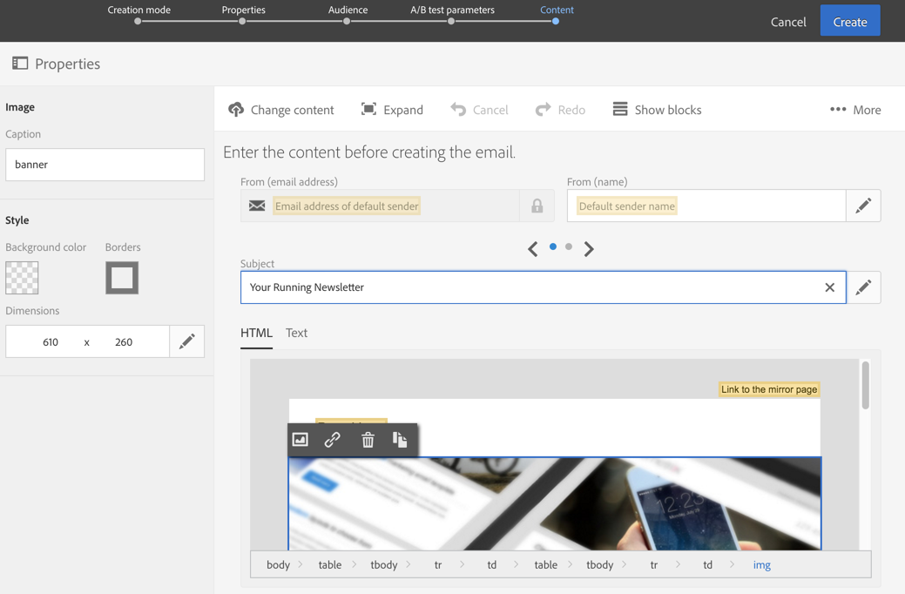
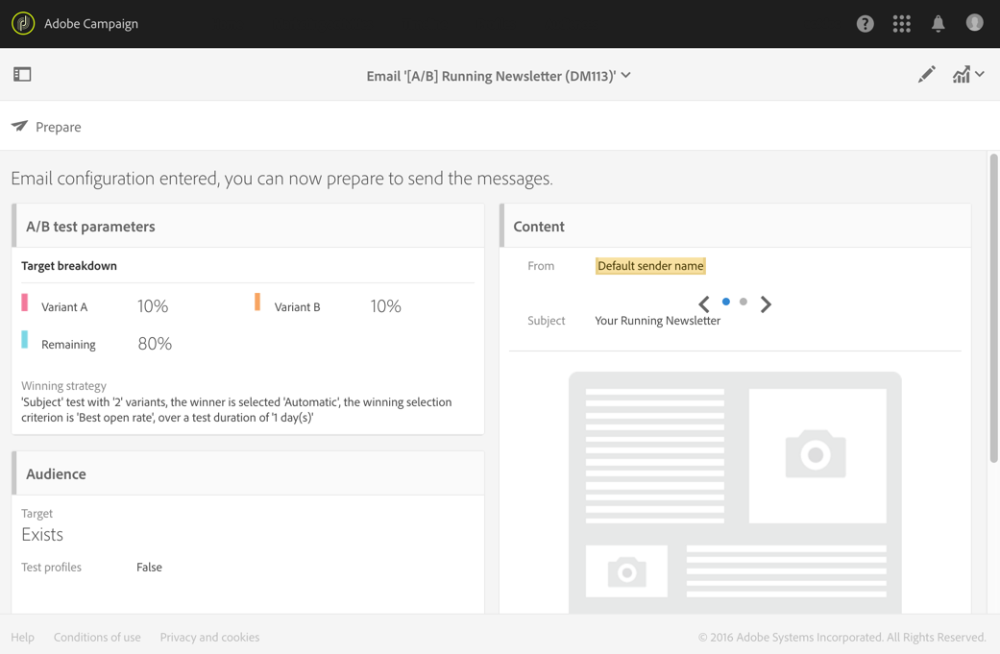

# Progettazione di un messaggio e-mail per test A/B{#designing-an-a-b-test-email}

La funzionalità di test A/B in Adobe Campaign consente di definire due o tre varianti di e-mail. Ogni variante viene inviata a campioni di popolazione per determinare quale ha il risultato migliore. Una volta determinata, la variante vincente viene quindi inviata alla popolazione rimanente.

Potete scegliere di variare il contenuto, l'oggetto o il mittente dell'e-mail.

>[!NOTE]
>
>Non è possibile eseguire test A/B sulle e-mail create in Adobe Experience Manager.

## Creazione di un messaggio e-mail di test A/B {#creating-an-a-b-test-email}

È possibile creare un test A/B utilizzando la procedura guidata standard per la creazione di e-mail, alla quale viene aggiunto un passaggio di configurazione del test A/B. La creazione di un messaggio e-mail standard è descritta in [Creazione di un messaggio e-mail](../../channels/using/creating-an-email.md) .

Nel contesto specifico di un test A/B:

1. Create un nuovo messaggio e-mail da uno dei tre modelli di test A/B specifici, in base all'elemento che desiderate variare:

   * Test A/B sul mittente
   * Test A/B sul contenuto
   * Test A/B sul soggetto
   

   >[!NOTE]
   >
   >I modelli di test A/B e di follow-up sono nascosti per impostazione predefinita. Per visualizzarli, selezionate la casella di prova A/B sul lato sinistro (pannello **[!UICONTROL Filter]** laterale).

1. Definite le proprietà generali e il pubblico di destinazione del messaggio e-mail, come per un messaggio e-mail standard. Consultate la sezione [Creazione di audience](../../audiences/using/creating-audiences.md) .
1. Al quarto passaggio della procedura guidata di creazione, definite i parametri di test A/B:

   * **[!UICONTROL Number of variants]**: È possibile scegliere di utilizzare due o tre varianti. Se scegliete tre varianti, questa scelta non può essere modificata dopo che il passaggio è stato confermato nella procedura guidata.
   * **[!UICONTROL Winning strategy]**: Selezionare il criterio da utilizzare per determinare la variante vincente.
   * **[!UICONTROL Target breakdown]**: Scegliere quale percentuale del target riceverà ogni variante. La percentuale rimanente riceverà la variante vincente una volta determinata. I profili di destinazione vengono selezionati in modo casuale.
   * **[!UICONTROL Winner sending method]**: Scegliere se si desidera che la variante vincente venga inviata automaticamente una volta determinata o se si desidera confermare manualmente l'invio alla popolazione rimanente.
   * **[!UICONTROL Test duration]**: Specificate la durata del test. La variante vincente viene determinata automaticamente dopo tale durata. Potete scegliere manualmente la variante vincente prima della fine del test dal dashboard e-mail.

      La prova deve essere di almeno un'ora affinché tutti i dati di tracciamento siano raccolti e presi in considerazione correttamente per selezionare la variante vincente.
   

1. Una volta definiti i parametri di test A/B, passate al passaggio successivo della procedura guidata e definite il contenuto dell'e-mail. A seconda del modello scelto, potete definire diversi soggetti, diversi nomi di mittenti o diversi contenuti diversi. Utilizzate il carosello per navigare tra le diverse varianti dell'elemento. Per ulteriori informazioni, consulta la sezione Editor  contenuto.

   

1. Confermate la creazione del messaggio e-mail. Viene visualizzata la dashboard e-mail.
1. Pianificare l'invio. La data definita indica l'inizio del test A/B.
1. Controllare i parametri di test A/B visualizzati nel **[!UICONTROL A/B test parameters]** blocco. È possibile modificarle fino a quando non si conferma l'invio del test (passaggio 9) selezionando il blocco.

   

1. Prepara l’invio e-mail per analizzare la destinazione e il numero di messaggi da inviare. Consultate la sezione [Preparazione dell’invio](../../sending/using/preparing-the-send.md) .
1. Prima di inviare il test A/B, controllate l'e-mail inviando le prove.
1. Al termine della preparazione, confermare l'invio del test. Una volta confermati, i parametri di test A/B non possono essere modificati.

   Il test A/B inizia alla data definita nel **[!UICONTROL Schedule]**. È possibile controllarne l'avanzamento utilizzando i blocchi **[!UICONTROL A/B test]** e **[!UICONTROL Deployment]** .

   Potete selezionare manualmente la variante vincente in qualsiasi momento se desiderate ridurre la durata del test.

   Al termine del test, nel **[!UICONTROL A/B Test]** blocco viene visualizzata una tabella di riepilogo che consente di visualizzare i vari indicatori per le diverse varianti testate.

1. Se hai selezionato **[!UICONTROL Send after confirmation]** come metodo di invio, devi selezionare manualmente la variante vincente per iniziare a inviarla alla popolazione rimanente. Se avete selezionato **[!UICONTROL Automatic]**, la variante vincente viene inviata automaticamente alla popolazione rimanente non appena è stata determinata dal sistema.

   >[!NOTE]
   >
   >Se è presente un legame, la variante vincente deve essere selezionata manualmente. Potete notificare al creatore dell’e-mail e al modificatore o ai modificatori che una variante è stata scelta o deve essere selezionata. Vedi Notifiche [di](../../administration/using/sending-internal-notifications.md)Adobe Campaign.

L'e-mail ora viene definita e inviata. Potete accedere ai relativi registri e rapporti per misurare il successo della campagna.

**Argomento** correlato:

[Creazione di un video e-mail](https://helpx.adobe.com/campaign/kt/acs/using/acs-create-email-from-homepage-feature-video-use.html)

## Informazioni sugli indicatori di test A/B {#about-a-b-test-indicators}

Nel dashboard e-mail sono disponibili diversi indicatori che consentono di misurare il test A/B: numero di clic, aperture, rimbalzi e così via.

L’ **[!UICONTROL Estimated recipient reactivity]** indicatore è un tasso che confronta il numero di destinatari che hanno fatto clic con il numero di destinatari che hanno aperto l’e-mail. Ad esempio, se 10 destinatari hanno aperto il messaggio e-mail e 5 destinatari hanno fatto clic su di esso. Il tasso di reattività è del 50%.
