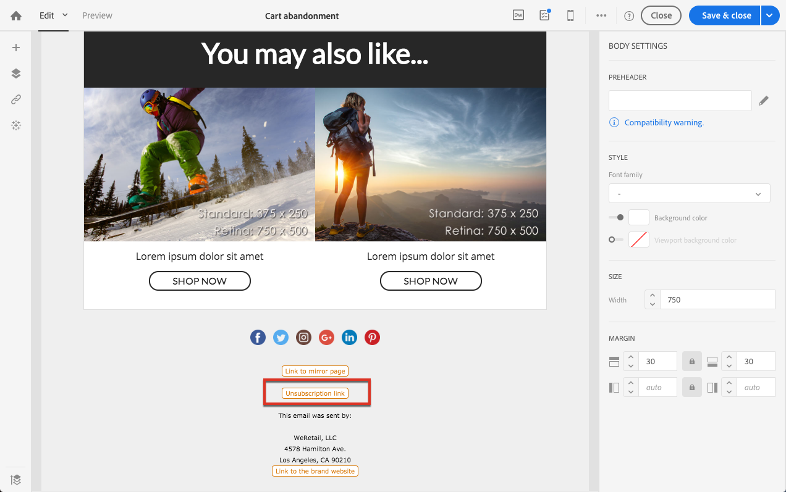

# Modifica di un messaggio transazionale {#editing-transactional-message}

Dopo aver creato e pubblicato un evento<!--(the cart abandonment example as explained in [this section](../../channels/using/getting-started-with-transactional-msg.md#transactional-messaging-operating-principle))-->, viene automaticamente creato il messaggio transazionale corrispondente.

I passaggi per configurare e pubblicare l&#39;evento sono descritti nella sezione [Configurazione di un evento transazionale](../../channels/using/configuring-transactional-event.md) e [Pubblicazione di un evento transazionale](../../channels/using/publishing-transactional-event.md).

I passaggi per accedere, modificare e personalizzare questo messaggio sono descritti di seguito.

>[!IMPORTANT]
>
>Solo gli utenti con il ruolo [Amministrazione](../../administration/using/users-management.md#functional-administrators) possono accedere e modificare i messaggi transazionali.

Quando il messaggio è pronto, può essere testato e pubblicato. Vedere [Verifica di un messaggio transazionale](../../channels/using/testing-transactional-message.md) e [Durata dei messaggi transazionali](../../channels/using/publishing-transactional-message.md).

## Accesso ai messaggi transazionali {#accessing-transactional-messages}

Per accedere al messaggio transazionale creato:

1. Fate clic sul logo **[!UICONTROL Adobe Campaign]**, nell&#39;angolo in alto a sinistra.
1. Seleziona **[!UICONTROL Marketing plans]** > **[!UICONTROL Transactional messages]** > **[!UICONTROL Transactional messages]**.

   

1. Fai clic sul messaggio desiderato per modificarlo.

   

Potete inoltre accedere direttamente a un messaggio transazionale tramite il collegamento situato nella parte sinistra della schermata di configurazione dell’evento corrispondente. Vedere [Anteprima e pubblicazione di un evento](../../channels/using/publishing-transactional-event.md#previewing-and-publishing-the-event)

## Personalizzazione di un messaggio sulle transazioni {#personalizing-a-transactional-message}

Per modificare e personalizzare un messaggio transazionale, segui i passaggi descritti di seguito.

>[!NOTE]
>
>Questa sezione descrive come modificare un messaggio transazionale **basato su eventi**. Le specificità dei messaggi transazionali **basati sul profilo** sono riportate di seguito [sotto](#profile-transactional-message-specificities).
>
>I passaggi di configurazione per creare un messaggio transazionale basato su eventi sono descritti in [questa sezione](../../channels/using/configuring-transactional-event.md#event-based-transactional-messages).

Ad esempio, desiderate inviare una notifica agli utenti del vostro sito Web che hanno aggiunto prodotti al loro carrello e che lasciano il sito senza dover proseguire con i loro acquisti. Questo esempio è illustrato nella sezione [Principio operativo dei messaggi transazionali](../../channels/using/getting-started-with-transactional-msg.md#transactional-messaging-operating-principle).

1. Fai clic sul blocco **[!UICONTROL Content]** per modificare l’oggetto e il contenuto del messaggio. Ai fini del presente esempio, seleziona un modello contenente immagini e testo. Per ulteriori informazioni sui modelli di contenuto delle e-mail, vedere [Progettazione di e-mail utilizzando i modelli](../../designing/using/using-reusable-content.md#designing-templates).

   

1. Aggiungi un oggetto e modifica il contenuto del messaggio in base alle tue esigenze.

   >[!NOTE]
   >
   >Il collegamento al carrello abbandonato porta a un URL esterno che reindirizzerà il consumatore al proprio carrello. Tale parametro non è gestito all’interno di Adobe Campaign.

1. Nell’esempio attuale, vuoi aggiungere tre campi precedentemente definiti durante la [creazione dell’evento](../../channels/using/configuring-transactional-event.md): nome, ultimo prodotto visionato, importo totale del carrello. A tal fine, [inserisci un campo di personalizzazione](../../designing/using/personalization.md#inserting-a-personalization-field) nel contenuto del messaggio.

1. Puoi accedere ai campi in questione tramite **[!UICONTROL Context]** > **[!UICONTROL Real-time event]** > **[!UICONTROL Event context]**.

   

1. Puoi anche arricchire il contenuto del messaggio. A tal fine, aggiungete i campi dalla tabella collegata alla configurazione dell&#39;evento (consultate [Arricchimento dell&#39;evento](../../channels/using/configuring-transactional-event.md#enriching-the-transactional-message-content)). In questo esempio, selezionare il campo **[!UICONTROL Title (salutation)]** dalla tabella **[!UICONTROL Profile]** fino a **[!UICONTROL Context]** > **[!UICONTROL Real-time event]** > **[!UICONTROL Event context]**.

   

1. Inserisci tutti i campi richiesti.

   

1. Per visualizzare l’anteprima del messaggio, seleziona il profilo definito per l’evento.

   La procedura per la visualizzazione dell’anteprima di un messaggio è spiegata nei dettagli nella sezione [Anteprima dei messaggi](../../sending/using/previewing-messages.md).

   

   Puoi verificare che i campi di personalizzazione corrispondano alle informazioni inserite nel profilo di test. Per ulteriori informazioni, vedere [Definizione di un profilo di test specifico](../../channels/using/testing-transactional-message.md#defining-specific-test-profile).

## Utilizzo degli elenchi di prodotti in un messaggio sulle transazioni {#using-product-listings-in-a-transactional-message}

Quando modificate il contenuto di un&#39;e-mail transazionale, potete creare elenchi di prodotti che fanno riferimento a una o più raccolte di dati. Ad esempio, in un messaggio e-mail di abbandono del carrello potete includere un elenco di tutti i prodotti inclusi nel carrello quando gli utenti hanno lasciato il sito Web, con un&#39;immagine, il prezzo e un collegamento a ciascun prodotto.

>[!IMPORTANT]
>
>Gli elenchi dei prodotti sono disponibili solo per il canale e-mail, quando si modifica il contenuto delle e-mail transazionali tramite l&#39;interfaccia [Email Designer](../../designing/using/designing-content-in-adobe-campaign.md#email-designer-interface).

Per aggiungere un elenco di prodotti abbandonati in un messaggio sulle transazioni, segui i passaggi indicati di seguito.

È inoltre possibile guardare [questo set di video](https://experienceleague.adobe.com/docs/campaign-standard-learn/tutorials/designing-content/product-listings-in-transactional-email.html?lang=en#configure-product-listings-in-transactional-emails) per illustrare i passaggi necessari per configurare gli elenchi di prodotti in un messaggio e-mail transazionale.

>[!NOTE]
>
>Adobe Campaign non supporta elenchi di prodotti nidificati, il che significa che non puoi includere un elenco di prodotti all’interno di un altro.

### Definizione di un elenco di prodotti {#defining-a-product-listing}

Prima di poter utilizzare un elenco di prodotti in un messaggio sulle transazioni, è necessario definire a livello di evento l’elenco dei prodotti e i campi per ciascun prodotto da visualizzare. Per ulteriori informazioni, consulta [Definizione delle raccolte di dati](../../channels/using/configuring-transactional-event.md#defining-data-collections).

1. Nel messaggio sulle transazioni, fai clic sul blocco **[!UICONTROL Content]** per modificare il contenuto dell’e-mail.
1. Trascina e rilascia un componente struttura all’interno dell’area di lavoro. Per ulteriori informazioni, vedere [Definizione della struttura delle e-mail](../../designing/using/designing-from-scratch.md#defining-the-email-structure).

   Ad esempio, seleziona un componente struttura a una colonna e aggiungi un componente testo, un componente immagine e un componente pulsante. Per ulteriori informazioni, vedere [Utilizzo dei componenti di contenuto](../../designing/using/designing-from-scratch.md#about-content-components).

1. Seleziona il componente struttura appena creato, quindi fai clic sull’icona **[!UICONTROL Enable product listing]** nella barra degli strumenti contestuale.

   

   Il componente struttura viene evidenziato con una cornice arancione e le impostazioni **[!UICONTROL Product listing]** sono visualizzate nella palette a sinistra.

   

1. Seleziona la modalità di visualizzazione degli elementi della raccolta:

   * **[!UICONTROL Row]**: orizzontale, ovvero ogni elemento posto sulla riga inferiore al precedente.
   * **[!UICONTROL Column]**: verticale, ovvero ciascun elemento posto accanto all’altro sulla medesima riga.

   >[!NOTE]
   >
   >L’opzione **[!UICONTROL Column]** è disponibile solo quando è in uso un componente struttura a più colonne ( **[!UICONTROL 2:2 column]**, **[!UICONTROL 3:3 column]** e **[!UICONTROL 4:4 column]** ). Quando modifichi l’elenco dei prodotti, compila solo la prima colonna: le altre non saranno prese in considerazione. Per ulteriori informazioni sulla selezione dei componenti struttura, vedere [Definizione della struttura dell&#39;e-mail](../../designing/using/designing-from-scratch.md#defining-the-email-structure).

1. Seleziona la raccolta dati creata durante la configurazione dell’evento correlato al messaggio sulle transazioni, disponibile nel nodo **[!UICONTROL Context]** > **[!UICONTROL Real-time event]** > **[!UICONTROL Event context]**.

   

   Per ulteriori informazioni sulla configurazione dell’evento, consulta [Definizione delle raccolte di dati](../../channels/using/configuring-transactional-event.md#defining-data-collections).

1. Utilizza l’elenco a discesa **[!UICONTROL First item]** per selezionare l’elemento che avvierà l’elenco visualizzato nel messaggio e-mail.

   Ad esempio, se scegli 2, il primo elemento della raccolta non verrà visualizzato nell’e-mail. L’elenco dei prodotti partirà dal secondo elemento.

1. Seleziona il numero massimo di elementi da visualizzare nell’elenco.

   >[!NOTE]
   >
   >Se desideri che gli elementi dell’elenco siano visualizzati in verticale ( **[!UICONTROL Column]** ), il numero massimo è limitato in base al componente struttura selezionato (2, 3 o 4 colonne). Per ulteriori informazioni sulla selezione dei componenti struttura, consulta [Modifica della struttura delle e-mail](../../designing/using/designing-from-scratch.md#defining-the-email-structure).

### Popolamento dell’elenco dei prodotti {#populating-the-product-listing}

Per visualizzare un elenco dei prodotti provenienti dall’evento collegato al messaggio e-mail sulle transazioni, attieniti alla procedura seguente.

Per ulteriori informazioni sulla creazione di una raccolta e dei campi correlati durante la configurazione dell’evento, consulta [Definizione delle raccolte di dati](../../channels/using/configuring-transactional-event.md#defining-data-collections).

1. Seleziona il componente immagine inserito, fai clic su **[!UICONTROL Enable personalization]** e sulla matita nel riquadro Impostazioni.

   

1. Seleziona **[!UICONTROL Add personalization field]** nella finestra **[!UICONTROL Image source URL]** che si apre.

   Dal nodo **[!UICONTROL Context]** > **[!UICONTROL Real-time event]** > **[!UICONTROL Event context]**, apri il nodo corrispondente alla raccolta creata, in questo caso **[!UICONTROL Product list]**, quindi fai clic sul campo immagine definito (qui **[!UICONTROL Product image]**). Fai clic su **[!UICONTROL Save]**.

   

   Il campo di personalizzazione selezionato viene ora visualizzato nel riquadro Impostazioni.

1. Nella posizione desiderata, seleziona **[!UICONTROL Insert personalization field]** dalla barra degli strumenti contestuale.

   

1. Dal nodo **[!UICONTROL Context]** > **[!UICONTROL Real-time event]** > **[!UICONTROL Event context]**, apri il nodo corrispondente alla raccolta creata (qui **[!UICONTROL Product list]**) e seleziona il campo creato (qui **[!UICONTROL Product name]**). Fai clic su **[!UICONTROL Confirm]**.

   

   Il campo di personalizzazione selezionato viene ora visualizzato nella posizione desiderata all’interno del contenuto dell’e-mail.

1. Procedi similmente per l’inserimento del prezzo.
1. Seleziona una parte di testo e fai clic su **[!UICONTROL Insert link]** nella barra degli strumenti contestuale.

   

1. Seleziona **[!UICONTROL Add personalization field]** nella finestra **[!UICONTROL Insert link]** che si apre.

   Dal nodo **[!UICONTROL Context]** > **[!UICONTROL Real-time event]** > **[!UICONTROL Event context]**, apri il nodo corrispondente alla raccolta creata, in questo caso **[!UICONTROL Product list]**, quindi fai clic sul campo URL (qui **[!UICONTROL Product URL]**). Fai clic su **[!UICONTROL Save]**.

   >[!IMPORTANT]
   >
   >Per motivi di sicurezza, accertati di inserire il campo di personalizzazione all’interno di un collegamento che inizia con un nome di dominio statico appropriato.

   

   Il campo di personalizzazione selezionato viene ora visualizzato nel riquadro Impostazioni.

1. Scegli il componente struttura sul quale viene applicato l’elenco di prodotti, quindi fai clic su **[!UICONTROL Show fallback]** per definire un contenuto predefinito.

   

1. Trascina uno o più componenti di contenuto e modificali in base alle tue esigenze.

   

   Il contenuto di fallback verrà visualizzato se la raccolta è vuota al momento di attivare l’evento, ad esempio se un cliente ha il carrello vuoto.

1. Nel riquadro Impostazioni, modifica gli stili per l’elenco dei prodotti. Per ulteriori informazioni, vedere [Gestione degli stili e-mail](../../designing/using/styles.md).
1. Visualizza l’anteprima del messaggio e-mail utilizzando un profilo di prova collegato all’evento sulle transazioni rilevante per il quale hai definito i dati della raccolta. Ad esempio, aggiungi le seguenti informazioni nella sezione **[!UICONTROL Event data]** relativa al profilo di test da utilizzare:

   

   Per approfondimenti sulla definizione di un profilo di test in un messaggio sulle transazioni, consulta [questa sezione](../../channels/using/testing-transactional-message.md#defining-specific-test-profile).

## Specificità dei messaggi transazionali basati su profilo {#profile-transactional-message-specificities}

Puoi inviare messaggi transazionali basati sui profili di marketing dei clienti, che ti consentono di sfruttare tutte le informazioni di profilo per personalizzare il contenuto del messaggio, utilizzare il collegamento di annullamento dell&#39;iscrizione e applicare regole di tipologia di marketing come [regole di affaticamento](../../sending/using/fatigue-rules.md).

* Per ulteriori informazioni sulle differenze tra i messaggi transazionali basati sugli eventi e quelli basati sui profili, vedere [questa sezione](../../channels/using/getting-started-with-transactional-msg.md#transactional-message-types).

* I passaggi di configurazione per creare un messaggio transazionale basato sul profilo sono descritti in [questa sezione](../../channels/using/configuring-transactional-event.md#profile-based-transactional-messages).

<!--### Editing a profile transactional message {#editing-profile-transactional-message}-->

I passaggi per creare, modificare e personalizzare un messaggio transazionale di profilo sono principalmente gli stessi del messaggio transazionale di un evento.

Le differenze sono elencate di seguito.

1. [Passa al messaggio transazionale creato per modificarlo.](#accessing-transactional-messages)
1. Nel messaggio transazionale, fai clic sulla sezione **[!UICONTROL Content]**. Oltre ai modelli di e-mail transazionali, potete anche scegliere qualsiasi modello di e-mail per la risorsa **[!UICONTROL Profile]**.

   

1. Seleziona il modello di e-mail predefinito. Analogamente a tutte le e-mail di marketing, include un **collegamento di annullamento dell&#39;iscrizione**.

   

   Per ulteriori informazioni sui modelli, vedere [questa sezione](../../designing/using/using-reusable-content.md#content-templates).

1. Inoltre, a differenza delle configurazioni basate su eventi in tempo reale, è possibile accedere direttamente a tutte le informazioni di profilo **per personalizzare il messaggio.** Puoi aggiungere [campi di personalizzazione](../../designing/using/personalization.md#inserting-a-personalization-field) come faresti per qualsiasi altra e-mail di marketing standard.

1. Salva le modifiche prima di pubblicare il messaggio. Per ulteriori informazioni, consulta [Pubblicazione di un messaggio sulle transazioni](../../channels/using/publishing-transactional-message.md#publishing-a-transactional-message).

<!--### Monitoring a profile transactional message delivery {#monitoring-a-profile-transactional-message-delivery}

Once the message is published and your site integration is done, you can monitor the delivery.

1. To view the message delivery log, click the icon at the bottom right of the **[!UICONTROL Deployment]** block.

1. Click the **[!UICONTROL Execution list]** tab.

   

1. Select the latest execution delivery.

   An **execution delivery** is a non-actionable and non-functional technical message created once a month for each transactional message, and each time a transactional message is edited and published again

1. Select the **[!UICONTROL Sending logs]** tab. In the **[!UICONTROL Status]** column, **[!UICONTROL Sent]** indicates that a profile has opted in.

   

1. Select the **[!UICONTROL Exclusions logs]** tab to view recipients who have been excluded from the message target, such as addresses on denylist.

   

>[!NOTE]
>
>For more information on accessing and using the logs, see [Monitoring a delivery](../../sending/using/monitoring-a-delivery.md).

For any profile that has opted out, the **[!UICONTROL Address on denylist]** typology rule excluded the corresponding recipient.

This rule is part of a specific typology that applies to all transactional messages based on the **[!UICONTROL Profile]** table.

**Related topics**:

* [Integrate the event triggering](../../channels/using/getting-started-with-transactional-msg.md#integrate-event-trigger)
* [About typologies and typology rules](../../sending/using/about-typology-rules.md)-->
