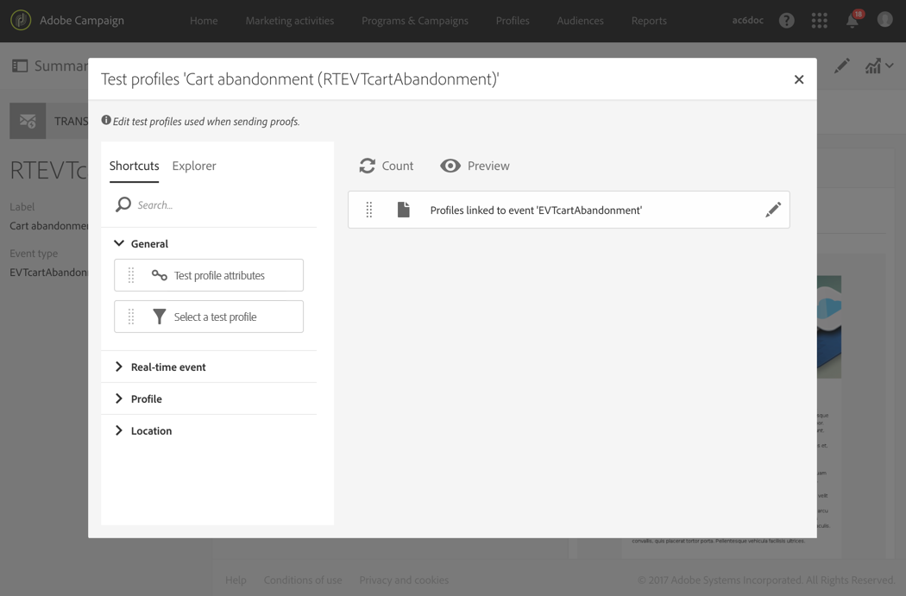

# Messaggi sulle transazioni degli eventi{#event-transactional-messages}

Potete inviare messaggi di transazione evento indirizzati a un evento. Questo tipo di messaggi transazionali non contiene informazioni sul profilo: il target di consegna è definito dai dati contenuti nell'evento stesso.

Dopo aver creato e pubblicato un evento (l'abbandono del carrello come spiegato in [questa sezione](../../channels/using/about-transactional-messaging.md#transactional-messaging-operating-principle)), il messaggio transazionale corrispondente viene creato automaticamente.

I passaggi di configurazione sono descritti nella sezione [Configurazione di un evento per l’invio di un messaggio](../../administration/using/configuring-transactional-messaging.md#use-case--configuring-an-event-to-send-a-transactional-message) transazionale.

Affinché l'evento attivi l'invio di un messaggio transazionale, è necessario personalizzare il messaggio, testarlo e pubblicarlo.

>[!NOTE]
>
>Per accedere ai messaggi transazionali, devi far parte del gruppo di **[!UICONTROL Administrators (all units)]** sicurezza.
>
>I messaggi relativi alle transazioni di eventi non contengono informazioni sul profilo, pertanto non sono compatibili con le regole di affaticamento (anche nel caso di un arricchimento con i profili). Consultate [Regole](../../administration/using/fatigue-rules.md#choosing-the-channel)di fatica.

## Definizione di un profilo di test in un messaggio transazione {#defining-a-test-profile-in-a-transactional-message}

Definite un profilo di test adattato, che vi consentirà di visualizzare l'anteprima del messaggio e inviare una prova per controllarlo.

### Creazione di un profilo di test all'interno del messaggio transazionale {#creating-a-test-profile-within-the-transactional-----------message}

1. Per accedere al messaggio creato, fai clic sul **[!UICONTROL Adobe Campaign]** logo, nell’angolo in alto a sinistra, quindi seleziona **[!UICONTROL Marketing plans]** &gt; **[!UICONTROL Transactional messages]** &gt; **[!UICONTROL Transactional messages]**.

   

1. Create un profilo di test da collegare all’evento.

   

1. Specificate le informazioni da inviare in formato JSON nella **[!UICONTROL Event data used for personalization]** sezione. Questo è il contenuto che verrà utilizzato per visualizzare l'anteprima del messaggio e quando il profilo di test riceve la prova.

   

   >[!NOTE]
   >
   >È inoltre possibile inserire le informazioni relative alla tabella del profilo. Consultate [Arricchimento del contenuto](../../administration/using/configuring-transactional-messaging.md#enriching-the-transactional-message-content)dei messaggi transazionali.

1. Dopo la creazione, il profilo di test verrà prespecificato nel messaggio transazionale. Fai clic sul **[!UICONTROL Test profiles]** blocco del messaggio per controllare la destinazione della prova.

   

### Creazione di un profilo di test all'esterno del messaggio transazionale {#creating-a-test-profile-outside-the-transactional-----------message}

Potete anche creare un nuovo profilo di test o usarne uno già esistente nel **[!UICONTROL Test profiles]** menu.

1. Fate clic sul **[!UICONTROL Adobe Campaign]** logo, nell’angolo in alto a sinistra, quindi selezionate **[!UICONTROL Profiles & audiences]** &gt; **[!UICONTROL Test profiles]**.
1. Nella **[!UICONTROL Event]** sezione della pagina del profilo di test selezionato, selezionate l’evento appena creato. In questo esempio, selezionare "abbandono carrello (EVTcartAbandonment)".
1. Specificate le informazioni da inviare in formato JSON nella casella di **[!UICONTROL Event data]** testo.

   

1. Salvare le modifiche.

Ora potete accedere al messaggio creato e selezionare il profilo di test aggiornato.

**Argomenti correlati:**

* [Gestione dei profili di test](../../sending/using/managing-test-profiles-and-sending-proofs.md)
* [Definizione delle audience](../../audiences/using/creating-audiences.md)

## Personalizzazione di un messaggio transattivo {#personalizing-a-transactional-message}

Per impostare la personalizzazione in un messaggio transazionale, segui i passaggi riportati di seguito:

1. Fai clic sul **[!UICONTROL Content]** blocco per modificare l'oggetto e il contenuto del messaggio. Per questo esempio, selezionate un modello contenente immagini e testo. Per ulteriori informazioni sui modelli di contenuto e-mail, consultate [Progettazione mediante i modelli](../../designing/using/using-reusable-content.md#designing-templates).

   

1. Aggiungi un oggetto e modifica il contenuto del messaggio in base alle tue esigenze.

   >[NOTA]
   >
   >Il collegamento al carrello abbandonato è un collegamento a un URL esterno che reindirizzerà la persona al suo carrello. Questo parametro non è gestito in Adobe Campaign.

1. In questo esempio, si desidera aggiungere tre campi definiti al momento della [creazione dell'evento](../../administration/using/configuring-transactional-messaging.md#use-case--configuring-an-event-to-send-a-transactional-message): nome, ultimo prodotto consultato, importo totale del carrello. A tal fine, [inserire un campo](../../designing/using/personalization.md#inserting-a-personalization-field) di personalizzazione nel contenuto del messaggio.

1. Passate a tali campi tramite **[!UICONTROL Context]** &gt; **[!UICONTROL Real-time event]** &gt; **[!UICONTROL Event context]**.

   

1. Per arricchire il contenuto del messaggio, aggiungete i campi selezionandoli dalla tabella con cui avete collegato l’evento. Nel nostro esempio, seleziona il **[!UICONTROL Title (salutation)]** campo nella **[!UICONTROL Profile]** tabella tramite **[!UICONTROL Context]** &gt; **[!UICONTROL Real-time event]** &gt; **[!UICONTROL Event context]**.

   

1. Inserite tutti i campi necessari.

   

1. Visualizzate l'anteprima del messaggio selezionando il profilo definito per l'evento.

   La procedura per visualizzare l'anteprima di un messaggio è dettagliata nella sezione [Anteprima messaggi](../../sending/using/previewing-messages.md) .

   

   Potete verificare che i campi di personalizzazione corrispondano alle informazioni inserite nel profilo di test. Per ulteriori informazioni, vedi [Definizione di un profilo di test in un messaggio](#defining-a-test-profile-in-a-transactional-message)transazionale.

## Utilizzo degli elenchi di prodotti in un messaggio transazionale {#using-product-listings-in-a-transactional-message}

Potete creare elenchi di prodotti che fanno riferimento a una o più raccolte di dati nel contenuto di un'e-mail transazionale. Ad esempio, in un messaggio e-mail di abbandono del carrello puoi includere un elenco di tutti i prodotti inclusi nei carrelli degli utenti al momento dell'uscita dal sito Web, con un'immagine, il prezzo e un collegamento a ciascun prodotto.

>[!CAUTION]
>
>Gli elenchi dei prodotti sono disponibili solo quando si modificano i messaggi e-mail transazionali tramite l'interfaccia di [Email Designer](../../designing/using/overview.md#email-designer) .

Per aggiungere un elenco di prodotti abbandonati in un messaggio transazionale, segui i passaggi indicati di seguito.

Potete inoltre guardare un set di video che illustrano i passaggi necessari per configurare gli elenchi di prodotti in un messaggio e-mail transazionale. Per ulteriori informazioni, consulta [questa pagina](https://helpx.adobe.com/campaign/kt/acs/using/acs-product-listings-in-transactional-emails-feature-video-setup.html).

>[!NOTE]
>
>Adobe Campaign non supporta elenchi di prodotti nidificati, il che significa che non puoi includere un elenco di prodotti all'interno di un altro elenco.

### Definizione di un elenco di prodotti {#defining-a-product-listing}

Prima di poter utilizzare un elenco di prodotti in un messaggio di transazione, è necessario definire a livello di evento l'elenco dei prodotti e i campi per ciascun prodotto dell'elenco da visualizzare. Per ulteriori informazioni, vedere [Definizione delle raccolte](../../administration/using/configuring-transactional-messaging.md#defining-data-collections)di dati.

1. Nel messaggio transazionale, fate clic sul **[!UICONTROL Content]** blocco per modificare il contenuto dell’e-mail.
1. Trascinare un componente struttura nell’area di lavoro. Per ulteriori informazioni, consultate [Modifica della struttura](../../designing/using/designing-from-scratch.md#defining-the-email-structure)delle e-mail.

   Ad esempio, selezionate un componente struttura a una colonna e aggiungete un componente testo, un componente immagine e un componente pulsante. Per ulteriori informazioni, vedere [Aggiunta di frammenti e componenti](../../designing/using/designing-from-scratch.md#defining-the-email-structure).

1. Selezionate il componente struttura appena creato e fate clic sull’ **[!UICONTROL Enable product listing]** icona nella barra degli strumenti contestuale.

   

   Il componente struttura viene evidenziato con un fotogramma arancione e le **[!UICONTROL Product listing]** impostazioni vengono visualizzate nella palette a sinistra.

   

1. Selezionate la modalità di visualizzazione degli elementi della raccolta:

   * **[!UICONTROL Row]**: orizzontalmente, ovvero ogni elemento su una riga sotto l'altro.
   * **[!UICONTROL Column]**: verticalmente, ovvero ciascun elemento accanto all’altro sulla stessa riga.
   >[!NOTE]
   >
   >L’ **[!UICONTROL Column]** opzione è disponibile solo quando si utilizza un componente struttura a più colonne ( **[!UICONTROL 2:2 column]**, **[!UICONTROL 3:3 column]** e **[!UICONTROL 4:4 column]** ). Quando modificate l’elenco dei prodotti, compilate solo la prima colonna: le altre colonne non saranno prese in considerazione. Per ulteriori informazioni sulla selezione dei componenti struttura, consultate [Modifica della struttura](../../designing/using/designing-from-scratch.md#defining-the-email-structure)delle e-mail.

1. Selezionare la raccolta dati creata durante la configurazione dell'evento correlato al messaggio di transazione. Potete trovarlo in **[!UICONTROL Context]** &gt; **[!UICONTROL Real-time event]** &gt; **[!UICONTROL Event context]** nodo.

   

   Per ulteriori informazioni sulla configurazione dell'evento, consultate [Definizione delle raccolte](../../administration/using/configuring-transactional-messaging.md#defining-data-collections)di dati.

1. Utilizzate l'elenco a **[!UICONTROL First item]** discesa per selezionare l'elemento che avvierà l'elenco visualizzato nel messaggio e-mail.

   Ad esempio, se selezionate 2, il primo elemento della raccolta non verrà visualizzato nell'e-mail. L'elenco dei prodotti inizierà sul secondo elemento.

1. Selezionare il numero massimo di elementi da visualizzare nell'elenco.

   >[!NOTE]
   >
   >Se desiderate che gli elementi dell’elenco siano visualizzati in verticale ( **[!UICONTROL Column]** ), il numero massimo di elementi è limitato in base al componente struttura selezionato (2, 3 o 4 colonne). Per ulteriori informazioni sulla selezione dei componenti struttura, consultate [Modifica della struttura](../../designing/using/designing-from-scratch.md#defining-the-email-structure)delle e-mail.

### Compilazione dell'elenco dei prodotti {#populating-the-product-listing}

Per visualizzare un elenco dei prodotti provenienti dall'evento collegato all'e-mail di transazione, attenetevi alla procedura seguente.

Per ulteriori informazioni sulla creazione di una raccolta e campi correlati durante la configurazione dell'evento, vedere [Definizione delle raccolte](../../administration/using/configuring-transactional-messaging.md#defining-data-collections)di dati.

1. Selezionate il componente immagine inserito, selezionate **[!UICONTROL Enable personalization]** e fate clic sulla matita nel riquadro Impostazioni.

   

1. Selezionate **[!UICONTROL Add personalization field]** nella **[!UICONTROL Image source URL]** finestra che si apre.

   Dal nodo **[!UICONTROL Context]** &gt; **[!UICONTROL Real-time event]** &gt; **[!UICONTROL Event context]** , aprite il nodo corrispondente alla raccolta creata (qui **[!UICONTROL Product list]** ) e selezionate il campo immagine definito (qui **[!UICONTROL Product image]** ). Click **[!UICONTROL Save]**.

   

   Il campo di personalizzazione selezionato viene ora visualizzato nel riquadro Impostazioni.

1. Nella posizione desiderata, selezionate **[!UICONTROL Insert personalization field]** dalla barra degli strumenti contestuale.

   

1. Dal nodo **[!UICONTROL Context]** &gt; **[!UICONTROL Real-time event]** &gt; **[!UICONTROL Event context]** , aprite il nodo corrispondente alla raccolta creata (qui **[!UICONTROL Product list]** ) e selezionate il campo creato (qui **[!UICONTROL Product name]** ). Click **[!UICONTROL Confirm]**.

   

   Il campo di personalizzazione selezionato viene ora visualizzato nella posizione desiderata nel contenuto dell'e-mail.

1. Procedere in modo simile per inserire il prezzo.
1. Selezionare del testo e **[!UICONTROL Insert link]** dalla barra degli strumenti contestuale.

   

1. Selezionate **[!UICONTROL Add personalization field]** nella **[!UICONTROL Insert link]** finestra che si apre.

   Dal nodo **[!UICONTROL Context]** &gt; **[!UICONTROL Real-time event]** &gt; **[!UICONTROL Event context]** , aprite il nodo corrispondente alla raccolta creata (qui **[!UICONTROL Product list]** ) e selezionate il campo URL creato (qui **[!UICONTROL Product URL]** ). Click **[!UICONTROL Save]**.

   >[!CAUTION]
   >
   >Per motivi di sicurezza, accertati di inserire il campo di personalizzazione all’interno di un collegamento che inizia con un nome di dominio statico appropriato.

   

   Il campo di personalizzazione selezionato viene ora visualizzato nel riquadro Impostazioni.

1. Selezionate il componente struttura sul quale viene applicato l’elenco di prodotti e selezionate **[!UICONTROL Show fallback]** per definire un contenuto predefinito.

   

1. Trascinate uno o più componenti di contenuto e modificateli in base alle esigenze.

   

   Il contenuto di riserva verrà visualizzato se la raccolta è vuota quando l'evento viene attivato, ad esempio se un cliente non ha nulla nel suo carrello.

1. Nel riquadro Impostazioni, modificate gli stili per l'elenco dei prodotti. Per ulteriori informazioni, consultate [Modifica degli stili](../../designing/using/styles.md)delle e-mail.
1. Visualizzate l'anteprima del messaggio e-mail utilizzando un profilo di prova collegato all'evento transazionale rilevante per il quale avete definito i dati della raccolta. Ad esempio, aggiungere le seguenti informazioni nella **[!UICONTROL Event data]** sezione relativa al profilo di test da utilizzare:

   

   Per ulteriori informazioni sulla definizione di un profilo di test in un messaggio transazionale, consulta [questa sezione](#defining-a-test-profile-in-a-transactional-message).

## Verifica di un messaggio transattivo {#testing-a-transactional-message}

Dopo aver salvato il messaggio transazionale, puoi inviare una prova per verificarlo.

I passaggi per l'invio di una prova sono descritti in [Invio di una prova](../../sending/using/managing-test-profiles-and-sending-proofs.md#sending-proofs) .

## Pubblicazione di un messaggio transazionale {#publishing-a-transactional-message}

Dopo aver controllato il messaggio transazionale, puoi pubblicarlo.

Ora, non appena si attiva l'evento "abbandono carrello", viene visualizzato automaticamente un messaggio contenente il titolo e il cognome del destinatario, l'URL del carrello, l'ultimo prodotto consultato o un elenco di prodotti se avete definito un elenco di prodotti e l'importo totale del carrello da inviare.

Per accedere ai rapporti relativi al messaggio transazionale, usa il **[!UICONTROL Reports]** pulsante. Consultate [Rapporti](../../reporting/using/about-dynamic-reports.md).

## Sospensione di una pubblicazione di messaggi transazionali {#suspending-a-transactional-message-publication}

Puoi sospendere la pubblicazione del messaggio transazionale utilizzando, ad esempio, il **[!UICONTROL Pause]** pulsante per modificare i dati contenuti nel messaggio. Pertanto, gli eventi non vengono più elaborati, ma rimangono in coda nel database Adobe Campaign.

Gli eventi in coda vengono conservati durante un periodo di tempo definito nell'API REST (consultate la documentazione [REST API) o nell'evento trigger, se utilizzate il servizio di base Triggers (consultate](https://final-docs.campaign.adobe.com/doc/standard/en/api/ACS_API.html)Utilizzo di Campaign e Experience Cloud Triggers ).

Quando si fa clic **[!UICONTROL Resume]**, vengono elaborati tutti gli eventi in coda (purché non scaduti). Ora contengono tutte le modifiche apportate durante la sospensione della pubblicazione del modello.

## Annullamento della pubblicazione di un messaggio transattivo {#unpublishing-a-transactional-message}

Facendo clic **[!UICONTROL Unpublish]** potete annullare la pubblicazione dei messaggi transazionali, ma anche la pubblicazione dell’evento corrispondente, che elimina dall’API REST la risorsa corrispondente all’evento creato in precedenza. Ora, anche se l’evento viene attivato nel sito Web, i messaggi corrispondenti non vengono più inviati e non vengono memorizzati nel database.

>[!NOTE]
>
>Per pubblicare nuovamente il messaggio, dovete tornare alla configurazione dell'evento corrispondente, pubblicarlo e quindi pubblicare il messaggio. Per ulteriori informazioni, consulta [Pubblicazione di un messaggio](#publishing-a-transactional-message)transazionale.

Se annulli la pubblicazione di un messaggio transazionale in pausa, potresti dover attendere fino a 24 ore prima di pubblicarlo nuovamente. In questo modo il flusso di lavoro **[!UICONTROL Database cleanup]** pulirà tutti gli eventi inviati alla coda. I passaggi per mettere in pausa un messaggio sono descritti nella sezione [Sospensione di una pubblicazione](#suspending-a-transactional-message-publication) di messaggi transazionali.

Il **[!UICONTROL Database cleanup]** flusso di lavoro, che viene eseguito ogni giorno alle 4 del mattino, è accessibile tramite **[!UICONTROL Administration]** &gt; **[!UICONTROL Application settings]** &gt; **[!UICONTROL Workflows]**.

## Eliminazione di un messaggio transattivo {#deleting-a-transactional-message}

Selezionando un messaggio transazionale, puoi eliminarlo con il **[!UICONTROL Delete element]** pulsante anche se è già stato pubblicato. Tuttavia, l'eliminazione di un messaggio transattivo può essere eseguita solo a determinate condizioni:

* **Messaggi** transazionali: Per eliminare un messaggio transazionale, è necessario annullare la pubblicazione del messaggio e non interromperlo.

   Se il messaggio di transazione non viene pubblicato, è necessario annullare la pubblicazione anche della configurazione dell'evento per eliminare correttamente il messaggio di transazione, a meno che non venga collegato un altro messaggio di transazione all'evento corrispondente. Per ulteriori informazioni su come annullare la pubblicazione di un messaggio transazionale, consulta questa [sezione](#unpublishing-a-transactional-message).

   >[!CAUTION]
   >
   >Se elimini un messaggio transazionale che ha già inviato delle notifiche, i registri di invio e tracciamento verranno eliminati.

* **Messaggi transazionali da un modello evento out-of-the-box (messaggi transazionali interni)**: Per eliminare un messaggio transazionale interno, il messaggio non deve essere pubblicato e non messo in pausa.

   Inoltre, non dovrebbe essere l'unico messaggio di transazione nell'evento, gli altri messaggi devono essere collegati all'evento corrispondente.

## Processo dei tentativi di messaggi transazionali {#transactional-message-retry-process}

Un messaggio transazionale temporaneamente non consegnato è soggetto a tentativi automatici eseguiti fino alla scadenza della consegna. Per ulteriori informazioni sulla durata della consegna, consulta Parametri [del periodo di](../../administration/using/configuring-email-channel.md#validity-period-parameters)validità.

Quando un messaggio di transazione non viene inviato, si verificano due tentativi nei sistemi:

* A livello di messaggistica transazionale, un messaggio transazionale può non riuscire prima che l'evento venga assegnato a un'esecuzione, ossia tra la ricezione dell'evento e la preparazione della consegna. Consultate Processo dei tentativi di elaborazione [degli eventi](#event-processing-retry-process).
* A livello del processo di invio, una volta che l'evento è stato assegnato a un recapito di esecuzione, il messaggio di transazione potrebbe non riuscire a causa di un errore temporaneo. Consulta Processo [per l'invio del](#message-sending-retry-process)messaggio.

### Processo dei tentativi di elaborazione degli eventi {#event-processing-retry-process}

Se l'evento non può essere assegnato a un'esecuzione, l'elaborazione dell'evento viene posticipata. I tentativi vengono quindi eseguiti fino a quando non viene assegnato a una nuova consegna di esecuzione.

>[!NOTE]
>
>Un evento posticipato non viene visualizzato nel messaggio transazionale che invia i registri, perché non è ancora assegnato a un'esecuzione consegna.

Ad esempio, non è stato possibile assegnare l'evento a un recapito di esecuzione perché il relativo contenuto non era corretto, si è verificato un problema con i diritti di accesso o il marchio, è stato rilevato un errore durante l'applicazione delle regole di tipologia, ecc. In questo caso, potete mettere in pausa il messaggio, modificarlo per risolvere il problema e pubblicarlo di nuovo. Il sistema dei tentativi lo assegnerà a una nuova esecuzione.

### Processo tentativi di invio messaggi {#message-sending-retry-process}

Una volta che l'evento è stato assegnato a un recapito di esecuzione, il messaggio di transazione può non riuscire a causa di un errore temporaneo, ad esempio se la cassetta postale del destinatario è piena. Per ulteriori informazioni, vedere [Riprova dopo un errore](../../sending/using/understanding-delivery-failures.md#retries-after-a-delivery-temporary-failure)temporaneo di consegna.

>[!NOTE]
>
>Quando un evento viene assegnato a un'esecuzione, viene visualizzato nei registri di invio dell'esecuzione e solo in questa fase. Le consegne non riuscite vengono visualizzate nella **[!UICONTROL Execution list]** scheda del messaggio di transazione.

### Limitazioni {#limitations}

**Invio aggiornamento log**

Nel processo dei tentativi, i registri di invio della nuova esecuzione non vengono aggiornati immediatamente (l'aggiornamento viene eseguito tramite un flusso di lavoro pianificato). Ciò significa che il messaggio potrebbe trovarsi nello **[!UICONTROL Pending]** stato anche se l'evento transazionale è stato elaborato dal nuovo invio di esecuzione.

**Esecuzione non riuscita**

Non è possibile interrompere la consegna dell'esecuzione. Tuttavia, se il recapito dell'esecuzione corrente non riesce, ne viene creata una nuova non appena viene ricevuto un nuovo evento, e tutti i nuovi eventi vengono elaborati dal nuovo recapito dell'esecuzione. Nessun nuovo evento viene elaborato dal recapito dell'esecuzione non riuscita.

Se alcuni eventi già assegnati a un recapito dell'esecuzione sono stati posticipati e se il recapito dell'esecuzione non riesce, il sistema dei tentativi non assegna gli eventi posticipati al nuovo recapito dell'esecuzione, il che significa che tali eventi vengono persi.
