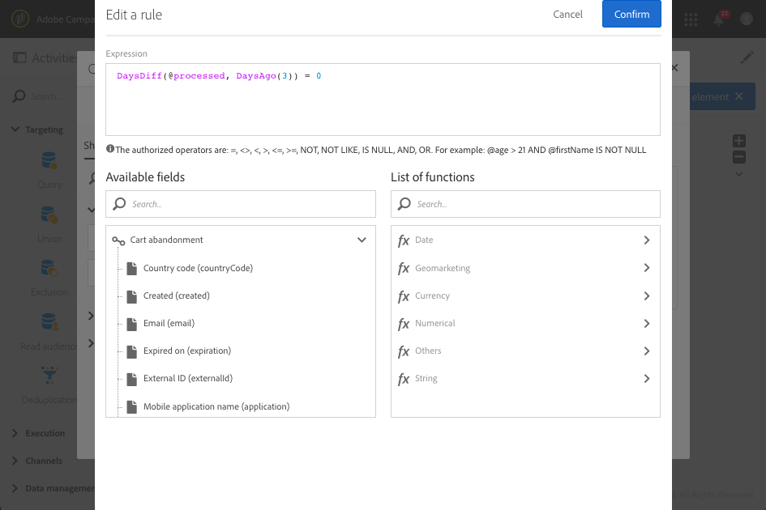
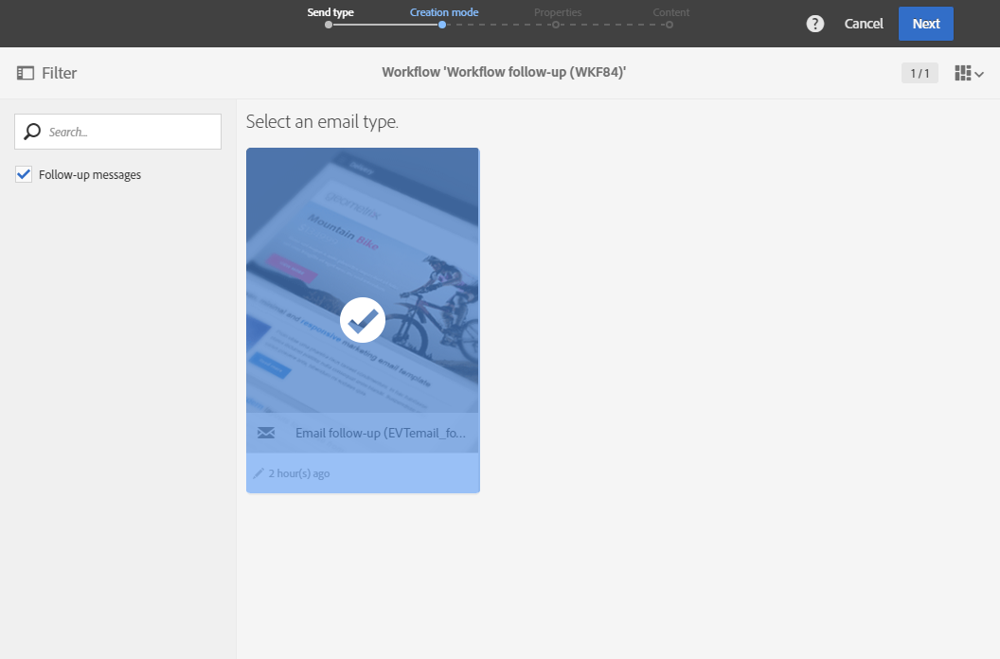
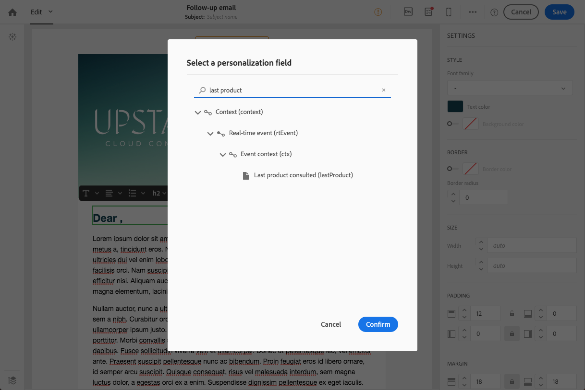

# Messaggi di follow-up{#follow-up-messages}

Puoi inviare un messaggio di follow-up ai clienti che hanno ricevuto un messaggio transazionale specifico. A questo scopo, dovete impostare un flusso di lavoro per l'evento corrispondente.

Riutilizziamo l'esempio descritto nella sezione relativa al principio [operativo dei messaggi](../../channels/using/about-transactional-messaging.md#transactional-messaging-operating-principle) transazionali: un messaggio e-mail di abbandono del carrello viene inviato agli utenti del sito Web che hanno aggiunto prodotti al carrello, ma hanno lasciato il sito senza procedere con i loro acquisti.

Desiderate inviare un promemoria amichevole a tutti i clienti che hanno ricevuto la notifica di abbandono del carrello ma che non l'hanno aperta dopo tre giorni.

Ogni cliente interessato riceverà quindi un messaggio di follow-up basato sugli stessi dati utilizzati nella prima e-mail inviata.

## Accesso ai messaggi di follow-up {#accessing-the-follow-up-messages}

Dopo aver creato e pubblicato un evento (l'abbandono del carrello come nell' [esempio](../../channels/using/about-transactional-messaging.md#transactional-messaging-operating-principle) precedente), il messaggio transazionale e il messaggio di follow-up corrispondenti vengono creati automaticamente.

I passaggi di configurazione sono descritti nella sezione [Configurazione di un evento per inviare un messaggio](../../administration/using/configuring-transactional-messaging.md#use-case--configuring-an-event-to-send-a-transactional-message) di follow-up.

Per gestire un evento in un flusso di lavoro, è necessario un modello di consegna. Tuttavia, quando si pubblica un evento, il messaggio  transazionale creato non può essere utilizzato come modello. Pertanto, è necessario creare un modello di consegna di follow-up specifico progettato per supportare questo tipo di evento e da utilizzare come modello in un flusso di lavoro.

Per accedere a questo modello:

1. Fate clic sul **[!UICONTROL Adobe Campaign]** logo, nell’angolo in alto a sinistra.
1. Selezionate **[!UICONTROL Resources]** &gt; **[!UICONTROL Templates]** &gt; **[!UICONTROL Delivery templates]**.
1. Selezionare la **[!UICONTROL Follow-up messages]** casella nel riquadro a sinistra.

   

Vengono visualizzati solo i messaggi di follow-up.

>[!NOTE]
>
>Per accedere ai messaggi transazionali, devi far parte del gruppo di **[!UICONTROL Administrators (all units)]** sicurezza.

## Invio di un messaggio di follow-up {#sending-a-follow-up-message}

Dopo aver creato il modello di consegna di follow-up, potete usarlo in un flusso di lavoro per inviare un messaggio di follow-up.

1. Accedi all'elenco delle attività di marketing e crea un nuovo flusso di lavoro.

   Consultate [Creazione di un flusso di lavoro](../../automating/using/building-a-workflow.md#creating-a-workflow).

1. Trascinate e rilasciate un' **[!UICONTROL Scheduler]** attività nel flusso di lavoro per aprirla. Impostate la frequenza di esecuzione su una volta al giorno.

   L'attività Scheduler viene presentata nella sezione [Scheduler](../../automating/using/scheduler.md) .

1. Trascinate e rilasciate un' **[!UICONTROL Query]** attività nel flusso di lavoro per aprirla.

   L'attività Query viene presentata nella sezione [Query](../../automating/using/query.md) .

1. Per eseguire la query su una risorsa diversa dalla risorsa del profilo, andate alla **[!UICONTROL Properties]** scheda dell'attività e fate clic sull'elenco a **[!UICONTROL Resource]** discesa.

   

   >[!NOTE]
   >
   >Per impostazione predefinita, l'attività è preconfigurata per la ricerca di profili.

1. Selezionate l’evento di cui desiderate eseguire il targeting in modo da poter accedere solo ai dati di questo evento.

   

1. Andate alla **[!UICONTROL Target]** scheda dell'attività e trascinate l' **[!UICONTROL Delivery logs (logs)]** elemento dalla **[!UICONTROL Email]** sezione nell'area di lavoro.

   

   Selezionate **[!UICONTROL Exists]** per eseguire il targeting di tutti i clienti che hanno ricevuto l’e-mail.

   

1. Spostate l’ **[!UICONTROL Tracking logs (tracking)]** elemento dalla palette all’area di lavoro e selezionate **[!UICONTROL Does not exist]** per eseguire il targeting di tutti i clienti che non hanno aperto l’e-mail.

   

1. Trascinate l’evento di destinazione (abbandono **del** carrello in questo esempio) dalla **[!UICONTROL Email]** sezione all’area di lavoro. Definite quindi una regola per eseguire il targeting di tutti i messaggi inviati tre giorni fa.

   

   Questo significa che tutti i destinatari che hanno ricevuto il messaggio transazionale tre giorni prima dell'esecuzione del flusso di lavoro e che non l'hanno ancora aperto, vengono assegnati al targeting.

   Fare clic **[!UICONTROL Confirm]** per salvare la query.

1. Trascinate e rilasciate un’attività di consegna **tramite** e-mail nel flusso di lavoro.

   L'attività di distribuzione e-mail viene presentata nella sezione relativa alla consegna  tramite e-mail.

   

   Potete anche utilizzare un'attività di consegna  SMS o di distribuzione [di app](../../automating/using/push-notification-delivery.md) Mobile. In questo caso, accertatevi di selezionare il **[!UICONTROL Mobile (SMS)]** **[!UICONTROL Mobile application]** canale o il canale al momento della creazione della configurazione dell'evento. Consultate [Creazione di un evento](../../administration/using/configuring-transactional-messaging.md#creating-an-event).

1. Aprite l'attività di consegna **e-** mail. Nella procedura guidata di creazione, selezionate la **[!UICONTROL Follow-up messages]** casella e selezionate il modello di consegna successivo creato dopo la pubblicazione dell’evento.

   

1. Nel contenuto del messaggio di follow-up, potete sfruttare il contenuto dell'evento aggiungendo campi di personalizzazione.

   

1. Trovate i campi definiti al momento della creazione dell’evento selezionando **[!UICONTROL Context]** &gt; **[!UICONTROL Real-time event]** &gt; **[!UICONTROL Event context]**. Consulta [Personalizzazione di un messaggio](../../channels/using/event-transactional-messages.md#personalizing-a-transactional-message)transazionale.

   

   Questo significa che potete sfruttare lo stesso contenuto, inclusi i dati arricchiti, utilizzato la prima volta che l’evento è stato inviato, per creare un promemoria personalizzato.

1. Salvate l'attività e avviate il flusso di lavoro.

Una volta avviato il flusso di lavoro, ogni cliente che ha ricevuto la notifica di abbandono del carrello tre giorni fa ma non l'ha aperta riceverà un messaggio di follow-up basato sugli stessi dati.

>[!NOTE]
>
>Se hai selezionato la dimensione di **[!UICONTROL Profile]** targeting al momento della creazione della configurazione dell'evento, il messaggio di follow-up utilizzerà anche il database di marketing di Adobe Campaign. See [Profile transactional messages](../../channels/using/profile-transactional-messages.md).

