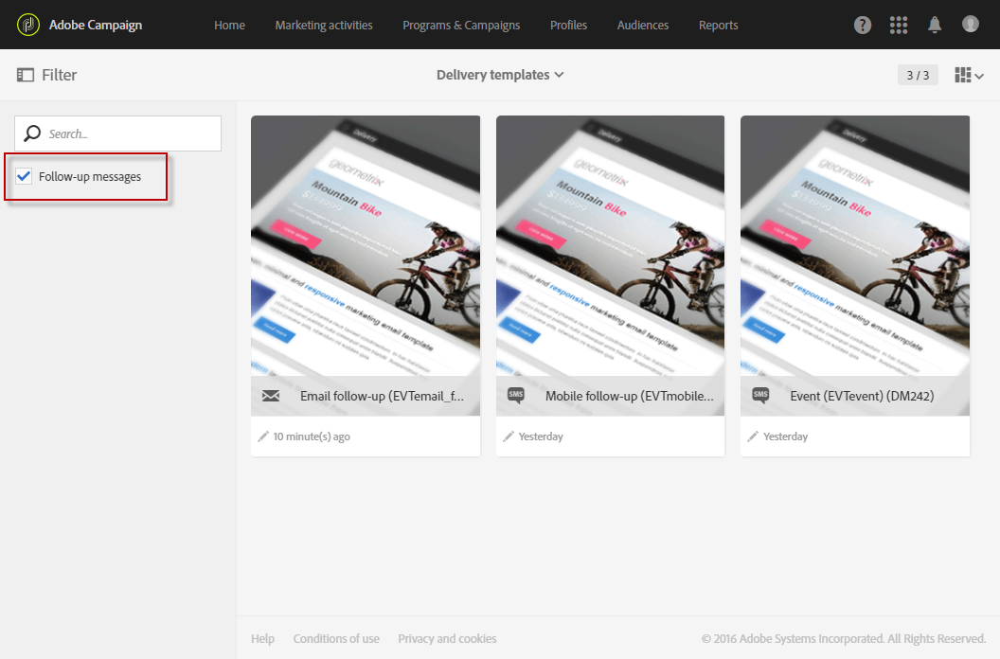

# Messaggi di follow-up {#follow-up-messages}

Un messaggio di follow-up è un modello di consegna marketing predefinito che può essere utilizzato in un flusso di lavoro per inviare un’altra comunicazione ai destinatari di un messaggio transazionale specifico.

Riutilizziamo l’esempio descritto nella [Principio operativo della messaggistica transazionale](../../channels/using/getting-started-with-transactional-msg.md#transactional-messaging-operating-principle) sezione: un’e-mail di abbandono carrello viene inviata agli utenti del sito web che hanno aggiunto prodotti al carrello, ma hanno lasciato il sito senza procedere con gli acquisti.

Desideri inviare un promemoria amico a tutti i clienti che hanno ricevuto la notifica di abbandono del carrello ma che non l’hanno aperto dopo tre giorni. Riceveranno un messaggio di follow-up basato sugli stessi dati utilizzati nella prima e-mail inviata.

## Configurazione di un evento per l’invio di un messaggio di follow-up {#configuring-an-event-to-send-a-follow-up-message}

Per inviare un messaggio di follow-up, devi innanzitutto configurare di conseguenza l’evento corrispondente al messaggio transazionale già ricevuto.

1. Utilizza la stessa configurazione di evento creata per inviare un messaggio transazionale di evento. Consulta [Configurazione di un evento transazionale](../../channels/using/configuring-transactional-event.md).
1. Durante la configurazione dell’evento, seleziona la **[!UICONTROL Create follow-up delivery template for this event]** prima di pubblicare l’evento.

   

1. [Anteprima e pubblicazione dell’evento](../../channels/using/publishing-transactional-event.md#previewing-and-publishing-the-event).

Dopo la pubblicazione dell’evento, vengono creati automaticamente un messaggio transazionale e un modello di consegna successivo collegati al nuovo evento. I passaggi per inviare il messaggio di follow-up sono descritti in [questa sezione](#sending-a-follow-up-message).

## Accesso ai messaggi di follow-up {#accessing-the-follow-up-messages}

Per gestire un evento in un flusso di lavoro, è necessario un modello di consegna. Tuttavia, quando si pubblica l’evento, il [messaggio transazionale](../../channels/using/editing-transactional-message.md) che è stato creato non può essere utilizzato come modello. Pertanto, devi creare un modello di consegna di follow-up specifico progettato per supportare questo tipo di evento e per essere utilizzato come modello in un flusso di lavoro.

Per accedere a questo modello:

1. Fai clic su **Adobe** in alto a sinistra.
1. Seleziona **[!UICONTROL Resources]** > **[!UICONTROL Templates]** > **[!UICONTROL Delivery templates]**.
1. Controlla la **[!UICONTROL Follow-up messages]** nel riquadro sinistro.

   

Vengono visualizzati solo i messaggi di follow-up.

>[!IMPORTANT]
>
>Solo gli utenti con [Amministrazione](../../administration/using/users-management.md#functional-administrators) Il ruolo può accedere e modificare i messaggi transazionali.

## Invio di un messaggio di completamento {#sending-a-follow-up-message}

Dopo aver creato il modello di consegna di follow-up, puoi utilizzarlo in un flusso di lavoro per inviare un messaggio di follow-up.

<!--You need to set up a workflow targeting the event corresponding to the transactional message that was already received.-->

1. Accedi all’elenco delle attività di marketing e crea un nuovo flusso di lavoro.

   Consulta [Creazione di un flusso di lavoro](../../automating/using/building-a-workflow.md#creating-a-workflow).

1. Trascina una **[!UICONTROL Scheduler]** nel flusso di lavoro e aprirlo. Imposta la frequenza di esecuzione su una volta al giorno.

   L’attività Scheduler viene presentata nel [Scheduler](../../automating/using/scheduler.md) sezione.

1. Trascina una **[!UICONTROL Query]** nel flusso di lavoro e aprirlo.

   L’attività Query viene presentata nel [Query](../../automating/using/query.md) sezione.

1. Per eseguire la query su una risorsa diversa da quella del profilo, vai al **[!UICONTROL Properties]** e fai clic sul pulsante **[!UICONTROL Resource]** elenco a discesa.

   

   >[!NOTE]
   >
   >Per impostazione predefinita l’attività è preconfigurata per ricercare profili.

1. Seleziona l’evento di destinazione in modo da accedere solo ai dati di questo evento.

   

1. Vai a dell’attività **[!UICONTROL Target]** , quindi trascinare e rilasciare la **[!UICONTROL Delivery logs (logs)]** dalla palette nell&#39;area di lavoro.

   

   Seleziona **[!UICONTROL Exists]** per eseguire il targeting per tutti i clienti che hanno ricevuto l’e-mail.

   

1. Sposta il **[!UICONTROL Tracking logs (tracking)]** dalla palette all&#39;area di lavoro e selezionare **[!UICONTROL Does not exist]** per eseguire il targeting per tutti i clienti che non hanno aperto l’e-mail.

   

1. Trascina e rilascia l’evento di destinazione (**Abbandono carrello** in questo esempio) dalla palette nell’area di lavoro. Quindi definisci una regola per eseguire il targeting di tutti i messaggi inviati tre giorni fa.

   

   Ciò significa che viene eseguito il targeting per tutti i destinatari che hanno ricevuto il messaggio sulle transazioni tre giorni prima dell’esecuzione del flusso di lavoro e che non lo hanno ancora aperto.

   Clic **[!UICONTROL Confirm]** per salvare la query.

1. Trascina e rilascia una **Consegna e-mail** attività nel flusso di lavoro.

   L’attività Email delivery viene presentata in [Consegna e-mail](../../automating/using/email-delivery.md) sezione.

   

   È inoltre possibile utilizzare un’ [SMS delivery](../../automating/using/sms-delivery.md) o un [Consegna notifiche push](../../automating/using/push-notification-delivery.md) attività. In questo caso, assicurati di selezionare **[!UICONTROL Mobile (SMS)]** o **[!UICONTROL Mobile application]** durante la creazione della configurazione dell’evento. Vedi [Creazione di un evento](../../channels/using/configuring-transactional-event.md#creating-an-event).

1. Apri **Consegna e-mail** attività. Nella procedura guidata di creazione, seleziona **[!UICONTROL Follow-up messages]** e seleziona il modello di consegna di follow-up creato dopo la pubblicazione dell’evento.

   

1. Nel contenuto del messaggio di follow-up, puoi sfruttare il contenuto dell’evento aggiungendo campi di personalizzazione.

   

1. Trova i campi definiti durante la creazione dell’evento selezionando **[!UICONTROL Context]** > **[!UICONTROL Real-time event]** > **[!UICONTROL Event context]**. Consulta [Personalizzazione di un messaggio sulle transazioni](../../channels/using/editing-transactional-message.md#personalizing-a-transactional-message).

   

   Ciò significa che puoi sfruttare lo stesso contenuto, inclusi i dati arricchiti, utilizzato la prima volta che l’evento è stato inviato, per creare un promemoria descrittivo personalizzato.

1. Salva l’attività e avvia il flusso di lavoro.

Una volta avviato il flusso di lavoro, ogni cliente che ha ricevuto la notifica di abbandono del carrello tre giorni fa ma non l’ha aperto riceverà un messaggio di follow-up basato sugli stessi dati.

>[!NOTE]
>
>Se hai selezionato **[!UICONTROL Profile]** dimensione di targeting durante la creazione della configurazione dell’evento, il messaggio di follow-up sfrutterà anche il database di marketing di Adobe Campaign. Vedi [Messaggi transazionali di profilo](../../channels/using/editing-transactional-message.md#profile-transactional-message-specificities).
