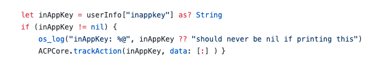

# Domande frequenti in-app {#in-app-faq}

## Quali risorse utili consigliamo per saperne di più sul canale in-app in Adobe Campaign Standard? {#resources-inapp}

Consulta le risorse seguenti:

* [Tutorial video](https://experienceleague.adobe.com/docs/campaign-standard-learn/tutorials/communication-channels/mobile/in-app/in-app-message-overview.html)
* [Post di blog](https://theblog.adobe.com/get-more-out-of-the-new-in-app-message-channel-from-adobe-campaign/)
* [Pagina community](https://experienceleaguecommunities.adobe.com/t5/adobe-campaign-standard/ct-p/adobe-campaign-standard-community)

## Qual è lo scopo delle API di estensione di Campaign setLinkageField e resetLinkageField? {#extensions-apis}

Poiché i messaggi in-app vengono estratti da SDK da Campaign, vogliamo fornire un meccanismo sicuro per garantire che i messaggi in-app contenenti dati PII non cadano in mani dannose. Di conseguenza, è stato implementato il seguente meccanismo per garantire la consegna sicura dei messaggi al dispositivo:

* I clienti contrassegnano i campi del profilo mobile (tabella appSubscriberRcp) come Personali e riservati se desiderano assicurarsi che queste informazioni particolari vengano consegnate in modo sicuro.
* I campi contrassegnati come tali possono essere utilizzati solo nel modello Profilo (non nel modello AppSubscriber o Broadcast) in cui è incorporato un meccanismo di sicurezza aggiuntivo.
* I messaggi generati utilizzando il modello di profilo possono essere trasmessi solo dopo che l’utente ha effettuato l’accesso all’app.
* Per facilitare questo handshake sicuro, gli sviluppatori di app mobili devono trasmettere ulteriori dettagli di autenticazione utilizzando l’API setLinkageField. Tieni presente che il campo di collegamento è quello identificato come collegamento tra Profilo mobile e Profilo CRM durante l’estensione della tabella appSubscriberRcp.
* Devono effettuare il flushing dei messaggi in-app memorizzati sul dispositivo e resetLinkageField quando l’utente si disconnette dall’app utilizzando resetLinkageField. In questo modo, se un utente diverso accede all’app, non vede i messaggi destinati all’utente precedente.
* Consulta [API di Mobile SDK](https://developer.adobe.com/client-sdks/documentation/adobe-campaign-standard/api-reference/) per implementare questo meccanismo di sicurezza lato client.

## Cosa devo fare per abilitare il reporting in-app in Campaign? {#enable-inapp-reporting}

Devi configurare il postback del tracciamento in-app. Le istruzioni sono disponibili [qui](../../administration/using/configuring-rules-launch.md#inapp-tracking-postback).

Per implementare il tracciamento delle notifiche locali, consulta questa [pagina](../../administration/using/local-tracking.md).

## Quali rapporti sono disponibili per il canale in-app? {#report-inapp}

In Adobe Campaign è disponibile un rapporto pronto all’uso per il canale in-app. Consulta questa [documentazione](../../reporting/using/in-app-report.md).

Consulta questa [pagina](../../reporting/using/indicator-calculation.md#in-app-delivery) per informazioni sul calcolo di ciascuna metrica in-app.

## Supporti varianti di contenuto multilingue per contenuti in-app simili a Push? {#multilingual-inapp}

Non sono attualmente disponibili modelli multilingue per la messaggistica in-app.

Tuttavia, se l’obiettivo è inviare un messaggio in-app in una lingua diversa dall’inglese, il contenuto può essere incollato direttamente nelle caselle di testo disponibili.

## È possibile aggiungere i campi di personalizzazione di Campaign a HTML personalizzato? {#custom-html-inapp}

No, non ancora supportato.

## È stato configurato un messaggio di avviso che tuttavia non viene visualizzato sul dispositivo. {#alert-message}

Per i messaggi di avviso, è necessario almeno un pulsante di esclusione (principale o secondario deve disporre di azione di esclusione). In caso contrario, è possibile salvare il messaggio ma non verrà ricevuto.

## Se l&#39;audio personalizzato di iOS delle notifiche locali non viene riprodotto, verrà riprodotto l&#39;audio predefinito? {#local-notification-sound}

Per l&#39;audio personalizzato su iOS, è necessario specificare un nome di file con estensione durante la creazione di una notifica locale (ad esempio, sound.caf). Se questa estensione non viene fornita, viene utilizzato il suono predefinito.

## I collegamenti diretti sono supportati nei messaggi in-app? {#inapp-deeplinks}

Sì, i collegamenti diretti sono supportati nei messaggi in-app. I collegamenti diretti devono includere:

* linguaggio che indica che il tracciamento della consegna deve essere disabilitato affinché i collegamenti diretti funzionino.
* Appsflyer con Branch come partner in grado di eseguire il tracciamento del deep link. Per ulteriori informazioni sull&#39;integrazione di Branch e Adobe Campaign Standard, consulta questa [pagina](https://help.branch.io/using-branch/docs/adobe-campaign-standard-1).

## È possibile attivare un messaggio in-app quando l’utente avvia l’app da una notifica push? {#inapp-push-trigger}

Sì, questi messaggi sono anche denominati messaggi a catena. Segui la procedura seguente:

1. Creare un messaggio in-app.

1. Definisci un evento personalizzato e selezionalo come attivatore di evento per questo IAM. Esempio: &quot;Trigger da push di anteprima autunno&quot;.

1. Quando crei il messaggio push, definisci una variabile personalizzata il cui valore può essere impostato come evento utilizzato per attivare IAM. Esempio: Chiave = &quot;inappkey&quot; e valore = &quot;Trigger from fall preview Push&quot;.

1. Nel codice dell’app mobile, implementa il trigger di evento come segue:

   
