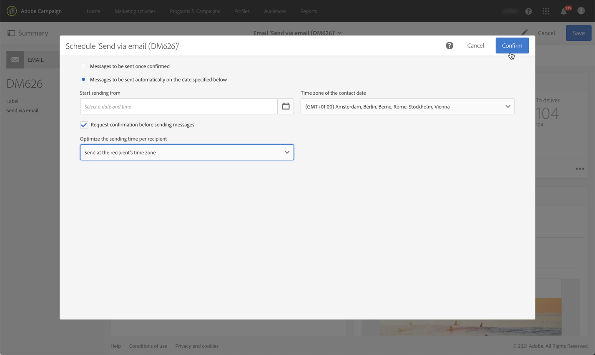

# Passaggi fondamentali per l’invio di un messaggio{#key-steps-to-send-a-message}

In questa sezione imparerai a creare e inviare messaggi personalizzati a un pubblico mirato utilizzando Adobe Campaign Standard.

Informazioni specifiche su come creare e configurare ciascun canale di comunicazione sono disponibili nelle seguenti sezioni:

* [Creazione di un messaggio e-mail](../../channels/using/creating-an-email.md)
* [Creazione di un SMS](../../channels/using/creating-an-sms-message.md)
* [Creazione di una consegna direct mailing](../../channels/using/creating-the-direct-mail.md)
* [Creazione di una notifica push](../../channels/using/preparing-and-sending-a-push-notification.md).
* [Preparazione e invio di un messaggio in-app](../../channels/using/preparing-and-sending-an-in-app-message.md)

Per informazioni sulle best practice per la consegna, consulta la sezione [Best practice per la consegna](../../sending/using/delivery-best-practices.md).

## Creare il messaggio

Sfrutta le [attività di marketing](../../start/using/marketing-activities.md) di Campaign Standard per creare e-mail, SMS, direct mail, notifiche push o messaggi in-app.

I messaggi possono essere creati dall&#39;elenco delle attività di marketing o da un flusso di lavoro utilizzando [attività dedicate](../../automating/using/about-channel-activities.md).

## Definire il pubblico

Definisci i destinatari del messaggio. A tale scopo, utilizza l&#39;[editor delle query](../../automating/using/editing-queries.md) dal riquadro di sinistra per filtrare i dati contenuti nel database e creare regole per il pubblico.

Sono disponibili diversi tipi di pubblico:

* **[!UICONTROL Target]** è il target principale della tua e-mail,
* **[!UICONTROL Test profiles]** sono i profili utilizzati per testare e convalidare l&#39;e-mail (vedi [Gestione dei profili di test](../../audiences/using/managing-test-profiles.md)).

## Progettare e personalizzare i contenuti

Nel blocco **[!UICONTROL Content]**, progetta e personalizza il contenuto del messaggio utilizzando i campi del database. Per ulteriori informazioni su come progettare contenuti per un canale specifico, consulta le sezioni elencate nella parte superiore di questa pagina.

## Preparare e testare

[Prepara](../../sending/using/preparing-the-send.md) il messaggio. Questo processo calcola la popolazione target e prepara il messaggio personalizzato.

**Controlla e verifica il messaggio** prima di inviarlo utilizzando le funzionalità di Campaign Standard: anteprima, rendering di e-mail, verifica, ecc. Per ulteriori informazioni, consulta [questa sezione](../../sending/using/previewing-messages.md).

Utilizza il blocco **[!UICONTROL Schedule]** per definire quando verranno inviati i messaggi (vedi [Pianificazione dei messaggi](../../sending/using/about-scheduling-messages.md)).

## Inviare e tracciare

Quando il messaggio è pronto, puoi confermarlo. Il blocco **[!UICONTROL Deployment]** visualizza l&#39;avanzamento dell&#39;invio e il risultato.

Sono disponibili diversi registri per aiutarti a monitorare la consegna dei messaggi (vedi [monitoraggio di una consegna](../../sending/using/monitoring-a-delivery.md)). Puoi anche tenere traccia del comportamento dei destinatari della consegna grazie alle [funzionalità di tracciamento](../../sending/using/tracking-messages.md) di Campaign Standard.

Misura l&#39;efficacia dei tuoi messaggi e l&#39;evoluzione degli invii e delle campagne tramite vari indicatori e grafici (vedi [Accesso ai report](../../reporting/using/about-dynamic-reports.md)).

