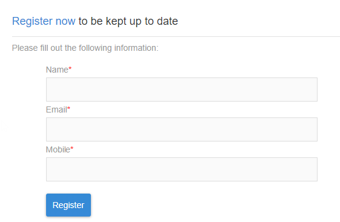

# Landing page limitations{#landing-page-limitations}

**Scrittura e aggiornamento dei dati**

* Landing pages are limited to **[!UICONTROL Profile]** and **[!UICONTROL Subscription]** resources only. Record can be saved and updated from **[!UICONTROL Profile]** and a subscription/unsubscription to a **[!UICONTROL Service]**.
To learn more on resources configuration, see [Configuring the resource's data structure](../../developing/using/configuring-the-resource-s-data-structure.md).

>[!CAUTION]
>
> A landing page cannot display or update data from any other resource than **[!UICONTROL Profile]** and **[!UICONTROL Subscription]**.

**Precaricamento**

* La pagina di destinazione non può visualizzare automaticamente un elenco di record, ma non può elencare i servizi a cui sono già stati iscritti. For more information on services, refer to this [page](../../audiences/using/creating-a-service.md).

* È possibile accedere a una pagina di destinazione con un modulo precompilato (dati precompilati con la pagina) da un'e-mail di Adobe Campaign. Non è possibile accedere a tale modulo dalla pagina di un sito Web.

**Riconciliazione**

* Il comportamento di riconciliazione è il seguente: Non appena viene trovata una corrispondenza, il processo di riconciliazione si interrompe. Ciò significa che la riconciliazione può essere effettuata solo su un record di profilo e non su più record in presenza di duplicati.

Ad esempio, vuoi inviare la seguente pagina di destinazione di acquisizione ai tuoi profili per aggiornare il database campagna con i numeri dei dispositivi mobili dei tuoi profili.

Se uno del profilo compila la pagina di destinazione con nuove informazioni ma dispone già di un profilo duplicato, il profilo corrispondente con la data di creazione prima verrà aggiornato in base alla priorità di creazione dei profili in base alla data di creazione.

Qui solo il primo profilo è stato aggiornato in quanto era la voce più obsoleta.

**Verifica della pagina di destinazione**

* Le pagine di destinazione funzionano solo sui profili e non sui profili, per cui non è possibile testare le pagine di destinazione come parte di una prova e-mail.
