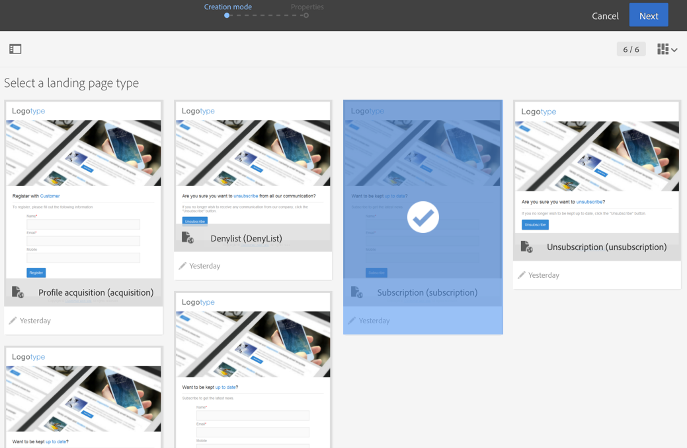

# Informazioni sui modelli di pagina di destinazione {#landing-page-templates}

Campaign è dotato di un set di modelli di pagina di destinazione incorporati:

* **[!UICONTROL Acquisition]**: questo è il modello predefinito per le pagine di destinazione, che ti consente di acquisire e aggiornare dati nel database di Campaign.
* **[!UICONTROL Subscription]**: questo modello deve essere utilizzato per offrire abbonamenti a un servizio.
* **[!UICONTROL Unsubscription]**: un collegamento a questo modello può essere presente in un’e-mail inviata agli abbonati a un servizio, per consentire loro di annullare l’abbonamento a tale servizio.
* **[!UICONTROL Denylist]**: questo modello deve essere utilizzato quando un profilo non desidera più essere contattato da Campaign. Per ulteriori informazioni sulla gestione dei inserisce nell&#39;elenco Bloccati di, consulta [Informazioni su consenso e rinuncia in Campaign](../../audiences/using/about-opt-in-and-opt-out-in-campaign.md).

Questi modelli sono proposti per impostazione predefinita durante la creazione di una nuova pagina di destinazione.



Per accedere ai modelli di pagina di destinazione, fai clic sul logo Adobe Campaign in alto a sinistra e seleziona **[!UICONTROL Resources]** > **[!UICONTROL Templates]** > **[!UICONTROL Landing page templates]**.

>[!NOTE]
>
>Adobe consiglia di creare modelli personalizzati duplicando un modello incorporato. Alcuni parametri possono essere impostati solo nei modelli di pagina di destinazione e non possono essere modificati direttamente nelle pagine di destinazione.

Durante la creazione di un modello, è consigliabile aggiungere un attributo **“type”** ai tag. Queste informazioni saranno elaborate dall’editor e consentiranno all’utente di collegare un campo di database al campo del modulo durante la configurazione dell’applicazione web.

Esempio di codice HTML nel modello:

```
<input id="email" type="email" name="email"/>
```

L’elenco ufficiale degli attributi “type” è disponibile al seguente indirizzo: [https://www.w3schools.com/tags/att_input_type.asp](https://www.w3schools.com/tags/att_input_type.asp)
