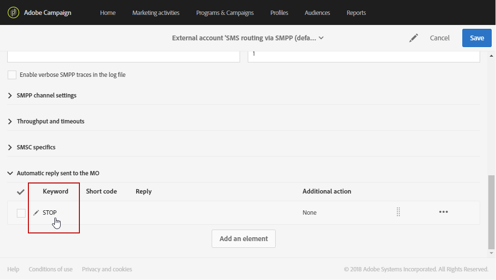

# Gestione degli SMS in arrivo{#managing-incoming-sms}

## Gestione di STOP SMS {#managing-stop-sms}

Quando un profilo risponde a un messaggio SMS inviato tramite Campaign, puoi configurare messaggi da inviargli automaticamente e l’azione da eseguire.

Questa configurazione è definita nella sezione **[!UICONTROL Automatic reply sent to the MO]** dell&#39; [account esterno di routing SMS](../../administration/using/configuring-sms-channel.md#defining-an-sms-routing). MO sta per &#39;Mobile Originato&#39;, il che significa che puoi configurare una risposta automatica al cellulare che ha inviato l&#39;SMS.

Per eseguire questa operazione:

1. Dal menu avanzato, tramite il logo Adobe Campaign , selezionare **[!UICONTROL Administration > Application settings > External accounts]**, quindi l&#39;account esterno **[!UICONTROL SMS routing via SMPP]**.
1. Nella categoria **[!UICONTROL Automatic reply sent to the MO]**, fare clic su **[!UICONTROL Create element]** per iniziare a configurare la risposta automatica.

   

1. Scegliere la parola chiave che attiverà la risposta automatica. Le parole chiave non fanno distinzione tra maiuscole e minuscole. Ad esempio, in questo caso, se i destinatari inviano la parola chiave &quot;STOP&quot;, riceveranno la risposta automatica.

   Lasciate vuota questa colonna se desiderate inviare la stessa risposta, indipendentemente dalla parola chiave.

   

1. Nel campo **[!UICONTROL Short code]**, specificate un numero che in genere viene utilizzato per inviare le consegne e fungerà da nome del mittente. È inoltre possibile decidere di lasciare vuota la colonna **[!UICONTROL Short code]**, per inviare la stessa risposta indipendentemente dal codice breve.

   

1. Digitare la risposta che si desidera inviare ai destinatari nel campo **[!UICONTROL Reply]**.

   Per eseguire un&#39;azione senza inviare una risposta, lasciare vuota la colonna **[!UICONTROL Reply]**. Ad esempio, questo consente di rimuovere dalla quarantena il numero di telefono di un utente che risponde con un messaggio diverso da &quot;STOP&quot;.

   

1. Nel campo **[!UICONTROL Additional action]**, collegare un&#39;azione alla risposta automatica:

   * L&#39;azione **[!UICONTROL Send to quarantine]** mette automaticamente in quarantena il numero di telefono del profilo.
   * L&#39;azione **[!UICONTROL Remove from quarantine]** rimuove il numero di telefono del profilo dalla quarantena.
   * L&#39;azione **[!UICONTROL None]** consente di inviare il messaggio solo ai destinatari senza eseguire alcuna azione.

   Ad esempio, nella configurazione seguente, se i destinatari inviano la parola chiave &quot;STOP&quot;, riceveranno automaticamente una conferma di annullamento dell&#39;iscrizione e il loro numero di telefono verrà inviato in quarantena con lo stato **[!UICONTROL On denylist]**. Questo stato si riferisce solo al numero di telefono, il profilo in modo che l&#39;utente continui a ricevere i messaggi e-mail.

   

Ora i destinatari possono annullare automaticamente la sottoscrizione ai messaggi e inviarli in quarantena con questa risposta automatica. I destinatari in quarantena sono elencati nella tabella **[!UICONTROL Addresses]** disponibile dal menu **[!UICONTROL Administration]** > **[!UICONTROL Channels]** > **[!UICONTROL Quarantines]**. Per ulteriori informazioni sulle quarantena, consultare la sezione [a1/>.](../../sending/using/understanding-quarantine-management.md)

Questi SMS in arrivo possono essere memorizzati se necessario. Per ulteriori informazioni, consultare la sezione [sezione](#storing-incoming-sms).

## Memorizzazione SMS in arrivo {#storing-incoming-sms}

Nell&#39;account **[!UICONTROL SMS routing via SMPP]** esterno, puoi scegliere di memorizzare i messaggi in arrivo, ad esempio quando un utente risponde &quot;STOP&quot; a un messaggio SMS per essere rimosso dagli elenchi dei destinatari.

Selezionando **[!UICONTROL Store incoming MO in the database]** nella categoria **[!UICONTROL SMPP channel settings]**, tutti gli SMS verranno memorizzati nella tabella inSMS e possono essere recuperati tramite un&#39;attività di query in un flusso di lavoro.

Per eseguire questa operazione:

1. Nel campo **[!UICONTROL SMPP channel settings]**, selezionare **[!UICONTROL Store incoming MO in the database]**.

   

1. Nella scheda **[!UICONTROL Marketing activities]**, fare clic su **[!UICONTROL Create]**, quindi selezionare **[!UICONTROL Workflow]**.

   

1. Selezionate il tipo di flusso di lavoro.
1. Modificate le proprietà del flusso di lavoro, quindi fate clic su **[!UICONTROL Create]**. Per ulteriori informazioni sulla creazione dei flussi di lavoro, consultare la sezione .
1. Trascinare un&#39;attività **[!UICONTROL Query]** e fare doppio clic su di essa.
1. Nella scheda **[!UICONTROL Properties]** della query, scegliere **[!UICONTROL Incoming SMS (inSMS)]** nel campo **[!UICONTROL Resource]**.

   

1. Quindi, nella scheda **[!UICONTROL Target]**, trascinare e rilasciare la regola **[!UICONTROL Incoming SMS attributes]**.

   

1. In questo caso, desideriamo eseguire il targeting di ogni messaggio in arrivo dal giorno precedente. Nella categoria **[!UICONTROL Field]**, selezionare **[!UICONTROL Creation date (created)]**.
1. In **[!UICONTROL Filter type]**, selezionare **[!UICONTROL Relative]**, quindi in **[!UICONTROL Level of precision]**, scegliere **[!UICONTROL Day]**.

   

1. Puoi quindi scegliere di recuperare i dati da oggi, il giorno precedente o gli ultimi giorni. Fare clic su **[!UICONTROL Confirm]** quando la query è configurata.

Questa query recupera tutti i messaggi STOP ricevuti in base all&#39;intervallo di tempo scelto.

L&#39;attività consente, ad esempio, di creare una popolazione e personalizzare meglio le consegne.
