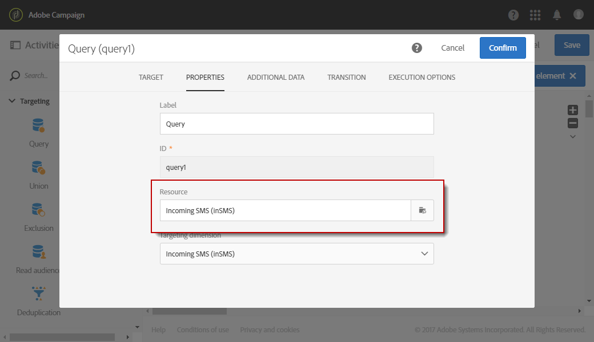

# Gestione degli SMS in arrivo{#managing-incoming-sms}

## Gestione di STOP SMS {#managing-stop-sms}

Quando un profilo risponde a un messaggio SMS inviato tramite Campaign, puoi configurare i messaggi che gli vengono automaticamente inviati e l'azione da eseguire.

Questa configurazione è definita nella **[!UICONTROL Automatic reply sent to the MO]** sezione dell'account [esterno](../../administration/using/configuring-sms-channel.md#defining-an-sms-routing)di routing SMS. MO sta per 'Mobile Originato', il che significa che puoi configurare una risposta automatica al cellulare che ha inviato l'SMS.

A questo scopo:

1. Dal menu avanzato, tramite il logo Adobe Campaign, selezionate **[!UICONTROL Administration > Application settings > External accounts]** quindi l'account **[!UICONTROL SMS routing via SMPP]** esterno.
1. Sotto la **[!UICONTROL Automatic reply sent to the MO]** categoria, fare clic **[!UICONTROL Create element]** per iniziare a configurare la risposta automatica.

   

1. Scegliere la parola chiave che attiverà la risposta automatica. Le parole chiave non fanno distinzione tra maiuscole e minuscole. Ad esempio, in questo caso, se i destinatari inviano la parola chiave "STOP", riceveranno la risposta automatica.

   Lasciate vuota questa colonna se desiderate inviare la stessa risposta, indipendentemente dalla parola chiave.

   

1. Nel **[!UICONTROL Short code]** campo, specifica un numero che in genere viene utilizzato per inviare le consegne e che fungerà da nome del mittente. Potete anche decidere di lasciare vuota la **[!UICONTROL Short code]** colonna, per inviare la stessa risposta indipendentemente dal codice breve.

   

1. Digitare la risposta da inviare ai destinatari nel campo **[!UICONTROL Reply]**.

   Per eseguire un'azione senza inviare una risposta, lasciare vuota la **[!UICONTROL Reply]** colonna. Ad esempio, questo consente di rimuovere dalla quarantena il numero di telefono di un utente che risponde con un messaggio diverso da "STOP".

   

1. Nel **[!UICONTROL Additional action]** campo, collegare un’azione alla risposta automatica:

   * L’ **[!UICONTROL Send to quarantine]** azione esegue automaticamente la quarantena del numero di telefono del profilo.
   * Questa **[!UICONTROL Remove from quarantine]** azione rimuove il numero di telefono del profilo dalla quarantena.
   * L’ **[!UICONTROL None]** azione consente di inviare il messaggio solo ai destinatari senza eseguire alcuna azione.
   Ad esempio, nella configurazione seguente, se i destinatari inviano la parola chiave "STOP", riceveranno automaticamente una conferma di annullamento dell’iscrizione e il loro numero di telefono verrà inviato in quarantena con lo **[!UICONTROL Blacklisted]** stato. Questo stato si riferisce solo al numero di telefono, il profilo non viene inserito in blacklist in modo che l'utente continui a ricevere i messaggi e-mail.

   

Ora i destinatari possono annullare automaticamente la sottoscrizione ai messaggi e inviare in quarantena con questa risposta automatica. I destinatari in quarantena sono elencati nella **[!UICONTROL Addresses]** tabella disponibile dal menu **[!UICONTROL Administration]** &gt; **[!UICONTROL Channels]** &gt; **[!UICONTROL Quarantines]** . Per ulteriori informazioni sulle quarantena, consulta questa [sezione](../../sending/using/understanding-quarantine-management.md).

Questi SMS in arrivo possono essere memorizzati se necessario. Per ulteriori informazioni, consulta questa [sezione](#storing-incoming-sms).

## Memorizzazione SMS in arrivo {#storing-incoming-sms}

Nell'account **[!UICONTROL SMS routing via SMPP]** esterno, potete scegliere di memorizzare i messaggi in arrivo, ad esempio quando un utente risponde "STOP" a un messaggio SMS per essere rimosso dagli elenchi dei destinatari.

Selezionando **[!UICONTROL Store incoming MO in the database]** la **[!UICONTROL SMPP channel settings]** categoria, tutti gli SMS verranno memorizzati nella tabella inSMS e possono essere recuperati tramite un'attività di query in un flusso di lavoro.

A questo scopo:

1. Nel **[!UICONTROL SMPP channel settings]** campo, selezionare **[!UICONTROL Store incoming MO in the database]**.

   

1. Nella **[!UICONTROL Marketing activities]** scheda, fare clic su **[!UICONTROL Create]** quindi selezionare **[!UICONTROL Workflow]**.

   

1. Selezionate il tipo di flusso di lavoro.
1. Modificate le proprietà del flusso di lavoro, quindi fate clic su **[!UICONTROL Create]**. Per ulteriori informazioni sulla creazione dei flussi di lavoro, consulta questa [sezione](../../automating/using/building-a-workflow.md).
1. Trascinate e rilasciate un' **[!UICONTROL Query]** attività e fate doppio clic su di essa.
1. Nella **[!UICONTROL Properties]** scheda della query, scegliere **[!UICONTROL Incoming SMS (inSMS)]** nel **[!UICONTROL Resource]** campo.

   

1. Quindi, nella **[!UICONTROL Target]** scheda, trascinare la **[!UICONTROL Incoming SMS attributes]** regola.

   

1. In questo caso, desideriamo eseguire il targeting di ogni messaggio in arrivo dal giorno precedente. Nella **[!UICONTROL Field]** categoria, selezionare **[!UICONTROL Creation date (created)]**.
1. In **[!UICONTROL Filter type]**, selezionate **[!UICONTROL Relative]** quindi in **[!UICONTROL Level of precision]**, scegliete **[!UICONTROL Day]**.

   

1. Puoi quindi scegliere di recuperare i dati da oggi, il giorno precedente o gli ultimi giorni. Fate clic **[!UICONTROL Confirm]** quando la query è configurata.

Questa query recupera tutti i messaggi STOP ricevuti in base all'intervallo di tempo scelto.

L'attività consente, ad esempio, di creare una popolazione e personalizzare meglio le consegne.
