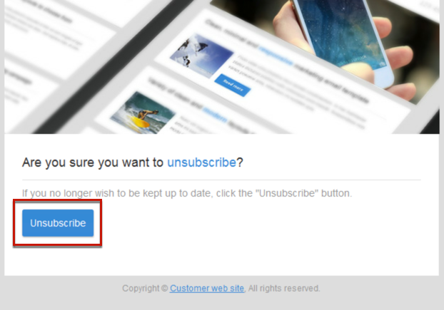

# Gestione dei dati del modulo della pagina di destinazione{#managing-landing-page-form-data}

## Modifica delle proprietà dei dati del modulo di una pagina di destinazione{#changing-a-landing-page-form-data-properties}

Puoi collegare i campi del database ad aree di input, pulsanti di scelta o blocchi di tipo casella di controllo. A questo scopo, seleziona il blocco e accedi a **[!UICONTROL Form data]** nella palette.

* La zona di input **Campo** ti consente di selezionare un campo di database da collegare a quello del modulo.
* L’opzione **Obbligatorio** ti consente di autorizzare l’invio della pagina solo se l’utente ha compilato il campo. Se non viene compilato un campo obbligatorio, viene visualizzato un messaggio di errore.

## Mappatura dei campi del modulo {#mapping-form-fields}

I campi di input vengono utilizzati per memorizzare o aggiornare i dati nel database Campaign. A questo scopo, devi collegare i campi del database con aree di input, pulsanti di scelta o blocchi di tipo casella di controllo. Per eseguire questa operazione:

1. Seleziona un blocco nella pagina di destinazione.
1. Nella palette, completa la parte **[!UICONTROL Form data]**.

   

1. Scegli un campo del database da collegare al campo del modulo nella zona di selezione **[!UICONTROL Field]**. È possibile mappare le pagine di destinazione solo con **Profili**.

1. Se necessario, seleziona l’opzione **[!UICONTROL Mandatory]**. È possibile inviare la pagina solo se l’utente ha completato questo campo. Se un campo obbligatorio è incompleto, viene visualizzato un messaggio di errore quando l’utente convalida la pagina.

1. Nell’area di selezione **[!UICONTROL HTML type of the field]**, definisci il tipo di campo scegliendo ad esempio **[!UICONTROL Text]**, **[!UICONTROL Number]** o **[!UICONTROL Date]**.
Se scegli una **[!UICONTROL Checkbox]** obbligatoria, accertati che sia di tipo **[!UICONTROL Field]**.

>[!NOTE]
>
>I campi predefiniti delle pagine di destinazione incorporate sono preconfigurati. Puoi modificarli, se necessario.

## Archiviazione e riconciliazione dei dati{#data-storage-and-reconciliation}

I parametri di riconciliazione dei dati ti consentono di definire come gestire i dati immessi nella pagina di destinazione dopo che un utente li ha inviati.

Per eseguire questa operazione:

1. Modifica le proprietà della pagina di destinazione accessibili tramite l’icona  nel dashboard della pagina di destinazione e visualizza i parametri **[!UICONTROL Job]**.

   

1. Seleziona la **[!UICONTROL Reconciliation key]**: questi campi del database (ad esempio: e-mail, nome e cognome) vengono utilizzati per determinare se è già presente un profilo del visitatore nel database di Adobe Campaign. In questo modo puoi aggiornare o creare un profilo, in base ai parametri definiti per la strategia di aggiornamento.
1. Definisci la **[!UICONTROL Form parameter mapping]**: in questa sezione puoi mappare i parametri dei campi della pagina di destinazione e quelli utilizzati nella chiave di riconciliazione.
1. Seleziona la **[!UICONTROL Update strategy]**: se la chiave di riconciliazione recupera un profilo di database esistente, puoi scegliere di aggiornarlo con i dati immessi nel modulo oppure impedirne l’aggiornamento.

## Casella di controllo Contratto {#agreement-checkbox}

Puoi aggiungere una casella di controllo che il profilo deve controllare prima di inviare la pagina di destinazione.

Ad esempio, questo consente di richiedere il consenso degli utenti per l&#39;informativa sulla privacy o di farli accettare i termini e le condizioni dell&#39;utente prima che inviino il modulo.

<!--This is particularly useful in the following case:

When a profile opens the landing page from an Outlook.com mailbox, Outlook checks whether the links on the landing page are suspicious. However, this Outlook security feature (called safelinks) has an unwanted effect: it automatically activates the buttons included on the landing page. Consequently, profiles are automatically subscribed or unsubscribed without confirmation when the landing page is displayed after clicking the email link, even if they do not submit the form.

To avoid this, Adobe recommends you always add to your landing page a checkbox which enables the profile to agree before proceeding with subscription or unsubscription.-->

>[!IMPORTANT]
>
>La selezione di questa casella di controllo è obbligatoria per gli utenti. Se non è selezionato, non sarà in grado di inviare la pagina di destinazione.

Per inserire e configurare questa casella di controllo, procedi come segue:

1. Durante la progettazione della pagina di destinazione, fai clic su **[!UICONTROL Show source]**.

   

1. Inserisci manualmente una casella di controllo, ad esempio nell’esempio seguente:

   

   <!--
   
<input type="checkbox" class="nl-dce-todo" data-nl-bindto="agreement" data-nl-agreementmsg="You must agree with the terms and conditions before proceeding" />I agree with the terms and conditions

   -->

1. Fai clic su **[!UICONTROL Hide source]**.

1. Viene visualizzata la nuova casella di controllo. Selezionala.

   

1. L’elenco a discesa corrispondente viene visualizzato nella sezione **[!UICONTROL Form data]** della palette. Seleziona **[!UICONTROL Agreement]** dall’elenco.

   

   >[!NOTE]
   >
   >L’elemento **[!UICONTROL Agreement]** non è mappato su un campo del database Campaign.

1. Fai clic sull’icona  accanto a **[!UICONTROL Form data]** per accedere alle proprietà avanzate della casella di controllo.

1. Se necessario, puoi modificare il messaggio.

   

   Questo testo verrà visualizzato come avviso se l’utente non seleziona la casella di controllo prima di inviare il modulo.

   >[!NOTE]
   >
   >Questa azione è obbligatoria per impostazione predefinita e non può essere modificata.

1. Fai clic su **[!UICONTROL Confirm]**.

Ora, ogni volta che viene visualizzata la pagina di destinazione, l’utente deve selezionare questa casella di controllo prima di inviare il modulo. In caso contrario, l’avviso verrà visualizzato e l’utente non sarà in grado di inviare il modulo fino all’attivazione della casella di controllo.