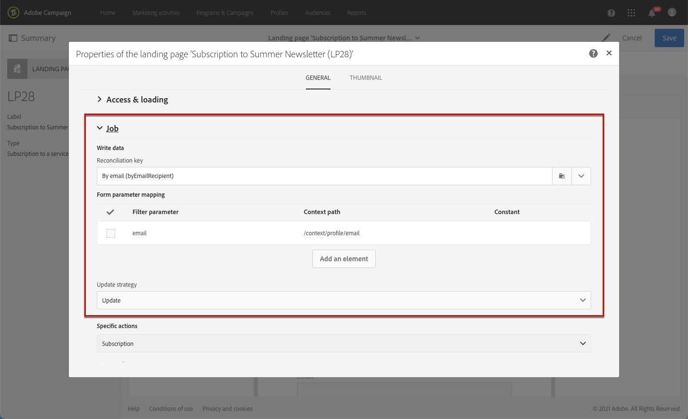

# Gestione dei dati del modulo della pagina di destinazione{#managing-landing-page-form-data}

Nel contenuto della pagina di destinazione, i campi di input vengono utilizzati per memorizzare o aggiornare i dati dal database Campaign.

A questo scopo, questi campi devono essere mappati ai campi del database.

Puoi definirne e gestirne la mappatura tramite **[!UICONTROL Form data]** nella palette a sinistra.

## Mappatura dei campi del modulo {#mapping-form-fields}

Per aggiornare il database Campaign in base alle tue esigenze, collega i campi del database pertinenti alla zona di input, ai blocchi di pulsanti di scelta o di tipo casella di controllo della pagina di destinazione.

A tale scopo, segui la procedura indicata di seguito:

1. Seleziona un blocco nel contenuto della pagina di destinazione.

   >[!NOTE]
   >
   >I campi predefiniti delle pagine di destinazione incorporate sono preconfigurati. Puoi modificarli, se necessario.

1. Accedere al **[!UICONTROL Form data]** nella palette a sinistra.

1. Per modificare il tipo di campo, seleziona un valore dalla **[!UICONTROL HTML type of the field]** elenco a discesa.

   

   >[!NOTE]
   >
   >Per ulteriori informazioni sull’utilizzo del tipo di casella di controllo in una pagina di destinazione, consulta la sezione [Aggiornare più abbonamenti al servizio](#multiple-subscriptions) e [Casella di controllo Contratto](#agreement-checkbox) sezioni.

1. Se si seleziona un tipo di campo non compatibile con il campo di database attualmente selezionato nella **[!UICONTROL Field]** viene visualizzato un messaggio di avviso. Per una mappatura ottimale, seleziona un valore appropriato.

   

1. Utilizza la **[!UICONTROL Field]** area per selezionare un campo del database da collegare al campo del modulo.

   

   >[!NOTE]
   >
   >Le pagine di destinazione possono essere mappate solo con **[!UICONTROL Profiles]** o **[!UICONTROL Service]** risorse.

   In questo esempio, mappa il **Nome** del campo della pagina di destinazione **[!UICONTROL Last name]** campo **[!UICONTROL Profiles]** risorsa.

   

1. Se necessario, seleziona l’opzione **[!UICONTROL Mandatory]**. In tal caso, la pagina di destinazione può essere inviata solo se l’utente ha compilato questo campo.

   

   Se non viene compilato un campo obbligatorio, viene visualizzato un messaggio di errore al momento dell’invio della pagina da parte dell’utente.

1. Fai clic su **[!UICONTROL Confirm]** per salvare le modifiche.

<!--If you choose a mandatory **[!UICONTROL Checkbox]**, make sure that it is of **[!UICONTROL Field]** type.-->

## Archiviazione e riconciliazione dei dati{#data-storage-and-reconciliation}

I parametri di riconciliazione dei dati ti consentono di definire come gestire i dati immessi nella pagina di destinazione dopo che un utente li ha inviati.

Per eseguire questa operazione:

1. Modifica le proprietà della pagina di destinazione accessibili tramite l’icona  presente nel dashboard della pagina di destinazione, quindi visualizza i parametri **[!UICONTROL Job]**.

   

1. Seleziona la **[!UICONTROL Reconciliation key]**: questo campo del database viene utilizzato per determinare se il visitatore dispone di un profilo già noto nel database di Adobe Campaign. Può essere ad esempio e-mail, nome, cognome. La chiave di riconciliazione consente di aggiornare o creare un profilo, in base alla **[!UICONTROL Update strategy]** di seguito.

1. Definisci la **[!UICONTROL Form parameter mapping]**: in questa sezione puoi mappare i parametri dei campi della pagina di destinazione e quelli utilizzati nella chiave di riconciliazione.

1. Seleziona la **[!UICONTROL Update strategy]**: se la chiave di riconciliazione recupera un profilo di database esistente, è possibile scegliere di aggiornarlo con i dati immessi nel modulo oppure impedirne l’aggiornamento.

   

## Abbonamenti a più servizi {#multiple-subscriptions}

Puoi utilizzare diverse caselle di controllo in una singola pagina di destinazione per consentire agli utenti di effettuare o annullare l’iscrizione a più servizi.

A tale scopo, segui la procedura indicata di seguito:

1. Durante la progettazione della pagina di destinazione:

   * Seleziona un blocco e dalla **[!UICONTROL Form data]** sezione, scegli **[!UICONTROL Checkbox]** come tipo di campo.

      

   * Se si ha familiarità con HTML, è anche possibile inserire manualmente una casella di controllo utilizzando **[!UICONTROL Show source]** pulsante .

      

      Questo consente di inserire la casella di controllo ovunque si trovi nella pagina.

      

1. Assicurati che la casella di controllo sia selezionata nel contenuto. La **[!UICONTROL Type]** l’elenco a discesa viene visualizzato nel **[!UICONTROL Form data]** della palette a sinistra. Seleziona **[!UICONTROL Service and subscription]** dall&#39;elenco.

   

1. Scegli un’opzione dalla **[!UICONTROL Behavior]** elenco a discesa.

   

1. Seleziona una [servizio](../../audiences/using/creating-a-service.md) dall&#39;elenco corrispondente.

   

1. Assicurati che **[!UICONTROL Mandatory]** deselezionata. In caso contrario, gli utenti non avranno scelta.

   

1. Per aggiungere altre caselle di controllo che consentono di effettuare l’abbonamento ad altri servizi, ripeti i passaggi indicati sopra il numero di volte necessario.

   

Una volta pubblicata la pagina di destinazione, gli utenti possono selezionare più caselle di controllo per abbonarsi a più newsletter dalla stessa pagina.

## Casella di controllo Contratto {#agreement-checkbox}

Puoi aggiungere una casella di controllo che il profilo deve controllare prima di inviare la pagina di destinazione.

Ad esempio, questo consente di richiedere il consenso degli utenti per l&#39;informativa sulla privacy o di farli accettare i termini e le condizioni dell&#39;utente prima che inviino il modulo.

>[!IMPORTANT]
>
>La selezione di questa casella di controllo è obbligatoria per gli utenti. Se non è selezionato, non sarà in grado di inviare la pagina di destinazione.

Per inserire e configurare questa casella di controllo, procedi come segue:

1. Durante la progettazione della pagina di destinazione:

   * Seleziona un blocco e dalla **[!UICONTROL Form data]** sezione, scegli **[!UICONTROL Checkbox]** come tipo di campo.

      

   * Se si ha familiarità con HTML, è anche possibile inserire manualmente una casella di controllo utilizzando **[!UICONTROL Show source]** pulsante .

      

      <!--Manually insert a checkbox, such as in the example below:

      <!--Click **[!UICONTROL Hide source]**.-->

1. Assicurati che la casella di controllo sia selezionata.

   

1. La **[!UICONTROL Type]** l’elenco a discesa viene visualizzato nel **[!UICONTROL Form data]** della palette a sinistra. Seleziona **[!UICONTROL Agreement]** dall&#39;elenco.

   

   >[!NOTE]
   >
   >La **[!UICONTROL Agreement]** l’elemento non è mappato su un campo del database Campaign.

1. Fai clic sul pulsante  accanto a **[!UICONTROL Form data]** per accedere alle proprietà avanzate della casella di controllo.

1. Se necessario, puoi modificare il messaggio.

   

   Questo testo verrà visualizzato come avviso se l’utente non seleziona la casella di controllo prima di inviare il modulo.

   >[!NOTE]
   >
   >Questa azione è obbligatoria per impostazione predefinita e non può essere modificata.

1. Fai clic su **[!UICONTROL Confirm]**.

Ora, ogni volta che viene visualizzata la pagina di destinazione, l’utente deve selezionare questa casella di controllo prima di inviare il modulo. In caso contrario, l’avviso verrà visualizzato e l’utente non sarà in grado di inviare il modulo fino all’attivazione della casella di controllo.