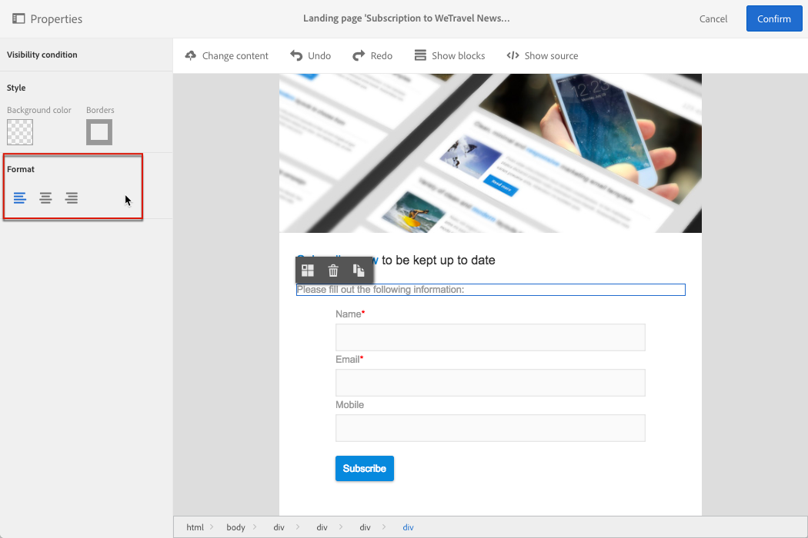

# Gestione della struttura e dello stile della pagina di destinazione{#managing-landing-page-structure-and-style}

## Gestione dei blocchi nell’editor dei contenuti {#managing-blocks-in-the-content-editor}

I diversi elementi di contenuto HTML vengono visualizzati nella pagina di destinazione come blocchi, corrispondenti al tag **&lt;div&gt;** **&lt;/div&gt;** .

Selezionare un blocco per interagire con esso. Sarà quindi circondata da una scatola blu.

Se è selezionato un blocco, gli oggetti principali dell'elemento HTML corrispondente verranno visualizzati in una breadcrumb situata nella parte inferiore della zona di modifica.

Quando il mouse passa sopra uno degli elementi di breadcrumb, l'elemento interessato viene evidenziato. È quindi possibile spostarsi facilmente tra i diversi blocchi e selezionare esattamente l'elemento HTML da modificare.

Utilizzare le opzioni della palette e della barra degli strumenti contestuale per modificare, eliminare o duplicare il blocco.

Per i blocchi contenenti testo, fare di nuovo clic nel blocco per attivare la modalità di modifica del testo. La cornice intorno al blocco diventa verde. Potete quindi selezionare o immettere del testo. Utilizzare le opzioni della palette e della barra degli strumenti contestuale per aggiungere un collegamento o modificare la formattazione del testo.

Parametri definiti per un elemento in un blocco (collegamenti, campi di personalizzazione, blocchi di contenuto, ecc.) può essere modificato in qualsiasi momento dalla palette.

## Aggiunta di un bordo e uno sfondo nell'editor contenuti {#adding-a-border-and-a-background-in-the-content-editor}

È inoltre possibile definire un colore **di** sfondo selezionando un colore dal grafico. Questo colore viene applicato al blocco selezionato.

È possibile aggiungere un **bordo** al blocco selezionato.

## Modifica dello stile del testo nell’editor del contenuto {#changing-the-text-style-in-the-content-editor}

Per modificare lo stile del testo, è necessario fare clic all'interno di un blocco di testo.

Per modificare l'allineamento del testo, selezionare una delle tre icone seguenti nella palette a sinistra:

* **Allinea a sinistra**: allinea il testo a sinistra del blocco selezionato (aggiunge stile="text-align: left;").
* **Centro**: centra il testo nel blocco selezionato (aggiunge stile="text-align: center;").
* **Allinea a destra**: allinea il testo a destra del blocco selezionato (aggiunge stile="text-align: right;").

È inoltre possibile utilizzare la barra degli strumenti per modificare gli attributi del font: adattare le dimensioni del font, rendere il testo in grassetto o corsivo, sottolineare o modificare il colore del testo. Fare riferimento a [questa sezione](../../channels/using/landing-page-content-editor-interface.md#landing-page-editor-toolbar).

## Inserimento di immagini in una pagina di destinazione {#inserting-images-in-a-landing-page}

1. Nel contenuto di una pagina di destinazione, selezionate un blocco contenente un’immagine.
1. Selezionare il **[!UICONTROL Insert]** pulsante.

   

1. Scegliere **[!UICONTROL Local image]** dalla barra degli strumenti contestuale.

   

1. Selezionare un file.

   

1. Regolate le proprietà dell’immagine in base alle esigenze.

   
