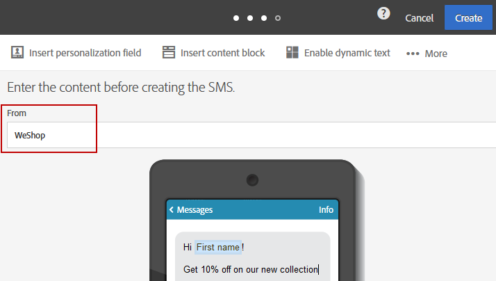

# Personalizzazione dei messaggi SMS{#personalizing-sms-messages}

I principi per la personalizzazione dei messaggi SMS sono gli stessi applicati alle [e-mail](../../designing/using/personalization.md#inserting-a-personalization-field). Devi tuttavia essere consapevole delle opzioni di traslitterazione, in quanto queste possono influenzare la codifica e quindi il numero di messaggi SMS da inviare. Per ulteriori informazioni, consulta la sezione [Traslitterazione e lunghezza degli SMS](../../administration/using/configuring-sms-channel.md#sms-encoding--length-and-transliteration).

Di seguito è riportato un messaggio SMS campione contenente campi di personalizzazione che, a seconda che sia stata selezionata o meno la traslitterazione, non genereranno lo stesso numero di invii:

**Ciao &lt; Nome > &lt; Cognome >, sono ora disponibili nuovi prodotti. Vieni a dare un’occhiata al negozio!**

* Per un destinatario denominato “John Smith”, poiché non contiene caratteri speciali, Adobe Campaign sceglierà la codifica GSM che consentirà di immettere fino a 160 caratteri per messaggio SMS. Il messaggio verrà pertanto inviato in una sola parte.
* Per un destinatario denominato “Raphaël Forêt”, i caratteri “ë” e “ê” non possono essere codificati in GSM. A seconda che la traslitterazione sia stata abilitata o meno, Adobe Campaign può selezionare due comportamenti:

   * Se la traslitterazione è autorizzata, “ë” e “ê” saranno sostituito da “e”, il che significa che la codifica GSM può essere utilizzata e quindi è possibile utilizzare fino a 160 caratteri nell’SMS. Questo messaggio verrà inviato come un singolo messaggio SMS, ma verrà leggermente modificato.
   * Se la traslitterazione non è autorizzata, Adobe Campaign sceglierà di inviare il messaggio in formato binario (Unicode): tutti i caratteri verranno quindi inviati come tali. Poiché i messaggi SMS in Unicode sono limitati a 70 caratteri, Adobe Campaign dovrà inviare il messaggio in due parti.

>[!NOTE]
>
>L’algoritmo che sceglie automaticamente la codifica migliore viene eseguito in modo indipendente per ogni messaggio, caso per caso. In questo modo, solo i messaggi personalizzati che richiedono la codifica Unicode verranno inviati in Unicode; tutti gli altri utilizzeranno la codifica GSM.

## Mittente dell’SMS {#sms-sender}

>[!IMPORTANT]
>
>Controlla le leggi vigenti nel tuo paese riguardo alla modifica dell’indirizzo del mittente. Dovresti anche verificare con il provider di servizi SMS se offre questa funzionalità.

L’opzione **[!UICONTROL From]** ti consente di personalizzare il nome del mittente del messaggio SMS utilizzando una stringa di caratteri. Questo è il nome visualizzato come mittente del messaggio SMS sul telefono cellulare del destinatario.

Se questo campo è vuoto, viene quindi utilizzato il numero di origine fornito nell’account esterno. Se non viene fornito alcun numero di origine, viene utilizzato il codice breve. L’account esterno specifico per la consegna SMS è presentato nella sezione [Definizione di un indirizzamento SMS](../../administration/using/configuring-sms-channel.md#defining-an-sms-routing).

