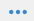

# Preparazione e invio di una notifica push{#preparing-and-sending-a-push-notification}

## Preparazione della notifica {#preparing-the-notification}

I passaggi per creare una notifica push con  Adobe Campaign sono:

1. Dalla finestra **[!UICONTROL Marketing activities]**, [creare una nuova attività di marketing](../../start/using/marketing-activities.md#creating-a-marketing-activity).

   È inoltre possibile creare una singola notifica push da una [campagna](../../start/using/marketing-activities.md#creating-a-marketing-activity) o dalla  pagina principale di Adobe Campaign .

   Potete anche utilizzare un&#39;attività di consegna delle notifiche push in un flusso di lavoro. Questa attività viene presentata nella sezione [Distribuzione delle notifiche push](../../automating/using/push-notification-delivery.md).

1. Seleziona **[!UICONTROL Push notification]**.
1. Selezionate un modello.

   

   Per impostazione predefinita, è possibile selezionare uno dei due modelli seguenti:

   * **[!UICONTROL Send push to Campaign profiles]**: utilizza questo modello per eseguire il targeting dei profili Adobe Campaign CRM  che si sono abbonati all&#39;applicazione mobile e hanno acconsentito alla ricezione di notifiche push. Potete inserire i campi [personalizzazione](../../designing/using/personalization.md#inserting-a-personalization-field) nella notifica push, ad esempio il nome del destinatario.
   * **[!UICONTROL Send push to app subscribers]**: utilizzate questo modello per inviare una notifica push a tutti gli utenti noti e anonimi di applicazioni mobili che hanno acconsentito alla ricezione di notifiche dall’applicazione. Puoi personalizzare questi messaggi con i dati raccolti dall’applicazione mobile.

   Potete anche selezionare modelli multilingue. Per ulteriori informazioni, consultate [Creazione di una notifica push multilingue](../../channels/using/creating-a-multilingual-push-notification.md).

   Per ulteriori informazioni sui modelli, consultare la sezione [Gestione dei modelli](../../start/using/marketing-activity-templates.md).

1. Immettete le proprietà di notifica push e selezionate la vostra app mobile nel campo **[!UICONTROL Associate a Mobile App to a delivery]**.

   L&#39;elenco a discesa mostrerà le applicazioni SDK V4 e  Experience Platform.

   

   Potete collegare la notifica push a una campagna. A questo scopo, selezionatela dalle campagne già create.

1. Nella schermata seguente, potete specificare un&#39;audience, ad esempio tutti i clienti VIP che hanno effettuato l&#39;iscrizione a una specifica applicazione mobile. Per ulteriori informazioni, vedere [Creazione di audience](../../audiences/using/creating-audiences.md).

   Il pubblico verrà filtrato automaticamente in base all&#39;applicazione mobile selezionata nel passaggio precedente.

   

1. Ora potete personalizzare la notifica push. Innanzitutto, scegliete lo stile del messaggio: **[!UICONTROL Alert/Message/Badge]** o **[!UICONTROL Silent push]**. I tipi di notifica push sono descritti nella sezione [Informazioni sulle notifiche push](../../channels/using/about-push-notifications.md).

   Modificate il contenuto della notifica push e definite le opzioni avanzate. Consultate [Personalizzazione di una notifica push](../../channels/using/customizing-a-push-notification.md).

   

   Il contenuto e le opzioni della notifica push configurate qui vengono passati all&#39;app mobile sotto forma di payload. La struttura dettagliata del payload è descritta nella nota tecnica [Informazioni sulla struttura del payload delle notifiche push Campaign Standard](https://docs.adobe.com/content/help/it-IT/campaign-standard/using/communication-channels/push-notifications/push-payload.html).

1. Fai clic su **[!UICONTROL Create]**.

   

1. Prima di inviare la notifica, potete testarla con i profili di test e quindi vedere esattamente cosa vedranno i destinatari prima di inviare la consegna. Selezionare **[!UICONTROL Audiences]** dal riepilogo delle consegne e fare clic sulla scheda **[!UICONTROL Test profiles]**.

   Per ulteriori informazioni sull&#39;invio di test, fare riferimento a [Profili di test](../../sending/using/sending-proofs.md).

1. Selezionate i profili di prova e fate clic su **[!UICONTROL Preview]** per visualizzare la notifica: il contenuto è personalizzato con i dati del profilo di test.
1. Controllate il layout della notifica push su diversi dispositivi: selezionate iPhone, telefono Android, iPad o tablet Android per visualizzare l&#39;anteprima del rendering.

   

1. La **[!UICONTROL Estimated Payload Size]** è una stima basata sui dati del profilo di prova. Le dimensioni effettive del payload possono variare. Il limite del messaggio è di 4 KB.

   >[!CAUTION]
   >
   >Se la dimensione del payload supera il limite di 4 KB, il messaggio non verrà recapitato.

I dati di personalizzazione influiscono sulle dimensioni del messaggio.

## Invio della notifica {#sending-the-notification}

Le notifiche push possono essere inviate a un&#39;audience selezionata in  Adobe Campaign definendo i criteri per l&#39;audience. Per l&#39;esempio seguente, il nostro pubblico selezionato è composto da 4 sottoscrittori di app mobili con targeting.

1. Fate clic su **[!UICONTROL Prepare]** per calcolare la destinazione e generare le notifiche.

   

1. Una volta completata la preparazione, la finestra **[!UICONTROL Deployment]** presenta i seguenti KPI: **[!UICONTROL Target]** e **[!UICONTROL To deliver]**. Tieni presente che il conteggio **[!UICONTROL To deliver]** è inferiore a quello di **[!UICONTROL Targeted]** a causa di esclusioni che possono essere visualizzate facendo clic sul pulsante  nella parte inferiore della finestra **[!UICONTROL Deployment]**.

   

1. Nella scheda **[!UICONTROL Exclusion logs]** è possibile trovare l&#39;elenco di tutti i messaggi esclusi dalla destinazione inviata e il motivo di tale esclusione.

   Qui, possiamo vedere che uno dei nostri abbonati alle app mobili è stato escluso perché l&#39;indirizzo era sul elenco Bloccati e gli altri abbonati perché il profilo era un duplicato.

   

1. Fare clic sulla scheda **[!UICONTROL Exclusion causes]** per visualizzare il volume dei messaggi esclusi.

   

1. Ora puoi fare clic su **[!UICONTROL Confirm]** per iniziare a inviare le notifiche push.
1. Controlla lo stato della consegna attraverso il dashboard messaggi e i registri. Per ulteriori informazioni, vedere [Invio di messaggi](../../sending/using/confirming-the-send.md) e [Registri di consegna](../../sending/using/monitoring-a-delivery.md#delivery-logs).

   In questo esempio, il dashboard dei messaggi mostra che  Adobe Campaign ha tentato di inviare due notifiche push: uno è stato consegnato correttamente al dispositivo e un altro non è riuscito. Per sapere perché la consegna presenta errori, fare clic sul pulsante  nella parte inferiore della finestra **[!UICONTROL Deployment]**.

   

1. Dalla finestra **[!UICONTROL Deployment]**, fate clic sulla scheda **[!UICONTROL Sending logs]** per accedere all&#39;elenco delle notifiche push inviate e ai relativi stati. Per questa consegna, una notifica push è stata inviata correttamente mentre l&#39;altra non è riuscita a causa di un token dispositivo non valido. Questo utente verrà aggiunto al elenco Bloccati da ulteriori consegne.

   >[!NOTE]
   >
   >I motivi possono essere qualsiasi errore a valle di  Adobe Campaign. In caso di guasti da parte di fornitori come apns e fcm, il motivo riflette anche questo. Per ulteriori informazioni sugli errori del fornitore, fare riferimento alla documentazione [Apple](https://developer.apple.com/library/content/documentation/NetworkingInternet/Conceptual/RemoteNotificationsPG/CommunicatingwithAPNs.html) e [Android](https://firebase.google.com/docs/cloud-messaging/http-server-ref).

   

Ora puoi misurare l&#39;impatto della consegna delle notifiche push con report dinamici.

**Argomenti correlati:**

* [Report notifiche push](../../reporting/using/push-notification-report.md)
* [Invio di una notifica push all’interno di un flusso di lavoro](../../automating/using/push-notification-delivery.md)
