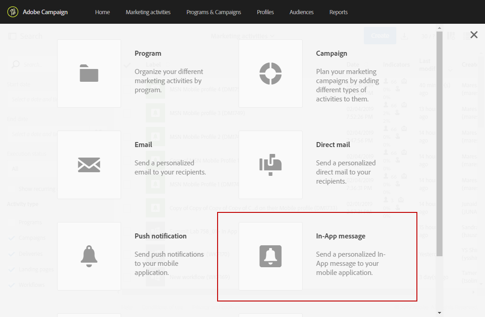
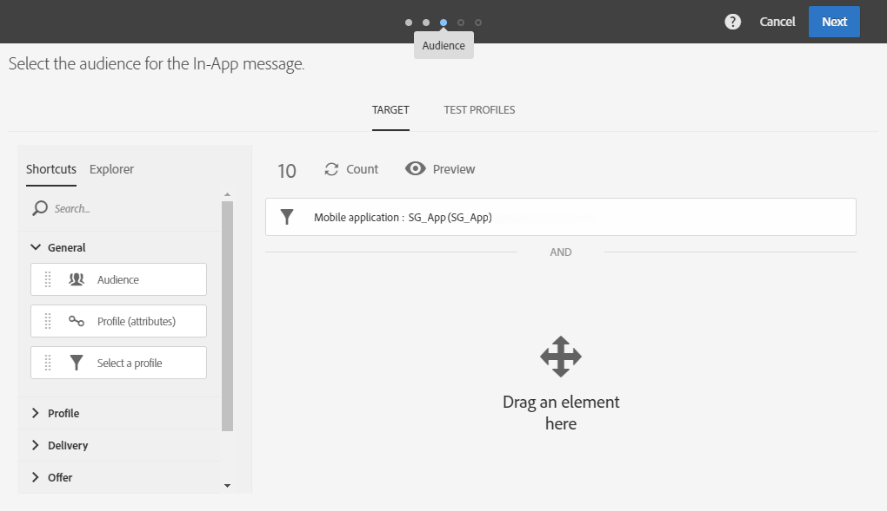
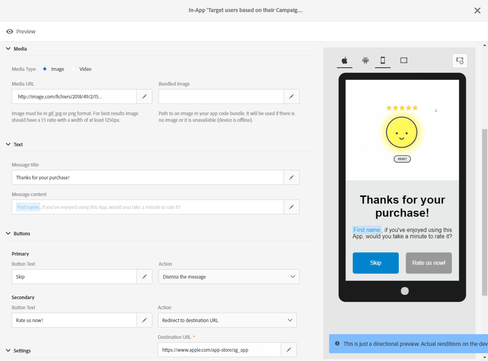

# Preparing and sending an In-App message{#preparing-and-sending-an-in-app-message}

>[!NOTE]
>
>La personalizzazione in-app si basa su un campo di collegamento, in genere un ID CRM e/o ID di accesso app mobile. Sei tenuto a proteggere questo campo di concatenamento quando utilizzato in relazione ad Adobe Campaign. Se non riesci a mantenere il campo di collegamento sicuro, il messaggio personalizzato potrebbe essere vulnerabile. Adobe non sarà responsabile dei danni derivanti da accessi non autorizzati o da utilizzare dati di profilo se non si seguono le procedure di composizione, gestione e protezione dei campi di collegamento protetti.

In Adobe Campaign sono disponibili tre tipi di messaggi in-app:

* **[!UICONTROL Target users based on their Campaign profile (inAppProfile)]**: Questo tipo di messaggio consente di eseguire il targeting dei profili di Adobe Campaign (profili CRM) che hanno effettuato la sottoscrizione all'applicazione mobile. Questo tipo di messaggio può essere personalizzato con tutti gli attributi di profilo disponibili in Adobe Campaign, ma richiede un handshake protetto tra i servizi di messaggistica in-app di Mobile SDK e Campaign per garantire che i messaggi con informazioni personali e sensibili vengano utilizzati solo dagli utenti autorizzati.

   Per scaricare questo tipo di messaggio sui dispositivi degli utenti, Mobile SDK deve inviare campi di collegamento utilizzati per collegare un profilo mobile a un profilo CRM in Adobe Campaign. For more information on SDK APIs required to support In-App, refer to this [page](https://aep-sdks.gitbook.io/docs/using-mobile-extensions/adobe-campaign-standard/adobe-campaign-standard-api-reference).

* **[!UICONTROL Target all users of a Mobile app (inAppBroadcast)]**: Questo tipo di messaggio consente di inviare messaggi a tutti gli utenti (attuali o futuri) della tua applicazione mobile anche se non dispongono di un profilo esistente in Adobe Campaign. La personalizzazione non è quindi possibile quando si personalizzano i messaggi in quanto il profilo utente potrebbe non esistere in Adobe Campaign.
* **[!UICONTROL Target users based on their Mobile profile (inApp)]**: Questo tipo di messaggio ti consente di rivolgerti a tutti gli utenti noti o anonimi di un'app mobile che dispone di un profilo mobile in Adobe Campaign. Questo tipo di messaggi può essere personalizzato utilizzando attributi non personali e non sensibili e non richiede handshake protetto tra l'SDK di Mobile e il servizio messaggistica in-app di Adobe Campaign.

   For more information on how to handle personal and sensitive data, refer to [Handling mobile profile fields with personal and sensitive data](../../channels/using/preparing-and-sending-an-in-app-message.md#handling-mobile-profile-fields-with-personal-and-sensitive-data).

## Handling mobile profile fields with personal and sensitive data {#handling-mobile-profile-fields-with-personal-and-sensitive-data}

In Adobe Campaign, mobile profile attributes data sent from mobile device are stored in **[!UICONTROL Subscriptions to an application (appSubscriptionRcp)]** resource which allows you to define the data that you want to collect from your applications' subscribers.

Questa risorsa deve essere estesa per raccogliere i dati che intendi inviare dal dispositivo mobile ad Adobe Campaign. To do so, refer to this [page](../../developing/using/extending-the-subscriptions-to-an-application-resource.md) for the detailed steps.

Per abilitare la personalizzazione dei messaggi in-app in modo più sicuro, i campi del profilo mobile da questa risorsa devono essere configurati di conseguenza. In your **[!UICONTROL Subscriptions to an application (appSubscriptionRcp)]**, when creating your new mobile profiles fields, check **[!UICONTROL Personal and Sensitive]** to make them unavailable during In-App messages personalization.

>[!NOTE]
>
>Se disponete di un'implementazione esistente con l'estensione delle risorse personalizzate su questa tabella, vi consigliamo di etichettare i campi in modo appropriato prima di utilizzarli per la personalizzazione dei messaggi in-app.

Once your **[!UICONTROL Subscriptions to an application]** custom resource is configured and published, you can start preparing your In-App delivery using the **[!UICONTROL Target users based on their Mobile profile (inApp)]** template. Only non-personal and non-sensitive fields will be available from **[!UICONTROL Subscriptions to an application (appSubscriptionRcp)]** resource for personalization.

If you require personalization with **Personal and Sensitive** fields, we recommend using the **[!UICONTROL Target users based on their Campaign profile (inAppProfile)]** template which has additional security mechanism to ensure that your users' PII data remains secure.

## Preparing your In-App message {#preparing-your-in-app-message}

I passaggi per creare un messaggio in-app standalone con Adobe Campaign sono:

1. From Adobe Campaign home page, click the **[!UICONTROL In-App messaging]** card.

   You can also create an In-App from the **Marketing activities** tab, by clicking the **[!UICONTROL Create]** button.

   Puoi anche creare un messaggio in-app da una campagna o dalla home page di Adobe Campaign o in un flusso di lavoro.

1. Select **In-App message**.

   

1. Seleziona un modello appropriato in base alle esigenze di targeting dell'audience.

   

   Per impostazione predefinita, potete selezionare uno dei tre modelli seguenti:

   * **[!UICONTROL Target users based on their Campaign CRM profile (inAppProfile)]**
   * **[!UICONTROL Target all users of a Mobile app (inAppBroadcast)]**
   * **[!UICONTROL Target users based on their Mobile profile (inApp)]**

1. Enter the In-App message properties and select your mobile app in the **[!UICONTROL Associate a Mobile App to a delivery]** field.

   

1. Selezionate l'audience da destinare al messaggio In-app. Il pubblico viene prefiltrato in base all'applicazione mobile associata a tale consegna.

   Note that this step is not needed with the **[!UICONTROL Broadcast an In-App message (inAppBroadcast)]** since it targets all users of a mobile application.

   

1. In the **[!UICONTROL Triggers]** tab, drag and drop the event that will trigger your message. Scegliendo un trigger, scegliete un'azione eseguita dagli utenti che causa la visualizzazione del messaggio In-app.

   Sono disponibili quattro categorie di eventi:

   * **[!UICONTROL Mobile Application events]**: Eventi personalizzati implementati nell'applicazione mobile.

      For more on events creations, refer to this [page](https://helpx.adobe.com/campaign/kb/configuring-app-sdk.html).

   * **[!UICONTROL Life Cycle events]**: Eventi del ciclo di vita forniti da Adobe Mobile SDK.

      For more on life cycle events, refer to this [page](https://marketing.adobe.com/resources/help/en_US/mobile/android/metrics.html).

   * **[!UICONTROL Analytics Events]**: Le tre categorie seguenti sono supportate in base a quanto è stato creato nell'app mobile: Adobe Analytics, dati contestuali o stato visualizzazione.

      Tenete presente che questi eventi sono disponibili solo se disponete di una licenza Adobe Analytics.

   * **[!UICONTROL Places]**: Le tre categorie seguenti sfruttano i dati sulla posizione in tempo reale per distribuire esperienze mobili rilevanti: Posiziona i dati contestuali, Inserisci i metadati personalizzati o Inserisci eventi.

      For more information on Adobe Places, refer to the [Places documentation](https://placesdocs.com/).
   

1. If you use an **[!UICONTROL Analytics Events]**, Adobe Analytics and View state events will be automatically populated based on the report suites configured in the Analytics extension in Adobe Experience Platform Launch whereas Context data events have to be manually added.

   Tenete presente che questi eventi sono disponibili solo se disponete di una licenza Adobe Analytics.

   

1. If you use a **[!UICONTROL Places]** trigger, Places context data, Places custom metadata or Places event type will be automatically populated based on all the Libraries and their Points of Interest created in Adobe Places.

   Tieni presente che il trigger verrà applicato solo al dispositivo per i punti di interesse dalle librerie selezionate nell'estensione Luoghi in Experience Platform Launch. For more information on the Places extension and how to install it, refer to this [documentation](https://aep-sdks.gitbook.io/docs/using-mobile-extensions/places-extension-1/places-extension).

1. In the **[!UICONTROL Frequency & duration]** tab, choose the frequency for your trigger, the start and end date, day of the week and time of the day when your In-App message will be active.

   

1. Modifica il contenuto del messaggio e definisci le opzioni avanzate. See [Customizing an In-App message](https://helpx.adobe.com/campaign/standard/channels/using/customizing-a-push-notification.html).

   

1. Click **[!UICONTROL Create]**.

Il messaggio in-app è pronto per essere inviato al pubblico di destinazione.

**Argomenti correlati:**

* [Personalizzazione di un messaggio in-app](../../channels/using/customizing-an-in-app-message.md)
* [Rapporto in-app](../../reporting/using/in-app-report.md)
* [Invio di un messaggio in-app all'interno di un flusso di lavoro](../../automating/using/in-app-delivery.md)

## Sending your In-App message {#sending-your-in-app-message}

Una volta completata la preparazione della consegna e i passaggi di approvazione, potete inviare il messaggio.

1. Click **[!UICONTROL Prepare]** to compute the target and generate the messages.

   

1. Una volta completata la preparazione, la finestra **Deployment** presenta i KPI seguenti: **Target** e **To deliver**.

   You can check the Deployment window by clicking the  button for potential exclusions or errors in your delivery.

   

1. Click **[!UICONTROL Confirm]** to start sending your In-App message.

   

1. Controllate lo stato della distribuzione tramite il dashboard messaggio e i registri. For more on this, refer to this [section](../../sending/using/monitoring-a-delivery.md).

   **[!UICONTROL Delivered]** e **[!UICONTROL Sent]** i conteggi kpis si basano su ciò che viene inviato correttamente dal servizio di consegna dei messaggi. Tenete presente che questi KPI non rappresentano un'indicazione del numero di dispositivi mobili che hanno ricevuto o scaricato il messaggio dal servizio di consegna dei messaggi.

   

1. Misura l'impatto dei messaggi in-app con i rapporti sulla distribuzione. For more on reporting, refer to [this section](../../reporting/using/in-app-report.md).

**Argomenti correlati:**

* [Rapporto in-app](../../reporting/using/in-app-report.md)
* [Invio di un messaggio in-app all'interno di un flusso di lavoro](../../automating/using/in-app-delivery.md)

