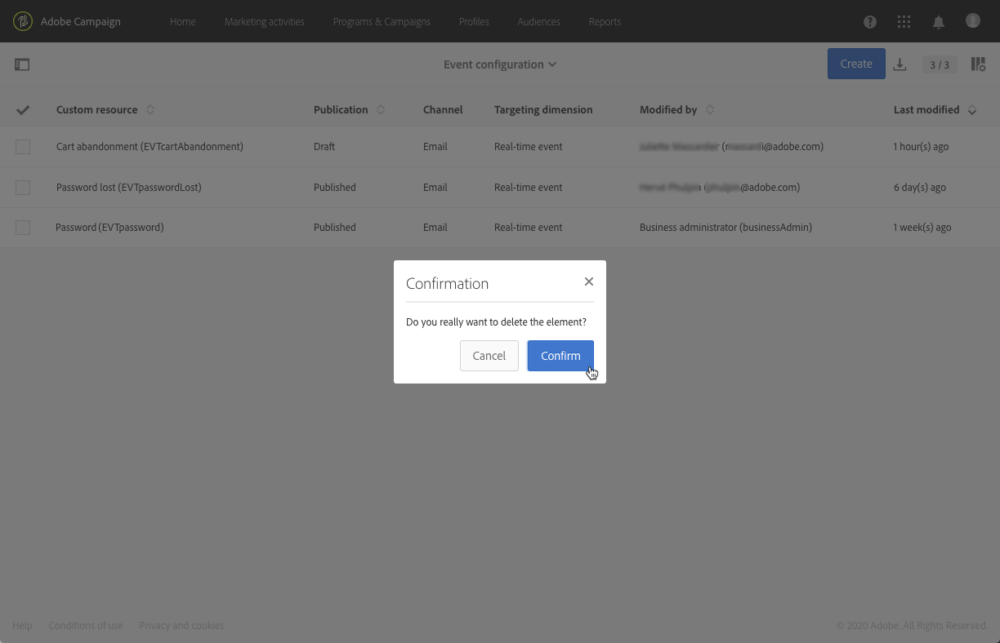

# Pubblicazione di un evento transazionale {#publishing-transactional-event}

Al termine della [configurazione](../../channels/using/configuring-transactional-event.md), l’evento è pronto per essere pubblicato. Di seguito sono descritti i passaggi per visualizzare in anteprima, pubblicare, annullare la pubblicazione ed eliminare un evento.

>[!IMPORTANT]
>
>Solo gli [amministratori funzionali](../../administration/using/users-management.md#functional-administrators) <!--being part of the **[!UICONTROL All]** [organizational unit](../../administration/using/organizational-units.md) -->dispongono dei diritti appropriati per pubblicare le configurazioni degli eventi.

Un grafico che illustra l’intero processo di pubblicazione dei messaggi transazionali, incluse le configurazioni degli eventi di pubblicazione e annullamento della pubblicazione, è disponibile in [questa sezione](../../channels/using/publishing-transactional-message.md).

Al termine della pubblicazione:
* Il messaggio transazionale corrispondente viene creato automaticamente. Consulta [Modifica dei messaggi transazionali](../../channels/using/editing-transactional-message.md).
* L’API che verrà utilizzata dallo sviluppatore del sito web viene distribuita e gli eventi transazionali possono ora essere inviati. Consulta [Integrare l&#39;attivazione dell&#39;evento](../../channels/using/getting-started-with-transactional-msg.md#integrate-event-trigger).

## Anteprima e pubblicazione di un evento {#previewing-and-publishing-the-event}

Prima di poter utilizzare l’evento, devi visualizzarlo in anteprima e pubblicarlo.

1. Fai clic sul pulsante **[!UICONTROL API preview]** per visualizzare una simulazione dell’API REST che verrà utilizzata dallo sviluppatore del sito web prima della pubblicazione.

   Una volta pubblicato l’evento, questo pulsante ti consente anche di visualizzare un’anteprima dell’API in produzione. Consulta [Integrare l&#39;attivazione dell&#39;evento](../../channels/using/getting-started-with-transactional-msg.md#integrate-event-trigger).

   

   >[!NOTE]
   >
   >L’API REST varia a seconda del canale selezionato e della dimensione di targeting selezionata. Per ulteriori dettagli sulle varie configurazioni, consulta [questa sezione](../../channels/using/configuring-transactional-event.md#transactional-event-specific-configurations).

1. Fai clic su **[!UICONTROL Publish]** per avviare la pubblicazione.

   

   L’API che verrà utilizzata dallo sviluppatore del sito web viene distribuita e gli eventi transazionali possono ora essere inviati.

1. Puoi visualizzare i registri di pubblicazione nella scheda corrispondente.

   

   >[!IMPORTANT]
   >
   >Ogni volta che modifichi l’evento, devi fare nuovamente clic su **[!UICONTROL Publish]** per generare l’API REST aggiornata che verrà utilizzata dallo sviluppatore del sito web.

   Una volta pubblicato l’evento, viene automaticamente creato un [messaggio transazionale](../../channels/using/editing-transactional-message.md) collegato al nuovo evento.

1. Puoi accedere direttamente a questo messaggio sulle transazioni tramite il collegamento situato nell’area a sinistra.

   

   >[!NOTE]
   >
   >Affinché l’evento attivi l’invio di un messaggio sulle transazioni, devi modificare e pubblicare il messaggio appena creato. Consulta le sezioni [Modifica](../../channels/using/editing-transactional-message.md) e [Pubblicazione di un messaggio transazionale](../../channels/using/publishing-transactional-message.md) . Devi anche [integrare questo evento trigger](../../channels/using/getting-started-with-transactional-msg.md#integrate-event-trigger) nel tuo sito web.

1. Una volta che Adobe Campaign inizia a ricevere gli eventi relativi a questa configurazione dell’evento, puoi fare clic sul collegamento **[!UICONTROL Latest transactional events]** nella sezione **[!UICONTROL History]** per accedere agli eventi più recenti inviati dal servizio di terze parti ed elaborati da Adobe Campaign.

Gli eventi (in formato JSON) sono elencati dal più recente al meno recente. Questo elenco consente di controllare i dati, ad esempio il contenuto o lo stato di un evento, a scopo di controllo e debug.

## Annullamento della pubblicazione di un evento {#unpublishing-an-event}

Il pulsante **[!UICONTROL Unpublish]** consente di annullare la pubblicazione dell’evento, che elimina dall’API REST la risorsa corrispondente all’evento creato in precedenza.

Adesso, anche se l’evento viene attivato nel sito web, i messaggi corrispondenti non saranno più inviati e pertanto non verranno memorizzati nel database.

>[!NOTE]
>
>Se hai già pubblicato il messaggio transazionale corrispondente, anche la pubblicazione del messaggio transazionale viene annullata. Consulta [Annullamento della pubblicazione di un messaggio sulle transazioni](../../channels/using/publishing-transactional-message.md#unpublishing-a-transactional-message).

Fai clic sul pulsante **[!UICONTROL Publish]** per generare una nuova API REST.

<!--## Transactional messaging publication process {#transactional-messaging-pub-process}

The chart below illustrates the transactional messaging publication process.

For more on publishing, pausing and unpublishing a transactional message, see [this section](../../channels/using/publishing-transactional-message.md).-->

## Eliminazione di un evento {#deleting-an-event}

Una volta che un evento è stato annullato o se non è ancora stato pubblicato, puoi eliminarlo dall’elenco di configurazione dell’evento. Per eseguire questa operazione:

1. Fai clic sul logo **Adobe** nell&#39;angolo in alto a sinistra, quindi seleziona **[!UICONTROL Marketing plans]** > **[!UICONTROL Transactional messages]** > **[!UICONTROL Event configuration]**.
1. Passa il puntatore del mouse sulla configurazione dell’evento desiderata e seleziona il pulsante **[!UICONTROL Delete element]** .

   

   >[!NOTE]
   >
   >Assicurati che la configurazione dell’evento abbia lo stato **[!UICONTROL Draft]** , altrimenti non potrai eliminarlo. Lo stato **[!UICONTROL Draft]** si applica a un evento non ancora pubblicato o che è stato [non pubblicato](#unpublishing-an-event).

1. Fai clic sul pulsante **[!UICONTROL Confirm]**.

   

>[!IMPORTANT]
>
>L’eliminazione di una configurazione di evento pubblicata e già utilizzata comporta anche l’eliminazione dei messaggi transazionali corrispondenti e dei relativi registri di invio e tracciamento.
