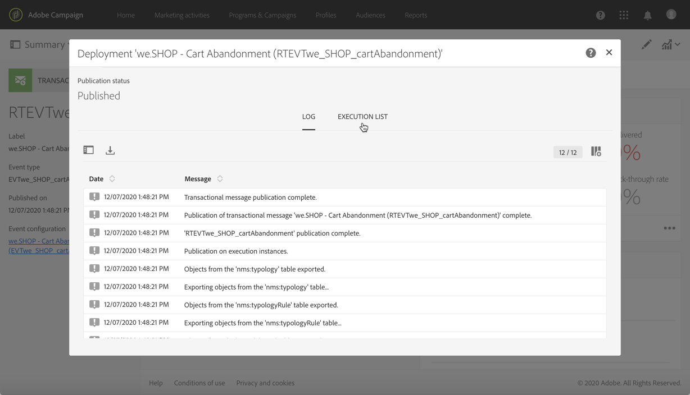

# Ciclo di vita dei messaggi transazionali {#publishing-transactional-message}

Quando il [messaggio transazionale](../../channels/using/editing-transactional-message.md) è pronto per essere inviato, può essere pubblicato.

Di seguito sono descritti i passaggi per pubblicare, mettere in pausa, annullare la pubblicazione ed eliminare un messaggio sulle transazioni.

>[!IMPORTANT]
>
>Solo gli utenti con il ruolo [Amministrazione](../../administration/using/users-management.md#functional-administrators) possono accedere e pubblicare messaggi transazionali.

## Processo di pubblicazione della messaggistica transazionale {#transactional-messaging-pub-process}

Il grafico seguente illustra il processo complessivo di pubblicazione della messaggistica transazionale.

**Argomenti correlati:**
* [Pubblicazione di un messaggio sulle transazioni](#publishing-a-transactional-message)
* [Sospensione di un messaggio sulle transazioni](#suspending-a-transactional-message-publication)
* [Annullamento della pubblicazione di un messaggio sulle transazioni](#unpublishing-a-transactional-message)
* [Pubblicazione di un evento](../../channels/using/publishing-transactional-event.md)

<!--## Testing a transactional message {#testing-a-transactional-message}

You first need to create a specific test profile that will allow you to properly check the transactional message.

### Defining a specific test profile {#defining-specific-test-profile}

Define a test profile that will be linked to your event, which will allow you to preview your message and send a relevant proof.

1. From the transactional message dashboard, click the **[!UICONTROL Create test profile]** button.

   

1. Specify the information to send in JSON format in the **[!UICONTROL Event data used for personalization]** section. This is the content that will be used when previewing the message and when the test profile receives the proof.

   

   >[!NOTE]
   >
   >You can also enter the information relating to the profile table. See [Enriching the event](../../channels/using/configuring-transactional-event.md#enriching-the-transactional-message-content) and [Personalizing a transactional message](../../channels/using/editing-transactional-message.md#personalizing-a-transactional-message).

1. Once created, the test profile will be pre-specified in the transactional message. Click the **[!UICONTROL Test profiles]** block of the message to check the target of your proof.

   

You can also create a new test profile or use one that already exists in the **[!UICONTROL Test profiles]** menu. To do this:

1. Click the **Adobe** logo, in the top left corner, then select **[!UICONTROL Profiles & audiences]** > **[!UICONTROL Test profiles]**.
1. In the **[!UICONTROL Event]** section, select the event that you have just created. In this example, select "Cart abandonment (EVTcartAbandonment)".
1. Specify the information to send in JSON format in the **[!UICONTROL Event data]** text box.

   

1. Save your changes.
1. Access the message that you created and select the updated test profile.

**Related topics:**

* [Managing test profiles](../../audiences/using/managing-test-profiles.md)
* [Creating audiences](../../audiences/using/creating-audiences.md)

### Sending the proof {#sending-proof}

Once you have created one or more specific test profiles and saved your transactional message, you can send a proof to test it.

The steps for sending a proof are detailed in the [Sending proofs](../../sending/using/sending-proofs.md) section.-->

## Pubblicazione di un messaggio sulle transazioni {#publishing-a-transactional-message}

Dopo aver modificato e verificato il messaggio sulle transazioni, puoi pubblicarlo. Fai clic sul pulsante **[!UICONTROL Publish]** .

Ora, non appena si attiva l’evento &quot;Abbandono carrello&quot;, viene visualizzato automaticamente un messaggio contenente il titolo e il cognome del destinatario, l’URL del carrello, l’ultimo prodotto visionato o un elenco di prodotti, se definito, e l’importo totale del carrello da inviare.

Per accedere ai rapporti relativi al messaggio sulle transazioni, usa il pulsante **[!UICONTROL Reports]**. Consulta [Rapporti dinamici](../../reporting/using/about-dynamic-reports.md).

**Argomenti correlati**:
* [Modifica di un messaggio transazionale](../../channels/using/editing-transactional-message.md)
* [Verifica di un messaggio transazionale](../../channels/using/testing-transactional-message.md)
* [Integrare l’attivazione dell’evento](../../channels/using/getting-started-with-transactional-msg.md#integrate-event-trigger)

## Sospensione di una pubblicazione di un messaggio sulle transazioni {#suspending-a-transactional-message-publication}

Puoi sospendere la pubblicazione del messaggio sulle transazioni utilizzando, ad esempio, il pulsante **[!UICONTROL Pause]** per la modifica dei dati contenuti nel messaggio. Pertanto, gli eventi non vengono più elaborati, ma rimangono in coda nel database di Adobe Campaign.

Gli eventi in coda vengono conservati durante un periodo di tempo definito nell’API REST (consulta la [documentazione REST API](../../api/using/managing-transactional-messages.md)) o nell’evento trigger, se utilizzi il servizio core Triggers (consulta [Informazioni su Adobe Experience Cloud Triggers](../../integrating/using/about-adobe-experience-cloud-triggers.md)).

Durante la selezione di **[!UICONTROL Resume]**, vengono elaborati tutti gli eventi in coda, purché non siano scaduti. Adesso tali eventi contengono tutte le modifiche apportate durante la sospensione della pubblicazione del modello.

## Annullamento della pubblicazione di un messaggio sulle transazioni {#unpublishing-a-transactional-message}

Facendo clic su **[!UICONTROL Unpublish]** puoi annullare la pubblicazione dei messaggi sulle transazioni, ma anche la pubblicazione dell’evento corrispondente, che elimina dall’API REST la risorsa corrispondente all’evento creato in precedenza.

Adesso, anche se l’evento viene attivato nel sito web, i messaggi corrispondenti non saranno più inviati e pertanto non verranno memorizzati nel database.

>[!NOTE]
>
>Per pubblicare nuovamente il messaggio, devi tornare alla configurazione dell&#39;evento corrispondente, [pubblicare l&#39;evento](../../channels/using/publishing-transactional-event.md), quindi [pubblicare il messaggio](#publishing-a-transactional-message).

Se annulli la pubblicazione di un messaggio sulle transazioni in sospensione, potresti dover attendere fino a 24 ore prima di poterlo pubblicare nuovamente. In questo modo, il flusso di lavoro **[!UICONTROL Database cleanup]** eliminerà tutti gli eventi inviati alla coda.

La procedura per la sospensione di un messaggio è spiegata nei dettagli nella sezione [Sospensione della pubblicazione di un messaggio sulle transazioni](#suspending-a-transactional-message-publication).

Il flusso di lavoro **[!UICONTROL Database cleanup]**, che viene eseguito ogni giorno alle 4.00, è accessibile tramite **[!UICONTROL Administration]** > **[!UICONTROL Application settings]** > **[!UICONTROL Workflows]**.

## Eliminazione di un messaggio sulle transazioni {#deleting-a-transactional-message}

Dopo aver annullato la pubblicazione di un messaggio sulle transazioni o se tale messaggio non è ancora stato pubblicato, puoi eseguirne l’eliminazione dall’elenco dei messaggi sulle transazioni. Per eseguire questa operazione:

1. Fai clic sul logo **Adobe** nell&#39;angolo in alto a sinistra, quindi seleziona **[!UICONTROL Marketing plans]** > **[!UICONTROL Transactional messages]** > **[!UICONTROL Transactional messages]**.
1. Passa il mouse sopra il messaggio desiderato.
1. Fai clic sul pulsante **[!UICONTROL Delete element]**.

Tuttavia, l’eliminazione di un messaggio sulle transazioni può essere eseguita solo in presenza di determinate condizioni:

* Assicurati che il messaggio sulle transazioni presenti lo stato **[!UICONTROL Draft]**, altrimenti non potrai eliminarlo. Lo stato **[!UICONTROL Draft]** si applica a un messaggio che non è ancora stato pubblicato o che è stato [annullato](#unpublishing-a-transactional-message) (e non è stato [sospeso](#suspending-a-transactional-message-publication)).

* **Messaggi sulle transazioni**: a meno che un altro messaggio sulle transazioni non sia collegato all’evento corrispondente, se il messaggio sulle transazioni non viene pubblicato, anche la configurazione dell’evento deve essere annullata onde consentire una corretta eliminazione del messaggio sulle transazioni. Per ulteriori informazioni, consulta [Annullamento della pubblicazione di un evento](../../channels/using/publishing-transactional-event.md#unpublishing-an-event).

   >[!IMPORTANT]
   >
   >Se elimini un messaggio sulle transazioni che ha già inviato delle notifiche, verranno cancellati anche i registri di invio e di tracciamento.

* **Messaggi sulle transazioni da un modello di evento predefinito (messaggi sulle transazioni interni)**: se un messaggio sulle transazioni interno è l’unico associato all’evento corrispondente, non è possibile eseguirne l’eliminazione. Devi innanzitutto creare un altro messaggio sulle transazioni effettuandone la duplicazione o utilizzando il menu **[!UICONTROL Resources]** > **[!UICONTROL Templates]** > **[!UICONTROL Transactional message templates]** .

<!--## Monitoring transactional message delivery {#monitoring-transactional-message-delivery}

Once the message is published and your site integration is done, you can monitor the delivery.

To monitor transactional messaging, you need to access **execution deliveries**. An execution delivery is a non-actionable and non-functional technical message created once a month for each transactional message, and each time a transactional message is edited and published again.

1. To view the message delivery log, click the icon at the bottom right of the **[!UICONTROL Deployment]** block.

   

1. Click the **[!UICONTROL Execution list]** tab.

   

1. Select the execution delivery of your choice.

   

1. Click again the icon at the bottom right of the **[!UICONTROL Deployment]** block.

   

   For each execution delivery, you can consult the delivery logs as you would do for a standard delivery. For more on accessing and using the logs, see [Monitoring a delivery](../../sending/using/monitoring-a-delivery.md).

**Related topics**:
* [Publishing a transactional message](#publishing-a-transactional-message)
* [Integrate the event triggering](../../channels/using/getting-started-with-transactional-msg.md#integrate-event-trigger)

### Profile-based transactional message specificities {#profile-transactional-message-monitoring}

For profile-based transactional messages, you can monitor the following profile information.

Select the **[!UICONTROL Sending logs]** tab. In the **[!UICONTROL Status]** column, **[!UICONTROL Sent]** indicates that a profile has opted in.

Select the **[!UICONTROL Exclusions logs]** tab to view recipients who have been excluded from the message target, such as addresses on denylist.

For any profile that has opted out, the **[!UICONTROL Address on denylist]** typology rule excluded the corresponding recipient.

This rule is part of a specific typology that applies to all transactional messages based on the **[!UICONTROL Profile]** table.

**Related topics**:

* [About typologies and typology rules](../../sending/using/about-typology-rules.md)
* [Monitoring a delivery](../../sending/using/monitoring-a-delivery.md)

## Transactional message retry process {#transactional-message-retry-process}

A temporarily undelivered transactional message is subject to automatic retries that are performed until the delivery expires. For more on the delivery duration, see [Validity period parameters](../../administration/using/configuring-email-channel.md#validity-period-parameters).

When a transactional message fails to be sent, there are two retry systems:

* At the transactional messaging level, a transactional message can fail before the event is assigned to an execution delivery, meaning between the event reception and the delivery preparation. See [Event processing retry process](#event-processing-retry-process).
* At the sending process level, once the event has been assigned to an execution delivery, the transactional message can fail due to a temporary error. See [Message sending retry process](#message-sending-retry-process).

The definition of **execution delivery** can be found in the [Monitoring transactional message delivery](#monitoring-transactional-message-delivery) section.

### Event processing retry process {#event-processing-retry-process}

When an event is triggered, it is assigned to an execution delivery.

If the event cannot be assigned to an execution delivery, the event processing is postponed. Retries are then performed until it is assigned to a new execution delivery.

>[!NOTE]
>
>A postponed event does not appear in the transactional message sending logs, because it is not assigned to an execution delivery yet.

For example, the event could not be assigned to an execution delivery because its content was not correct, there was an issue with access rights or branding, an error was detected on applying typology rules, etc. In this case, you can pause the message, edit it to fix the problem and publish it again. The retry system will then assign it to a new execution delivery.

### Message sending retry process {#message-sending-retry-process}

Once the event has been assigned to an execution delivery, the transactional message can fail due to a temporary error, if the recipient's mailbox is full for example. For more on this, see [Retries after a delivery temporary failure](../../sending/using/understanding-delivery-failures.md#retries-after-a-delivery-temporary-failure).

>[!NOTE]
>
>When an event is assigned to an execution delivery, it appears in the sending logs of this execution delivery, and only at this time. The failed deliveries are displayed in the **[!UICONTROL Execution list]** tab of the transactional message sending logs.

### Retry process limitations {#limitations}

**Sending logs update**

In the retry process, the sending logs of the new execution delivery are not immediately updated (the update is performed through a scheduled workflow). It means that the message could be in **[!UICONTROL Pending]** status even if the transactional event has been processed by the new execution delivery.

**Failed execution delivery**

You cannot stop an execution delivery. However, if the current execution delivery fails, a new one is created as soon as a new event is received, and all new events are processed by this new execution delivery. No new events are processed by the failed execution delivery.

If some events already assigned to an execution delivery have been postponed as part of the retry process and if that execution delivery fails, the retry system does not assign the postponed events to the new execution delivery, which means that these events are lost. Check the [delivery logs](#monitoring-transactional-message-delivery) to see the recipients that may have been impacted.-->
