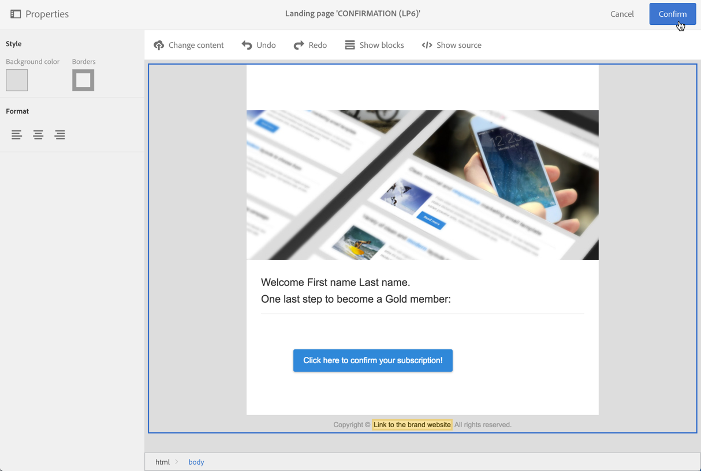

# Setting up a double opt-in process{#setting-up-a-double-opt-in-process}

## About double opt-in {#about-double-opt-in}

Il duplice meccanismo di consenso è una procedura consigliata per l'invio di e-mail. Protegge la piattaforma da indirizzi e-mail errati o non validi, oltre a possibili reclami di spam.

Il principio consiste nell'inviare un messaggio e-mail per confermare il contratto del visitatore prima di memorizzarlo come «profili» nel database campagna: il visitatore compila una pagina di destinazione online, quindi riceve un messaggio e-mail e deve fare clic sul collegamento di conferma per finalizzarne l'iscrizione.

Per impostare questa impostazione, è necessario:

1. Create e pubblicate una pagina di destinazione in modo che i visitatori possano registrarsi e iscriversi. Questa pagina di destinazione sarà disponibile da un sito Web. Visitors who fill in and submit this landing page will be stored in the database but ‘blacklisted', in order not to receive any communication before the final validation (see [Managing blacklisting in Campaign](../../audiences/using/about-opt-in-and-opt-out-in-campaign.md)).
1. Create e inviate automaticamente l'e-mail di consenso, con un collegamento di conferma. Questo messaggio e-mail farà riferimento alla popolazione che ha inviato la pagina di destinazione. Si basa su un modello e-mail che consente di eseguire il targeting dei profili di rinuncia.
1. Reindirizza a una pagina di destinazione di conferma. Questa pagina di destinazione finale propone un pulsante di conferma: i visitatori devono fare clic su di esso. È possibile creare un messaggio e-mail di benvenuto da inviare come conferma e, ad esempio, aggiungere un'offerta speciale nell'e-mail per i nuovi destinatari.

Questi passaggi devono essere impostati in Adobe Campaign in un ordine specifico affinché tutti i parametri siano abilitati correttamente.

## Step 1: Create the confirmation landing page {#step-1--create-the-confirmation-landing-page}

Il processo di configurazione del doppio meccanismo di scelta inizia con la creazione della pagina di destinazione di conferma: Questa pagina verrà visualizzata quando i visitatori facevano clic sull'e-mail di conferma per registrarsi.

Per creare e configurare questa pagina di destinazione, devi:

1. Design a [new landing page](../../channels/using/about-landing-pages.md) based on the **[!UICONTROL Profile acquisition (acquisition)]** template. Enter the label '**CONFIRMATION**'.

   If you need to use [services](../../audiences/using/about-subscriptions.md), you can also use the **[!UICONTROL Subscription (sub)]** template.

1. Edit the landing page properties and under the **[!UICONTROL Access and loading]** section, unselect the option **[!UICONTROL Authorize unidentified visitors]**, select **[!UICONTROL Preload visitor data]** (this one is not mandatory).

   

1. In the **[!UICONTROL Job]** &gt; **[!UICONTROL Additional data]** section, click **[!UICONTROL Add an element]** and enter the following context path:

   /context/profile/blackList

   Set the value to **false** and click **[!UICONTROL Add]**.

   

   Questo contesto rimuove il campo blacklist per poter inviare e-mail. We will see later that the first landing page was setting this field to **true** before confirmation, to prevent from sending emails to non-confirmed profiles. For more on this, see [Step 3: Create the acquisition landing page](../../channels/using/setting-up-a-double-opt-in-process.md#step-3--create-the-acquisition-landing-page).

1. Personalizzate il contenuto della pagina di destinazione: puoi visualizzare dati personalizzati e cambiare l'etichetta del pulsante di conferma in "Click here to confirm my subscription" (Fare clic qui per confermare l'iscrizione).

   

1. Adattare il contenuto della pagina di conferma per informare i sottoscrittori che sono state registrate.

   

1. [Verificate e pubblicate](../../channels/using/sharing-a-landing-page.md) la pagina di destinazione.

## Step 2: Create the confirmation email {#step-2--create-the-confirmation-email}

Una volta creata la pagina di destinazione di conferma, potete progettare l'e-mail di conferma: questo messaggio e-mail verrà inviato automaticamente a ogni visitatore che convalida la pagina di destinazione di acquisizione. Questa convalida viene considerata un evento e l'e-mail è un messaggio transazionale, collegato a una specifica regola di tipologia che consente di abilitare le popolazioni di rinuncia.

I passaggi per la creazione di questi elementi sono descritti di seguito. Prima di creare la pagina di destinazione di acquisizione stessa, devi fare riferimento a questo modello e-mail.

### Create the event {#create-the-event}

The confirmation email is a [transactional message](../../channels/using/about-transactional-messaging.md) as it reacts to an event: the validation of the form. Occorre innanzitutto creare l'evento, quindi creare il modello del messaggio transazionale.

1. Create an event, from the **[!UICONTROL Marketing plans]** &gt; **[!UICONTROL Transactional messages]** &gt; **[!UICONTROL Event configuration]** menu, accessible from the Adobe Campaign logo, and enter the label '**CONFIRM**'.
1. Select the **[!UICONTROL Profile]** targeting dimension and click **[!UICONTROL Create]**.

   

1. In the **[!UICONTROL Fields]** section, click **[!UICONTROL Create element]** and add the **[!UICONTROL email]** in the data structure to enable reconciliation.
1. In the **[!UICONTROL Enrichment]** section, click **[!UICONTROL Create element]** and select the target resource **[!UICONTROL Profile]**. You can then map on the **[!UICONTROL email]** in the **[!UICONTROL Join definition]** section, or any other composite reconciliation key, depending on your needs.

   

   If you need to use services, you can also add the **[!UICONTROL serviceName]**.

1. Select **[!UICONTROL Profile]** as the **[!UICONTROL Targeting enrichment]** in the dropdown list.
1. Click **[!UICONTROL Publish]** to publish the event.

L'evento è pronto. Ora potete progettare il modello e-mail. This template must include a link to the **CONFIRMATION** landing page created before. For more on this, see [Design the confirmation message](../../channels/using/setting-up-a-double-opt-in-process.md#design-the-confirmation-message).

### Create the typology rule {#create-the-typology-rule}

You need to create a specific [typology rule](../../administration/using/about-typology-rules.md), by duplicating an out-of-box one. Questa regola consente di inviare messaggi a profili che non hanno ancora confermato il loro contratto e che sono ancora in lista nera. Per impostazione predefinita, le regole di digitazione escludono i profili di rinuncia (ovvero in blacklist). Per creare questa regola di tipo tipologia, effettuate le seguenti operazioni:

1. From the Adobe Campaign logo, select **[!UICONTROL Administration]** &gt; **[!UICONTROL Channels]** &gt; **[!UICONTROL Typologies]** and click **[!UICONTROL Typologies]**.
1. Duplicate the out-of-box typology **[!UICONTROL Transactional message on profile (mcTypologyProfile)]**.
1. Once duplication confirmed, edit the new typology and enter the label **TYPOLOGY_PROFILE**.
1. Remove the **blacklisted address** rule.
1. Click **[!UICONTROL Save]**.

Questa tipologia può essere associata all'e-mail di conferma.

### Design the confirmation message {#design-the-confirmation-message}

L'e-mail di conferma è un messaggio transazionale in base all'evento creato. Per creare il messaggio, effettuate le seguenti operazioni:

1. From the Adobe Campaign logo, select **[!UICONTROL Marketing plans]** &gt; **[!UICONTROL Transactional messages]** and click **[!UICONTROL Transactional messages]**.
1. Edit the **CONFIRM** email template and personalize it. Potete caricare un contenuto esistente o utilizzare un modello esistente.
1. Add a link to the **CONFIRMATION** landing page, and click **[!UICONTROL Confirm]** to save modifications.

   

1. Modificate le proprietà del modello e-mail. In the **[!UICONTROL Advanced parameters]** &gt; **[!UICONTROL Preparation]** section, select the **TYPOLOGY_PROFILE** typology created before.
1. Salvate e pubblicate il messaggio transazionale.

## Step 3: Create the acquisition landing page {#step-3--create-the-acquisition-landing-page}

Devi creare la pagina iniziale di acquisizione iniziale: this op-in form will be published on your website.

Per creare e configurare questa pagina di destinazione, devi:

1. Design a [new landing page](../../channels/using/about-landing-pages.md) based on the **[!UICONTROL Profile acquisition (acquisition)]** template. Enter the label '**ACQUISITION**'.
1. Edit the landing page properties: in the **[!UICONTROL Job]** &gt; **[!UICONTROL Additional data]** section, click **[!UICONTROL Add an element]** and enter the following context path:

   /context/profile/blackList

   and set the value to **true**.

   Questo è obbligatorio per forzare la blacklist ed evitare di inviare messaggi ai visitatori che non hanno confermato il loro contratto. The validation of the CONFIRMATION landing page will set this field to **false** after confirmation. For more on this, see [Step 1: Create the confirmation landing page](../../channels/using/setting-up-a-double-opt-in-process.md#step-1--create-the-confirmation-landing-page).

1. In the **[!UICONTROL Job]** &gt; **[!UICONTROL Specific actions]** section, select the option **[!UICONTROL Start sending messages]**.
1. In the associated drop-down list, choose the **CONFIRM** transactional message template you created.

   

1. Personalizza il contenuto della pagina di destinazione, a seconda del marchio e dei dati da acquisire. You can display personalized data and change the label of the confirmation button to **Confirm my subscription** for example.

   

1. Personalizzate la pagina di conferma per informare il nuovo utente iscritto che deve convalidare l'iscrizione.

   

1. [Verificate e pubblicate](../../channels/using/sharing-a-landing-page.md) la pagina di destinazione.

È stato configurato il meccanismo di consenso doppio. You can run and test the procedure from end to end, starting from the public URL of this **[!UICONTROL ACQUISITION]** landing page. Questo URL viene visualizzato nella dashboard della pagina di destinazione.
