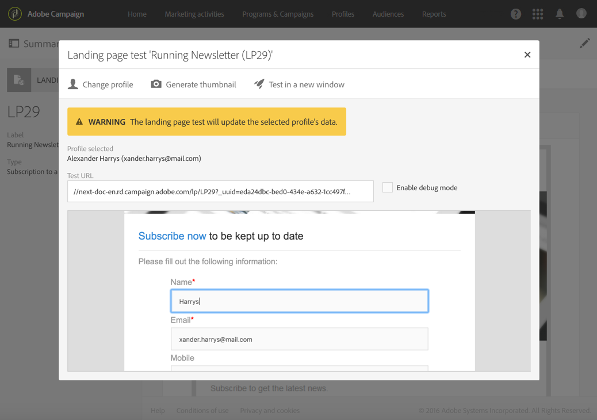

# Sharing a landing page{#sharing-a-landing-page}

## About landing page publication {#about-landing-page-publication}

Prima di pubblicare una pagina di destinazione, è necessario eseguire i test: convalidare l'esecuzione, configurare l'accesso e impostare la fine della pagina di destinazione. Questi passaggi sono prerequisiti e devono essere eseguiti con cautela.

## Testing the landing page {#testing-the-landing-page-}

Poiché la pagina di destinazione inciderà sulla piattaforma e i dati, è necessario testarne attentamente l'esecuzione. A tal fine:

1. Click the **[!UICONTROL Test]** button in the action bar of the landing page.
1. Dalla schermata di prova, selezionate un profilo di prova e un servizio di prova se la pagina di destinazione deve gestire le iscrizioni.

   

1. Immettete i dati nei campi e selezionate le opzioni.
1. Inviate la pagina di destinazione e verificate gli aggiornamenti nel database.

   >[!CAUTION]
   >
   >Quando il modulo viene inviato, il servizio e il profilo utilizzati vengono aggiornati.

1. Ripetete questa procedura con vari profili e dati.

   Potete anche generare la miniatura della pagina di destinazione da questa schermata.

## Setting up validity parameters {#setting-up-validity-parameters}

Prima di pubblicare, per motivi di sicurezza e prestazioni della piattaforma, consigliamo vivamente di impostare una data di scadenza nelle proprietà della pagina di destinazione. Nella data selezionata, la pagina di destinazione viene automaticamente annullata. A tal fine:

1. Edit the landing page properties accessed via the  button in the landing page dashboard.

   

1. Set up expiration date and time in the **[!UICONTROL Publication]** section: the landing page will automatically be unpublished on the specified date and therefore no longer be available.

   Potete selezionare il fuso orario da considerare per la data e l'ora indicate.

1. Definite un URL di reindirizzamento per reindirizzare i visitatori verso una pagina di destinazione non attiva.

   

>[!CAUTION]
>
>Potete inoltre definire una data e un'ora di distribuzione: la pagina di destinazione verrà pubblicata automaticamente nella data specificata.

## Publishing a landing page {#publishing-a-landing-page}

Quando pubblicate una pagina di destinazione, questa diventa attiva e accessibile dai visitatori.

You can unpublish or update and republish your landing page at any time, via the **[!UICONTROL Publish]** button. Tuttavia, se la pubblicazione non riesce e non avete ancora pubblicato la pagina di destinazione, la prima versione resterà online.
