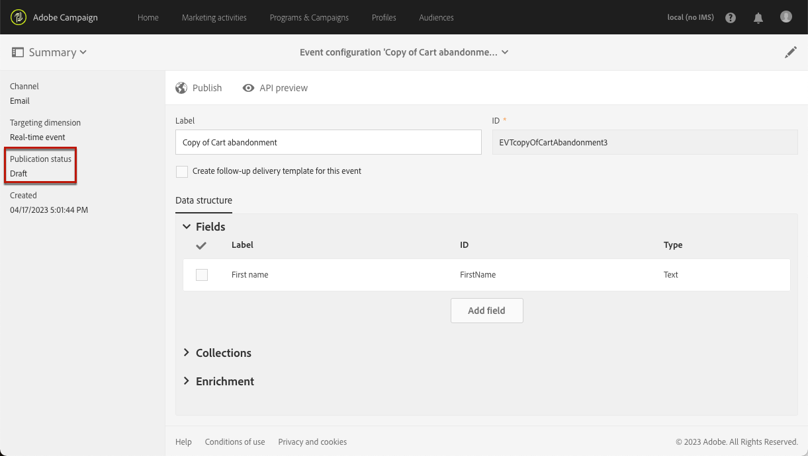
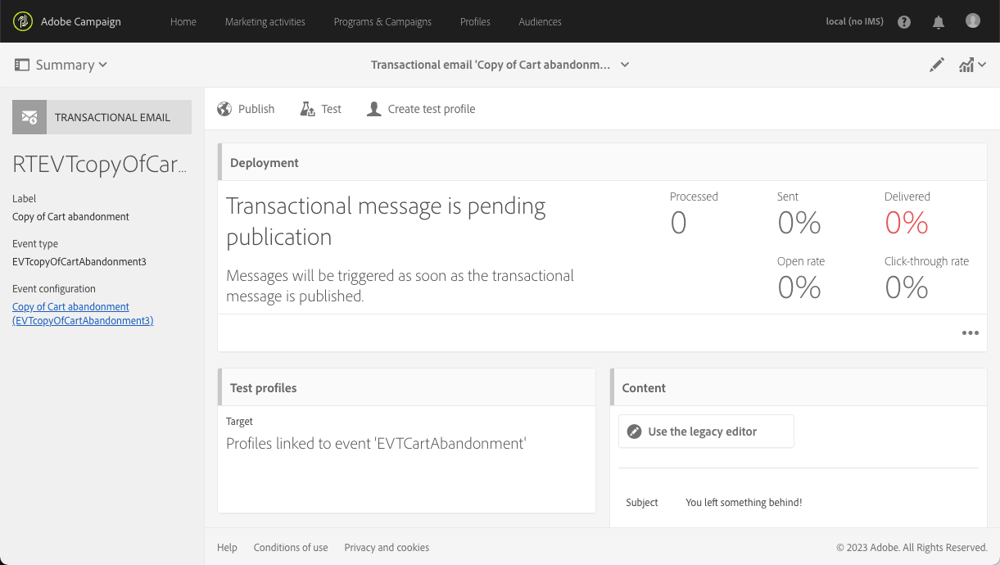

# Miglioramenti degli eventi transazionali {#transactional-event-improvements}

>[!AVAILABILITY]
>
>Queste funzioni sono attualmente disponibili solo per un insieme di organizzazioni (disponibilità limitata). Per ulteriori informazioni, contatta il tuo rappresentante Adobe.

Attualmente, in Adobe Campaign Standard, gli utenti senza il gruppo di sicurezza Amministratore non possono accedere, creare o pubblicare eventi transazionali, il che causa problemi agli utenti aziendali che devono configurare e pubblicare eventi ma non dispongono dei diritti di amministratore. Inoltre, non è possibile duplicare eventi transazionali.

Abbiamo implementato i seguenti miglioramenti al controllo degli accessi alla messaggistica transazionale:

* Nuovo **[!UICONTROL Role]**, chiamato **Utente MC**&#x200B;è stato aggiunto per consentire agli utenti non amministratori di gestire la configurazione degli eventi transazionali. La **Utente MC** Il ruolo consente a questi utenti di accedere, creare, pubblicare e annullare la pubblicazione di eventi e messaggi transazionali.

* Le consegne di esecuzione (ovvero i messaggi tecnici creati ogni volta che un messaggio sulle transazioni viene modificato e pubblicato di nuovo o una volta al mese per impostazione predefinita) sono ora impostate su **[!UICONTROL Organizational unit]** del gruppo di sicurezza a cui appartiene l&#39;utente che crea l&#39;evento, anziché essere limitato al **[!UICONTROL Organizational unit]** del **Agente del Centro messaggi (mcExec)** gruppo di sicurezza.

* **Amministratori** può ora duplicare gli eventi transazionali pubblicati, nonché gli utenti con **Utente MC** nello stesso ruolo **Unità organizzativa** gerarchia come l’utente che ha creato l’evento.

## Assegnare il ruolo utente MC {#assign-role}

Per assegnare la **Utente MC** ruolo per il gruppo di sicurezza:

1. Crea un nuovo **[!UICONTROL Security group]** o aggiorna una esistente. [Ulteriori informazioni](../../administration/using/managing-groups-and-users.md).

1. Fai clic su **[!UICONTROL Create element]** per assegnare ruoli al gruppo di sicurezza.

   

1. Selezionare l&#39;utente MC **[!UICONTROL Role]** e fai clic su **[!UICONTROL Confirm]**.

   >[!IMPORTANT]
   >
   > Procedi con cautela quando assegni il ruolo MC User agli operatori, in quanto ciò consente loro di annullare la pubblicazione degli eventi.

   

1. Una volta configurata, fai clic su **[!UICONTROL Save]**.

Utenti collegati a questo **[!UICONTROL Security group]** ora può accedere, creare e pubblicare eventi e messaggi transazionali.

## Assegna il gruppo di sicurezza utente MC {#assign-group}

1. Nell’Admin Console, seleziona la **Prodotti** scheda .

1. Seleziona **Adobe Campaign Standard** quindi scegli la tua istanza.

1. Da **Profili di prodotto** selezionare **Utente MC** gruppo.

1. Fai clic su **Aggiungi utente** e immetti il nome, il gruppo di utenti o l’indirizzo e-mail del profilo da aggiungere a questo profilo di prodotto.

1. Una volta aggiunto, fai clic su **Salva**.

Utenti aggiunti a questo **[!UICONTROL Security group]** ora può accedere, creare e pubblicare eventi e messaggi transazionali.

## Duplicare eventi transazionali {#duplicate-transactional-events}

Un utente con **Amministratore** gruppo di sicurezza<!--([Functional administrators](../../administration/using/users-management.md#functional-administrators)?)--> può ora duplicare una configurazione di evento se l’evento è stato **pubblicato**.

Inoltre, gli utenti non amministratori con **Utente MC** Il ruolo ora può accedere alle configurazioni dell’evento, ma la loro autorizzazione a duplicare è determinata dal **Unità organizzativa** appartengono a. Se l’utente corrente e l’utente che ha creato l’evento appartengono alla stessa gerarchia di unità organizzativa, la duplicazione è consentita.

Ad esempio, se un utente appartenente all’unità organizzativa &quot;Vendite Francia&quot; crea una configurazione di evento:

* Un altro utente la cui unità organizzativa è &quot;Vendite a Parigi&quot; potrà duplicare questo evento, perché &quot;Vendite a Parigi&quot; fa parte dell&#39;unità organizzativa &quot;Vendite Francia&quot;.

* Tuttavia, un utente la cui unità organizzativa è &quot;San Francisco Sales&quot; non sarà in grado di farlo, perché &quot;San Francisco Sales&quot; è sotto l&#39;unità organizzativa &quot;US Sales&quot;, che è separata dall&#39;unità organizzativa &quot;France Sales&quot;.

Per duplicare una configurazione di un evento, segui i passaggi seguenti.

1. Fai clic sul pulsante **Adobe** , nell’angolo in alto a sinistra, quindi seleziona **[!UICONTROL Marketing plans]** > **[!UICONTROL Transactional messages]** > **[!UICONTROL Event configuration]**.

1. Passa il puntatore del mouse sulla configurazione dell’evento pubblicata desiderata e seleziona la **[!UICONTROL Duplicate element]** pulsante .

   

   >[!CAUTION]
   >
   >Non è possibile duplicare una configurazione evento non pubblicata. [Ulteriori informazioni](publishing-transactional-event.md)

1. Viene visualizzato automaticamente l’evento duplicato. Contiene la stessa configurazione definita per l&#39;evento originale, ma ha **[!UICONTROL Draft]** stato.

   

1. Il messaggio transazionale corrispondente viene creato automaticamente. Per accedervi, vai a **[!UICONTROL Transactional messages]** > **[!UICONTROL Transactional messages]**.

   

1. Apri il messaggio appena duplicato. Contiene la stessa progettazione definita per il messaggio originale, ma ha la **[!UICONTROL Draft]** , anche se il messaggio transazionale originale è stato pubblicato.

   

1. Ora puoi modificare e personalizzare il messaggio. Vedi [Modifica dei messaggi transazionali](../../channels/using/editing-transactional-message.md).

## Impatto {#impacts}

La tabella seguente illustra l&#39;impatto di questi miglioramenti:

| Oggetti | Prima di questa modifica | Dopo questa modifica |
|:-: | :--: | :-:|
| Eventi transazionali | Solo gli utenti all&#39;interno della **Amministratore** gruppo di sicurezza può creare e pubblicare eventi. | La **Utente MC** Il ruolo consente agli utenti di creare e pubblicare eventi. |
| Messaggi transazionali | I messaggi transazionali sono impostati su **Unità organizzativa** del **Agente del Centro messaggi (mcExec)** gruppo di sicurezza. | I messaggi transazionali sono impostati su **Unità organizzativa** del gruppo di sicurezza a cui appartiene l’utente che crea l’evento/messaggio sulle transazioni. |
| Consegne di esecuzione | Le consegne di esecuzione sono impostate su **Unità organizzativa** del **Agente del Centro messaggi (mcExec)** gruppo di sicurezza. | Le consegne di esecuzione sono impostate su **Unità organizzativa** del gruppo di sicurezza a cui appartiene l’utente che crea l’evento/messaggio sulle transazioni. |
| Eventi transazionali pubblicati | La duplicazione non è possibile per nessun utente. | <ul><li>Utenti con **Amministratore** gruppo di sicurezza può duplicare gli eventi pubblicati.</li> <li>Utenti con **Utente MC** Il ruolo può duplicare gli eventi pubblicati se si trovano nello stesso **Unità organizzativa** gerarchia come l’utente che ha creato l’evento.</li></ul> |

<!--Transactional Message Templates| Transactional Message templates are set to the Organizational unit **All**. | Transaction Message Template will be set to the **Organizational unit** of the security group to which the user creating the message template belongs.-->