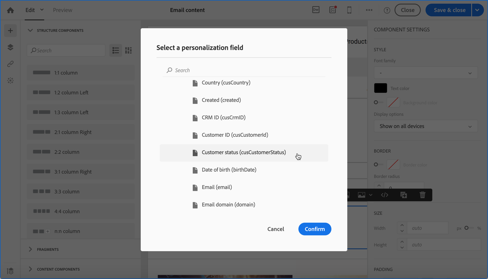

# Caso di utilizzo dei messaggi transazionali {#transactional-messaging-use-case}

In questo esempio, desideri utilizzare la funzionalità di messaggistica transazionale di Adobe Campaign per inviare un’e-mail di conferma dopo ogni acquisto sul sito web, identificando i clienti tramite il loro ID CRM.

I prerequisiti sono i seguenti:

* Assicurarsi che la risorsa **[!UICONTROL Profile]** sia stata estesa con un nuovo campo corrispondente all&#39;ID CRM.

* Crea e pubblica una risorsa personalizzata corrispondente agli acquisti e collegala alla risorsa **[!UICONTROL Profile]**. In questo modo, potrai recuperare informazioni da questa risorsa per arricchire il contenuto del messaggio.

Per ulteriori informazioni sull&#39;estensione, la creazione e la pubblicazione di risorse, vedere [questa sezione](../../developing/using/key-steps-to-add-a-resource.md).

I passaggi principali per implementare questo caso d’uso sono descritti di seguito.

>[!NOTE]
>
>Per una rappresentazione grafica del processo generale di messaggistica transazionale, vedere [questo schema](../../channels/using/getting-started-with-transactional-msg.md#key-steps).

## Passaggio 1: creare e pubblicare la configurazione dell’evento {#create-event-configuration}

1. Crea un nuovo evento utilizzando il canale **[!UICONTROL Email]**. Vedi [Creazione di un evento](../../channels/using/configuring-transactional-event.md#creating-an-event).

1. Selezionare la dimensione di targeting **[!UICONTROL Profile]** per creare un [messaggio transazionale basato su profilo](../../channels/using/configuring-transactional-event.md#profile-based-transactional-messages).

1. Definisci gli attributi che saranno disponibili per personalizzare il messaggio transazionale. In questo esempio, aggiungi i campi &quot;CRM ID&quot; e &quot;Product identifier&quot;. Vedere [Definizione degli attributi dell&#39;evento](../../channels/using/configuring-transactional-event.md#defining-the-event-attributes).

   

1. Per arricchire il contenuto del messaggio con le informazioni relative agli acquisti del cliente, crea un arricchimento destinato alla risorsa **[!UICONTROL Purchase]**. Vedere [Arricchimento dell&#39;evento](../../channels/using/configuring-transactional-event.md#enriching-the-transactional-message-content).

   

1. Creare una condizione di unione tra il campo &quot;Identificatore prodotto&quot; precedentemente aggiunto all&#39;evento e il campo corrispondente dalla risorsa **[!UICONTROL Purchase]**.

   

1. Poiché è obbligatorio per gli eventi basati su profilo, è necessario creare anche un arricchimento che abbia come destinazione la risorsa **[!UICONTROL Profile]**.

1. Creare una condizione di join tra il campo &quot;ID CRM&quot; precedentemente aggiunto al messaggio e il campo corrispondente della risorsa **[!UICONTROL Profile]** estesa. <!--What's the purpose to have created a CRM ID for this event and to have the CRM ID as a join condition? could it be any other field provided you created it in the event?-->

   

1. Nella sezione **[!UICONTROL Targeting enrichment]**, seleziona l&#39;arricchimento nella risorsa **[!UICONTROL Profile]**, che verrà utilizzata come destinazione del messaggio durante l&#39;esecuzione della consegna.

   

1. Visualizza l’anteprima e pubblica l’evento. Vedi [Anteprima e pubblicazione dell’evento](../../channels/using/publishing-transactional-event.md#previewing-and-publishing-the-event).

## Passaggio 2: modificare e pubblicare il messaggio sulle transazioni {#create-transactional-message}

1. Vai al messaggio transazionale creato automaticamente al momento della pubblicazione dell’evento. Consulta [Accesso ai messaggi transazionali](../../channels/using/editing-transactional-message.md#accessing-transactional-messages).

1. Modifica e personalizza il messaggio. Consulta [Modifica di un messaggio transazionale di profilo](../../channels/using/editing-transactional-message.md#editing-profile-transactional-message).

1. Tramite la riconciliazione con il campo &quot;ID CRM&quot; aggiunto alla risorsa **[!UICONTROL Profile]**, puoi accedere direttamente a tutte le informazioni del profilo per [personalizzare](../../designing/using/personalization.md#inserting-a-personalization-field) il messaggio.

   

1. Tramite la riconciliazione con il campo &quot;Identificatore prodotto&quot;, è possibile arricchire il contenuto del messaggio con le informazioni relative agli acquisti del cliente aggiungendo qualsiasi campo dalla risorsa **[!UICONTROL Purchase]**.

   

   A tale scopo, selezionare **[!UICONTROL Insert personalization field]** dalla barra degli strumenti contestuale. Dal nodo **[!UICONTROL Context]** > **[!UICONTROL Transactional event]** > **[!UICONTROL Event context]**, apri il nodo corrispondente alla risorsa personalizzata **[!UICONTROL Purchase]** e seleziona un campo qualsiasi.

1. Puoi verificare il messaggio utilizzando un profilo di test specifico. Vedi [Verifica di un messaggio transazionale](../../channels/using/testing-transactional-message.md#testing-a-transactional-message).

1. Quando il contenuto è pronto, salva le modifiche e pubblica il messaggio. Consulta [Pubblicazione di un messaggio transazionale](../../channels/using/publishing-transactional-message.md#publishing-a-transactional-message).

## Passaggio 3: integrare l’attivazione dell’evento {#integrate-event-trigger}

Integra l’evento nel sito web. Vedi [Integrare l&#39;attivazione dell&#39;evento](../../channels/using/getting-started-with-transactional-msg.md#integrate-event-trigger).

## Passaggio 4: consegna dei messaggi {#message-delivery}

Una volta eseguiti tutti questi passaggi, non appena un cliente acquista prodotti dal sito web, riceve un’e-mail di conferma personalizzata contenente informazioni sul suo acquisto.
