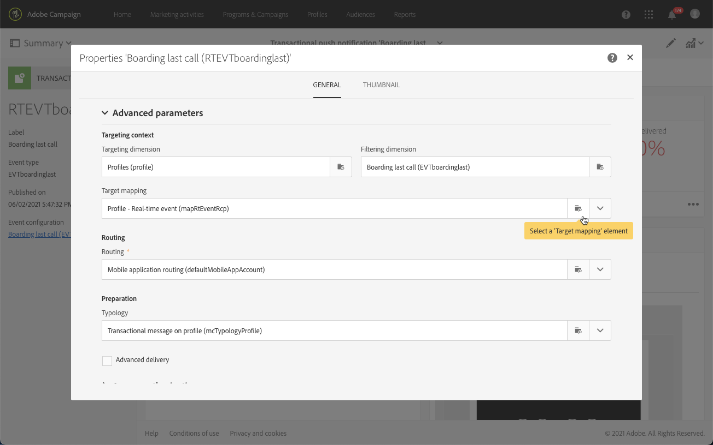

# Notifiche push transazionali{#transactional-push-notifications}

Puoi utilizzare Adobe Campaign per inviare notifiche push transazionali su dispositivi mobili iOS e Android. Questi messaggi vengono ricevuti sulle app mobili che configuri in Adobe Campaign sfruttando l’SDK di Experience Cloud Mobile.

>[!NOTE]
>
>Il canale push è opzionale. Controlla il contratto di licenza. Per ulteriori informazioni sulle notifiche push standard, consulta [Informazioni sulle notifiche push](../../channels/using/about-push-notifications.md).

Per poter inviare notifiche push transazionali, devi configurare Adobe Campaign di conseguenza. Consulta [Configurazione di un’app mobile](../../administration/using/configuring-a-mobile-application.md).

Puoi inviare due tipi di notifiche push transazionali:

* [Notifiche push transazionali con targeting di un evento](#transactional-push-notifications-targeting-an-event)
* [Notifiche push transazionali con targeting di profili](#transactional-push-notifications-targeting-a-profile) dal database di Adobe Campaign

## Notifiche push transazionali con targeting di un evento {#transactional-push-notifications-targeting-an-event}

Puoi utilizzare Adobe Campaign per inviare **notifiche push transazionali anonime a tutti gli utenti** che hanno acconsentito a ricevere notifiche dalla tua app mobile.

In questo caso, solo **i dati contenuti nell’evento vengono utilizzati per definire il target della consegna**. Non vengono utilizzati dati dal database dei profili integrato di Adobe Campaign.

### Configurazione di una notifica push transazionale basata su eventi {#configuring-event-based-transactional-push-notification}

Per inviare una notifica push transazionale a tutti gli utenti che hanno acconsentito alla ricezione di notifiche dall’app mobile, devi innanzitutto creare e configurare un evento che punti ai dati contenuti nell’evento stesso.

>[!NOTE]
>
>Puoi comunque personalizzare il contenuto di una notifica push transazionale basata su eventi utilizzando [attributi evento](../../channels/using/configuring-transactional-event.md#defining-the-event-attributes) (dati dell&#39;evento) e [arricchimento degli eventi](../../channels/using/configuring-transactional-event.md#enriching-the-transactional-message-content) (dati dal database di Campaign). Consulta [l’esempio seguente](#sending-event-based-transactional-push-notification).

L’evento deve contenere i tre elementi seguenti:

* A **token di registrazione**, ID utente per un’app mobile e un dispositivo. Potrebbe non corrispondere ad alcun profilo dal database di Adobe Campaign.
* A **nome dell’app mobile** (uno per tutti i dispositivi: Android e iOS). Questo è l’ID dell’app mobile configurata in Adobe Campaign che verrà utilizzata per ricevere notifiche push sui dispositivi degli utenti. Per ulteriori informazioni, consulta [Configurazione di un’app mobile](../../administration/using/configuring-a-mobile-application.md).
* A **piattaforma push** (&quot;gcm&quot; per Android o &quot;apns&quot; per iOS).

Per configurare l’evento, effettua le seguenti operazioni:

1. Durante la creazione della configurazione dell’evento, seleziona la **[!UICONTROL Push notification]** e il **[!UICONTROL Real-time event]** dimensione di targeting (vedi [Creazione di un evento](../../channels/using/configuring-transactional-event.md#creating-an-event)).
1. Aggiungi campi all’evento. Questo ti consentirà di personalizzare il messaggio transazionale (consulta [Definizione degli attributi dell’evento](../../channels/using/configuring-transactional-event.md#defining-the-event-attributes)). In questo esempio, definisci i campi &quot;gateNumber&quot;, &quot;lastname&quot; e &quot;firstname&quot;.
1. Puoi anche arricchire il contenuto del messaggio. A questo scopo, aggiungi i campi dalla tabella collegata alla configurazione dell’evento (consulta [Arricchimento dell’evento](../../channels/using/configuring-transactional-event.md#enriching-the-transactional-message-content)).

   <!--Event-based transactional messaging is supposed to use only the data that are in the sent event to define the recipient and the message content personalization. However, you can enrich the content of your transactional message using information from the Adobe Campaign database.-->

1. [Anteprima e pubblicazione dell’evento](../../channels/using/publishing-transactional-event.md#previewing-and-publishing-the-event).

   Durante l’anteprima dell’evento, l’API REST contiene gli attributi &quot;registrationToken&quot;, &quot;application&quot; e &quot;pushPlatform&quot; che verranno utilizzati per eseguire il targeting della consegna.

   

   Dopo la pubblicazione dell’evento, viene creata automaticamente una notifica push transazionale collegata al nuovo evento. Ora puoi modificare e pubblicare il messaggio appena creato (consulta [questa sezione](#sending-event-based-transactional-push-notification)).

1. Integra l’evento nel sito web (consulta [Integrare l’attivazione dell’evento](../../channels/using/getting-started-with-transactional-msg.md#integrate-event-trigger)).

### Invio di una notifica push transazionale basata su eventi {#sending-event-based-transactional-push-notification}

Ad esempio, una compagnia aerea desidera invitare gli utenti delle sue app mobili a passare al gate pertinente per l’imbarco.

L’azienda invierà una notifica push transazionale per utente (identificato con un token di registrazione), utilizzando un’app mobile, tramite un singolo dispositivo.

1. Vai al messaggio transazionale creato per modificarlo. Consulta [Accesso ai messaggi transazionali](../../channels/using/editing-transactional-message.md#accessing-transactional-messages).

   

1. Fai clic su **[!UICONTROL Content]** blocca per modificare il titolo e il corpo del messaggio.

1. Puoi inserire campi di personalizzazione per aggiungere elementi definiti al momento della creazione dell’evento (consulta [Definizione degli attributi dell’evento](../../channels/using/configuring-transactional-event.md#defining-the-event-attributes)).

   

   Per trovare questi campi, fai clic sulla matita accanto a un elemento, quindi fai clic su **[!UICONTROL Insert personalization field]** e seleziona **[!UICONTROL Context]** > **[!UICONTROL Real-time event]** > **[!UICONTROL Event context]**.

   

   Per ulteriori informazioni sulla modifica di un contenuto di notifica push, consulta [Preparazione e invio di una notifica push](../../channels/using/preparing-and-sending-a-push-notification.md).

1. Puoi anche arricchire il contenuto dei messaggi transazionali se desideri utilizzare informazioni aggiuntive provenienti dal database di Adobe Campaign (consulta [Arricchimento dell’evento](../../channels/using/configuring-transactional-event.md#enriching-the-transactional-message-content)).

1. Salva le modifiche e pubblica il messaggio. Consulta [Pubblicazione di un messaggio transazionale](../../channels/using/publishing-transactional-message.md#publishing-a-transactional-message).

1. Utilizzando l’API REST di Adobe Campaign Standard, invia un evento a un token di registrazione (ABCDEF123456789), utilizzando un’app mobile (WeFlight), su Android (gcm), contenente i dati di imbarco:

   ```
   {
     "registrationToken":"ABCDEF123456789",
     "application":"WeFlight",
     "pushPlatform":"gcm",
     "ctx":
     {
       "gateNumber":"Gate B18",
       "lastname":"Green",
       "firstname":"Jane"
     }
   }
   ```

   Per ulteriori informazioni sull’integrazione dell’attivazione di un evento in un sistema esterno, consulta [Integrare l’attivazione dell’evento](../../channels/using/getting-started-with-transactional-msg.md#integrate-event-trigger).

Se il token di registrazione esiste, l’utente corrispondente riceve una notifica push transazionale con il seguente contenuto:

*&quot;Ciao Jane Green, l&#39;imbarco è appena iniziato! Si prega di procedere al Gate B18.&quot;*

## Notifiche push transazionali con targeting di profilo {#transactional-push-notifications-targeting-a-profile}

Puoi inviare una notifica push transazionale **ai profili Adobe Campaign che si sono abbonati alla tua app mobile**. Questa consegna può contenere [campi di personalizzazione](../../designing/using/personalization.md#inserting-a-personalization-field), ad esempio il nome del destinatario, recuperato direttamente dal database di Adobe Campaign.

In questo caso, l’evento deve contenere alcuni campi **consentire la riconciliazione con un profilo dal database di Adobe Campaign**.

Quando si esegue il targeting di profili, viene inviata una notifica push transazionale per app mobile e per dispositivo. Ad esempio, se un utente di Adobe Campaign si è abbonato a due applicazioni, riceverà due notifiche. Se un utente si è abbonato alla stessa applicazione con due dispositivi diversi, riceverà una notifica su ciascun dispositivo.

Le app mobili a cui un profilo si è abbonato sono elencate nella **[!UICONTROL Mobile App Subscriptions]** di questo profilo. Per accedere a questa scheda, seleziona un profilo e fai clic su **[!UICONTROL Edit profile properties]** a destra.


Per ulteriori informazioni sull’accesso e la modifica dei profili, consulta [Informazioni sui profili](../../audiences/using/about-profiles.md).

### Configurazione di una notifica push transazionale basata su profilo {#configuring-profile-based-transactional-push-notification}

Per inviare una notifica push transazionale ai profili Adobe Campaign che si sono abbonati alla tua app mobile, devi innanzitutto creare e configurare un evento che punti al database di Adobe Campaign.

1. Durante la creazione della configurazione dell’evento, seleziona la **[!UICONTROL Push notification]** e il **[!UICONTROL Profile]** dimensione di targeting (vedi [Creazione di un evento](../../channels/using/configuring-transactional-event.md#creating-an-event)).

   Per impostazione predefinita, la notifica push transazionale viene inviata a tutte le app mobili a cui i destinatari si sono abbonati. Per inviare la notifica push a una specifica app mobile, selezionala nell’elenco. Le altre app mobili saranno oggetto del messaggio, ma saranno escluse dall’invio.

   

1. Aggiungi campi all’evento, se desideri personalizzare il messaggio transazionale (consulta [Definizione degli attributi dell’evento](../../channels/using/configuring-transactional-event.md#defining-the-event-attributes)).

   >[!NOTE]
   >
   >Devi aggiungere almeno un campo per creare un arricchimento. Non è necessario creare altri campi come **Nome** e **Cognome** poiché potrai utilizzare i campi di personalizzazione del database di Adobe Campaign.

1. Creare un arricchimento per collegare l’evento al **[!UICONTROL Profile]** risorsa (vedere [Arricchimento dell’evento](../../channels/using/configuring-transactional-event.md#enriching-the-transactional-message-content)) e selezionare questo arricchimento come **[!UICONTROL Targeting enrichment]**.

   >[!IMPORTANT]
   >
   >Questo passaggio è obbligatorio per gli eventi basati su profilo.

1. [Anteprima e pubblicazione dell’evento](../../channels/using/publishing-transactional-event.md#previewing-and-publishing-the-event).

   Quando si visualizza l’anteprima dell’evento, l’API REST non contiene un attributo che specifica il token di registrazione, il nome dell’applicazione e la piattaforma push in quanto verranno recuperati dal **[!UICONTROL Profile]** risorsa.

   Dopo la pubblicazione dell’evento, viene creata automaticamente una notifica push transazionale collegata al nuovo evento. Ora puoi modificare e pubblicare il messaggio appena creato (consulta [questa sezione](#sending-profile-based-transactional-push-notification)).

1. Integra l’evento nel sito web (consulta [Integrare l’attivazione dell’evento](../../channels/using/getting-started-with-transactional-msg.md#integrate-event-trigger)).

### Invio di una notifica push transazionale basata su profilo {#sending-profile-based-transactional-push-notification}

Ad esempio, una compagnia aerea desidera inviare un’ultima chiamata per l’imbarco a tutti gli utenti di Adobe Campaign che si sono abbonati alla sua app mobile.

1. Vai al messaggio transazionale creato per modificarlo. Consulta [Accesso ai messaggi transazionali](../../channels/using/editing-transactional-message.md#accessing-transactional-messages).

1. Fai clic su **[!UICONTROL Content]** blocca per modificare il titolo e il corpo del messaggio.

   A differenza delle configurazioni basate su eventi in tempo reale, puoi accedere direttamente a tutte le informazioni sul profilo per personalizzare il messaggio. Consulta [Inserimento di un campo di personalizzazione](../../designing/using/personalization.md#inserting-a-personalization-field).

   Per ulteriori informazioni sulla modifica di un contenuto di notifica push, consulta [Preparazione e invio di una notifica push](../../channels/using/preparing-and-sending-a-push-notification.md).

1. Salva le modifiche e pubblica il messaggio. Consulta [Pubblicazione di un messaggio transazionale](../../channels/using/publishing-transactional-message.md#publishing-a-transactional-message).
1. Utilizzando l’API REST di Adobe Campaign Standard, invia un evento a un profilo:

   ```
   {
     "ctx":
     {
       "email":"janegreen@email.com",
       "gateNumber":"D16",
     }
   }
   ```

Per ulteriori informazioni sull’integrazione dell’attivazione di un evento in un sistema esterno, consulta [Integrare l’attivazione dell’evento](../../channels/using/getting-started-with-transactional-msg.md#integrate-event-trigger).

L’utente corrispondente riceve una notifica push transazionale contenente tutti gli elementi di personalizzazione recuperati dal database di Adobe Campaign.

>[!NOTE]
>
>Non sono presenti campi del token di registrazione, dell’applicazione e della piattaforma push. In questo esempio, la riconciliazione viene eseguita con il campo e-mail.

## Modifica della mappatura di destinazione in una notifica push transazionale {#change-target-mapping}

Le notifiche push transazionali utilizzano uno specifico [mappatura target](../../administration/using/target-mappings-in-campaign.md) contenente le impostazioni tecniche necessarie per inviare questo tipo di consegne.

Per modificare questa mappatura di destinazione, effettua le seguenti operazioni:

1. Dall’elenco dei messaggi transazionali, seleziona una notifica push.

1. Nel dashboard dei messaggi, fai clic su **[!UICONTROL Edit properties]** pulsante.

   

1. Espandi **[!UICONTROL Advanced parameters]** sezione.

1. Fai clic su **[!UICONTROL Select a 'Target mapping' element]**.

   

1. Seleziona una mappatura di destinazione dall’elenco.

   >[!NOTE]
   >
   >Tempi di preparazione e prestazioni ottimali per l’invio **basato su profilo** notifiche push transazionali, utilizza **[!UICONTROL Profile - Real-time event for Push (mapRtEventAppSubRcp)]** mappatura target.

   

1. Conferma la modifica e pubblica il messaggio. Consulta [Pubblicazione di un messaggio transazionale](../../channels/using/publishing-transactional-message.md#publishing-a-transactional-message).

   >[!IMPORTANT]
   >
   >Devi pubblicare nuovamente il messaggio affinché la modifica sia effettiva, altrimenti verrà ancora utilizzata la mappatura di destinazione precedente.


