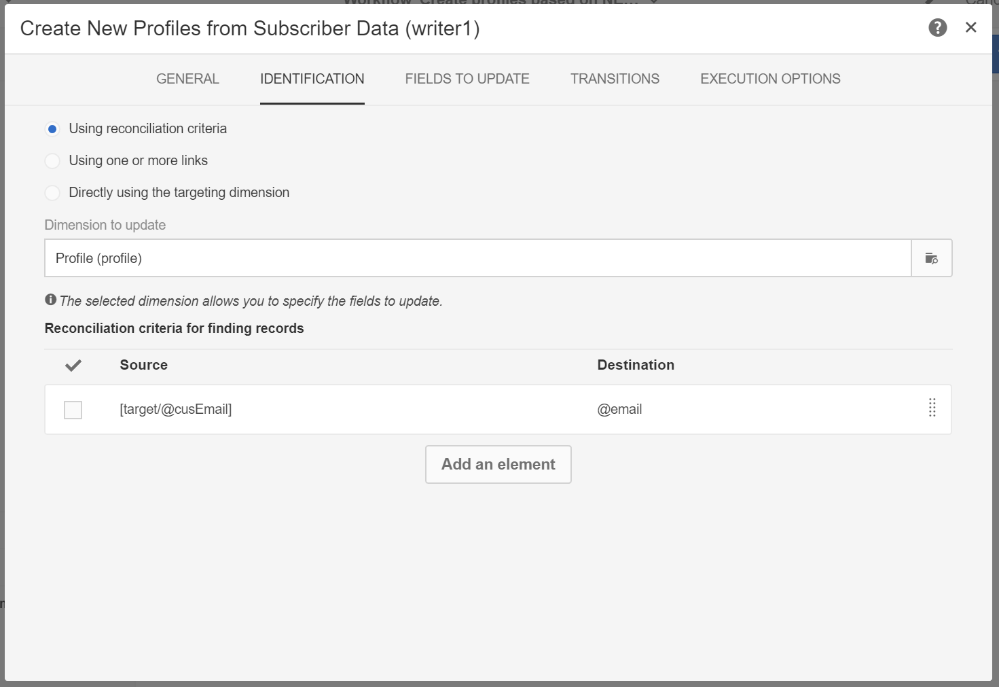

# Creazione e aggiornamento delle informazioni sul profilo in base ai dati delle applicazioni mobili

## Panoramica

Questa pagina descrive i passaggi per sviluppare un flusso di lavoro che crea/aggiorna i dati del profilo dopo che un&#39;applicazione mobile invia Raccogli dati PII, su base programmata.

* **PII** sta per &quot;Informazioni personali&quot;. Può trattarsi di qualsiasi dato, comprese le informazioni che non compaiono nella tabella Profilo del database Campaign, come, ad esempio, Analytics for Mobile [Points of Interest](../../integrating/using/about-campaign-points-of-interest-data-integration.md). Il PII è definito da Mobile App Developer, in genere con un esperto di marketing.
* **Collect PII** è un&#39;operazione HTTP-POST a un&#39;API Rest in  Adobe Campaign Standard da un&#39;app mobile.

L&#39;obiettivo di questo caso d&#39;uso è creare o aggiornare un profilo Campaign Standard, se i dati PII restituiti da un&#39;applicazione mobile contengono dati relativi al profilo.

## Prerequisiti

Prima di creare o aggiornare i profili in base ai dati dell&#39;iscrizione all&#39;app mobile, è necessario seguire diversi passaggi di configurazione per abilitare le notifiche push in Campaign Standard:

1. [Creare un&#39;applicazione mobile](../../administration/using/configuring-a-mobile-application.md)
1. [Integra l’SDK per dispositivi mobili  Adobe con l’applicazione](https://helpx.adobe.com/it/campaign/kb/integrate-mobile-sdk.html)mobile.
1. [Configurare  Adobe Campaign per l&#39;invio di notifiche](https://docs.adobe.com/content/help/it-IT/campaign-standard/using/administrating/configuring-channels/configuring-a-mobile-application.html)push.

## Passaggio 1 - Estendi la risorsa Profilo per le notifiche push/iscrizioni

Per poter creare o aggiornare la risorsa Profilo con i dati PII, è innanzitutto necessario estendere la risorsa Profilo con i campi desiderati. Per eseguire questa operazione:

* Identificare i campi PII inviati dall&#39;applicazione mobile.
* Identificare il campo da utilizzare per la riconciliazione per associare i dati PII ai dati del profilo.

In questo esempio, la **[!UICONTROL Fields]** sezione riflette i dati PII inviati dall&#39;applicazione mobile. La **[!UICONTROL Link to profiles]** sezione indica il campo utilizzato per associare il PII ai dati del profilo, dove **cusEmail** viene mappato su **@email**.

La mappatura dei dati del profilo durante l’estensione della **[!UICONTROL Subscriptions to an Application]** risorsa è SOLA LETTURA. Viene utilizzato per la riconciliazione. Il profilo deve essere inserito nel sistema con i dati necessari per riconciliare il profilo con i dati PII. Nel nostro caso, un indirizzo e-mail per il profilo deve corrispondere a un&#39;e-mail inviata da Collect PII per consentire la riconciliazione:

* Raccogli PII viene ricevuto da un&#39;app mobile per un utente il cui nome è &quot;Jane, cognome è &quot;Doe&quot; e l&#39;indirizzo e-mail è janedoe@doe.com.
* Separatamente, i dati del profilo devono esistere (ad esempio, i dati devono essere inseriti manualmente o provenire già da altre risorse), dove l&#39;indirizzo e-mail del profilo è janedoe@doe.com.

**Argomenti correlati:**

* [Estensione degli abbonamenti a una risorsa dell’applicazione](../../developing/using/extending-the-subscriptions-to-an-application-resource.md).
* [Creazione o estensione di una risorsa](../../developing/using/key-steps-to-add-a-resource.md)esistente.

## Passaggio 2 - Creare il flusso di lavoro

L&#39;utilizzo di un Flusso di lavoro in Campaign Standard consente a un amministratore di identificare e sincronizzare in modo univoco i dati tra i dati AppSubscription (utente iscritto) e i dati Profile o Recipient. Un aggiornamento basato su flusso di lavoro non sincronizza i dati del profilo in tempo reale, ma non deve causare inutili blocchi del database o sovraccarichi.

I passaggi principali per creare il flusso di lavoro sono:

1. Utilizzate un&#39;attività **[!UICONTROL Query]** **[!UICONTROL Incremental query]** o per ottenere un elenco delle sottoscrizioni più recenti.
1. Utilizzate un&#39; **[!UICONTROL Reconciliation]** attività per mappare i dati PII con il profilo.
1. Aggiungete un processo di verifica.
1. Utilizzare un **[!UICONTROL Update data]** per aggiornare o creare il profilo con i dati PII.

In questo flusso di lavoro vengono considerati i seguenti requisiti:

* Tutti i campi che sono stati estesi devono essere disponibili per creare/aggiornare la tabella dei profili.
* La tabella Profilo può essere estesa per supportare i campi che non sono supportati in modo nativo (ad esempio, Dimensioni T-shirt).
* I campi della tabella AppSubscription vuoti non devono essere aggiornati nella tabella Profilo.
* Qualsiasi record aggiornato nella tabella AppSubscription deve essere incluso nell&#39;esecuzione successiva del Flusso di lavoro.

Per creare il flusso di lavoro, trascinate e rilasciate le seguenti attività nell’area di lavoro, quindi collegatele: **[!UICONTROL Start]**, **[!UICONTROL Scheduler]**, **[!UICONTROL Incremental query]**, **[!UICONTROL Update data]**.

Seguite quindi i passaggi indicati di seguito per configurare ogni attività.

### Configurare l&#39; **[!UICONTROL Scheduler]** attività

Nella **[!UICONTROL General]** scheda, impostare **[!UICONTROL Execution frequency]** (ad esempio, &quot;Daily&quot;), **[!UICONTROL Time]** (ad esempio, &quot;1:00:00 AM&quot;) e **[!UICONTROL Start]** (ad esempio, Data odierna).

### Configurare l&#39; **[!UICONTROL Incremental query]** attività.

1. Nella **[!UICONTROL Properties]** scheda fare clic sull&#39; **[!UICONTROL Select an element]** icona del **[!UICONTROL Resource]** campo, quindi selezionare l&#39; **[!UICONTROL Subscriptions to an application (nms:appSubscriptionRcp:appSubscriptionRcpDetail)]** elemento.

   

1. Nella **[!UICONTROL Target]** scheda, trascina il **[!UICONTROL Mobile application]** filtro, quindi seleziona il nome di un&#39;applicazione Mobile.

   

1. Nella **[!UICONTROL Processed data]** scheda, selezionare **[!UICONTROL Use a date field]**, quindi aggiungere il **[!UICONTROL Last modified (lastModified)]** campo come **[!UICONTROL Path to the date field]**.

   

### Configurare l&#39; **[!UICONTROL Update data]** attività.

1. Nella **[!UICONTROL Identification]** scheda, assicurarsi che il **[!UICONTROL Dimension to update]** campo sia impostato su &quot;Profili (profilo)&quot;, quindi fare clic sul **[!UICONTROL Create element]** pulsante per aggiungere un campo come criterio di riconciliazione.

   

1. Nel **[!UICONTROL Source]** campo, seleziona un campo dalla tabella appSubscriptionRcp come campo di riconciliazione. Può trattarsi dell&#39;e-mail del profilo, crmId, marketingCloudId, ecc. In questo esempio, utilizzeremo il campo &quot;Email (cusEmail)&quot;.

1. Nel **[!UICONTROL Destination]** campo, seleziona un campo dalla tabella del profilo per riconciliare i dati dalla tabella appSubscriptionRcp. Può essere l&#39;e-mail del profilo o qualsiasi campo esteso come crmId, marketingCloudId, ecc. In questo esempio, è necessario selezionare il campo &quot;Email (email)&quot; per mapparlo con il campo &quot;Email (cusEmail)&quot; dalla tabella appSubscriptionRcp.

   

1. Nella **[!UICONTROL Fields to update]** scheda, fai clic sul **[!UICONTROL Create element]** pulsante, quindi mappatura i campi provenienti dalla tabella appSubscriptionRcp (**[!UICONTROL Source]** campo) con i campi che vuoi aggiornare nella tabella Profilo (**[!UICONTROL Destination]** campo).

1. Nel **[!UICONTROL Enabled if]** campo, aggiungere un&#39;espressione per assicurare che il campo corrispondente nella tabella Profilo sia aggiornato solo se il campo di origine contiene un valore. A questo scopo, selezionare il campo dall&#39;elenco, quindi aggiungere il simbolo &quot;!espressione =&#39;&#39;&quot; (se il campo Sorgente è `[target/@cusEmail]` nell&#39;editor Espressione, assicurarsi di digitare `[target/@cusEmail] != ''"`).

   

>[!NOTE]
>
>In questo caso, il flusso di lavoro esegue un UPSERT, ma poiché si basa su **[!UICONTROL Incremental query]** dati, viene inserito solo. La modifica della query può influenzare i dati inseriti o aggiornati.
>Inoltre, le impostazioni specificate nella scheda Campi da aggiornare determinano quali campi vengono inseriti o aggiornati in condizioni specifiche. Queste impostazioni possono essere univoche per ogni applicazione o cliente.
>Presta attenzione quando configuri queste impostazioni, in quanto potrebbero verificarsi conseguenze non desiderate, in quanto l&#39;aggiornamento dei record nel Profilo basato sui dati appSubscriptionRcp può modificare le informazioni personali degli utenti senza convalida.

Quando tutti i campi da inserire/aggiornare nel profilo sono stati aggiunti, fai clic su **[!UICONTROL Confirm]**.

Salva il flusso di lavoro, quindi fai clic **[!UICONTROL Start]** per eseguire il flusso di lavoro.

