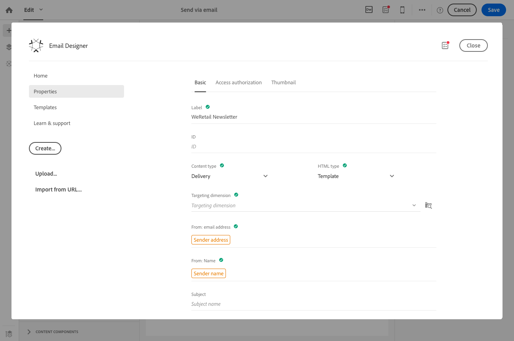

# Informazioni sulla progettazione di contenuto e-mail{#about-email-content-design}

Utilizzate l'interfaccia di trascinamento e rilascio di Designer per creare e modificare il contenuto delle e-mail in Adobe Campaign.

Questa sezione descrive le specificità di E-mail Designer:

* [Informazioni su Designer Designer](../../designing/using/about-email-content-design.md#about-the-email-designer)
* [Definizione della struttura e-mail](../../designing/using/defining-the-email-structure.md)
* [Modifica degli stili e-mail](../../designing/using/editing-email-styles.md)

Per ulteriori informazioni sulle azioni comuni a una o più attività di marketing, consultare le sezioni seguenti:

* Per ulteriori informazioni sulla personalizzazione di un contenuto e-mail, consultate [Inserimento di un campo personalizzato](../../designing/using/inserting-a-personalization-field.md) e [Aggiunta di un blocco di contenuto](../../designing/using/adding-a-content-block.md).
* Per ulteriori informazioni sull'importazione di un altro contenuto e-mail, consultate [Selezione di un contenuto esistente](../../designing/using/selecting-an-existing-content.md).
* Per ulteriori informazioni sulla definizione del contenuto dinamico in un messaggio e-mail, vedi [Definizione del contenuto dinamico in un messaggio e-mail](../../designing/using/defining-dynamic-content-in-an-email.md).
* Per ulteriori informazioni sull'inserimento di collegamenti in un messaggio e-mail, consultate [Inserimento di un collegamento](../../designing/using/inserting-a-link.md).
* Per ulteriori informazioni sull'inserimento di immagini in un'e-mail, consultate [Inserimento di immagini](../../designing/using/inserting-images.md).

Controllate inoltre le best practice [generali per la progettazione dei contenuti](../../designing/using/content-design-best-practices.md).

## Informazioni su Designer Designer {#about-the-email-designer}

Designer consente di creare e-mail e modelli per contenuto e-mail. È compatibile con indirizzi e-mail semplici, e-mail transazionali, e-mail di test A/B, e-mail in più lingue e e-mail ricorrenti.

Per iniziare a utilizzare E-mail Designer, guardate questo [set di video](https://helpx.adobe.com/campaign/kt/acs/using/acs-email-designer-tutorial.html#GettingStarted) che spiegano la funzionalità generale di Designer Designer e come progettare un'e-mail da zero o utilizzando i modelli.

### Home page di Designer Designer {#email-designer-home-page}

[Quando si crea un'e-mail](../../channels/using/creating-an-email.md), la pagina **[!UICONTROL Email Designer]** principale viene visualizzata automaticamente quando si seleziona il contenuto dell'e-mail.


**[!UICONTROL Properties]** La scheda consente di modificare i dettagli e-mail quali l'etichetta, l'indirizzo e il nome del mittente o l'oggetto dell'e-mail. Potete anche accedere a questa scheda facendo clic sull'etichetta e-mail nella parte superiore dello schermo.



**[!UICONTROL Templates]** La scheda consente di scegliere tra i contenuti HTML forniti e quelli già creati per iniziare rapidamente a progettare l'e-mail. Consultate [Modelli di contenuto](../../start/using/about-templates.md#content-templates).


La **[!UICONTROL Learn & support]** scheda consente di accedere facilmente alla documentazione e alle esercitazioni correlate.


Se non si seleziona un modello, la home page di Designer di e-mail consente anche di scegliere la modalità di avvio del contenuto:

* Fate clic sul **[!UICONTROL Create]** pulsante per avviare un nuovo contenuto da zero. Consultate [Progettazione di un contenuto e-mail da zero](../../designing/using/about-email-content-design.md#designing-an-email-content-from-scratch).
* Fate clic sul **[!UICONTROL Upload]** pulsante per caricare un file dal computer. Consultate [Importazione di contenuto da un file](../../designing/using/importing-content-from-a-file.md).
* Fate clic sul **[!UICONTROL Import from URL]** pulsante per recuperare il contenuto esistente a un URL. Consultate [Importazione di contenuto da un URL](../../designing/using/importing-content-from-a-url.md).

### Interfaccia di Designer Designer {#email-designer-interface}

Designer Designer offre numerose opzioni che consentono di creare, modificare e personalizzare ogni aspetto del contenuto.

L'interfaccia è composta da diverse aree che offrono diverse funzionalità:


Negli elementi disponibili nel **riquadro (** 1), trascinare e rilasciare i componenti e i frammenti di contenuto nell' **area di lavoro principale** (2). Selezionate un componente o un elemento nell' **area di lavoro** (2) e personalizzate le relative caratteristiche principali e di visualizzazione dal riquadro **Impostazioni** (3).

Accedere a opzioni e impostazioni generali dalla **barra degli strumenti principale** (4).

>[!NOTE]
>
>Il riquadro **Impostazioni** può scorrere a sinistra in base alla risoluzione dello schermo e alla visualizzazione.


La barra degli strumenti **contestuale** dell'interfaccia Editor offre varie funzionalità a seconda della zona selezionata. Contiene pulsanti di azione e pulsanti che consentono di modificare lo stile del testo. Le modifiche apportate vengono applicate sempre alla zona selezionata.

### Consigli generali per l'utilizzo di Email Designer {#general-recommendations-for-using-the-email-designer}

Per utilizzare correttamente Designer Designer e creare le migliori e-mail il più semplicemente possibile, è consigliabile applicare i seguenti principi:

* Utilizzate lo stile in linea anziché un CSS separato e CSS nella sezione &lt; head &gt; dell'HTML. L'utilizzo di stili in linea consente di ottimizzare il salvataggio e il riutilizzo dei frammenti di contenuto.

   Consultate [Aggiunta di attributi di stile in linea](../../designing/using/editing-email-styles.md#adding-inline-styling-attributes).

* Regola facilmente il tuo marchio creando e riutilizzando frammenti di contenuto per mantenere coerenza nelle campagne di marketing.

   Vedere [Creazione di un frammento di contenuto](../../designing/using/defining-the-email-structure.md#creating-a-content-fragment).

Controllate inoltre le best practice [generali per la progettazione dei contenuti](../../designing/using/content-design-best-practices.md).

### Modalità di compatibilità di Designer con e-mail {#email-designer-compatibility-mode}

Quando caricate un contenuto, esso deve contenere tag specifici per essere completamente conforme e modificabile con l'editor WYSIWYG di Email Designer.

Se tutto o parte dell'HTML caricato non è conforme ai tag previsti, il contenuto viene caricato in modalità di compatibilità, che limita le possibilità di edizione tramite l'interfaccia utente.

Quando un contenuto viene caricato in modalità di compatibilità, potete comunque eseguire le seguenti modifiche tramite l'interfaccia (le azioni non disponibili sono nascoste):

* Modifica del testo o modifica di un'immagine
* Inserimento di collegamenti e campi di personalizzazione
* Modifica alcune opzioni di stile nel blocco HTML selezionato
* Definizione di contenuto condizionale


Altre modifiche, ad esempio l'aggiunta di nuove sezioni al messaggio e-mail o lo stile avanzato, devono essere eseguite direttamente nel codice sorgente del messaggio e-mail tramite la modalità HTML.

Per ulteriori informazioni sulla conversione di un messaggio e-mail esistente in un messaggio e-mail compatibile con Designer, consultare [questa sezione](../../designing/using/about-email-content-design.md#designing-an-email-using-existing-contents).

### Limitazioni di Designer per e-mail {#email-designer-limitations}

* Non è possibile utilizzare i campi di personalizzazione in un frammento. Per ulteriori informazioni sui frammenti, vedere [questa sezione](../../designing/using/defining-the-email-structure.md#about-fragments).
* Quando si modificano gli stili, sono disponibili solo i font Web ufficialmente supportati dalla maggior parte dei client e-mail.
* Gli stili non possono essere salvati come tema per riuso futuro. Tuttavia, lo stile CSS può essere salvato in un modello di contenuto o in un messaggio e-mail. Per ulteriori informazioni sugli stili, [consultate questa sezione](../../designing/using/editing-email-styles.md).

### Aggiornamenti di Designer Designer {#email-designer-updates}

Il miglioramento continuo di Designer Designer è migliorato. Se è stato creato un contenuto e-mail da zero, da un modello out-of-the-box o se avete creato dei frammenti, al successivo apertura del contenuto potrebbe essere visualizzato il seguente messaggio di aggiornamento:


Adobe consiglia di aggiornare i contenuti alla versione più recente per evitare problemi quali problemi di collisione CSS. Click **[!UICONTROL Update now]**.

Se si verifica un errore durante l'aggiornamento del contenuto, controllate il codice HTML e correggetelo prima di eseguire nuovamente questo aggiornamento.

Per i frammenti, tenete presente quanto segue:

* Se si desidera aggiungere un frammento a una nuova e-mail o a un modello e se si riceve questo messaggio, è necessario aggiornare prima il frammento.

* Se si dispone di più frammenti, è necessario aggiornare ciascun frammento che si desidera utilizzare in un contenuto e-mail.

* Per evitare l'impatto sui messaggi e-mail correnti non ancora pronti, è possibile non aggiornare alcuni frammenti.

* È comunque possibile inviare e-mail in cui un frammento non aggiornato è già utilizzato, ma tale frammento non è modificabile.

* L'aggiornamento dei frammenti utilizzati nelle e-mail già preparate non ha alcun impatto su tali e-mail.

## Progettazione di un contenuto e-mail da zero {#designing-an-email-content-from-scratch}

Di seguito sono descritti i passaggi principali per creare e progettare da zero un contenuto e-mail utilizzando l'e-mail Designer:

1. Create un'e-mail e apritene il contenuto.
1. Aggiungete componenti struttura per formare l'e-mail. Consultate [Modifica della struttura e-mail](../../designing/using/defining-the-email-structure.md#editing-the-email-structure).
1. Inserire componenti di contenuto e frammenti nei componenti struttura. Vedere [Aggiunta di frammenti e componenti di contenuto](../../designing/using/defining-the-email-structure.md#adding-fragments-and-content-components).
1. Aggiungete immagini e modificate il testo dell'e-mail. Consultate [Inserimento di immagini](../../designing/using/inserting-images.md).
1. Personalizza l'e-mail aggiungendo campi personalizzati, collegamenti e così via. Consultate [Inserimento di un campo personalizzazione](../../designing/using/inserting-a-personalization-field.md), [Inserimento di un collegamento](../../designing/using/inserting-a-link.md) e [Definizione del contenuto dinamico in un messaggio e-mail](../../designing/using/defining-dynamic-content-in-an-email.md).
1. Definire l'oggetto dell'e-mail. Consultate [Personalizzazione dell'oggetto di un messaggio e-mail](../../designing/using/personalizing-the-subject-line-of-an-email.md).
1. Visualizzate l'anteprima dell'e-mail.
1. Salvate i contenuti e continuate con il messaggio, dopo aver definito un pubblico e pianificato l'invio.

Potete anche ritirare questo [video introduttivo](https://video.tv.adobe.com/v/22771/?autoplay=true&hidetitle=true&captions=ita).

>[!NOTE]
>
>Per evitare di progettare contenuti e-mail da zero, potete utilizzare i modelli di contenuto forniti. Per ulteriori informazioni, consultate [Modelli di contenuto](../../start/using/about-templates.md#content-templates).

**Argomenti correlati**:

* [Creazione di un'e-mail](../../channels/using/creating-an-email.md)
* [Selezione di un contenuto esistente](../../designing/using/selecting-an-existing-content.md)
* [Selezione di un'audience in un messaggio](../../audiences/using/selecting-an-audience-in-a-message.md)
* [Pianificazione dei messaggi](../../sending/using/about-scheduling-messages.md)
* [Anteprima dei messaggi](../../sending/using/previewing-messages.md)
* [Rendering e-mail](../../sending/using/email-rendering.md)
* [Creare e-mail personalizzate senza necessità di HTML](https://helpx.adobe.com/campaign/kb/simplify-campaign-management.html#Createcompellingcontenttailoredtoeveryindividual)

## Progettazione di un'e-mail utilizzando i contenuti esistenti {#designing-an-email-using-existing-contents}

In questa sezione viene illustrato come convertire un messaggio e-mail esistente in un messaggio e-mail compatibile con Designer.

Per impostazione predefinita, se caricate solo HTML (consultate [Importazione di contenuto da un file](../../designing/using/importing-content-from-a-file.md)), il contenuto viene caricato in modalità[di compatibilità](../../designing/using/about-email-content-design.md#email-designer-compatibility-mode), che limita le possibilità di edizione tramite l'interfaccia utente (solo per edizione locale, nessuna trascinamento e rilascio).

Tuttavia, se si desidera creare un framework di modelli modulari e frammenti che possono essere combinati per riutilizzarli in più e-mail, è consigliabile convertire l'HTML e-mail in un modello di Designer e-mail.

Quando si progettano contenuti con E-mail Designer, sono disponibili tre opzioni:

* [Creazione di contenuto da un modello out-of-the-box](../../designing/using/about-email-content-design.md#building-content-from-an-out-of-the-box-template)
* [Uso di frammenti e componenti](../../designing/using/about-email-content-design.md#using-fragments-and-components), avvio da zero e creazione di una struttura HTML
* [Conversione di un'e-mail di contenuto](../../designing/using/about-email-content-design.md#converting-an-html-content) HTML in un contenuto modulare di Designer

### Creazione di contenuto da un modello out-of-the-box {#building-content-from-an-out-of-the-box-template}

1. Create un'e-mail e apritene il contenuto. Per ulteriori informazioni, consultate [Creazione di un'e-mail](../../channels/using/creating-an-email.md).
1. Fate clic sull'icona Home per accedere alla **[!UICONTROL Email Designer]** home page.
1. Fare clic sulla **[!UICONTROL Templates]** scheda.
1. Scegliete un modello HTML out-of-the-box.

   I diversi modelli presentano diverse combinazioni di diversi tipi di elementi. Ad esempio, i modelli «Sfumatura» hanno margini mentre i modelli «Astro» non sono disponibili. Per ulteriori informazioni, consultate [Modelli di contenuto](../../start/using/about-templates.md#content-templates).

1. È possibile combinare questi elementi per creare diverse varianti di e-mail. Ad esempio, potete duplicare una sezione e-mail selezionando un componente struttura e facendo clic sulla **[!UICONTROL Duplicate]** barra degli strumenti contestuale.
1. Potete spostare gli elementi intorno utilizzando la freccia blu a sinistra per trascinare un componente struttura sotto o sopra un altro. Per ulteriori informazioni, consultate [Modifica della struttura e-mail](../../designing/using/defining-the-email-structure.md#editing-the-email-structure).
1. Potete anche spostare i componenti per modificare l'organizzazione di ogni elemento struttura. Per ulteriori informazioni, vedere [Aggiunta di frammenti e componenti](../../designing/using/defining-the-email-structure.md#adding-fragments-and-content-components).
1. Modificate il contenuto di ogni elemento in base alle vostre esigenze: immagini, testo, collegamenti.
1. Adattare le opzioni di stile al contenuto, se necessario. Per ulteriori informazioni, consultate [Modificare gli stili delle e-mail](../../designing/using/editing-email-styles.md).

### Uso di frammenti e componenti {#using-fragments-and-components}

Per creare semplicemente un contenuto esterno conforme a Designer Designer, Adobe consiglia di creare un messaggio da zero e copiare il contenuto dell'e-mail esistente in frammenti e componenti.

Se disponete di un contenuto che non può essere ricreato, potete copiare il codice HTML dall'e-mail originale utilizzando il **[!UICONTROL Html]** componente Contenuto. Prima di continuare, accertatevi di disporre di HTML.

Di seguito viene presentato un esempio completo.

>[!NOTE]
>
>Il nuovo contenuto non sarà la copia esatta dell'e-mail originale, ma i passaggi indicati di seguito guideranno la creazione di un messaggio che sarà il più vicino possibile.

Supponiamo di voler utilizzare una newsletter esistente creata all'esterno di Adobe Campaign.

Vuoi avere la stessa intestazione e il medesimo piè di pagina in tutte le e-mail che invierai con Adobe Campaign. Il corpo dell'e-mail cambia a seconda del contenuto che si intende visualizzare in ogni newsletter.

**Prerequisiti**

1. Nell'e-mail originale, individua le sezioni riutilizzabili dalle sezioni che saranno univoche per ogni e-mail inviata.
1. Salvate tutte le immagini e le risorse che desiderate usare.
1. Se avete familiarità con HTML, suddivide il contenuto HTML originale in parti diverse.

**Creazione di frammenti per il contenuto riutilizzabile**

Utilizzando Designer Designer, creare un frammento per ogni sezione riutilizzabile. In questo esempio verranno creati due frammenti: uno per l'intestazione e uno per il piè di pagina. Potete quindi copiare le parti pertinenti dal contenuto esistente in questi frammenti.

A tal fine, attenetevi alla procedura seguente:

1. In Adobe Campaign, accedete **[!UICONTROL Resources]** a &gt; **[!UICONTROL Content templates & fragments]** e create un frammento per l'intestazione. Per ulteriori informazioni, vedere [Creazione di un frammento di contenuto](../../designing/using/defining-the-email-structure.md#creating-a-content-fragment).
1. Aggiungere tutti i componenti struttura necessari al frammento.

   

1. Inserire componenti di immagine e testo nella struttura.

   

1. Caricate l'immagine corrispondente, inserite il testo e regolate le impostazioni.

   Per ulteriori informazioni sulla gestione delle impostazioni di stile e degli attributi in linea, consultate [Modifica degli stili delle e-mail](../../designing/using/editing-email-styles.md).

   

1. Salvare il frammento.
1. Procedere in modo simile per creare il piè di pagina e salvarlo.

   

   Se si ha familiarità con HTML, è possibile copiare il codice HTML dal piè di pagina originale utilizzando il **[!UICONTROL Html]** componente Contenuto. Per ulteriori informazioni, consultate [Informazioni sui componenti di contenuto](../../designing/using/defining-the-email-structure.md#about-content-components).

   

I frammenti sono ora pronti per essere utilizzati in un modello.

**Inserimento di frammenti e componenti nel modello**

È ora possibile creare un modello e-mail con E-mail Designer. Utilizzare i componenti di contenuto per riflettere le diverse sezioni dell'e-mail e modificare le impostazioni per avvicinarle il più possibile alla newsletter originale. Infine, inserire i frammenti appena creati.

1. Utilizzando Designer Designer, creare un modello. Per ulteriori informazioni, consultate [Modelli di contenuto](../../start/using/about-templates.md#content-templates).
1. Inserire diversi componenti struttura nel modello, corrispondente all'intestazione, al piè di pagina e al corpo dell'e-mail. Per ulteriori informazioni sull'aggiunta di componenti struttura, vedere [Modifica della struttura e-mail con Posta elettronica](../../designing/using/defining-the-email-structure.md#editing-the-email-structure).
1. Inserite tutti i componenti di contenuto necessari per creare il corpo della newsletter. Questo sarà il contenuto modificabile dell'e-mail che verrà aggiornato ogni mese.

   

   Se avete familiarità con il codice HTML, Adobe consiglia di sfruttare **[!UICONTROL Html]** i componenti in cui potete copiare e incollare gli elementi più complessi dell'e-mail originale. Utilizzare altri componenti, ad esempio **[!UICONTROL Button]****[!UICONTROL Image]** , o **[!UICONTROL Text]** per il resto del contenuto. Per ulteriori informazioni, consultate [Informazioni sui componenti di contenuto](../../designing/using/defining-the-email-structure.md#about-content-components).

   >[!NOTE]
   >
   >L'utilizzo del **[!UICONTROL Html]** componente determina la creazione di componenti modificabili con opzioni limitate. Prima di selezionare questo componente, assicuratevi di saper gestire il codice HTML.

1. Regolate i componenti di contenuto in modo che corrispondano al numero di messaggi e-mail originali.

   

   Per ulteriori informazioni sulla gestione delle impostazioni di stile e degli attributi in linea, consultate [Modifica degli stili delle e-mail](../../designing/using/editing-email-styles.md).

1. Inserire i due frammenti (intestazione e piè di pagina) creati in precedenza nei componenti struttura desiderati.

   

1. Salvate il modello.

È ora possibile gestire completamente questo modello all'interno di E-mail Designer per creare e aggiornare la newsletter inviata ogni mese ai destinatari.

Per utilizzarlo, create un'e-mail e selezionate il modello di contenuto appena creato.

**Argomento** correlato:

* [Creazione di un'e-mail](../../channels/using/creating-an-email.md)
* [Video introduttivo su Email Designer](https://video.tv.adobe.com/v/22771/?autoplay=true&hidetitle=true&captions=ita)
* [Progettazione di un contenuto e-mail da zero](../../designing/using/about-email-content-design.md#designing-an-email-content-from-scratch)

### Conversione di un contenuto HTML {#converting-an-html-content}

Questo caso d'uso consente di convertire rapidamente un'e-mail HTML in componenti e-mail di Designer.

>[!CAUTION]
>
>Questa sezione è destinata agli utenti esperti che hanno familiarità con il codice HTML.

>[!NOTE]
>
>Come la modalità di compatibilità, un componente HTML è modificabile con opzioni limitate: è possibile eseguire solo la versione locale.

All'esterno di Designer Designer, accertarsi che l'HTML originale sia diviso in sezioni riutilizzabili.

In caso contrario, tagliate i diversi blocchi dal codice HTML. Ad esempio:

```
<!-- 3 COLUMN w/CTA (SCALED) -->
<table width="100%" align="center" cellspacing="0" cellpadding="0" border="0" role="presentation" style="max-width:680px;">
<tbody>
<tr>
<td class="padh10" align="center" valign="top" style="padding:0 5px 20px 5px;">
<table width="100%" cellspacing="0" cellpadding="0" border="0" role="presentation">
<tbody>
<tr>
...
</tr>
</tbody>
</table>
</td>
</tr>
</tbody>
</table>
<!-- //3 COLUMN w/CTA (SCALED) -->
```

Dopo aver identificato tutti i blocchi, in Designer e-mail ripetete la procedura seguente per ogni sezione dell'e-mail esistente:

1. Aprire E-mail Designer per creare un contenuto e-mail vuoto.
1. Impostate gli attributi del livello del corpo: colori di sfondo, larghezza, ecc. Per ulteriori informazioni, consultate [Modificare gli stili delle e-mail](../../designing/using/editing-email-styles.md).
1. Aggiungere un componente struttura. Per ulteriori informazioni, consultate [Modifica della struttura e-mail](../../designing/using/defining-the-email-structure.md#editing-the-email-structure).
1. Aggiungere un componente HTML. Per ulteriori informazioni, vedere [Aggiunta di frammenti e componenti](../../designing/using/defining-the-email-structure.md#adding-fragments-and-content-components).
1. Copiate il codice HTML in tale componente.
1. Passa alla visualizzazione mobile. Per ulteriori informazioni, consulta [questa sezione](../../designing/using/about-email-content-design.md#switching-to-mobile-view).

   La visualizzazione reattiva è interrotta perché il CSS è mancante.

1. Per risolvere questo problema, passate alla modalità codice sorgente e copiate la sezione dello stile in una nuova sezione di stile. Ad esempio:

   ```
   <style type="text/css">
   a {text-decoration:none;}
   body {min-width:100% !important; margin:0 auto !important; padding:0 !important;}
   img {line-height:100%; text-decoration:none; -ms-interpolation-mode:bicubic;}
   ...
   </style>
   ```

   >[!NOTE]
   >
   >Non modificate il CSS generato da E-mail Designer: `<style acrite-template-css="true">` e `<style acrite-custom-styles="" type="text/css">`. Accertatevi di aggiungere lo stile dopo questo.

1. Torna alla visualizzazione mobile per verificare che il contenuto sia visualizzato correttamente e salvi le modifiche.

## Passaggio alla visualizzazione mobile {#switching-to-mobile-view}

Potete regolare la progettazione reattiva di un'e-mail modificando separatamente tutte le opzioni di stile per la visualizzazione mobile. Ad esempio, potete adattare i margini e la spaziatura, utilizzare dimensioni di font più piccole o più grandi, cambiare i pulsanti o applicare diversi colori di sfondo che saranno specifici della versione per dispositivi mobili dell'e-mail.

Tutte le opzioni di stile sono disponibili nella visualizzazione mobile. Le impostazioni di stile di Designer di Designer sono presentate nella sezione [Modifica degli stili](../../designing/using/editing-email-styles.md) delle e-mail.

1. Create un'e-mail e iniziate a modificarne il contenuto. Per ulteriori informazioni, consultate [Progettazione di un contenuto e-mail da zero](../../designing/using/about-email-content-design.md#designing-an-email-content-from-scratch).
1. Per accedere alla visualizzazione mobile dedicata, seleziona il **[!UICONTROL Switch to mobile view]** pulsante.

   

   Viene visualizzata la versione per dispositivi mobili. Contiene tutti i componenti e gli stili definiti nella visualizzazione desktop.

1. Modificare in modo indipendente tutte le impostazioni di stile come colore di sfondo, allineamento, spaziatura, margine, famiglia di font, colore del testo e così via.

   

1. Quando si modifica un'impostazione di stile nella visualizzazione mobile, le modifiche vengono applicate solo al display mobile.

   Ad esempio, riducete le dimensioni di un'immagine, aggiungete uno sfondo verde e modificate la spaziatura nella visualizzazione mobile.

   

1. Potete nascondere un componente quando viene visualizzato su un dispositivo mobile. A questo scopo, selezionate **[!UICONTROL Show only on desktop devices]** dall' **[!UICONTROL Display options]**elenco.
Potete anche scegliere di nascondere questo componente sui dispositivi desktop, che significa che verrà visualizzato solo sui dispositivi mobili. A tal fine, selezionate **[!UICONTROL Show only on mobile devices]**.
Ad esempio, questa opzione consente di visualizzare un'immagine specifica sui dispositivi mobili e su un'altra immagine sui dispositivi desktop.
Puoi impostare questa opzione tramite la visualizzazione mobile o desktop.

   

1. Fate di nuovo clic **[!UICONTROL Switch to mobile view]** sul pulsante per tornare alla visualizzazione desktop standard. Le modifiche dello stile apportate non vengono applicate.

   

   >[!NOTE]
   >
   >L'unica eccezione è rappresentata dalle **[!UICONTROL Style inline]** impostazioni. Qualsiasi modifica di stile in linea viene applicata anche alla visualizzazione desktop standard.

1. Qualsiasi altra modifica alla struttura o al contenuto dell'e-mail, ad esempio modifiche testuali, caricamento di una nuova immagine, aggiunta di un nuovo componente, ecc. viene applicata anche alla visualizzazione standard.

   Ad esempio, tornate alla visualizzazione mobile, modificate qualche testo e sostituite un'immagine.

   

   Fate di nuovo clic **[!UICONTROL Switch to mobile view]** sul pulsante per tornare alla visualizzazione desktop standard. Le modifiche vengono riflesse.

   

1. La rimozione di uno stile nella visualizzazione mobile consente di tornare allo stile applicato in modalità desktop.

   Ad esempio, in visualizzazione mobile, applicate un colore di sfondo verde a un pulsante.

   

1. Passate alla visualizzazione desktop e applicate uno sfondo grigio allo stesso pulsante.

   

1. Passate nuovamente alla visualizzazione mobile e disattivate **[!UICONTROL Background color]** l'impostazione.

   

   Ora viene applicato il colore di sfondo definito nella visualizzazione desktop: diventa grigio (non vuoto).

   L'unica eccezione è l' **[!UICONTROL Border color]** impostazione. Se disattivato nella visualizzazione mobile, non viene più applicato alcun bordo, anche se nella visualizzazione desktop è definito un colore del bordo.

>[!NOTE]
>
>La visualizzazione mobile non è disponibile nei [frammenti](../../designing/using/defining-the-email-structure.md#about-fragments).

## Modalità Testo normale e HTML {#plain-text-and-html-modes}

### Generazione di una versione di testo dell'e-mail {#generating-a-text-version-of-the-email}

Per impostazione predefinita, la **[!UICONTROL Plain text]** versione dell'e-mail viene generata automaticamente e sincronizzata con **[!UICONTROL Edit]** la versione.

Anche i campi di personalizzazione e i blocchi di contenuto aggiunti alla versione HTML vengono sincronizzati con la versione di testo normale.

>[!NOTE]
>
>Per utilizzare blocchi di contenuto in una versione di testo normale, accertatevi che non contengano codice HTML.

Per avere una versione di testo normale diversa dalla versione HTML, potete disattivare questa sincronizzazione facendo clic sul **[!UICONTROL Sync with HTML]** passaggio dalla **[!UICONTROL Plain text]** visualizzazione dell'e-mail.


Potete quindi modificare la versione di testo normale come desiderato.

>[!NOTE]
>
>Se modificate **[!UICONTROL Plain text]** la versione mentre la sincronizzazione è disabilitata, alla successiva attivazione dell' **[!UICONTROL Sync with HTML]** opzione, tutte le modifiche apportate nella versione di testo normale verranno sostituite con la versione HTML. Le modifiche apportate **[!UICONTROL Plain text]** non possono essere visualizzate **[!UICONTROL HTML]** .

### Modifica di un'origine di contenuto e-mail in HTML {#editing-an-email-content-source-in-html}

Per gli utenti più avanzati e il debug, puoi visualizzare e modificare il contenuto e-mail direttamente in HTML.

Potete modificare la versione HTML del messaggio e-mail in due modi:

* Selezionate **[!UICONTROL Edit]** &gt; **[!UICONTROL HTML]** per aprire la versione HTML dell'intero messaggio e-mail.

   

* Dall'interfaccia WYSIWYG, selezionate un elemento e fate clic sull **[!UICONTROL Source code]** 'icona.

   Viene visualizzata solo l'origine dell'elemento selezionato. Potete modificare il codice sorgente se l'elemento selezionato è un **[!UICONTROL HTML]** componente di contenuto. Altri componenti sono in modalità di sola lettura, ma possono comunque essere modificati nella versione HTML completa dell'e-mail.

   

Se modificate il codice HTML, la capacità di risposta dell'e-mail potrebbe risultare danneggiata. Assicuratevi di testarlo utilizzando il **[!UICONTROL Preview]** pulsante. Consultate [Anteprima dei messaggi](../../sending/using/previewing-messages.md).

## Progettazione tramite integrazioni Adobe Campaign {#design-through-adobe-campaign-integrations}

### Modifica del contenuto in Dreamweaver {#editing-content-in-dreamweaver}

L'integrazione di Adobe Campaign Standard con Dreamweaver consente di modificare il contenuto di un'e-mail nell'interfaccia di Dreamweaver. Potete accedere alla potente interfaccia di Dreamweaver per progettare e sviluppare contenuti e-mail reattivi.

* **Sincronizzazione bidirezionale**

   Ogni volta che viene effettuata una modifica in un prodotto, viene aggiornata in tempo reale nell'altro. Se desiderate modificare il colore del testo in Dreamweaver, non appena viene modificato viene visualizzato il colore del testo in Campaign. Inoltre, quando selezionate il codice in Dreamweaver o Campaign, poiché i numeri di riga sono identici, la selezione rimane tra i due prodotti, molto utile quando si ricercano elementi specifici nel codice.

* **Caricare immagini locali in AC tramite Dreamweaver**

   Quando create o modificate un'e-mail in Dreamweaver, potete semplicemente selezionare un'immagine dal desktop o dal computer locale. Mentre Dreamweaver è sempre stato consentito, quando sono connesse Dreamweaver e Campaign, il file locale viene caricato immediatamente sul server Adobe Campaign: non è necessario caricare manualmente le immagini in seguito alla modifica del contenuto. Inoltre, garantisce che le immagini più recenti siano sempre live in Campaign.

* **Aggiungere la personalizzazione delle campagne in Dreamweaver**

   Per lo sviluppatore di e-mail non è più necessario aggiungere testo, né ```[[FIRSTNAME_PLACEHOLDER]]``` cercare la sintassi delle tabelle del modello dati. La barra degli strumenti Campagna di Dreamweaver si collega direttamente al modello dati dell'istanza Campaign. Ciò significa che puoi inserire tutti i dati che desideri personalizzare da un qualcosa come Nome a Indirizzo. Se avete creato blocchi di contenuto in Campaign, potete anche estrarre quelli direttamente in Dreamweaver.

Questa funzionalità è disponibile nella documentazione di Dreamweaver accessibile [qui](https://helpx.adobe.com/dreamweaver/using/working-with-dreamweaver-and-campaign.html). È disponibile anche [un video](https://helpx.adobe.com/campaign/kt/acs/using/acs-dreamweaver-integration-feature-video-use.html) dimostrativo.

### Modifica del contenuto in Experience Manager {#editing-content-in-experience-manager}

Il contenuto e-mail può essere modificato in Experience Manager e quindi utilizzato per uno o più messaggi e-mail in Adobe Campaign Standard. Fare riferimento [a questo documento](../../integrating/using/integrating-with-experience-manager.md).

### Confronto delle opzioni di progettazione e-mail {#email-design-options-comparison}

Adobe Campaign offre diverse opzioni di authoring e-mail. La tabella seguente mostra le possibilità, i vantaggi e le limitazioni principali per ciascuno di essi.

<table> 
 <thead> 
  <tr> 
   <th> </th> 
   <th> Email Designer<br /> </th> 
   <th> Experience Manager<br /> </th> 
   <th> Dreamweaver<br /> </th> 
  </tr> 
 </thead> 
 <tbody> 
  <tr> 
   <td> <strong>Avvio e-mail vuoto</strong><br /> </td> 
   <td> Supportato<br /> </td> 
   <td> Supportato<br /> </td> 
   <td> Supportato<br /> </td> 
  </tr> 
  <tr> 
   <td> <strong>Scrivere HTML</strong><br /> </td> 
   <td> Supportato<br /> </td> 
   <td> Non supportato<br /> </td> 
   <td> Supportato<br /> </td> 
  </tr> 
  <tr> 
   <td> <strong>Aggiorna HTML</strong><br /> </td> 
   <td> Solo all'interno di un componente HTML<br /> </td> 
   <td> Non supportato<br /> </td> 
   <td> Supportato<br /> </td> 
  </tr> 
  <tr> 
   <td> <strong>Personalizzazione di base</strong><br /> </td> 
   <td> Supportato<br /> </td> 
   <td> Supportato<br /> </td> 
   <td> Supportato<br /> </td> 
  </tr> 
  <tr> 
   <td> <strong>Personalizzazione avanzata</strong><br /> </td> 
   <td> Supportato<br /> </td> 
   <td> Non supportato<br /> </td> 
   <td> Non supportato<br /> </td> 
  </tr> 
  <tr> 
   <td> <strong>Test/Anteprima</strong><br /> </td> 
   <td> Supportato<br /> </td> 
   <td> Anteprima in<br /> AEM Test in Campaign<br /> </td> 
   <td> Anteprima e test in Campaign<br /> </td> 
  </tr> 
  <tr> 
   <td> <strong>Elenchi prodotti</strong><br /> </td> 
   <td> Supportato nei messaggi transazionali e-mail<br /> </td> 
   <td> Non supportato<br /> </td> 
   <td> Non supportato<br /> </td> 
  </tr> 
  <tr> 
   <td> <strong>Vantaggi</strong><br /> </td> 
   <td> 
     - Semplice creazione di e-mail tramite l'esperienza
 di trascinamento<br/>- Funzionalità simile all'editor
 di contenuto precedente<br/>- Contenuto riutilizzabile con frammenti
  </td> 
   <td> 
     - Riutilizzo delle risorse dal sito Web -<br/>Utilizzo dell'efficacia di Experience Manager nei contenuti e-mail
    </td> 
   <td> 
    - Possibilità di uno sviluppatore di codificare direttamente un'e-mail<br/>
 - Sincronizzazione bicubica<br/>
 - Modifica offline in Dreamweaver e sincronizzazione in un secondo<br/>
 tempo - Caricamento delle immagini in Adobe Campaign tramite Dreamweaver
  </td> 
  </tr> 
  <tr> 
   <td> <strong>Limitazioni</strong><br /> </td> 
   <td> 
     - Nessun contenuto condizionale all'interno dei frammenti<br/>
 - Uso dei frammenti di Experience Manager non possibili
  </td> 
   <td> 
     - Personalizzazione avanzata difficile da implementare<br/>
 - Necessità di inviare test in Adobe Campaign
  </td> 
   <td> Contenuto dinamico non supportato<br /> </td> 
  </tr> 
  <tr> 
   <td> <strong>Pubblico</strong><br /> </td> 
   <td> Esperti di marketing che desiderano mantenere la flessibilità di utilizzare i componenti HTML in combinazione con le funzionalità di trascinamento<br /> </td> 
   <td> Esperti di marketing che utilizzano Experience Manager che desiderano utilizzare modelli e-mail standard con poche personalizzazioni<br /> </td> 
   <td> Sviluppatori che desiderano scrivere contenuti e-mail e integrare direttamente con Adobe Campaign<br /> </td> 
  </tr> 
  <tr> 
   <td> <strong>Per saperne di più</strong><br /> </td> 
   <td> Vedere <a href="../../designing/using/about-email-content-design.md#about-the-email-designer">Informazioni su Designer Designer</a><br /> </td> 
   <td> Consultate <a href="../../integrating/using/integrating-with-experience-manager.md">Integrazione con Experience Manager</a><br /> </td> 
   <td> Consultate <a href="https://helpx.adobe.com/dreamweaver/using/working-with-dreamweaver-and-campaign.html">Dreamweaver e Campaign</a> e guardate questo <a href="https://helpx.adobe.com/campaign/kt/acs/using/acs-dreamweaver-integration-feature-video-use.html">video</a><br /> </td> 
  </tr> 
 </tbody> 
</table>

