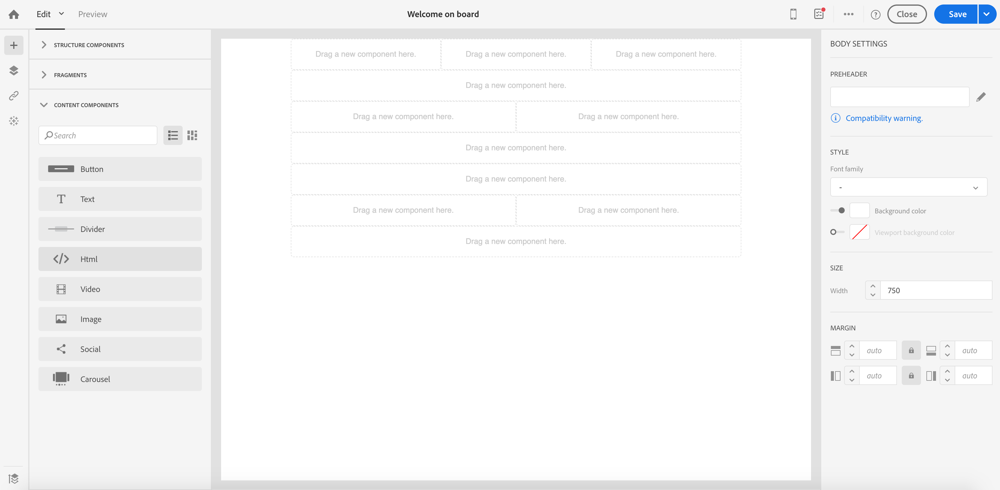
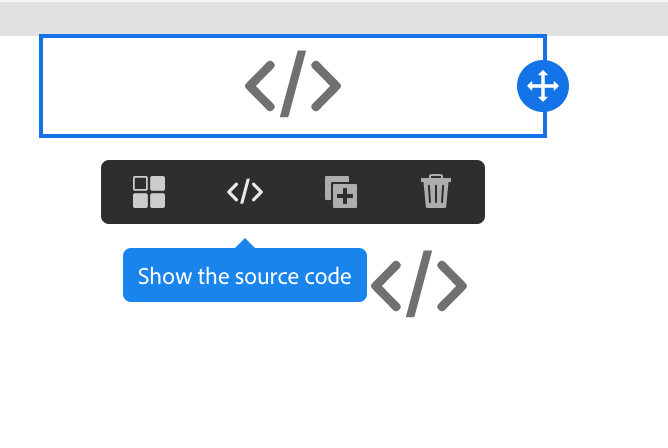

# Conversione del contenuto delle e-mail dell&#39;editor legacy {#converting-an-html-content}

Iniziate a utilizzare e-mail Designer e create modelli e frammenti riutilizzabili dal codice HTML dell&#39;e-mail creato nell&#39;editor legacy.

Questo caso d&#39;uso consente di creare un modello di E-mail Designer utilizzando un&#39;e-mail HTML e dividendolo in componenti HTML in Designer e-mail.

>[!NOTE]
>
>Come la modalità di compatibilità, un componente HTML è modificabile con opzioni limitate: è possibile eseguire solo edizioni interne.

>[!IMPORTANT]
>
>Questa sezione è destinata agli utenti esperti che hanno familiarità con il codice HTML.

## Preparazione del contenuto delle e-mail

1. Selezionate un messaggio e-mail HTML.
1. Identificare le sezioni per dividere l’e-mail HTML.
1. Rimuovete i diversi blocchi dal codice HTML.

## Creare la struttura delle e-mail

1. Aprite l&#39;e-mail **[!UICONTROL Email Designer]** per creare un contenuto e-mail vuoto.
1. Impostate gli attributi a livello di corpo: colori di sfondo, larghezza, ecc. Per ulteriori informazioni, consulta [Modifica degli stili delle e-mail](../../designing/using/styles.md).
1. Aggiungete tutti i componenti della struttura disponibili. Per ulteriori informazioni, consulta [Modifica della struttura delle e-mail](../../designing/using/designing-from-scratch.md#defining-the-email-structure).

## Aggiunta di contenuto HTML

1. Aggiungete un componente HTML a ciascun componente struttura. Per ulteriori informazioni, consulta [Aggiunta di frammenti e componenti](../../designing/using/designing-from-scratch.md#defining-the-email-structure).
1. Copiate e incollate il codice HTML in ogni componente.

## Gestione dello stile dell’e-mail {#manage-the-style-of-your-email}

1. Passa a **[!UICONTROL Mobile view]**. Per ulteriori informazioni, consulta [questa sezione](../../designing/using/plain-text-html-modes.md#switching-to-mobile-view).

1. Per risolvere il problema, passare alla modalità codice sorgente e copiare e incollare la sezione di stile in una nuova sezione di stile. Ad esempio:

   ```
   <style type="text/css">
   a {text-decoration:none;}
   body {min-width:100% !important; margin:0 auto !important; padding:0 !important;}
   img {line-height:100%; text-decoration:none; -ms-interpolation-mode:bicubic;}
   ...
   </style>
   ```

   >[!NOTE]
   >
   >Accertatevi di aggiungere lo stile dopo questo in un altro tag di stile personalizzato.
   >
   >Non modificate il CSS generato da Designer e-mail:
   >
   >* `<style data-name="default" type="text/css">(##)</style>`
   >* `<style data-name="supportIOS10" type="text/css">(##)</style>`
   >* `<style data-name="mediaIOS8" type="text/css">(##)</style>`
   >* `<style data-name="media-default-max-width-500px" type="text/css">(##)</style>`
   >* `<style data-name="media-default--webkit-min-device-pixel-ratio-0" type="text/css">(##)</style>`


1. Tornate alla visualizzazione mobile per verificare che il contenuto sia correttamente visualizzato e salvare le modifiche.

## Caso di utilizzo

Proviamo a convertire questo messaggio e-mail, creato nell’editor legacy, in un **[!UICONTROL Email Designer]** modello.

### Identificare la sezione del messaggio e-mail

In questa e-mail possiamo identificare 11 sezioni.


Per identificare quale elemento è la sezione dell’HTML, potete selezionarla.


Per visualizzare la versione HTML del messaggio e-mail, fate clic su **[!UICONTROL Show source]**.

### Creare il modello e-mail e la relativa struttura

1. Trascinate e rilasciate **[!UICONTROL Structure components]** il layout del messaggio e-mail.

1. Ripetere la procedura il numero di volte necessario. Dobbiamo creare 11 componenti della struttura.

   

### Inserimento di componenti di contenuto HTML

1. Inserite un **[!UICONTROL HTML component]** elemento in ogni **[!UICONTROL Structure component]** .

   

1. Per ciascuna sezione, fate clic su **[!UICONTROL Show source code]** .

   

1. Inserite la sezione HTML.

1. Fai clic su **[!UICONTROL Save]**.

Ora potete controllare il rendering dell&#39;e-mail.


### Gestione degli stili per adattarli alla visualizzazione mobile

1. Inserite elementi CSS per assicurarvi che il messaggio e-mail sia adatto alla visualizzazione mobile.

1. Passate al codice sorgente e copiate e incollate la sezione di stile in una nuova sezione di stile.

Per ulteriori informazioni, consulta [Gestione dello stile delle e-mail](#manage-the-style-of-your-email).

L&#39;e-mail precedente è ora disponibile in Designer e-mail.