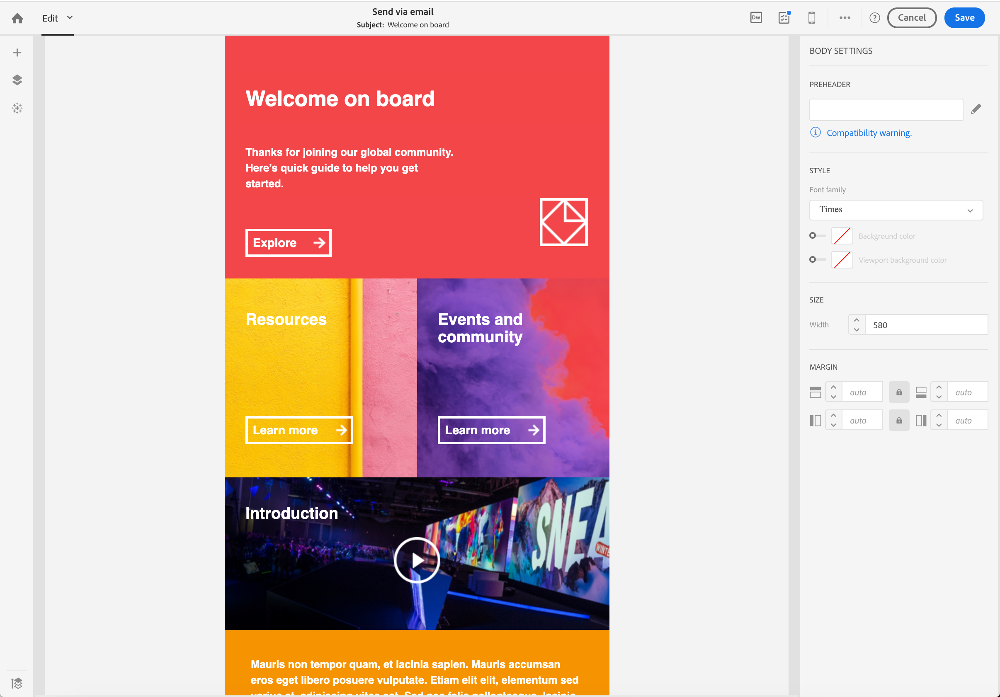

# Conversione di contenuti e-mail da editor legacy {#converting-an-html-content}

Inizia a utilizzare E-mail Designer e crea modelli e frammenti riutilizzabili dal tuo HTML e-mail creato nell’Editor legacy.

Questo caso d’uso consente di creare un modello di E-mail designer utilizzando un’e-mail HTML e suddividendola in componenti HTML in E-mail Designer.

>[!NOTE]
>
>Analogamente alla modalità di compatibilità, un componente HTML può essere modificato con opzioni limitate: è possibile eseguire solo l’edizione sul posto.

>[!IMPORTANT]
>
>Questa sezione è destinata agli utenti avanzati che hanno familiarità con il codice HTML.

## Preparazione del contenuto dell’e-mail

1. Seleziona un messaggio e-mail di HTML.
1. Identifica le sezioni per dividere l’e-mail di HTML.
1. Taglia i diversi blocchi dal tuo HTML.

## Creare la struttura delle e-mail

1. Apri **[!UICONTROL Email Designer]**  per creare un contenuto e-mail vuoto.
1. Imposta gli attributi del livello del corpo: colori di sfondo, larghezza, ecc. Per ulteriori informazioni, consulta [Modifica degli stili delle e-mail](../../designing/using/styles.md).
1. Aggiungi tutti i componenti struttura che hai nelle sezioni. Per ulteriori informazioni, consulta [Modifica della struttura delle e-mail](../../designing/using/designing-from-scratch.md#defining-the-email-structure).

## Aggiungi contenuto HTML

1. Aggiungi un componente HTML a ciascun componente struttura. Per ulteriori informazioni, consulta [Aggiunta di frammenti e componenti](../../designing/using/designing-from-scratch.md#defining-the-email-structure).
1. Copia e incolla il HTML in ogni componente.

## Gestire lo stile dell’e-mail {#manage-the-style-of-your-email}

1. Passa a **[!UICONTROL Mobile view]**. Per ulteriori informazioni, consulta [questa sezione](../../designing/using/plain-text-html-modes.md#switching-to-mobile-view).

1. Per risolvere questo problema, passa alla modalità codice sorgente e copia e incolla la sezione di stile in una nuova sezione di stile. Ad esempio:

   ```
   <style type="text/css">
   a {text-decoration:none;}
   body {min-width:100% !important; margin:0 auto !important; padding:0 !important;}
   img {line-height:100%; text-decoration:none; -ms-interpolation-mode:bicubic;}
   ...
   </style>
   ```

   >[!NOTE]
   >
   >Assicurati di aggiungere il tuo stile dopo in un altro tag di stile personalizzato.
   >
   >Non modificare il CSS generato da E-mail Designer:
   >
   >* `<style data-name="default" type="text/css">(##)</style>`
   >* `<style data-name="supportIOS10" type="text/css">(##)</style>`
   >* `<style data-name="mediaIOS8" type="text/css">(##)</style>`
   >* `<style data-name="media-default-max-width-500px" type="text/css">(##)</style>`
   >* `<style data-name="media-default--webkit-min-device-pixel-ratio-0" type="text/css">(##)</style>`


1. Torna alla visualizzazione per dispositivi mobili per verificare che il contenuto sia visualizzato correttamente e salvare le modifiche.

## Caso d’uso

Proviamo a convertire questa e-mail, creata nell’editor legacy, in un **[!UICONTROL Email Designer]** modello.

### Identifica la sezione dell’e-mail

In questa e-mail possiamo identificare 11 sezioni.


Per identificare l’elemento che rappresenta la sezione del HTML, puoi selezionarlo.


Per visualizzare la versione HTML dell’e-mail, fai clic su **[!UICONTROL Show source]**.

### Creare il modello e-mail e la relativa struttura

1. Trascina **[!UICONTROL Structure components]**  che riflette il layout dell’e-mail.

1. Ripetere il numero di volte necessario. Dobbiamo creare 11 componenti struttura.

   

### Inserimento di componenti di contenuto HTML

1. Inserisci un **[!UICONTROL HTML component]**  in ogni **[!UICONTROL Structure component]** .

   

1. Per ogni sezione, fai clic su **[!UICONTROL Show source code]** .

   

1. Inserisce la sezione HTML.

1. Fai clic su **[!UICONTROL Save]**.

Ora puoi controllare il rendering dell’e-mail.



### Gestione degli stili per adattarli alla vista mobile

1. Inserisci elementi CSS per garantire che l’e-mail sia adatta alla visualizzazione per dispositivi mobili.

1. Passa al codice sorgente e copia e incolla la sezione di stile in una nuova sezione di stile.

Per ulteriori informazioni, consulta [Gestire lo stile dell’e-mail](#manage-the-style-of-your-email).

L’e-mail legacy è ora disponibile in E-mail Designer.
