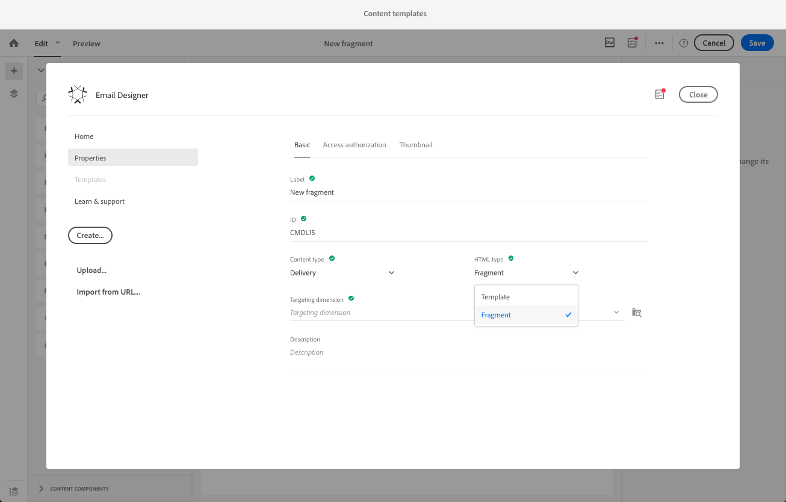

# Definizione della struttura e-mail{#defining-the-email-structure}

## Modifica della struttura e-mail {#editing-the-email-structure}

Designer consente di definire facilmente la struttura dell'e-mail. Aggiungendo e spostando elementi strutturali con azioni semplici trascinate, potete progettare la forma dell'e-mail in secondi.

Per modificare la struttura di un messaggio e-mail:

1. Aprite un contenuto esistente o create un nuovo contenuto e-mail.
1. Potete accedere all' **[!UICONTROL Structure components]** icona **facendo** clic sull'icona + a sinistra.

   

1. Trascina e rilascia i componenti struttura necessari per la forma dell'e-mail.

   

   Una linea blu materializza la posizione esatta dei componenti struttura prima di rilasciarla. Potete rilasciarlo sopra, tra o sotto qualsiasi altro componente, ma non all'interno.

   >[!NOTE]
   >
   >Una volta inserito nell'e-mail, non è possibile spostare né rimuovere i componenti a meno che non sia già presente un componente contenuto o un frammento all'interno.

1. Sono disponibili diversi componenti struttura composti di una o più colonne.

   Selezionate **[!UICONTROL n:n column]** il componente per definire il numero di colonne desiderato (tra 3 e 10). Potete anche definire la larghezza di ciascuna colonna spostando le frecce nella parte inferiore di ciascuna colonna.

   

   >[!NOTE]
   >
   >Ogni dimensione di colonna non può essere inferiore al 10% della larghezza totale del componente struttura. Non è possibile rimuovere una colonna non vuota.

Una volta definita la struttura, puoi aggiungere frammenti di contenuto e componenti all'e-mail.

## Aggiunta di frammenti e componenti di contenuto {#adding-fragments-and-content-components}

Con Designer Designer, dopo l'aggiunta di componenti struttura all'e-mail, è possibile definirne il contenuto. A tal fine, dovete aggiungere elementi all'interno di ciascun componente struttura.

Esistono due categorie di elementi di contenuto utilizzabili: **frammenti** e **componenti di contenuto**.

### Informazioni sui frammenti {#about-fragments}

Un frammento è un componente riutilizzabile a cui è possibile fare riferimento in una o più e-mail.

Per utilizzare al meglio i frammenti in E-mail Designer:

* Creare i propri frammenti. Vedere [Creazione di un frammento di contenuto](../../designing/using/defining-the-email-structure.md#creating-a-content-fragment) e [Salvataggio del contenuto come frammento](../../designing/using/defining-the-email-structure.md#saving-content-as-a-fragment).
* Utilizzateli il numero di volte necessario nelle e-mail. Consultate [Inserimento di elementi in un messaggio e-mail](../../designing/using/defining-the-email-structure.md#inserting-elements-into-an-email).
* Quando si modifica un frammento, le modifiche vengono sincronizzate: vengono propagate automaticamente a tutte le e-mail (purché non siano state ancora preparate o inviate) contenente tale frammento.

Quando viene aggiunto a un messaggio e-mail, i frammenti sono bloccati per impostazione predefinita. Se si desidera modificare un frammento per un'e-mail specifica, è possibile interrompere la sincronizzazione con il frammento originale sbloccandola nell'e-mail in cui viene utilizzata. Le modifiche non verranno più sincronizzate.

Per sbloccare un frammento all'interno di un messaggio e-mail, selezionarlo e fare clic sull'icona a forma di lucchetto dalla barra degli strumenti contestuale.

Tale frammento diventa un componente standalone non collegato più al frammento originale. Può quindi essere modificato come qualsiasi altro componente di contenuto. Consultate [Informazioni sui componenti di contenuto](../../designing/using/defining-the-email-structure.md#about-content-components).

### Informazioni sui componenti contenuto {#about-content-components}

I componenti Contenuto sono componenti grezzi e vuoti che possono essere modificati una volta inserito in un'e-mail.

Potete aggiungere quanti componenti di contenuto desiderate in un componente struttura. Potete anche spostarle all'interno del componente Struttura o in un altro componente struttura.

Di seguito è riportato l'elenco dei componenti disponibili in E-mail Designer:

* **[!UICONTROL Button]**

   Se devi usare più pulsanti, anziché modificare ciascun pulsante da zero, puoi duplicare il **[!UICONTROL Button]** componente utilizzando la barra degli strumenti contestuale.

   È inoltre possibile salvare i pulsanti in frammenti che possono essere riutilizzati. Per ulteriori informazioni, vedere [Creazione di un frammento di contenuto](../../designing/using/defining-the-email-structure.md#creating-a-content-fragment) e [Salvataggio del contenuto come frammento](../../designing/using/defining-the-email-structure.md#saving-content-as-a-fragment).

* **[!UICONTROL Carousel]**

   Per ulteriori informazioni, consultate [Utilizzo del componente Carosello](../../designing/using/defining-the-email-structure.md#using-the-carousel-component).

* **[!UICONTROL Divider]**
* **[!UICONTROL Html]**

   Utilizzate questo componente per copiare e incollare le diverse parti dell'HTML esistente. Questo consente di creare componenti HTML modulari gratuiti.

   >[!NOTE]
   >
   >Un componente HTML gratuito è modificabile con opzioni limitate. Se tutti gli stili non sono allineati, accertatevi di aggiungere il CSS corretto nella **sezione head** del codice HTML, in caso contrario l'e-mail non sarà reattiva. Utilizzare **[!UICONTROL Preview]** il pulsante per verificare la capacità di risposta dei contenuti (vedere [Anteprima dei messaggi](../../sending/using/previewing-messages.md)).

* **[!UICONTROL Image]**
* **[!UICONTROL Social]**
* **[!UICONTROL Text]**

#### Utilizzo del componente carosello {#using-the-carousel-component}

1. Trascinare e rilasciare il **[!UICONTROL Carousel]** componente all'interno di un componente struttura.
1. Sfogliate le immagini dal computer.

   

1. Nel **[!UICONTROL Settings]** riquadro, impostate il numero di miniature desiderato nel carosello.
1. Seleziona un'immagine di fallback dal computer.

   

   Il componente Carosello non è compatibile con tutti i programmi e-mail. Caricate un fallback per visualizzare un'immagine quando il carosello non è supportato nell'e-mail.

   >[!NOTE]
   >
   >Il componente Carosello è compatibile con le seguenti piattaforme e-mail: Apple Mail 7, Apple Mail 8, Outlook 2011 per Mac, Outlook 2016 per Mac, Mozilla Thunderbird, ipad e ipad mini iOS, iphone iOS, Android, AOL (Chrome, Firefox e Safari).

1. Selezionare **[!UICONTROL Fallback view]** per visualizzare l'immagine di fallback in E-mail Designer.

### Inserimento di elementi in un'e-mail {#inserting-elements-into-an-email}

Per definire il contenuto dell'e-mail, potete aggiungere elementi di contenuto nei componenti di struttura che avete posizionato in anticipo. Consultate [Modifica della struttura e-mail](../../designing/using/defining-the-email-structure.md#editing-the-email-structure).

1. Per accedere agli elementi del contenuto, seleziona l'icona **+** a sinistra. Selezionare [Frammenti](../../designing/using/defining-the-email-structure.md#about-fragments) o [Componenti contenuto](../../designing/using/defining-the-email-structure.md#about-content-components).
1. Se si conosce già l'etichetta o parte dell'etichetta del frammento che si desidera aggiungere, è possibile cercarla.

   

1. Trascinare un frammento o un componente di contenuto dalla palette a un componente struttura del messaggio e-mail.

   

   Una volta aggiunto un elemento all'e-mail, può essere spostato all'interno del componente struttura o in un altro componente struttura nell'e-mail.

   

1. Modificate l'elemento in base alle esigenze esatte di questa e-mail. Potete aggiungere testo, collegamenti, immagini e così via.

   >[!NOTE]
   >
   >I frammenti sono bloccati per impostazione predefinita se aggiunti a un'e-mail. Se si desidera modificare il frammento per un'e-mail o apportare modifiche direttamente al frammento, è possibile interrompere la sincronizzazione con il frammento originale. Vedere [Informazioni sui frammenti](../../designing/using/defining-the-email-structure.md#about-fragments).

1. Ripetete questa procedura per tutti gli elementi da aggiungere all'e-mail.
1. Salva l'e-mail.

Una volta popolata la struttura e-mail, potete modificare lo stile di ogni elemento di contenuto. Consultate [Modifica di un elemento](../../designing/using/editing-email-styles.md#editing-an-element).

>[!NOTE]
>
>Se un frammento viene modificato, le modifiche vengono propagate automaticamente nelle e-mail in cui viene utilizzata. Per ulteriori informazioni, vedere [Informazioni sui frammenti](../../designing/using/defining-the-email-structure.md#about-fragments).

### Creazione di un frammento di contenuto {#creating-a-content-fragment}

Puoi creare frammenti di contenuto personalizzati per utilizzarli in base alle esigenze in una o più e-mail.

1. Vai a **[!UICONTROL Resources]** &gt; e **[!UICONTROL Content templates & fragments]** fai clic **[!UICONTROL Create]** su.
1. Fare clic sull'etichetta e-mail per accedere alla **[!UICONTROL Properties]** scheda di Email Designer.
1. Specificare un'etichetta riconoscibile e selezionare i seguenti parametri per trovare il frammento più tardi nelle nuove e-mail:

   * Poiché i frammenti sono compatibili solo con le e-mail, selezionarli **[!UICONTROL Delivery]** dall'elenco **[!UICONTROL Content type]** a discesa.
   * Selezionare **[!UICONTROL Fragment]** dall'elenco **[!UICONTROL HTML type]** a discesa per utilizzare il contenuto come frammento nelle e-mail.
   

1. Se necessario, è possibile impostare un'immagine che verrà utilizzata come miniatura per il frammento. Selezionarlo dalla **[!UICONTROL Thumbnail]** scheda delle proprietà del modello.

   

   La miniatura verrà visualizzata accanto all'etichetta del frammento quando si modifica un messaggio e-mail.

1. Salvate le modifiche per tornare all'area di lavoro principale.
1. Aggiungere un componente struttura e un componente di contenuto personalizzabili in base alle esigenze.
1. Una volta modificato, salvare il frammento.

Il frammento può essere utilizzato in qualsiasi messaggio e-mail creato con E-mail Designer. Viene visualizzata sotto la **[!UICONTROL Fragments]** sezione della palette.

>[!NOTE]
>
>Non è possibile inserire campi personalizzati all'interno di un frammento, a meno che non sia utilizzato nell'e-mail. A tal fine, è necessario sbloccare il frammento. Vedere [Informazioni sui frammenti](../../designing/using/defining-the-email-structure.md#about-fragments).

### Salvataggio del contenuto come frammento {#saving-content-as-a-fragment}

Durante la modifica di un'e-mail con Posta elettronica, è possibile salvare direttamente parte dell'e-mail come frammento.

>[!CAUTION]
>
>Non è possibile salvare come frammento una struttura contenente campi di personalizzazione, contenuto dinamico o un altro frammento.

1. Quando si modifica un'e-mail in Designer e-mail, selezionare **[!UICONTROL Save as fragment]** dalla barra degli strumenti principale.

   

1. Dall'area di lavoro, selezionare le strutture che compongono il frammento.

   

   >[!NOTE]
   >
   >È possibile selezionare solo strutture adiacenti tra loro.

1. Click **[!UICONTROL Create]**.

1. Aggiungi un'etichetta e una descrizione, se necessario, quindi fai clic **[!UICONTROL Save]** su.

   

1. Per trovare il frammento appena creato, passare **[!UICONTROL Resources]** a &gt; **[!UICONTROL Content templates & fragments]**.

   

1. Per utilizzare il nuovo frammento, aprire qualsiasi contenuto e-mail e selezionarlo dall'elenco dei frammenti.

<!--You need to copy-paste the HTML corresponding to the section that you want to save into a new fragment.

>[!NOTE]
>
>To do this, you need to be familiar with HTML code.

To save as a fragment some email content that you created, follow the steps below.

1. When editing an email in the Email Designer, select **[!UICONTROL Edit]** > **[!UICONTROL HTML]** to open the HTML version of that email.
1. Select and copy the HTML corresponding to the part that you want to save.
1. Go to **[!UICONTROL Resources]** > **[!UICONTROL Content templates & fragments]** and click **[!UICONTROL Create]**.
1. Click the email label to access the **[!UICONTROL Properties]** tab of the Email Designer and select **[!UICONTROL Fragment]** from the **[!UICONTROL HTML type]** drop-down list.
1. Select **[!UICONTROL Edit]** > **[!UICONTROL HTML]** to open the HTML version of the fragment.
1. Paste the HTML that you copied where appropriate.
1. Switch back to the **[!UICONTROL Edit]** view to check the result and save the new fragment.-->

