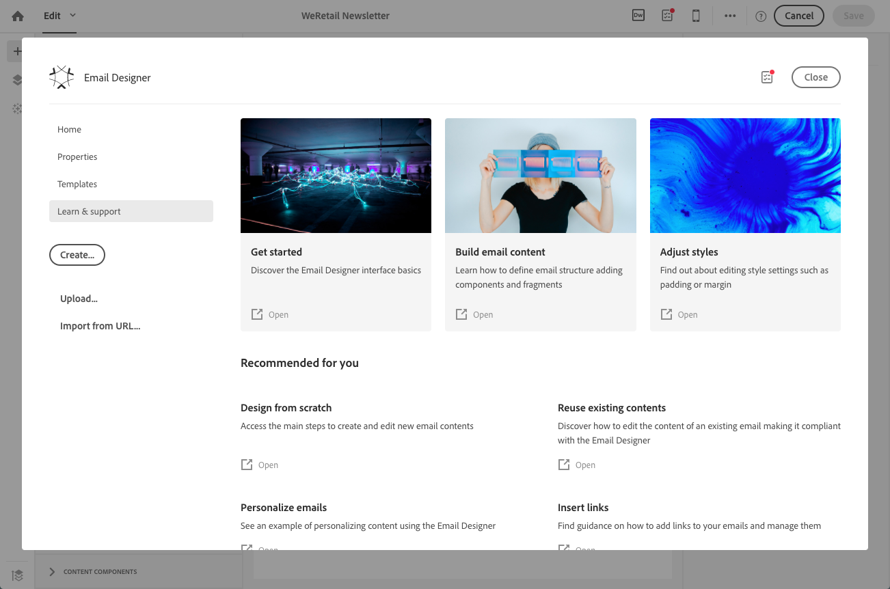

# E-mail Designer di Campaign{#designing-content-in-adobe-campaign}

Dopo aver creato un’e-mail in  Adobe Campaign, è necessario definirne il contenuto.

Email Designer consente di creare e-mail accattivanti e personalizzate attraverso un&#39;interfaccia a trascinamento. Sia che stiate partendo da una lavagna vuota, o sfruttando frammenti di contenuto o modelli esistenti, progettate e perfezionate tutti i contenuti per ogni e-mail, sia essa promozionale o transazionale.

Progettato per fornire HTML ottimizzati per la progettazione reattiva, e-mail Designer consente di definire e applicare facilmente condizioni di visibilità e contenuto dinamico a un&#39;e-mail, a un modello o a un frammento direttamente tramite l&#39;interfaccia utente. Puoi passare direttamente dall’interfaccia di trascinamento al codice HTML facendo clic su un pulsante.

Designer e-mail consente di creare contenuti e modelli di contenuto e-mail. È compatibile con e-mail semplici, e-mail transazionali, e-mail di test A/B, e-mail in più lingue ed e-mail ricorrenti.

Per iniziare a utilizzare e-mail Designer, guarda questo [set di video](https://docs.adobe.com/content/help/en/campaign-learn/campaign-standard-tutorials/designing-content/email-designer/email-designer-overview.html#GettingStarted) che illustrano le funzionalità generali di e-mail Designer e come progettare un&#39;e-mail da zero o utilizzando i modelli.

<!--The Email Designer has more features than the Legacy Editor and is backward compatible.-->

* Per informazioni su come creare contenuti e-mail, vedere [Guida introduttiva a Designer](../../designing/using/quick-start.md)e-mail.
* Per una panoramica di Progettazione e-mail, vedere [Uso di Designer](../../designing/using/designing-content-in-adobe-campaign.md)e-mail.
* Per ulteriori informazioni sulla creazione di contenuto:
   * Da zero, consulta [Progettazione di e-mail da zero](../../designing/using/designing-from-scratch.md).
   * Utilizzando il contenuto esistente, consultate [Progettazione con contenuto](../../designing/using/using-existing-content.md)esistente.
   * Utilizzando le integrazioni di Creative Cloud, consultate [Progettazione](../../designing/using/using-integrations.md)di e-mail con più soluzioni.
* Per ulteriori informazioni sulla personalizzazione, consulta [Personalizzazione](../../designing/using/personalization.md).

Quando create un messaggio e-mail, potete scegliere di utilizzare un modello predefinito o di caricare un contenuto esistente da un’altra origine. Consultate [Selezione di un contenuto](../../designing/using/using-existing-content.md#selecting-an-existing-content)esistente.

Per aumentare l&#39;efficienza delle campagne di marketing, personalizza i tuoi contenuti. Consultate [Inserimento di un campo](../../designing/using/personalization.md#inserting-a-personalization-field) di personalizzazione e [Aggiunta di un blocco](../../designing/using/personalization.md#adding-a-content-block)di contenuto.

Potete anche definire contenuti dinamici che variano a seconda di ciascun profilo. Consultate [Definizione del contenuto dinamico in un’e-mail](../../designing/using/personalization.md#defining-dynamic-content-in-an-email) e [Definizione del contenuto dinamico in una pagina](../../channels/using/designing-a-landing-page.md#defining-dynamic-content-in-a-landing-page)di destinazione.

Ottimizza i tuoi messaggi e le pagine di destinazione con collegamenti e immagini. Consultate [Inserimento di un collegamento](../../designing/using/links.md#inserting-a-link) e [Inserimento di immagini](../../designing/using/images.md#inserting-images).

## Interfaccia di Progettazione e-mail {#email-designer-interface}

Designer e-mail offre diverse opzioni che consentono di creare, modificare e personalizzare ogni aspetto del contenuto.

L&#39;interfaccia è composta da diverse aree che offrono diverse funzionalità:

Dagli elementi disponibili nella **palette** (1), trascinare componenti di struttura e frammenti di contenuto nell’ **area di lavoro** principale (2). Selezionate un componente o un elemento in **Workspace** (2) e personalizzatene lo stile principale e le caratteristiche di visualizzazione dal riquadro **Impostazioni** (3).

Accesso alle opzioni e alle impostazioni generali dalla **barra degli strumenti** principale (4).

>[!NOTE]
>
>Il riquadro **Impostazioni** può spostarsi a sinistra in base alla risoluzione e alla visualizzazione dello schermo.

La barra degli strumenti **contestuale** dell’interfaccia dell’editor offre diverse funzionalità a seconda della zona selezionata. Contiene i pulsanti di azione e i pulsanti che ti consentono di modificare lo stile del testo. Le modifiche effettuate si applicano sempre alla zona selezionata.

### Pagina principale di Designer e-mail {#email-designer-home-page}

Quando [create un messaggio e-mail](../../channels/using/creating-an-email.md), la pagina principale viene visualizzata automaticamente quando si seleziona il contenuto dell&#39;e-mail **[!UICONTROL Email Designer]** .

La **[!UICONTROL Properties]** scheda consente di modificare i dettagli dell&#39;e-mail, ad esempio l&#39;etichetta, l&#39;indirizzo e il nome del mittente o l&#39;oggetto dell&#39;e-mail. Per accedere a questa scheda, fai clic sull’etichetta dell’e-mail nella parte superiore dello schermo.

La **[!UICONTROL Templates]** scheda consente di scegliere tra i contenuti HTML predefiniti o i modelli già creati per iniziare rapidamente a progettare l’e-mail. Consultate Modelli [di](../../designing/using/using-reusable-content.md#content-templates)contenuto.

La **[!UICONTROL Learn & support]** scheda consente di accedere facilmente alla documentazione e alle esercitazioni correlate.

Se non si seleziona un modello, la home page di Designer e-mail consente inoltre di scegliere come iniziare a progettare il contenuto:

* Fate clic sul **[!UICONTROL Create]** pulsante per iniziare un nuovo contenuto da zero. Consultate [Progettazione di contenuti e-mail da zero](../../designing/using/designing-from-scratch.md#designing-an-email-content-from-scratch).
* Fate clic sul **[!UICONTROL Upload]** pulsante per caricare un file dal computer. Consultate [Importazione di contenuto da un file](../../designing/using/using-existing-content.md#importing-content-from-a-file).
* Fate clic sul **[!UICONTROL Import from URL]** pulsante per recuperare il contenuto esistente da un URL. Consultate [Importazione di contenuto da un URL](../../designing/using/using-existing-content.md#importing-content-from-a-url).

## Terminologia {#terminology}

**Modelli**: I modelli sono strutture di e-mail che potete creare e riutilizzare per diverse consegne.

**Frammenti**: Un frammento è un componente riutilizzabile a cui è possibile fare riferimento in una o più e-mail.

**Componenti** struttura: Elementi strutturali che definiscono il layout del messaggio e-mail.

**Componenti** contenuto: I componenti contenuto sono componenti vuoti e non elaborati che possono essere modificati una volta inseriti in un messaggio e-mail.

## Best practice per la progettazione dei contenuti {#content-design-best-practices}

Per utilizzare in modo appropriato il Designer e-mail e creare le e-mail migliori il più semplicemente possibile, si consiglia di applicare i seguenti principi:

* Utilizzate lo stile in linea anziché CSS e CSS separati nella sezione &lt;head> dell&#39;HTML. Utilizzando lo stile in linea, è possibile ottimizzare il salvataggio e il riutilizzo dei frammenti di contenuto.

   Consultate [Aggiunta di attributi](../../designing/using/styles.md#adding-inline-styling-attributes)di stile in linea.

* Se importate dei file ZIP contenenti contenuto HTML, utilizzate i normali CSS. I fogli di stile SCSS non sono supportati.

* Puoi impostare facilmente il tuo marchio creando e riutilizzando frammenti di contenuto per mantenere la coerenza tra le campagne di marketing.

   Vedere [Creazione di un frammento](../../designing/using/using-reusable-content.md#creating-a-content-fragment)di contenuto.

* Durante la modifica del contenuto **** e-mail:

   Visualizzate l&#39;anteprima dei messaggi prima di inviarli.  Adobe Campaign offre un modo per testare il rendering delle e-mail tramite Litmus. Per ulteriori informazioni, consultate Rendering [e-](../../sending/using/email-rendering.md)mail.

Una maggiore progettazione e best practice generali per i messaggi sono presentate nella sezione seguente: [Best practice](../../sending/using/delivery-best-practices.md)di distribuzione.

### Aggiornamento dei frammenti {#email-designer-updates}

E-mail Designer è in continuo miglioramento. Se avete creato un contenuto e-mail da zero, da un modello preconfigurato o se avete creato dei frammenti, alla successiva apertura del contenuto potreste visualizzare il seguente messaggio di aggiornamento:

 Adobe consiglia di aggiornare il contenuto alla versione più recente per evitare problemi quali problemi di collisione CSS. Fai clic su **[!UICONTROL Update now]**.

Se si verifica un errore durante l&#39;aggiornamento del contenuto, controllate il codice HTML e correggetelo prima di eseguire di nuovo l&#39;aggiornamento.

Per quanto riguarda i frammenti, tenere presente quanto segue:

* Se si desidera aggiungere un frammento a un nuovo indirizzo e-mail o modello e se si riceve questo messaggio, è necessario aggiornare prima il frammento.

* Se si dispone di più frammenti, è necessario aggiornare ogni frammento che si desidera utilizzare in un contenuto e-mail.

* Per evitare l’impatto sugli attuali messaggi e-mail non ancora preparati, è possibile scegliere di non aggiornare alcuni frammenti.

* È comunque possibile inviare e-mail in cui un frammento non aggiornato è già utilizzato, ma tale frammento non è modificabile.

* L&#39;aggiornamento dei frammenti utilizzati nelle e-mail già preparate non ha alcun impatto su tali e-mail.

## Limiti di Email Designer {#email-designer-limitations}

* Non è possibile utilizzare campi di personalizzazione in un frammento. For more on fragments, see [this section](../../designing/using/using-reusable-content.md#about-fragments).

<!--* You cannot save directly as a fragment some content of an email that you are editing within the Email Designer. You need to copy-paste the HTML corresponding to that content into a new fragment. For more on this, see [Saving content as a fragment](../../designing/using/using-reusable-content.md#saving-content-as-a-fragment).-->

* Durante la modifica degli stili, sono disponibili solo i font Web ufficialmente supportati dalla maggior parte dei client e-mail.
* Non è possibile salvare gli stili come tema da riutilizzare in futuro. Tuttavia, lo stile CSS può essere salvato in un modello di contenuto o in un messaggio e-mail. For more on styles, see [this section](../../designing/using/styles.md).
* Il tag meta del referente non è supportato nella finestra di progettazione e-mail.
* Le coppie sostitutive, i caratteri non inclusi nel piano multilingue di base del set di caratteri Unicode, non possono essere memorizzati in 2 byte (16 bit) e devono essere codificati in 2 caratteri UTF-16. Questi caratteri includono alcuni ideogrammi CJK, la maggior parte delle emoticon e alcune lingue. Questi caratteri possono causare problemi di incompatibilità nel testo dinamico. Prima di inviare i messaggi è necessario eseguire dei test rigorosi.

**Argomenti correlati**

* [Creazione di un messaggio e-mail](../../channels/using/creating-an-email.md)
* [Progettazione di una pagina di destinazione](../../channels/using/designing-a-landing-page.md)
* [Creazione di un messaggio SMS](../../channels/using/creating-an-sms-message.md)
* [Preparazione e invio di una notifica push](../../channels/using/preparing-and-sending-a-push-notification.md)
