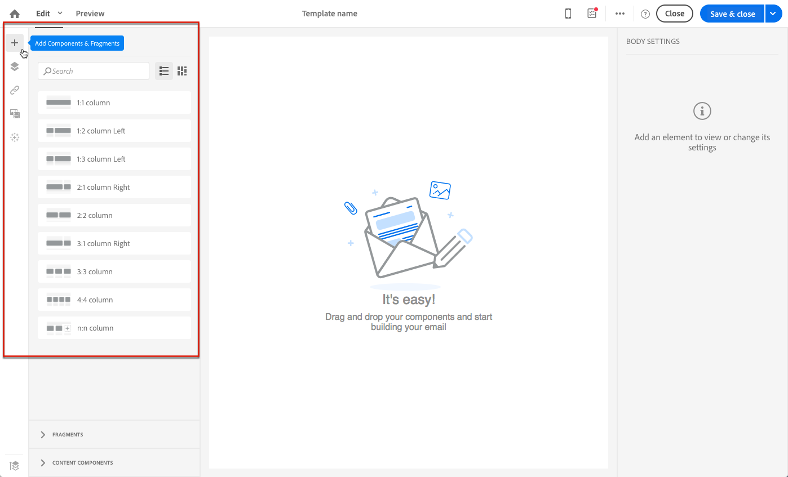
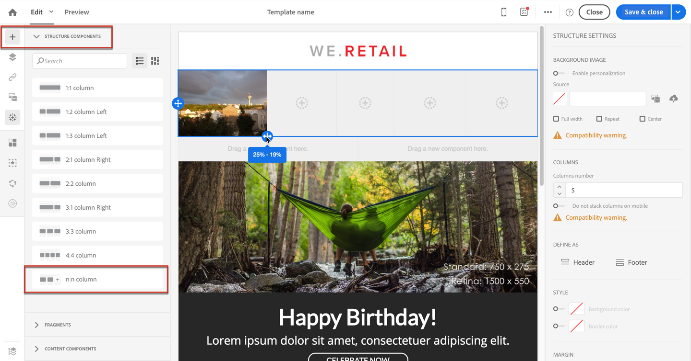

# Progettazione di e-mail da zero {#designing-an-email-content-from-scratch}

Scopri come gestire l’edizione del contenuto delle e-mail. Con E-mail Designer è possibile creare e-mail e modelli a partire da o senza contenuti predefiniti.

Di seguito sono riportati i passaggi principali per creare e progettare un contenuto e-mail da zero utilizzando E-mail Designer:

1. Crea un’e-mail e apri il relativo contenuto.
1. Aggiungi componenti struttura per modellare l’e-mail. Vedi [Modifica della struttura delle e-mail](#defining-the-email-structure).
1. Inserire componenti di contenuto e frammenti nei componenti struttura. Vedi [Aggiunta di frammenti e componenti di contenuto](#defining-the-email-structure).
1. Aggiungi immagini e modifica il testo dell’e-mail. Vedi [Inserimento di immagini](../../designing/using/images.md#inserting-images).
1. Personalizza la tua e-mail aggiungendo campi di personalizzazione, collegamenti e così via. Vedi [Inserimento di un campo di personalizzazione](../../designing/using/personalization.md#inserting-a-personalization-field), [Inserimento di un collegamento](../../designing/using/links.md#inserting-a-link) e [Definizione del contenuto dinamico in un messaggio e-mail](../../designing/using/personalization.md#defining-dynamic-content-in-an-email).
1. Definisci l’oggetto del messaggio e-mail. Vedi [Personalizzazione dell’oggetto di un messaggio e-mail](../../designing/using/subject-line.md#defining-the-subject-line-of-an-email).
1. Visualizzare l’anteprima del messaggio e-mail.
1. Salva il contenuto e continua con il messaggio dopo aver verificato di aver definito un pubblico e pianificato correttamente l’invio.

Puoi anche controllare questo [video introduttivo](https://video.tv.adobe.com/v/22771/?autoplay=true&hidetitle=true).

>[!NOTE]
>
>Per evitare di progettare contenuti e-mail da zero, puoi utilizzare modelli di contenuto predefiniti. Per ulteriori informazioni, consulta [Modelli di contenuto](../../designing/using/using-reusable-content.md#content-templates).

## Definizione della struttura e-mail {#defining-the-email-structure}

>[!CONTEXTUALHELP]
>id="ac_structure_components"
>title="Informazioni sui componenti struttura"
>abstract="I componenti struttura definiscono il layout del messaggio e-mail."

>[!CONTEXTUALHELP]
>id="ac_edition_columns"
>title="Definizione delle colonne nell’e-mail"
>abstract="E-mail Designer consente di definire facilmente il layout dell’e-mail definendone la struttura a colonne."

E-mail Designer consente di definire facilmente la struttura delle e-mail. Aggiungendo e spostando elementi strutturali con semplici azioni di trascinamento, puoi progettare la forma del messaggio e-mail in pochi secondi.

Per modificare la struttura di un messaggio e-mail:

1. Apri un contenuto esistente o crea un nuovo contenuto e-mail.
1. Accedere al **[!UICONTROL Structure components]** selezionando la **+** a sinistra.

   

1. Trascina e rilascia i componenti struttura necessari per modellare il messaggio e-mail.

   

   Una linea blu materializza la posizione esatta dei componenti struttura prima di rilasciarla. Puoi rilasciarlo sopra, tra o sotto qualsiasi altro componente, ma non all’interno.

   >[!NOTE]
   >
   >La pila di colonne non è compatibile con tutti i programmi e-mail. Quando non è supportata, le colonne non vengono impilate.
   >
   >Una volta inseriti nell’e-mail, non puoi spostare né rimuovere i componenti a meno che non sia già presente un componente di contenuto o un frammento all’interno.

1. Sono disponibili diversi componenti struttura composti da una o più colonne.

   Seleziona la **[!UICONTROL n:n column]** per definire il numero di colonne desiderato (tra 3 e 10). Per definire la larghezza di ogni colonna, sposta le frecce nella parte inferiore di ciascuna colonna.

   

   >[!NOTE]
   >
   >Le dimensioni di ogni colonna non possono essere inferiori al 10% della larghezza totale del componente struttura. Non è possibile rimuovere una colonna non vuota.

Una volta definita la struttura, puoi aggiungere frammenti di contenuto e componenti all’e-mail.

## Utilizzo di una pre-intestazione {#preheader}

>[!CONTEXTUALHELP]
>id="ac_edition_preheader"
>title="Utilizzo di una pre-intestazione"
>abstract="La pre-intestazione consente di configurare un breve testo di riepilogo che fornirà un tasso di apertura più alto dell’e-mail."

Un preintestazione è un breve testo di riepilogo che segue l’oggetto quando visualizzi un’e-mail dalla tua casella in entrata. La preintestazione offre una velocità di apertura più elevata.

Seleziona la **[!UICONTROL Preheader]** modifica e completa il contenuto.

Puoi aggiungere una **[!UICONTROL Content block]**, **[!UICONTROL Dynamic content]** o **[!UICONTROL Personalization fields]** nel contenuto della preintestazione.

>[!NOTE]
>
>La preintestazione non è compatibile con tutti i programmi e-mail. Quando non è supportata, non viene visualizzata.

## Utilizzo dei componenti di contenuto {#about-content-components}

>[!CONTEXTUALHELP]
>id="ac_content_components"
>title="Informazioni sui componenti per contenuti"
>abstract="I componenti per contenuti sono dei segnaposto di contenuto vuoti che possono essere modificati per creare un’email."

I componenti contenuto sono componenti vuoti e non elaborati che possono essere modificati una volta inseriti in un messaggio e-mail.

È possibile aggiungere tutti i componenti di contenuto desiderati in un componente struttura. È inoltre possibile spostarle all’interno del componente struttura o in un altro componente struttura.

Elenco dei componenti disponibili in E-mail Designer:

### **[!UICONTROL Button]**

Se è necessario utilizzare più pulsanti, anziché modificare ciascun pulsante da zero, è possibile duplicare il **[!UICONTROL Button]** mediante la barra degli strumenti contestuale.

È inoltre possibile salvare i pulsanti nei frammenti che è possibile riutilizzare. Per ulteriori informazioni, consulta [Creazione di un frammento di contenuto](../../designing/using/using-reusable-content.md#creating-a-content-fragment) e [Salvataggio del contenuto come frammento](../../designing/using/using-reusable-content.md#saving-content-as-a-fragment).

Seleziona **[!UICONTROL Fallback view]** per visualizzare l’immagine di fallback in E-mail Designer.

### **[!UICONTROL Text]**

Utilizza questo componente per inserire testo nel messaggio e-mail. È possibile regolare il colore, lo stile e le dimensioni del testo in **[!UICONTROL Component Settings]**.

### **[!UICONTROL Divider]**

Utilizza questo componente per inserire una linea di divisione nell’e-mail. È possibile selezionare il colore, lo stile e le dimensioni della linea di interruzione in **[!UICONTROL Component Settings]**.

### **[!UICONTROL HTML]**

Utilizza questo componente per copiare e incollare le diverse parti del tuo HTML esistente. Questo consente di creare componenti HTML modulari gratuiti.

>[!NOTE]
>
>È possibile modificare un componente HTML gratuito con opzioni limitate. Se tutti gli stili non sono allineati, assicurati di aggiungere il CSS appropriato nel **testa** del codice HTML, altrimenti l’e-mail non sarà reattiva. Utilizza la **[!UICONTROL Preview]** per testare la reattività del contenuto (consulta [Anteprima dei messaggi](../../sending/using/previewing-messages.md)).

Per rendere semplicemente un contenuto esterno conforme a E-mail Designer, Adobe consiglia di creare un messaggio da zero e di copiare il contenuto dell’e-mail esistente in frammenti e componenti.

Se disponi di un contenuto che non può essere ricreato, puoi copiare e incollare il codice HTML dall’e-mail originale utilizzando il comando **[!UICONTROL Html]** componente di contenuto. Prima di procedere, assicurarsi di avere familiarità con HTML.

>[!NOTE]
>
>Il nuovo contenuto non sarà la copia esatta dell’e-mail originale, ma i passaggi seguenti ti guideranno attraverso la creazione di un messaggio il più vicino possibile.

**Prima di copiare il contenuto**

1. Nell’e-mail originale, identifica le sezioni riutilizzabili dalle sezioni che saranno univoche per ogni e-mail che invierai.
1. Salva tutte le immagini e le risorse che desideri utilizzare.
1. Se si ha familiarità con HTML, suddividere il contenuto originale di HTML in parti diverse.

### Video {#video-settings}

>[!CONTEXTUALHELP]
>id="ac_edition_video"
>title="Impostazioni video"
>abstract="Utilizza questo componente per inserire un video nell’e-mail. Tieni presente che i video non funzionano su tutti i client e-mail. È consigliabile impostare un’immagine di fallback."
>additional-url="https://www.emailonacid.com/blog/article/email-development/a_how_to_guide_to_embedding_html5_video_in_email/" text="Ulteriori informazioni"

Inserisci il componente video in un componente struttura dell’e-mail e inserisci il collegamento video nel **[!UICONTROL Component Settings]**.

>[!NOTE]
>
>Il video non è compatibile con tutti i programmi e-mail. Quando non è supportato, viene visualizzato il fallback.

### Immagine

Utilizza questo componente per inserire un’immagine nel messaggio e-mail.

Inserisci il componente immagine in un componente struttura e fai clic su Sfoglia per caricare un file immagine dal computer.

### **[!UICONTROL Social]**

Utilizza questo componente per inserire i collegamenti alle pagine dei social media nel messaggio e-mail. Puoi selezionare i collegamenti da visualizzare e le dimensioni della relativa icona in **[!UICONTROL Component Settings]**.

### Carosello {#carousel-settings}

>[!CONTEXTUALHELP]
>id="ac_edition_carousel"
>title="Impostazioni carosello"
>abstract="Scopri come inserire e configurare un carosello nel contenuto. Tieni presente che il carosello non funziona su tutti i client e-mail e, nel caso in cui non sia supportato, sarà visualizzata un’immagine di fallback."

1. Trascina e rilascia la **[!UICONTROL Carousel]** all’interno di un componente struttura.
1. Consente di selezionare le immagini dal computer.

   

1. Da **[!UICONTROL Settings]** impostare il numero di miniature desiderate nel carosello.
1. Seleziona un&#39;immagine di fallback dal computer.

   

Il componente carosello non è compatibile con tutti i programmi e-mail. Carica un fallback per visualizzare un’immagine invece quando il carosello non è supportato nell’e-mail.

>[!NOTE]
>
>Il componente carosello è compatibile con le seguenti piattaforme e-mail: Apple Mail 7, Apple Mail 8, Outlook 2011 per Mac, Outlook 2016 per Mac, Mozilla Thunderbird, iPad e iPad mini iOS, iPhone iOS, Android, AOL (Chrome, Firefox e Safari).

**Argomenti correlati**:

- [Creazione di un messaggio e-mail](../../channels/using/creating-an-email.md)
- [Selezione di un pubblico in un messaggio](../../audiences/using/selecting-an-audience-in-a-message.md)
- [Pianificazione dei messaggi](../../sending/using/about-scheduling-messages.md)
- [Anteprima dei messaggi](../../sending/using/previewing-messages.md)
- [Rendering di e-mail](../../sending/using/email-rendering.md)
