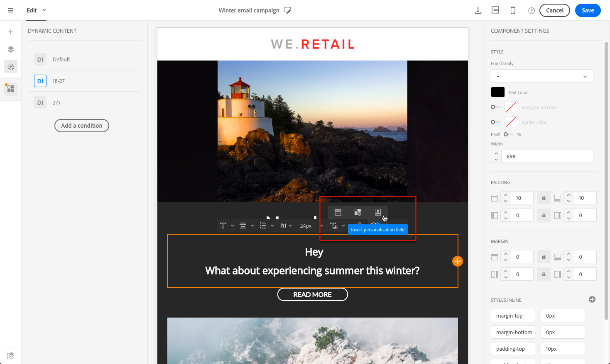

# Example: Email personalization{#example-email-personalization}

In questo esempio, un membro del team di marketing marketing ha creato un messaggio e-mail per informare alcuni dei clienti che è presente un'offerta speciale. Il membro del team ha deciso di personalizzare l'e-mail in base alle relative età. I client di età compresa tra 18 e 27 anni riceveranno un'e-mail contenente un'immagine e uno slogan diversi a quelli dei client precedenti a 27.

Il messaggio e-mail viene creato come segue:

* I contenuti dinamici vengono applicati all'immagine e questi contenuti dinamici sono configurati in base all'intervallo di età.

   

   Adding and configuring dynamic content is detailed in the [Defining dynamic content in an email](../../designing/using/defining-dynamic-content-in-an-email.md) section.

* I campi di personalizzazione e i contenuti dinamici vengono applicati al testo. A seconda dell'intervallo di età del profilo, l'e-mail inizia con il nome del profilo, oppure con il titolo e il cognome del profilo.

   

   Adding and configuring the personalization fields is detailed in the [Inserting a personalization field](../../designing/using/inserting-a-personalization-field.md) section.

## Configuring images {#configuring-images}

In questo esempio, il contenuto dinamico applicato alle immagini è configurato come segue:

**A target 18-27-year:**

1. Select the dynamic content in the **[!UICONTROL Properties]** palette and click the **[!UICONTROL Edit]** button.

   

1. Edit the label then select the **[!UICONTROL Age]** field from the **[!UICONTROL Profile]** node.

   

1. Select the **Greater than or equal to** operator then enter **18** to create the **older than 18** expression.

   

1. Add a new **[!UICONTROL Age]** condition.

   Select the **Less than or equal to** operator followed by 27 in the value field to create the **younger than 27** expression.

   

1. Confermate le modifiche.

**Per eseguire il targeting dei profili di età inferiore a 27:**

1. Selezionare il contenuto dinamico dalla palette e modificarlo.
1. Edit the label then select the **[!UICONTROL Age]** field from the **[!UICONTROL Profile]** node.
1. Add the **Greater than** operator followed by 27 in the value field to create the **older than 27** expression.

   

1. Confermate le modifiche.

Il contenuto dinamico è configurato correttamente.

## Configuring text {#configuring-text}

In questo esempio, il contenuto dinamico applicato ai testi è configurato come segue:

**Per eseguire il targeting dei profili invecchiati tra 18-27:**

1. Selezionate il componente struttura desiderato e aggiungete un contenuto dinamico.
1. Modificate il contenuto dinamico e configurate le espressioni di targeting. Refer to [Configuring images](../../designing/using/example--email-personalization.md#configuring-images).
1. In the structure component, at the desired position, click the **[!UICONTROL Personalize]** icon from the contextual toolbar and select **[!UICONTROL Insert personalization field]**.

   

1. In the list that appears, select the **[!UICONTROL First name]** field and confirm.

   

1. Il campo personalizzazione viene quindi perfettamente inserito nel contenuto dinamico selezionato.

**Per eseguire il targeting dei profili di età inferiore a 27:**

1. Selezionate il componente struttura desiderato e aggiungete un contenuto dinamico.
1. Modificate il contenuto dinamico e configurate le espressioni di targeting. Refer to [Configuring images](../../designing/using/example--email-personalization.md#configuring-images).
1. In the structure component, at the desired position, click the **[!UICONTROL Personalize]** icon from the contextual toolbar and select **[!UICONTROL Insert personalization field]**.
1. Select **[!UICONTROL Title]** from the drop-down list.
1. Proceed similarly to add the **[!UICONTROL Last name]** field.

   

I campi personalizzati dovrebbero essere perfettamente inseriti nel contenuto dinamico scelto.

## Previewing emails {#previewing-emails}

Previewing allows you to check that the personalization fields and the dynamic contents are configured correctly before sending the **[!UICONTROL Proofs]**. Durante l'anteprima, potete selezionare diversi profili di test corrispondenti alle destinazioni e-mail.

Senza profili di prova, l'e-mail che viene visualizzata per impostazione predefinita è:

L'e-mail non dispone di campi di personalizzazione nello slogan e viene utilizzata l'immagine predefinita.

Il primo profilo di test corrisponde a un client invecchiato tra 18 e 27. Selezionando questo profilo viene visualizzato il seguente messaggio e-mail:

Il campo di personalizzazione che corrisponde all'espressione di 18-27 anni, in particolare il nome del profilo, è configurato correttamente e l'immagine è stata modificata anche in base al profilo.

Il secondo profilo corrisponde a un client invecchiato su 27 e genera il seguente messaggio e-mail:

L'immagine è cambiata grazie al contenuto dinamico, e lo slogan visualizzato è lo slogan più formale definito per questo pubblico pubblico.

**Argomenti correlati:**

* [Creazione di audience](../../audiences/using/creating-audiences.md)
* [Preparazione dell'invio](../../sending/using/preparing-the-send.md)

