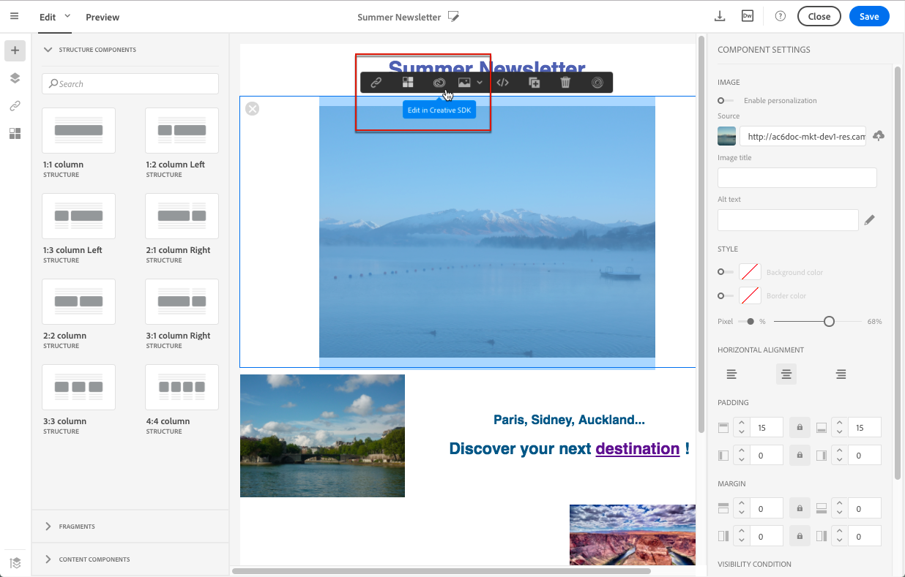

# Utilizzo delle immagini {#images}

## Inserimento di immagini{#inserting-images}

Puoi inserire immagini nelle e-mail e nelle pagine di destinazione.

Sono disponibili i seguenti tipi di immagini, a seconda della configurazione:

* Immagini locali
* Immagini condivise da Adobe Experience Cloud - fai riferimento a [Utilizzo di Campaign e del servizio core Assets](../../integrating/using/working-with-campaign-and-assets-core-service.md) / Assets on Demand
* Immagini dinamiche da Adobe Target - consulta [Utilizzo di Campaign e Target](../../integrating/using/about-campaign-target-integration.md)

>[!CAUTION]
>
>Se scegli di aggiungere un&#39;immagine direttamente modificando la versione HTML dell&#39;e-mail, non devi chiamare **file esterni in un tag &lt;script>** della pagina HTML. Questi file non verranno importati sul server Adobe Campaign.

### Inserimento di immagini in un messaggio e-mail {#inserting-images-in-an-email}

1. Aggiungi un componente struttura. Per ulteriori informazioni, consulta [Modifica della struttura delle e-mail](../../designing/using/designing-from-scratch.md#defining-the-email-structure).
1. All’interno di questo componente struttura, aggiungi un componente di contenuto **[!UICONTROL Image]** .

   

1. Fai clic su **[!UICONTROL Browse]**. Trascina e rilascia un’immagine o fai clic su per selezionare un file dal computer.

   

1. Seleziona il componente di contenuto appena aggiunto.
1. Controlla le proprietà dell&#39;immagine e regolale se necessario.

   

## Impostazione delle proprietà immagine{#setting-up-image-properties}

Quando selezioni un blocco contenente un’immagine, nella palette vengono offerte le seguenti proprietà:

* **Abilita la** personalizzazione ti consente di personalizzare l’origine dell’immagine. Consulta [Personalizzazione di un&#39;origine immagine](../../designing/using/personalization.md#personalizing-an-image-source).
* **I** titoli delle immagini consentono di definire un titolo per l’immagine.
* **Il testo Alt**  (e-mail) o  **Didascalia**  (pagina di destinazione) consente di definire la didascalia collegata all’immagine (corrisponde all’attributo  **** altHTML ).
* Durante la modifica di un messaggio e-mail, **Stile** consente di specificare le dimensioni dell’immagine, lo sfondo e il bordo.
* Durante la modifica di una pagina di destinazione, **Dimension** consente di specificare le dimensioni dell’immagine in pixel.

L&#39;editor ti consente di lavorare con **tutti i tipi di immagini** i cui formati sono compatibili con i browser. Per essere compatibile con l&#39;editor, le animazioni di tipo **&quot;Flash&quot;** devono essere inserite in una pagina HTML come segue:

```
<object type="application/x-shockwave-flash" data="http://www.mydomain.com/flash/your_animation.swf" width="200" height="400">
 <param name="movie" value="http://www.mydomain.com/flash/your_animation.swf" />
 <param name="quality" value="high" />
 <param name="play" value="true"/>
 <param name="loop" value="true"/> 
</object>
```

<!--
## Modifying images with the Adobe Creative SDK{#modifying-images-with-the-adobe-creative-sdk}

You can edit images and use a complete set of features powered by the Adobe Creative SDK to enhance your images directly in the content editor when editing emails or landing pages.

The image editor offers a powerful, full-featured image editing UI component that allows you to edit images and apply effects and frames, original high-quality stickers, beautiful overlays, fun features like tilt shift and color splash, pro-level adjustments and more.

To modify an image with the Adobe Creative SDK:

1. Select the image.
1. In the toolbar, click the Creative Cloud icon.

   

1. Select the tool you want to use through the icons on the top of the window to modify the image.

   

1. Click **[!UICONTROL Save]** when modifications are done. The updated image is saved on Adobe Campaign server and ready to be used.

>[!NOTE]
>
>Tools offered in the image editor cannot be customized.
-->