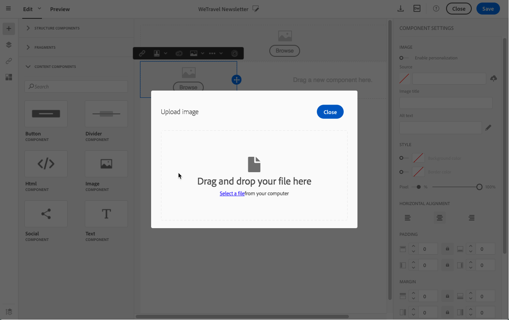

# Utilizzo delle immagini {#images}

## Inserimento di immagini{#inserting-images}

Puoi inserire immagini nelle e-mail e nelle pagine di destinazione.

A seconda della configurazione, sono disponibili i seguenti tipi di immagini:

* Immagini locali
* Immagini condivise da Adobe Experience Cloud. Fare riferimento a [Utilizzo di Campaign e del servizio core Assets](../../integrating/using/working-with-campaign-and-assets-core-service.md) / Assets On Demand
* Immagini dinamiche da Adobe Target. Fare riferimento a [Utilizzo di Campaign e Target](../../integrating/using/about-campaign-target-integration.md)

>[!CAUTION]
>
>Se scegli di aggiungere un&#39;immagine direttamente modificando la versione HTML dell&#39;e-mail, non devi richiamare **file esterni in un tag &lt;script>** della pagina HTML. Questi file non verranno importati sul server Adobe Campaign.

### Inserimento di immagini in un messaggio e-mail {#inserting-images-in-an-email}

1. Aggiungi un componente struttura. Per ulteriori informazioni, consulta [Modifica della struttura delle e-mail](../../designing/using/designing-from-scratch.md#defining-the-email-structure).
1. All&#39;interno di questo componente struttura, aggiungere un componente di contenuto **[!UICONTROL Image]**.

   

1. Fai clic su **[!UICONTROL Browse]**. Trascina e rilascia un’immagine o fai clic per selezionare un file dal computer.

   

1. Seleziona il componente di contenuto appena aggiunto.
1. Controlla le proprietà dell’immagine e regolale se necessario.

   

## Impostazione delle proprietà dell&#39;immagine{#setting-up-image-properties}

Quando selezioni un blocco che contiene un’immagine, nella palette vengono offerte le seguenti proprietà:

* **Abilita personalizzazione** ti consente di personalizzare l&#39;origine dell&#39;immagine. Consulta [Personalizzazione di un&#39;origine immagine](../../designing/using/personalization.md#personalizing-an-image-source).
* **Titolo immagine** consente di definire un titolo per l&#39;immagine.
* **Testo alt** (e-mail) o **Didascalia** (pagina di destinazione) consente di definire la didascalia collegata all&#39;immagine (corrisponde all&#39;attributo HTML **alt**).
* Durante la modifica di un&#39;e-mail, **Style** ti consente di specificare la dimensione dell&#39;immagine, lo sfondo e il bordo.
* Quando modifichi una pagina di destinazione, **Dimension** ti consente di specificare la dimensione dell&#39;immagine in pixel.

L&#39;editor consente di utilizzare **tutti i tipi di immagine** i cui formati sono compatibili con i browser. Per la compatibilità con l&#39;editor, le animazioni di tipo **&quot;Flash&quot;** devono essere inserite in una pagina HTML nel modo seguente:

```
<object type="application/x-shockwave-flash" data="http://www.mydomain.com/flash/your_animation.swf" width="200" height="400">
 <param name="movie" value="http://www.mydomain.com/flash/your_animation.swf" />
 <param name="quality" value="high" />
 <param name="play" value="true"/>
 <param name="loop" value="true"/> 
</object>
```

<!--
## Modifying images with the Adobe Creative SDK{#modifying-images-with-the-adobe-creative-sdk}

You can edit images and use a complete set of features powered by the Adobe Creative SDK to enhance your images directly in the content editor when editing emails or landing pages.

The image editor offers a powerful, full-featured image editing UI component that allows you to edit images and apply effects and frames, original high-quality stickers, beautiful overlays, fun features like tilt shift and color splash, pro-level adjustments and more.

To modify an image with the Adobe Creative SDK:

1. Select the image.
1. In the toolbar, click the Creative Cloud icon.

   

1. Select the tool you want to use through the icons on the top of the window to modify the image.

   

1. Click **[!UICONTROL Save]** when modifications are done. The updated image is saved on Adobe Campaign server and ready to be used.

>[!NOTE]
>
>Tools offered in the image editor cannot be customized.
-->
