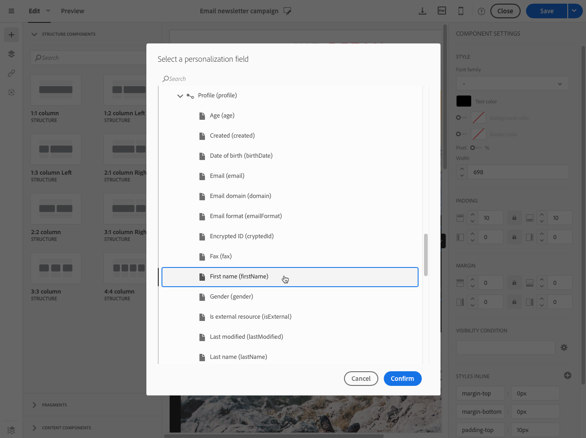
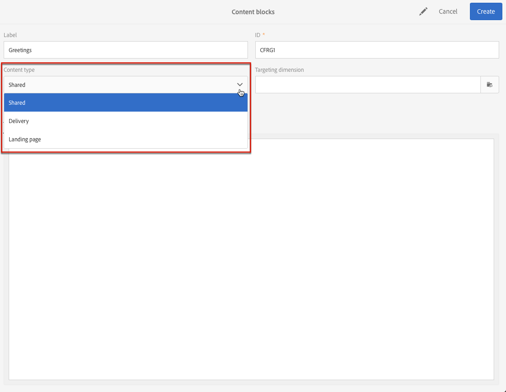
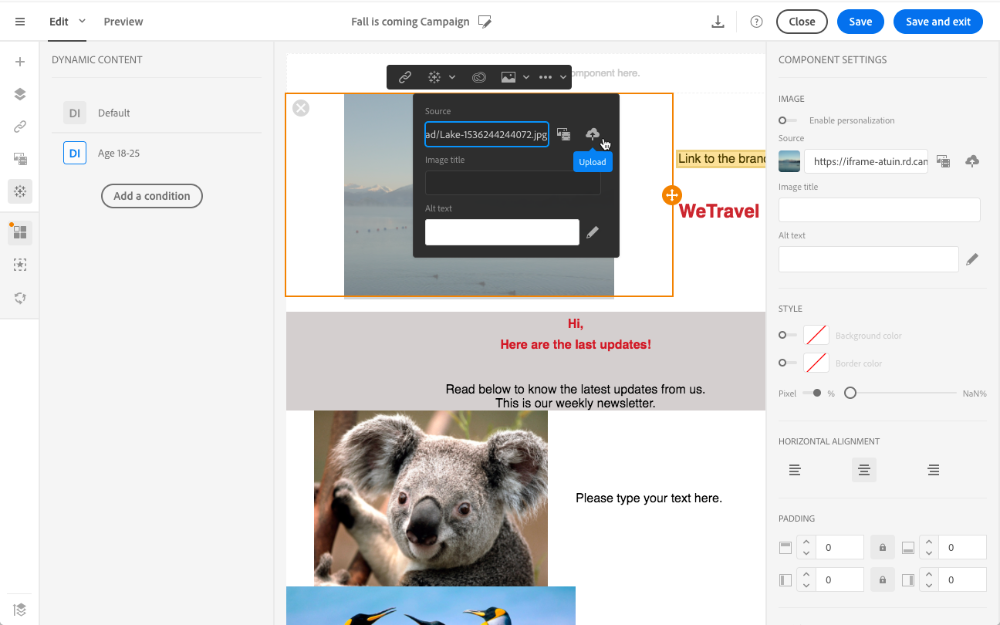
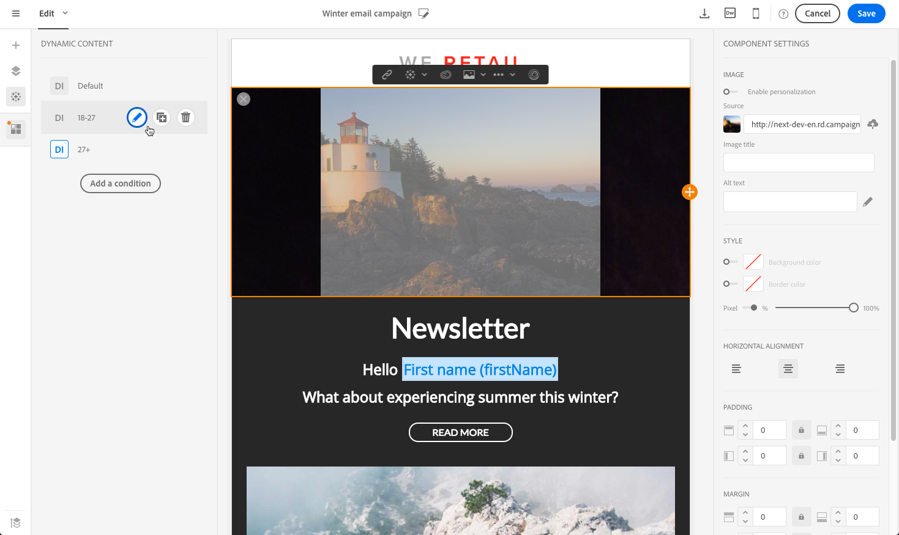
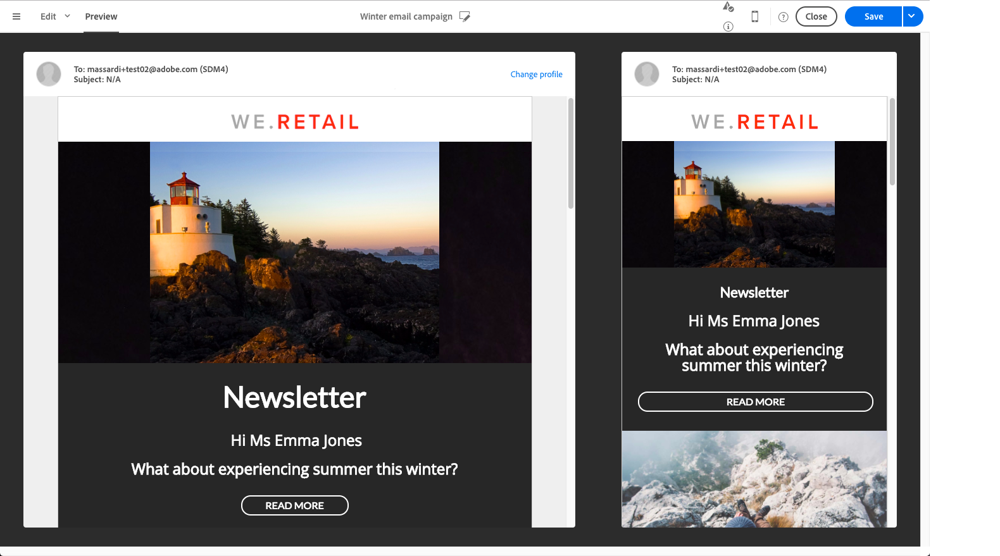

# Personalizzazione di contenuti e-mail {#personalization}

Il contenuto e la visualizzazione dei messaggi inviati da  Adobe Campaign possono essere personalizzati in diversi modi. Questi metodi possono essere combinati in base ai criteri in base ai profili. In generale, Adobe Campaign ti consente di:

* Inserire campi di personalizzazione dinamici. Consulta [Inserimento di un campo di personalizzazione](#inserting-a-personalization-field).
* Inserire blocchi di personalizzazione predefiniti. Consulta [Aggiunta di un blocco di contenuto](#adding-a-content-block).
* Personalizza il mittente di un messaggio e-mail. Consulta [Personalizzazione del mittente](#personalizing-the-sender).
* Personalizzare l’oggetto di un messaggio e-mail. See [Personalizing the subject line of an email](../../designing/using/subject-line.md#subject-line).
* Creare contenuto condizionale. Consultate [Definizione del contenuto dinamico in un messaggio e-mail](#defining-dynamic-content-in-an-email).

## Personalizzazione del mittente {#personalizing-the-sender}

Per definire il nome del mittente che verrà visualizzato nell&#39;intestazione dei messaggi inviati, passare alla **[!UICONTROL Properties]** scheda della home page di Designer e-mail (accessibile tramite l&#39;icona principale). Per ulteriori informazioni, consulta [Definizione del mittente di un’e-mail](../../designing/using/subject-line.md#email-sender).

Per modificare il nome del mittente, fai clic sul blocco del nome **del** mittente. Il campo diventa quindi modificabile ed è possibile immettere il nome che si desidera utilizzare.

Questo campo può essere personalizzato. A tal fine, puoi aggiungere campi di personalizzazione, blocchi di contenuto e contenuti dinamici facendo clic sulle icone sotto il nome del mittente.

>[!NOTE]
>
>I parametri dell&#39;intestazione non devono essere vuoti. L&#39;indirizzo del mittente è obbligatorio per consentire l&#39;invio di un&#39;e-mail (standard RFC).  Adobe Campaign controlla la sintassi degli indirizzi e-mail immessi.

## Personalizzazione degli URL{#personalizing-urls}

 Adobe Campaign consente di personalizzare uno o più URL nel messaggio aggiungendo campi di personalizzazione, blocchi di contenuto o contenuti dinamici. Per eseguire questa operazione:

1. Inserite un URL esterno e specificatene i parametri. See [Inserting a link](../../designing/using/links.md#inserting-a-link).
1. Se non viene visualizzato, fate clic sulla matita accanto all’URL selezionato nel riquadro Impostazioni per accedere alle opzioni di personalizzazione.
1. Aggiungete i campi di personalizzazione, i blocchi di contenuto e il contenuto dinamico che desiderate utilizzare.

   

1. Salva le modifiche.

>[!NOTE]
>
>La personalizzazione degli URL non può essere applicata né al nome del dominio, né all’estensione dell’URL. Se la personalizzazione non è corretta, durante l&#39;analisi dei messaggi verrà visualizzato un messaggio di errore. Quando si seleziona un blocco di contenuto, non è possibile selezionare elementi quali **Collega a pagina** mirror. Questo tipo di blocchi è vietato all&#39;interno di un collegamento.

## Inserimento di un campo di personalizzazione{#inserting-a-personalization-field}

 Adobe Campaign consente di inserire un campo dal database nella pagina, ad esempio il nome del profilo.

>[!NOTE]
>
>Le immagini seguenti mostrano come inserire un campo di personalizzazione utilizzando [Email Designer](../../designing/using/designing-content-in-adobe-campaign.md) per un messaggio e-mail.

Per aggiungere un campo di personalizzazione al contenuto:

1. Fare clic all&#39;interno di un blocco di testo, fare clic sull&#39; **[!UICONTROL Personalize]** icona dalla barra degli strumenti contestuale e selezionare **[!UICONTROL Insert personalization field]**. Per ulteriori informazioni sull&#39;interfaccia di Designer e-mail, vedere [questa sezione](../../designing/using/designing-content-in-adobe-campaign.md#email-designer-interface).

   

1. Selezionare il campo da inserire nel contenuto della pagina.

   

1. Fai clic su **[!UICONTROL Confirm]**.

Il nome del campo viene visualizzato nell’editor ed è evidenziato.

Una volta generata la personalizzazione (ad esempio, durante l’anteprima e la preparazione dell’e-mail), questo campo verrà sostituito dal valore corrispondente al profilo di destinazione.

>[!NOTE]
>
>Se l’e-mail viene creata da un flusso di lavoro, i dati aggiuntivi calcolati nel flusso di lavoro sono disponibili anche nei campi di personalizzazione. Per ulteriori informazioni sull&#39;aggiunta di dati aggiuntivi da un flusso di lavoro, vedere la sezione [Arricchimento dei dati](../../automating/using/about-targeting-activities.md#enriching-data) .

## Aggiunta di un blocco di contenuto{#adding-a-content-block}

 Adobe Campaign offre un elenco di blocchi di contenuto preconfigurati. Questi blocchi di contenuto sono dinamici, personalizzati e hanno un rendering specifico. Ad esempio, potete aggiungere un saluto o un collegamento alla pagina mirror.

>[!NOTE]
>
>Le immagini seguenti mostrano come inserire un blocco di contenuto tramite [Email Designer](../../designing/using/designing-content-in-adobe-campaign.md) per un messaggio e-mail.

Per aggiungere un blocco di contenuto:

1. Fare clic all&#39;interno di un blocco di testo, fare clic sull&#39; **[!UICONTROL Personalize]** icona dalla barra degli strumenti contestuale e selezionare **[!UICONTROL Insert content block]**. Per ulteriori informazioni sull&#39;interfaccia di Designer e-mail, vedere [questa sezione](../../designing/using/designing-content-in-adobe-campaign.md#email-designer-interface).

   

1. Selezionare il blocco di contenuto da inserire. I blocchi disponibili variano a seconda del contesto (e-mail o pagina di destinazione).

   

1. Fai clic su **[!UICONTROL Save]**.

Il nome del blocco di contenuto viene visualizzato nell’editor ed è evidenziato in giallo. Si adatta automaticamente al profilo quando viene generata la personalizzazione.

I blocchi di contenuto forniti sono:

* **[!UICONTROL Database URL in emails (EmailUrlBase)]**: Questo blocco di contenuto può essere utilizzato solo per una **consegna**.
* **[!UICONTROL Mirror page URL (MirrorPageUrl)]**: Questo blocco di contenuto può essere utilizzato solo per una **consegna**.
* **[!UICONTROL Link to mirror page (MirrorPage)]**: Questo blocco di contenuto può essere utilizzato solo per una **consegna**.
* **[!UICONTROL Greetings (Greetings)]**
* **[!UICONTROL Unsubscription link (UnsubscriptionLink)]**: Questo blocco di contenuto può essere utilizzato solo per una **consegna**.
* **[!UICONTROL Social network sharing links (LandingPageViralLinks)]**: Questo blocco di contenuto può essere utilizzato solo in una pagina **di** destinazione.
* **[!UICONTROL Default sender name (DefaultSenderName)]**: Questo blocco di contenuto può essere utilizzato solo per una **consegna**.
* **[!UICONTROL Name of default reply-to email address (DefaultReplyName)]**: Questo blocco di contenuto può essere utilizzato solo per una **consegna**.
* **[!UICONTROL Email address of default sender (DefaultSenderAddress)]**: Questo blocco di contenuto può essere utilizzato solo per una **consegna**.
* **[!UICONTROL Default error email address (DefaultErrorAddress)]**: Questo blocco di contenuto può essere utilizzato solo per una **consegna**.
* **[!UICONTROL Default reply-to email address (DefaultReplyAddress)]**: Questo blocco di contenuto può essere utilizzato solo per una **consegna**.
* **[!UICONTROL Brand name (BrandingUsualName)]**
* **[!UICONTROL Link to the brand website (BrandingWebSiteLink)]**
* **[!UICONTROL Brand logo (BrandingLogo)]**
* **[!UICONTROL Notification style (notificationStyle)]**

### Creazione di blocchi di contenuto personalizzati {#creating-custom-content-blocks}

Puoi definire nuovi blocchi di contenuto che verranno inseriti in un messaggio o in una pagina di destinazione.

Per creare un blocco di contenuto, effettuate le seguenti operazioni:

1. Fare clic **[!UICONTROL Resources > Content blocks]** dal menu avanzato per accedere all&#39;elenco dei blocchi di contenuto.
1. Fare clic sul **[!UICONTROL Create]** pulsante o duplicare un blocco di contenuto preesistente.

   

1. Immetti un’etichetta.
1. Selezionare il blocco di testo **[!UICONTROL Content type]**. Sono disponibili tre opzioni:

   * **[!UICONTROL Shared]**: Il blocco di contenuto può essere utilizzato in una consegna o in una pagina di destinazione.
   * **[!UICONTROL Delivery]**: Il blocco di contenuto può essere utilizzato solo in una consegna.
   * **[!UICONTROL Landing page]**: Il blocco di contenuto può essere utilizzato solo in una pagina di destinazione.

   

1. Potete selezionare un **[!UICONTROL Targeting dimension]**. Per ulteriori informazioni, consultate [Informazioni sulla dimensione](#about-targeting-dimension)di targeting.

   

1. È possibile selezionare l&#39; **[!UICONTROL Depends on format]** opzione per definire due blocchi diversi: uno per le e-mail HTML e uno per le e-mail in formato testo. Verranno quindi visualizzate due schede nell&#39;editor (HTML e testo) per definire il contenuto corrispondente.

   

1. Immettete il contenuto dei blocchi di contenuto e fate clic sul **[!UICONTROL Create]** pulsante.

Il blocco di contenuto ora può essere utilizzato nell&#39;editor del contenuto di un messaggio o di una pagina di destinazione.

>[!CAUTION]
>
>Quando modificate il contenuto di un blocco, accertatevi che non siano presenti spazi bianchi aggiuntivi tra l&#39;inizio e la fine delle istruzioni *if* . In HTML gli spazi bianchi vengono visualizzati sullo schermo e avranno pertanto un impatto sul layout del contenuto.

### La dimensione di targeting {#about-targeting-dimension}

La dimensione di targeting consente di definire in quale tipo di messaggio è possibile utilizzare il blocco di contenuto. Ciò per evitare l&#39;uso di blocchi inappropriati in un messaggio, che potrebbe causare errori.

In effetti, quando modificate un messaggio, potete selezionare solo i blocchi di contenuto con una dimensione di targeting compatibile con la dimensione di targeting del messaggio.

Ad esempio, la dimensione di targeting del **[!UICONTROL Unsubscription link]** blocco è **[!UICONTROL Profiles]** perché contiene campi di personalizzazione specifici per la **[!UICONTROL Profiles]** risorsa. Pertanto, non potete utilizzare un **[!UICONTROL Unsubscription link]** blocco in un messaggio [transazionale](../../channels/using/event-transactional-messages.md)evento, perché la dimensione di targeting di quel tipo di messaggio è **[!UICONTROL Real-time events]**. Tuttavia, puoi utilizzare il blocco di collegamento **** Annulla sottoscrizione in un messaggio [transazionale di](../../channels/using/profile-transactional-messages.md)profilo, perché la dimensione di targeting di quel tipo di messaggio è **Profili**. Infine, il **[!UICONTROL Link to mirror page]** blocco non ha una dimensione di targeting, pertanto è possibile utilizzarlo in qualsiasi messaggio.

Se lasciate vuoto questo campo, il blocco di contenuto sarà compatibile con tutti i messaggi, indipendentemente dalla dimensione di targeting. Se imposti una dimensione di targeting, tale blocco sarà compatibile solo con i messaggi che hanno la stessa dimensione di targeting.

Per ulteriori informazioni, consulta [Dimensioni di targeting e risorse](../../automating/using/query.md#targeting-dimensions-and-resources).

**Argomenti correlati:**

* [Inserimento di un campo di personalizzazione](#inserting-a-personalization-field)
* [Aggiunta di un blocco di contenuto](#adding-a-content-block)
* [Definizione di contenuto dinamico in un messaggio e-mail](#defining-dynamic-content-in-an-email)

## Personalizzazione di un’origine immagine{#personalizing-an-image-source}

 Adobe Campaign consente di personalizzare una o più immagini del messaggio in base a un particolare criterio o di utilizzare il tracciamento. A tal fine, è possibile inserire campi di personalizzazione, blocchi di contenuto o contenuti dinamici nella sorgente immagine. Per eseguire questa operazione:

1. Inserisci un&#39;immagine nel contenuto del messaggio oppure seleziona un&#39;immagine già presente.
1. Nella palette Proprietà immagine, selezionare l&#39; **[!UICONTROL Enable personalization]** opzione.

   

   Il **[!UICONTROL Source]** campo viene visualizzato e l’immagine selezionata viene visualizzata come **personalizzata** nell’editor.

1. Fai clic sulla matita accanto al pulsante del **[!UICONTROL Source]** campo per accedere alle opzioni di personalizzazione.
1. Dopo aver aggiunto l’origine immagine, aggiungete i campi di personalizzazione, i blocchi di contenuto e il contenuto dinamico desiderati.

   

   >[!NOTE]
   >
   >Il nome di dominio (http://mydomain.com) non può essere personalizzato, deve essere immesso manualmente. Il resto dell’URL può essere personalizzato. Ad esempio: http://mydomain.com/ `[Gender]` .jpg

1. Conferma le modifiche.

## Contenuto condizionale {#conditional-content}

### Definizione di una condizione di visibilità{#defining-a-visibility-condition}

Potete specificare una condizione di visibilità per qualsiasi elemento. Sarà visibile solo se la condizione è rispettata.

Per aggiungere una condizione di visibilità, selezionare un blocco e immettere la condizione da rispettare nel **[!UICONTROL Visibility condition]** campo delle relative impostazioni.

Questa opzione è disponibile solo per gli elementi seguenti: INDIRIZZO, BLOCCO, CENTRO, DIR, DIV, DL, SET DI CAMPI, MODULO, H1, H2, H3, H4, H5, H6, NOSCRIPT, OL, P, PRE, UL, TR, TD.

L&#39;editor di espressioni viene presentato nella sezione di modifica [delle espressioni](../../automating/using/editing-queries.md#about-query-editor) Avanzate.

Queste condizioni adottano la sintassi dell&#39;espressione XTK (ad es. **context.profile.email !=&#39;&#39;** or **context.profile.status=&#39;0&#39;**). Per impostazione predefinita, tutti i campi sono visibili.

>[!NOTE]
>
>Non è possibile definire una condizione per un blocco che contiene già un sottoelemento con un contenuto dinamico o un blocco che già costituisce un contenuto dinamico. I blocchi dinamici non visibili come elenchi a discesa non possono essere modificati.

### Definizione di contenuto dinamico in un messaggio e-mail{#defining-dynamic-content-in-an-email}

>[!CONTEXTUALHELP]
>id="ac_dynamic_content"
>title="Definizione del contenuto dinamico"
>abstract="Definite contenuti diversi per i destinatari in base alle regole definite tramite l&#39;editor di espressioni."

In un messaggio e-mail potete definire contenuti diversi che verranno visualizzati in modo dinamico ai destinatari in base alle condizioni definite tramite l&#39;editor di espressioni. Ad esempio, dalla stessa e-mail, puoi fare in modo che ogni profilo riceva un messaggio diverso in base alla sua fascia di età.

La definizione del contenuto dinamico è diversa dalla [definizione delle condizioni](#defining-a-visibility-condition)di visibilità.

1. Selezionare un frammento, un componente o un elemento. In questo esempio, selezionate un’immagine.
1. Fate clic sull’ **[!UICONTROL Dynamic content]** icona nella barra degli strumenti contestuale.

   

   La **[!UICONTROL Dynamic content]** sezione viene visualizzata nella palette a sinistra.

   

   Per impostazione predefinita, questa sezione contiene due elementi: la variante predefinita e una nuova variante.

   >[!NOTE]
   >
   >Il contenuto deve sempre avere una variante predefinita. Non potete eliminarla.

1. Fare clic sul **[!UICONTROL Edit]** pulsante per definire le condizioni di visualizzazione della prima variante alternativa.

   

1. Specificate un&#39;etichetta e selezionate i campi che desiderate impostare come condizioni. Ad esempio, dal **[!UICONTROL General]** nodo, selezionare il **[!UICONTROL Age]** campo

   

1. Impostare le condizioni di filtraggio. Ad esempio, desiderate che venga visualizzato un contenuto diverso alle persone di età compresa tra i 18 e i 25 anni.

   

1. Una volta impostate tutte le condizioni, definite l&#39;ordine di priorità in cui verrà applicata la condizione e salvate le modifiche.

   

   Il contenuto verrà visualizzato nella palette in ordine di priorità, dall&#39;alto verso il basso. For more on priorities, refer to [this section](#defining-dynamic-content-in-an-email).

1. Caricate una nuova immagine per la variante appena definita.

   

   I destinatari di età compresa tra i 18 e i 25 anni vedranno la nuova immagine.

   

1. Fate clic **[!UICONTROL Add a condition]** per aggiungere un nuovo contenuto e la relativa regola collegata.

   

   Ad esempio, potete aggiungere un’immagine diversa da visualizzare alle persone di età compresa tra i 26 e i 35 anni.

1. Procedere in modo simile per qualsiasi altro elemento del messaggio e-mail che si desidera visualizzare in modo dinamico. Può essere testo, pulsante, frammento, ecc. Salva le modifiche.

>[!CAUTION]
>
>Dopo aver preparato il messaggio e prima di inviarlo, provatelo utilizzando una prova. In caso contrario, alcuni errori potrebbero non essere rilevati e l&#39;e-mail potrebbe non essere inviata.

**Argomenti correlati:**

* [Invio di bozze](../../sending/using/sending-proofs.md)
* [Modifica avanzata delle espressioni](../../automating/using/editing-queries.md#about-query-editor)

### Ordine di priorità {#order-of-priority}

Nell&#39;editor di espressioni, quando si definisce un contenuto dinamico, l&#39;ordine di priorità è il seguente.

1. Potete definire due diversi contenuti dinamici con **due condizioni** diverse, ad esempio:

   **Condizione 1:** il genere del profilo è maschile,

   **Condizione 2:** il profilo ha tra i 20 e i 30 anni.

   

   Alcuni profili nel database corrispondono alle due condizioni, ma è possibile inviare un solo messaggio e-mail con un solo contenuto dinamico.

1. È quindi necessario definire la priorità per il contenuto dinamico. Una condizione con un ordine di priorità **1** (e quindi il contenuto dinamico corrispondente) verrà inviata a un profilo anche se un&#39;altra condizione il cui ordine di priorità è **2** o **3** è soddisfatto anche da questo profilo.

   

È possibile definire un solo ordine di priorità per contenuto dinamico.

## Esempio: Personalizzazione e-mail{#example-email-personalization}

In questo esempio, un membro del team del servizio marketing ha creato un messaggio e-mail per informare alcuni dei suoi clienti che esiste un&#39;offerta speciale solo per loro. Il membro del team ha deciso di personalizzare l&#39;e-mail in base alle età dei clienti. I clienti di età compresa tra i 18 e i 27 anni riceveranno un&#39;e-mail contenente un&#39;immagine e uno slogan diversi a quelli che riceveranno i clienti di età superiore ai 27 anni.

Il messaggio e-mail viene creato come segue:

* I contenuti dinamici vengono applicati all’immagine e i contenuti dinamici sono configurati in base all’intervallo di età.

   

   L’aggiunta e la configurazione di contenuto dinamico sono descritti in dettaglio nella sezione [Definizione del contenuto dinamico di una sezione e-mail](#defining-dynamic-content-in-an-email) .

* I campi di personalizzazione e il contenuto dinamico vengono applicati al testo. A seconda dell’intervallo di età del profilo, l’e-mail inizia con il nome del profilo oppure con il titolo e il cognome del profilo.

   

   L’aggiunta e la configurazione dei campi di personalizzazione sono descritti in dettaglio nella sezione [Inserimento di un campo](#inserting-a-personalization-field) di personalizzazione.

### Configurazione delle immagini {#configuring-images}

>[!CONTEXTUALHELP]
>id="ac_dynamic_image"
>title="Gestione delle immagini dinamiche"
>abstract="Personalizzate l&#39;e-mail con immagini dinamiche in base alle regole definite tramite l&#39;editor di espressioni."

In questo esempio, il contenuto dinamico applicato alle immagini è configurato come segue:

**Per raggiungere i 18-27 anni:**

1. Selezionare il contenuto dinamico nella **[!UICONTROL Properties]** palette e fare clic sul **[!UICONTROL Edit]** pulsante.

   

1. Modificare l&#39;etichetta e selezionare il **[!UICONTROL Age]** campo dal **[!UICONTROL Profile]** nodo.

   

1. Selezionare l&#39;operatore **Maggiore o uguale a** , quindi immettere **18** per creare l&#39;espressione **precedente a 18** .

   

1. Aggiungere una nuova **[!UICONTROL Age]** condizione.

   Selezionare l&#39;operatore **Minore o uguale a** seguito da 27 nel campo del valore per creare l&#39;espressione **minore di 27** .

   

1. Conferma le modifiche.

**Per eseguire il targeting dei profili di età pari o superiore a 27 anni:**

1. Selezionare il contenuto dinamico dalla palette e modificarlo.
1. Modificare l&#39;etichetta e selezionare il **[!UICONTROL Age]** campo dal **[!UICONTROL Profile]** nodo.
1. Aggiungete l&#39;operatore **Maggiore di** seguito da 27 nel campo del valore per creare l&#39;espressione **precedente a 27** .

   

1. Conferma le modifiche.

I contenuti dinamici sono configurati correttamente.

### Configurazione del testo {#configuring-text}

In questo esempio, il contenuto dinamico applicato ai testi è configurato come segue:

**Per eseguire il targeting dei profili di età compresa tra 18 e 27 anni:**

1. Selezionate il componente struttura desiderato e aggiungete un contenuto dinamico.
1. Modificate il contenuto dinamico e configurate le espressioni di targeting. Consultate [Configurazione delle immagini](#configuring-images).
1. Nel componente struttura, nella posizione desiderata, fate clic sull’ **[!UICONTROL Personalize]** icona nella barra degli strumenti contestuale e selezionate **[!UICONTROL Insert personalization field]**.

   

1. Nell&#39;elenco visualizzato, selezionare il **[!UICONTROL First name]** campo e confermare.

   

1. Il campo di personalizzazione viene quindi inserito perfettamente nel contenuto dinamico selezionato.

**Per eseguire il targeting dei profili di età pari o superiore a 27 anni:**

1. Selezionate il componente struttura desiderato e aggiungete un contenuto dinamico.
1. Modificate il contenuto dinamico e configurate le espressioni di targeting. Consultate [Configurazione delle immagini](#configuring-images).
1. Nel componente struttura, nella posizione desiderata, fate clic sull’ **[!UICONTROL Personalize]** icona nella barra degli strumenti contestuale e selezionate **[!UICONTROL Insert personalization field]**.
1. Selezionare **[!UICONTROL Title]** dall&#39;elenco a discesa.
1. Procedere in modo simile per aggiungere il **[!UICONTROL Last name]** campo.

   

I campi di personalizzazione devono ora essere inseriti perfettamente nel contenuto dinamico scelto.

### Anteprima dei messaggi e-mail {#previewing-emails}

L’anteprima consente di verificare che i campi di personalizzazione e il contenuto dinamico siano configurati correttamente prima di inviare l’ **[!UICONTROL Proofs]**. Durante l&#39;anteprima, potete selezionare diversi profili di test corrispondenti alle destinazioni e-mail.

Senza i profili di prova, l&#39;e-mail visualizzata per impostazione predefinita è:

Il messaggio e-mail non contiene campi di personalizzazione e viene utilizzata l&#39;immagine predefinita.

Il primo profilo di test corrisponde a un client di età compresa tra 18 e 27 anni. Selezionando questo profilo, viene visualizzato il seguente messaggio e-mail:

Il campo di personalizzazione che corrisponde all&#39;espressione di 18-27 anni, in particolare il nome del profilo, è configurato correttamente e l&#39;immagine è anche cambiata in base al profilo.

Il secondo profilo corrisponde a un client di oltre 27 anni e genera il seguente messaggio e-mail:

L&#39;immagine è cambiata grazie al contenuto dinamico, e lo slogan che appare è lo slogan più formale definito per questo pubblico di destinazione.

**Argomenti correlati:**

* [Creazione di tipi di pubblico](../../audiences/using/creating-audiences.md)
* [Preparazione dell’invio](../../sending/using/preparing-the-send.md)

